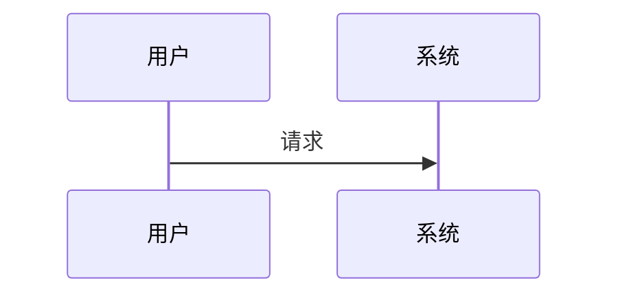
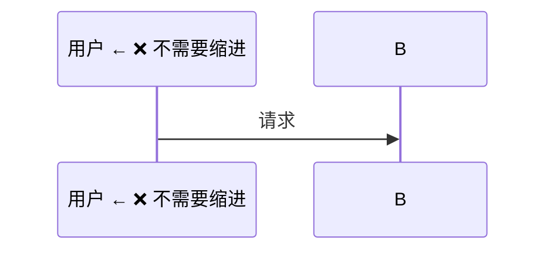
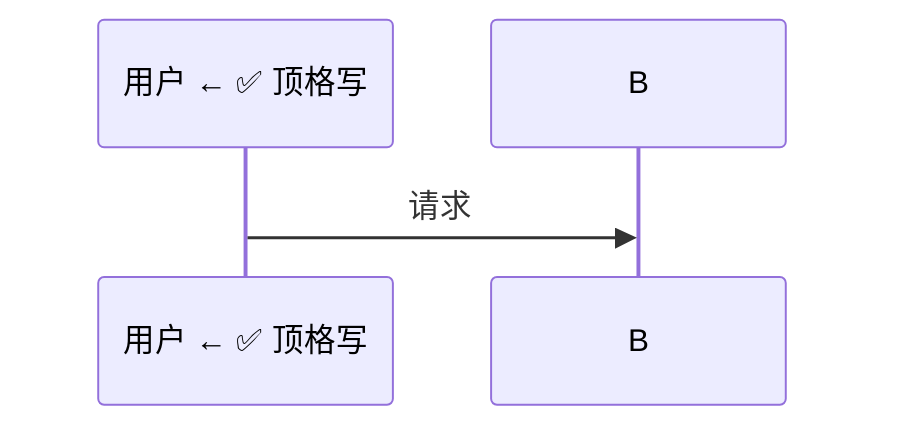
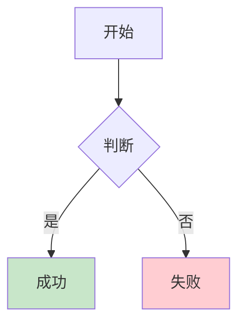
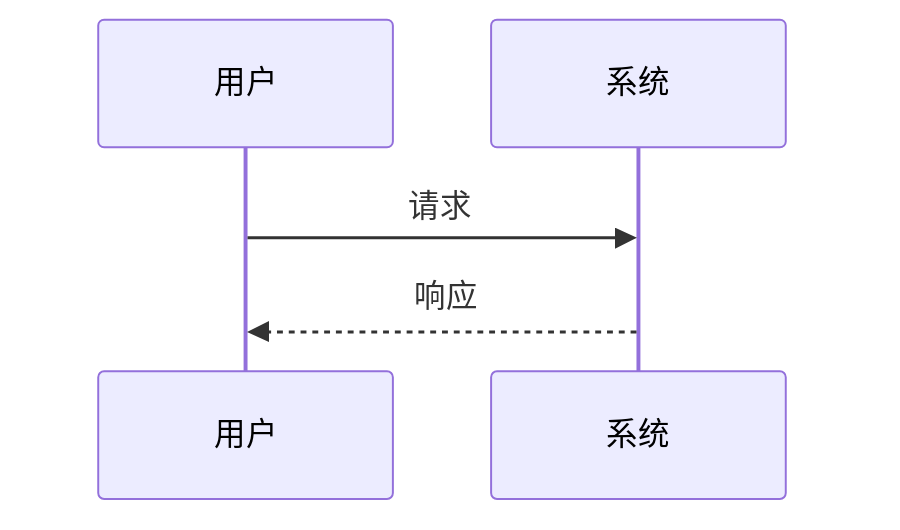

# OpenClaw 文档规范

## 📋 Markdown 渲染问题总结

在部署 Footprint 文档站过程中遇到的所有问题及解决方案。

---

## 1. Mermaid 图表规范

### ❌ 常见问题

#### 1.1 sequenceDiagram 中使用 style 语法

**错误示例**：
```mermaid
sequenceDiagram
    participant A as 用户
    participant B as 系统
    A->>B: 请求
    style A fill:#fff4e1  ← ❌ sequenceDiagram 不支持 style
```

**正确示例**：


**说明**：
- `style` 语法仅适用于 `graph` 和 `flowchart`
- `sequenceDiagram`、`classDiagram`、`stateDiagram` 等不支持 `style`

---

#### 1.2 sequenceDiagram 使用缩进

**错误示例**：


**正确示例**：


**说明**：
- Mermaid 10 不需要缩进
- 缩进可能导致解析错误

---

#### 1.3 mermaid 代码块内包含空行

**错误示例**：
```mermaid
graph TB
    A --> B
    
    C --> D  ← ❌ 空行会导致解析错误
```

**正确示例**：
```mermaid
graph TB
A --> B
C --> D  ← ✅ 没有空行
```

**说明**：
- Mermaid 10 对空行敏感
- 代码块内不能有空行

---

#### 1.4 表格前后没有空行

**错误示例**：
```markdown
**标题**：
| 列 1 | 列 2 |
|-----|-----|
| A   | B   |
### 下一节
```

**正确示例**：
```markdown
**标题**：

| 列 1 | 列 2 |
|-----|-----|
| A   | B   |

### 下一节
```

**说明**：
- Markdown 表格前后必须有空行
- 否则 docute 无法正确解析

---

## 2. 目录结构规范

### ✅ 推荐结构

```
/home/admin/footprint/          # 唯一项目目录
├── docs/                       # 文档目录
│   ├── index.html             # 主页面（含 Mermaid 支持）
│   ├── note/                   # 文档内容
│   │   ├── sourceLearn/        # 源码解构文档
│   │   └── mermaid-test.md     # 测试文档
│   └── ...
├── sync-deploy.sh             # 同步到容器
├── sync-source-learn.sh       # 同步源码解构
├── docker-compose.yml         # Docker 配置
├── Dockerfile                 # Docker 镜像
└── DEPLOY.md                  # 部署说明
```

### ❌ 避免的做法

- 不要创建多个项目目录（如 `footprint-new`、`footprint-deploy`）
- 所有修改都在 `footprint/` 目录进行

---

## 3. 工作流程规范

### 3.1 修改文档后

```bash
cd /home/admin/footprint
./sync-deploy.sh
```

### 3.2 同步源码解构文档

```bash
cd /home/admin/footprint
./sync-source-learn.sh "提交信息"
```

### 3.3 浏览器刷新

- **必须强制刷新**：`Ctrl + Shift + R` (Windows) 或 `Cmd + Shift + R` (Mac)
- 或使用无痕模式测试

---

## 4. Mermaid 使用规范

### 4.1 支持的图表类型

| 类型 | 支持 style | 需要缩进 | 支持空行 |
|------|-----------|---------|---------|
| `graph` / `flowchart` | ✅ | ❌ | ❌ |
| `sequenceDiagram` | ❌ | ❌ | ❌ |
| `classDiagram` | ❌ | ❌ | ❌ |
| `stateDiagram` | ❌ | ❌ | ❌ |
| `erDiagram` | ❌ | ❌ | ❌ |
| `journey` | ❌ | ❌ | ❌ |
| `gantt` | ❌ | ❌ | ❌ |
| `pie` | ❌ | ❌ | ❌ |

### 4.2 通用规则

1. **所有 mermaid 代码块**：
   - ❌ 不要使用缩进
   - ❌ 不要包含空行
   - ✅ 顶格书写

2. **style 语法**：
   - ✅ 仅用于 `graph` 和 `flowchart`
   - ❌ 不要用于 `sequenceDiagram` 等其他类型

3. **中文支持**：
   - ✅ 节点文本可以使用中文
   - ✅ 标签可以使用中文（如 `A[开始]`）

### 4.3 完整示例

#### graph（支持 style）


#### sequenceDiagram（不支持 style）


---

## 5. 容器管理

### 常用命令

```bash
# 查看状态
docker ps | grep footprint

# 重启容器
docker restart footprint

# 查看日志
docker logs footprint --tail 50

# 停止容器
docker stop footprint

# 启动容器
docker compose up -d

# 删除容器
docker stop footprint && docker rm footprint
```

---

## 6. 检查清单

在提交文档前，请检查：

- [ ] Mermaid 代码块内没有空行
- [ ] sequenceDiagram 没有使用 style
- [ ] 所有 mermaid 代码没有缩进
- [ ] Markdown 表格前后有空行
- [ ] 运行了 `./sync-deploy.sh`
- [ ] 在浏览器中强制刷新验证

---

## 7. 快速修复脚本

### 修复所有 mermaid 代码块

```bash
cd /home/admin/footprint/docs/note/sourceLearn

python3 << 'PYEOF'
import os
import re

for root, dirs, files in os.walk('.'):
    for file in files:
        if file.endswith('.md'):
            filepath = os.path.join(root, file)
            with open(filepath, 'r', encoding='utf-8') as f:
                content = f.read()
            
            def fix_mermaid(match):
                code = match.group(1)
                lines = [line for line in code.split('\n') if line.strip()]
                
                # 如果是 sequenceDiagram，删除 style 行
                if 'sequenceDiagram' in code:
                    lines = [line for line in lines if not line.strip().startswith('style ')]
                
                return '```mermaid\n' + '\n'.join(lines) + '\n```'
            
            content = re.sub(r'```mermaid\n(.*?)\n```', fix_mermaid, content, flags=re.DOTALL)
            
            with open(filepath, 'w', encoding='utf-8') as f:
                f.write(content)
            
            print(f'✓ {filepath}')

print('✅ 所有文件已修复')
PYEOF

# 同步到容器
./sync-deploy.sh
```

---

## 8. 访问地址

- **文档站**: http://123.56.28.217:3457
- **Mermaid 测试**: http://123.56.28.217:3457/#/note/mermaid-test
- **源码解构**: http://123.56.28.217:3457/#/note/sourceLearn

---

创建时间：2026-03-11
最后更新：2026-03-11
