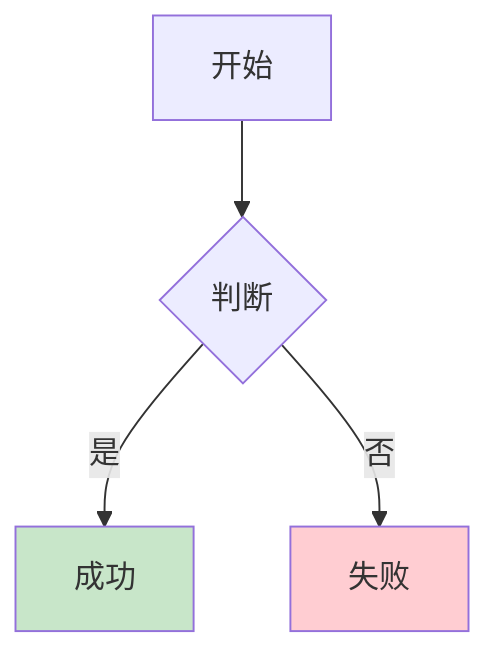
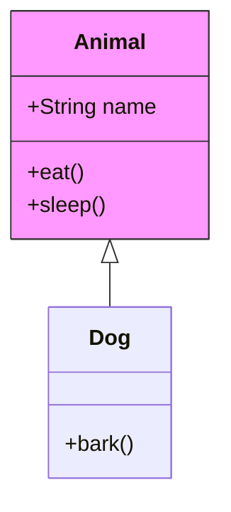
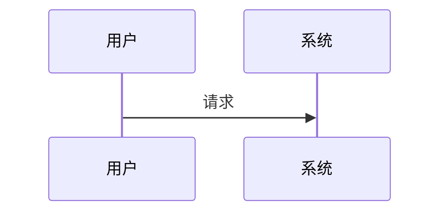
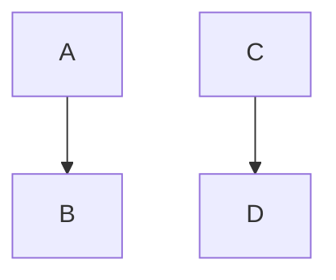

# Mermaid 图表支持规范

## 📊 图表类型与语法支持

### 各图表类型对 style 的支持

| 图表类型 | style 支持 | 说明 | 示例 |
|---------|-----------|------|------|
| `graph` / `flowchart` | ✅ **完全支持** | 可使用 `style` 语句 | `style A fill:#f9f` |
| `classDiagram` | ✅ **完全支持** | 原生支持 style 语法 | `style ClassName fill:#f9f,stroke:#333` |
| `stateDiagram` | ✅ **v11+ 支持** | Mermaid v11 改进了支持 | `state "状态" as S` |
| `sequenceDiagram` | ❌ **不支持** | 需用 themeCSS 替代 | 见下方替代方案 |
| `erDiagram` | ❌ **不支持** | - | - |
| `journey` | ❌ **不支持** | - | - |
| `gantt` | ❌ **不支持** | - | - |
| `pie` | ❌ **不支持** | - | - |

---

## ✅ 正确用法示例

### 1. graph / flowchart（支持 style）



**代码**：
```markdown

```

---

### 2. classDiagram（支持 style）



**代码**：
```markdown

```

---

### 3. sequenceDiagram（不支持 style）

**❌ 错误写法**：
```mermaid
sequenceDiagram
participant A as 用户
participant B as 系统
A->>B: 请求
style A fill:#f9f  ← 这会报错！
```

**✅ 正确写法**（无 style）：


**🎨 如需自定义样式**，使用 themeCSS：


---

## 📝 通用规范

### 所有图表类型都要遵守

1. **不要缩进** - 所有代码顶格写
2. **不要空行** - 代码块内不留空行
3. **中文支持** - 节点文本和标签可以使用中文

### 对比示例

**❌ 错误**：
```mermaid
graph TB
    A --> B  ← 缩进了
    
    C --> D  ← 有空行
```

**✅ 正确**：


---

## 🔧 Markdown 表格规范

### 表格前后必须有空行

**❌ 错误**：
```markdown
**标题**：
| 列 1 | 列 2 |
|-----|-----|
| A   | B   |
### 下一节
```

**✅ 正确**：
```markdown
**标题**：

| 列 1 | 列 2 |
|-----|-----|
| A   | B   |

### 下一节
```

---

## 🚀 版本信息

- **当前版本**: Mermaid v11.x
- **CDN**: https://cdn.jsdelivr.net/npm/mermaid@11/dist/mermaid.min.js
- **更新时间**: 2026-03-11

---

## 📖 参考资料

- [Mermaid 官方文档](https://mermaid.js.org/)
- [Mermaid GitHub](https://github.com/mermaid-js/mermaid)
- [classDiagram 样式](https://mermaid.js.org/syntax/classDiagram.html#styling)
- [sequenceDiagram 主题](https://mermaid.js.org/syntax/sequenceDiagram.html#configuration)

---

最后更新：2026-03-11
