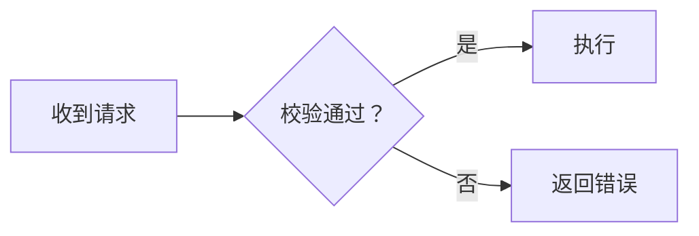
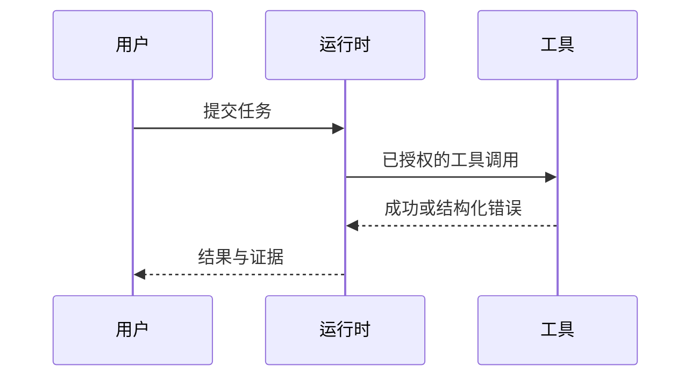
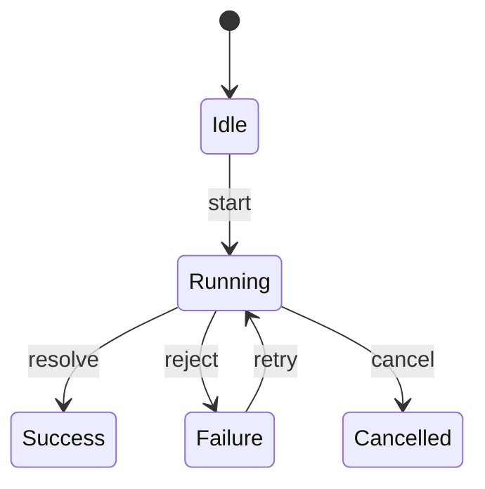

# Mermaid 图表规范与兼容边界

> 核查日期：2026-10-08。适用：仓库 Markdown 图表。
> 状态：官方语法资料核查；本轮未启动站点、未进行浏览器渲染实测。

## 1. 核心修正

原规范把“不允许缩进、不允许空行”写成 Mermaid 通用限制，这不成立。官方示例广泛使用缩进和空行。可以为了仓库一致性采用简单排版，但不能把排版习惯当作解析器规范。

不同图形有不同样式语法，不能从 flowchart 推断所有图形的能力。classDiagram 支持自己的样式声明；状态图也有自己的样式和作用范围限制。序列图不使用 flowchart 的节点 style 语句。

## 2. 最小流程图

```mermaid
flowchart LR
    A["收到请求"] --> B{"校验通过？"}
    B -->|是| C["执行"]
    B -->|否| D["返回错误"]
```

含义：校验是执行前的门槛，失败分支不进入执行节点。

使用简单 ASCII 标识符，中文放在引号标签里；复杂标点和换行优先简化。不要为了美观启用 HTML 标签或放宽安全策略。

## 3. 时间顺序

```mermaid
sequenceDiagram
    participant U as 用户
    participant R as 运行时
    participant T as 工具
    U->>R: 提交任务
    R->>T: 已授权的工具调用
    T-->>R: 成功或结构化错误
    R-->>U: 结果与证据
```

含义：工具返回值先回到运行时，再成为后续判断的输入；工具返回本身不是新的用户授权。

## 4. 状态转换

```mermaid
stateDiagram-v2
    [*] --> Idle
    Idle --> Running: start
    Running --> Success: resolve
    Running --> Failure: reject
    Running --> Cancelled: cancel
    Failure --> Running: retry
```

图展示业务状态，不承诺网络请求已被物理中止。取消后的过期结果仍需要运行时代际校验。

## 5. 错误示例的表达

故意错误的代码应使用 text 围栏；展示 Mermaid 源码中的围栏时，外层长度必须更长。否则 Markdown 本身就可能提早闭合，问题发生在 Mermaid 之前。

## 6. 当前站点限制

docs/index.html 引用 Mermaid 11 的浮动主版本 CDN，并使用一次性的 done 标志。静态阅读可发现：第一轮渲染后，后续路由新出现的图可能不再触发转换；该现象尚未浏览器复现。

页面还显式使用 loose 安全级别。这里只记录风险与修复建议，不在纯文档批次中变更安全配置。应单独审查安全级别、HTML 标签、渲染失败回退和切页行为，再决定实现。

因此，新文档必须同时保留文字解释；“GitHub 上能渲染”不等于“Docute 上所有路由已验证”。

## 7. 核查清单

- 每个围栏闭合，类型和语法匹配。
- 错误示例不会被当成真实图表执行。
- 节点名称清楚，箭头说明一致。
- 首次打开、切换页面、后退、重复进入均需验证。
- 解析失败时仍能读取原始说明。
- 验证时记录确切 Mermaid 版本，不仅写 v11。

## 8. 官方参考

- [序列图](https://mermaid.js.org/syntax/sequenceDiagram.html)
- [类图及样式](https://mermaid.js.org/syntax/classDiagram.html)
- [状态图](https://mermaid.js.org/syntax/stateDiagram.html)
