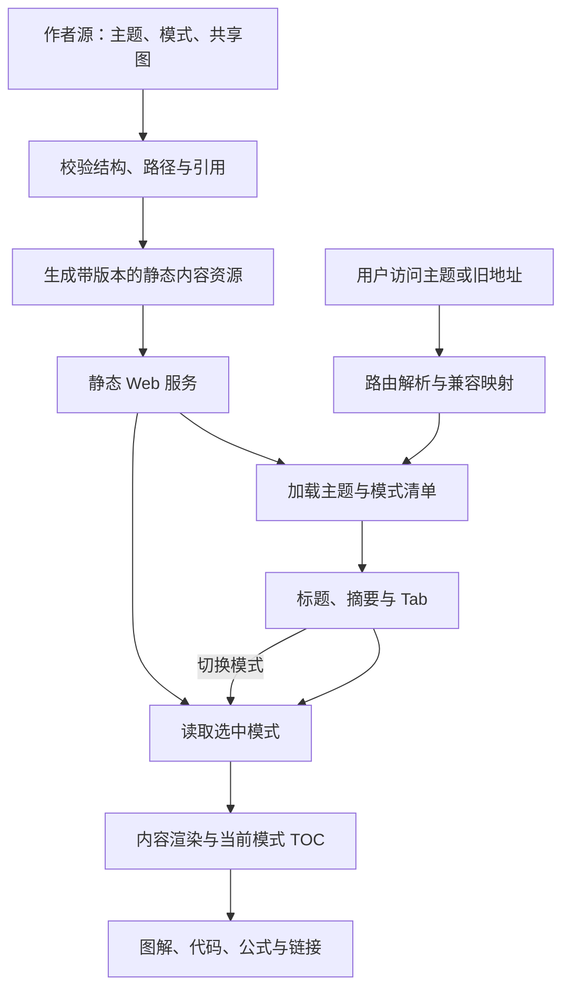

# AI 多模式作者源：展示接入与验收合同

> 2026-10-10。本提交交付内容和声明式清单，不包含新加载器/构建器实现。当前站点仍为 Docute + 阅读增强脚本；不能直接部署本分支就声称新阅读体验完成。

## 1. 已准备与待执行的边界

已准备：20 个主题的 topic.json、三个模式正文、模式清单、共享图源、全体主题索引、作者规范与内容审阅记录。

待实施：清单驱动的读取适配、共享图展开/渲染、模式路由与 TOC、构建检查及浏览器测试。运行确认后才进入部署。此文是后续工程输入，不是任务已运行或发布已批准的证明。

不新增教学实验、数据库、模型 API、ScenarioPlayer 或完整 Knowledge IR。保留 Docute 站点壳与普通笔记读取。重大依赖、系统设置、合并、受保护分支写入和部署仍按用户批准边界办理。

## 2. 最小读取链路

生成资源应保留明确的源路径/锚点映射。可以沿用现有 Markdown 解析器，先把共享图引用展开为 Mermaid 围栏，再由已接入的受限图解渲染路径显示；若选择构建时 SVG，须单独确认运行环境与所需依赖。源合同不要求为此重写前端框架。必须在工程记录中写清实际选用的编译/渲染阶段，而非混称所有图已在构建时生成。

同一固定作者源与固定工具配置应得到可重复的内容产物。不要在构建中调用 AI 重写正文，不把当前时间或随机 ID 注入内容身份。实际 SVG 引擎的布局复现能力另行验证，不能无条件保证跨平台字节一致。

## 3. UI 约定

- 页头：主题标题、固定摘要，模式切换时不消失。
- 横向模式：由 modes/index.json 生成，不硬编码三个中文标题。
- 正文：只显示所选模式，默认系统阐述。
- 纵向 TOC：来自当前模式的真实标题层级；图注不提升到与主章节平级。
- 概念图解可以复用系统阐述的图源，不能重新加回“书面区不允许 Mermaid”的检查。
- 手机空间不足时可横向滚动或使用明确的模式选择器；键盘与读屏语义一致。
- 打印/搜索应有明确的完整内容策略；不把隐藏模式永久从站内搜索丢失。

## 4. 状态与交互

| 事件 | 必须发生 | 不得发生 |
| --- | --- | --- |
| 首次打开 | 解析合法主题和模式，加载当前内容 | 按文件名猜测模式顺序 |
| URL 未指定模式 | 使用 defaultMode | 依赖上个主题不存在的模式 |
| URL 模式无效 | 提示并回退默认模式，规范化地址 | 空白页或静默显示错误正文 |
| 点击模式 | 同步选中态、正文及 TOC | Tab 已切换但旧正文冒充新模式 |
| 快速切换 | 取消旧请求或丢弃过期响应 | 旧回包覆盖后选择 |
| 相同版本缓存命中 | 复用对应主题/模式产物 | 跨版本沿用旧模式内容 |
| 加载失败 | 显示可重试状态，其他模式可用 | 将错误伪装成成功或无限重试 |
| 前进/后退 | 根据 URL 恢复模式和位置 | 只改 URL，不改页面 |
| 深链接 | 内容就绪后定位锚点 | 在内容未挂载时提前丢失定位 |
| 图渲染失败 | 说明错误并保留文本/源码路径 | 整页崩溃或没有含义的空图 |

显式 URL 的模式选择优先于任何本地偏好。手动切换默认到目标模式顶部；浏览器历史恢复应按该历史项位置，包含异步媒体占位。若实现滚动记忆，需要规定其与显式锚点的优先级。

## 5. 路由与旧页面

原入口如 `/note/ai/03-agent-loop` 必须继续可访问。`topic.json.legacyRoutes` 给出主题映射；深链接还应映射旧 oral/written/diagram 与新 overview/explanation/diagrams，并保留原 03 的四个图 ID。

旧章节的自动 slug 需要从当前站点实际行为盘点，生成兼容映射；不能仅凭改了 H2/H3 就宣称全部旧锚点兼容。新 explicit section ID 的使用同样需验证。

作者文件中的相对 Markdown 链接须按源目录解释，再转换成站点内路由。历史修复曾处理 Docute 相对链接，此改造必须回归该路径，不能直接把作者源文件地址交给浏览器当页面。

## 6. 安全与资源约束

所有清单路径只能访问本内容包允许的文件；拒绝目录穿越、未知类型与任意外部源自动执行。共享图引用只接受本主题已登记 `.mmd`，未知链接仍作为普通链接，不进行任意抓取。

HTML、SVG、URL 和图解使用明确的白名单/安全策略；不要通过 eval 或动态脚本执行内容。代码验证文件只是材料，默认不执行。限制异常大小、图节点和递归深度，失败可定位到源文件。

## 7. 验收矩阵

1. 内容清单：20 主题全部可达，60 个模式入口一致，57 个共享图源能找到且不重复维护。
2. 文本与 TOC：H1/H2/H3 正确，图注属于相应章节，默认系统阐述，概要与固定摘要职责清楚。
3. 三样板：Agent Loop、Tool Calling、ReAct 的正文原位有图，图解模式有读图说明，两处引用同源。
4. 边界章节：16 的公式与代码、05 的协议 JSON、08 的状态图、09 的时序图、18 的长表格可读。
5. 全主题：每主题切换三个模式，图解可见或明确降级，不只抽测首页。
6. 导航：旧页、旧图锚点、相对链接、深链接、前进/后退、刷新保持模式、无效地址。
7. 异步：慢响应、请求失败、连续切换、缓存版本切换、内容与 TOC 同步。
8. 可访问性：键盘移动与激活、焦点可见、Tab/tabpanel 或等价语义、手机窄屏、打印。
9. 非 AI 回归：普通 Markdown、原导航和既有文章图解未破坏。
10. 发布：确认提交、构建版本、资源路径、站点访问和回退；无发布批准不执行。

现有 `scripts/check-reading-samples.mjs` 绑定旧标题及“书面区无 Mermaid”条件，需在实现中更新/替换相关断言并保留合法回归。不能通过跳过旧测试制造全绿。没有执行命令的地方，不写“测试通过”。

## 8. 交付证据

提交 ID、真实运行命令与退出结果、测试范围、浏览器截图、未通过与未执行项、部署批准和回退信息分别记录。内容审阅、静态结构检查、浏览器表现和线上发布是四类证据，不能互相替代。
