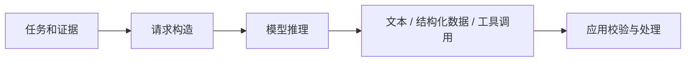

# 推理请求：输入、采样、结构化输出与流式传输

> 层级：入门到工程。日期：2026-10-08。状态：平台无关教学模型，未调用真实 API。

## 1. 请求到底包含什么

模型请求通常包含指令、用户任务、历史或引用的状态、工具定义、输出约束和推理参数。不同厂商的字段、角色、状态引用方式不同，不能把一种 SDK 格式当作通用协议。

## 2. 一次调用的边界



模型输出工具调用描述，不代表外部函数已经执行。模型输出合法 JSON，也不代表内容可信或操作已获授权。

## 3. 输出的不确定性

采样温度、候选截断和推理预算可能影响结果，但 API 支持并不统一。温度设为零不能承诺跨硬件、服务版本和并发条件下逐字相同。可靠性必须由评测与校验提供。

## 4. 结构化输出的三层验证

| 层 | 问题 | 示例 |
| --- | --- | --- |
| 语法 | 是否能解析 | JSON 是否完整 |
| 结构 | 是否满足 Schema | title 是否字符串 |
| 语义 | 是否符合业务和事实 | 引用是否支持结论、卡片 ID 是否存在 |

对未知字段、长度、枚举、递归深度和资源消耗设边界。拒绝或截断输入时，应给出可操作的错误说明。

## 5. 流式处理

网络 chunk 可能在字符串、转义字符和 Unicode 编码中间断开。不要把每个 chunk 直接 JSON.parse。区分传输事件、协议事件、应用事件；先完成协议解析，再把已验证的增量交给 UI。

卡片 UI 可以先显示骨架和文本预览，但提交、支付、写库等副作用必须等待完整校验与授权。

## 6. 成本与延迟

一次任务的成本不仅是最终答案长度，还包括重复上下文、工具结果、检索、重试和多轮决策。首 token 延迟、总响应时间、工具耗时与用户感知等待是不同指标。

模型名称、价格和上下文窗口是易变配置，不写死在知识正文；接入时查官方 API 和实际账单。

## 7. 最小契约示例

```json
{
  "schemaVersion": "1",
  "kind": "concept",
  "title": "闭包",
  "summary": "函数可以访问其词法环境中的绑定",
  "sourceIds": ["source-1"]
}
```

这是本书自定义卡片结构，不是任何产品的内部格式。source-1 必须映射到应用已保存的来源记录，不能接受凭空的引用标识。

## 8. 验证练习

设计四个输入：半截 JSON、未知 kind、超长 summary、虚构 sourceId。分别说明应该在哪一层拒绝、如何展示错误、是否可以重试。重试必须受次数与预算限制。

## 9. 延伸

- [工具与协议](05-tools-mcp-skills.md)
- [结构化 UI](07-ui-ir.md)
- [评估与观测](10-evaluation.md)
