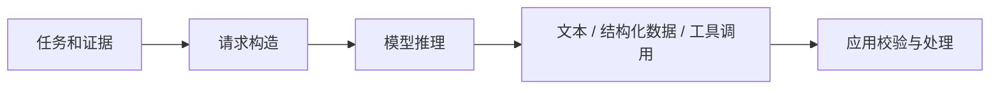

# 推理请求：输入、采样、结构化输出与流式传输

> 层级：入门到工程。日期：2026-10-08。状态：平台无关机制说明模型，未调用真实 API。

## 快速回顾

- 一次 API 响应完成不等于用户任务完成；模型计算、服务协议与应用状态是不同层。
- 结构合法、事实正确与动作获准需要分别检查。
- 流式字节、协议事件和应用对象不能按同一边界解析。

## 1. 请求、服务与模型计算

模型请求通常包含指令、用户任务、历史或引用的状态、工具定义、输出约束和推理参数。不同厂商的字段、角色、状态引用方式不同，不能把一种 SDK 格式当作通用协议。



模型输出工具调用描述，不代表外部函数已经执行。模型输出合法 JSON，也不代表内容可信或操作已获授权。

服务 API 不只是一个文本函数。它可能负责认证、配额、消息模板、工具 Schema、服务端会话引用与结果存储；底层模型才执行数值计算。“API 看起来有记忆”也可能只是服务重新装配历史，并不能据此判断模型参数改变。

| 边界 | 输入 | 输出 | 应独立记录 |
| --- | --- | --- | --- |
| 应用 → 服务 | 指令、任务、证据与配置 | 请求 ID | 版本、预算与数据范围 |
| 服务 → 模型 | 编码后的序列/模态输入 | token 分布或相关表示 | 具体格式可能不可见 |
| 服务 → 应用 | 文本、事件、工具提议、终止信息 | 可处理结果 | 是否完整、是否拒绝、是否截断 |
| 应用 → 用户 | 已校验内容与状态 | 可见产物 | 来源、错误和未完成部分 |

模型计算细节见[语言模型机制](16-language-models.md)。应用层应把服务返回的完成状态与业务完成分开：响应完成可能只是工具调用提议已经生成，不是用户任务已经完成。

## 2. 解码与输出边界

采样温度、候选截断和推理预算可能影响结果，但 API 支持并不统一。温度设为零不能承诺跨硬件、服务版本和并发条件下逐字相同。可靠性必须由评测与校验提供。

temperature 缩放 logits，较低值通常使分布更集中；top-p 按累计概率截取候选，top-k 按候选个数截取。参数不是“创造力旋钮”的严格物理量，效果依赖任务、模型和其他设置；部分模型不暴露这些参数。

输出预算限制产生的长度，但“最大输出 2k”不保证每次正好输出 2k，也不保证正文一定在边界前自然结束。长度截断、停止序列、模型主动结束、服务拒绝与用户取消应区别记录。JSON 被截断时，不能靠补一个右括号就宣布语义完整。

## 3. 结构化输出与业务校验

| 层 | 问题 | 示例 |
| --- | --- | --- |
| 语法 | 是否能解析 | JSON 是否完整 |
| 结构 | 是否满足 Schema | title 是否字符串 |
| 语义 | 是否符合业务和事实 | 引用是否支持结论、卡片 ID 是否存在 |

对未知字段、长度、枚举、递归深度和资源消耗设边界。拒绝或截断输入时，应给出可操作的错误说明。

```json
{
  "schemaVersion": "1",
  "kind": "concept",
  "title": "闭包",
  "summary": "函数可以访问其词法环境中的绑定",
  "sourceIds": ["source-1"]
}
```

这是本知识库自定义卡片结构，不是任何产品的内部格式。source-1 必须映射到应用已保存的来源记录，不能接受凭空的引用标识。

## 4. 流式协议与完整性

网络 chunk 可能在字符串、转义字符和 Unicode 编码中间断开。不要把每个 chunk 直接 JSON.parse。区分传输事件、协议事件、应用事件；先完成协议解析，再把已验证的增量交给 UI。

卡片 UI 可以先显示骨架和文本预览，但提交、支付、写库等副作用必须等待完整校验与授权。

自写示意，假设上层协议最终传递一份卡片对象：

```text
网络读取 1：{"title":"闭
网络读取 2：包","sourceIds":[
网络读取 3："s1"]}
```

第三行的引号若真是中文引号，则最终 JSON 仍非法；“收齐所有 chunk”只是完整性条件，不是语法正确的充分条件。实际 HTTP 字节流还可能把一个 UTF-8 字符拆开，必须由流式解码器保留跨块状态。

处理层次应是：字节解码 → 传输/事件协议解帧 → 协议数据累积 → 结构与语义校验 → 应用展示。若服务使用 SSE，网络读取不等于一个完整 SSE 事件，一个事件也未必等于完整工具参数。

预览可接纳未最终提交的文本，但应把“正在生成”与“已验证内容”区别开；执行动作不能由半截 event 或模型文本触发。

## 5. 错误分类与恢复

| 情况 | 当前能够确认什么 | 常见处理思路 |
| --- | --- | --- |
| 输入 Schema 错误 | 本次输入不符合合同 | 修正输入，不原样无限重试 |
| 权限拒绝 | 当前身份/动作不被允许 | 停止并说明缺少权限 |
| 限流 | 请求节奏不被接受 | 按服务约定退避并受总预算约束 |
| 网络中断 | 结果是否完成可能未知 | 查请求状态或明确部分结果 |
| 语义不合格 | 结构可用但业务不成立 | 回到证据或受限修复 |
| 用户取消 | 用户不再等待当前任务 | 停止后续链路，处理迟到结果 |

读模型响应和执行外部写入有不同风险。前者重试主要涉及成本、延迟与输出变化，后者还可能重复产生业务副作用。更多见[恢复边界](09-reliability-security.md)。

## 6. 成本与延迟

一次任务的成本不仅是最终答案长度，还包括重复上下文、工具结果、检索、重试和多轮决策。首 token 延迟、总响应时间、工具耗时与用户感知等待是不同指标。

模型名称、价格和上下文窗口是易变配置，不写死在知识正文；接入时查官方 API 和实际账单。

## 7. 关联与深入入口

- [MDN SSE](https://developer.mozilla.org/en-US/docs/Web/API/Server-sent_events/Using_server-sent_events)：传输层依据，关注事件分帧；不把 SSE 当作某厂商完整语义协议。
- [提示与行为](17-prompt-behavior.md)：指令、示例和输出限制怎样共同工作。
- Advance 引子：增量结构校验与最终校验怎样分工？首字延迟与稳定首屏之间有哪些取舍？这些是应用协议问题，不是单独调一个采样参数。

- [工具与协议](05-tools-mcp-skills.md)
- [结构化 UI](07-ui-ir.md)
- [评估与观测](10-evaluation.md)

