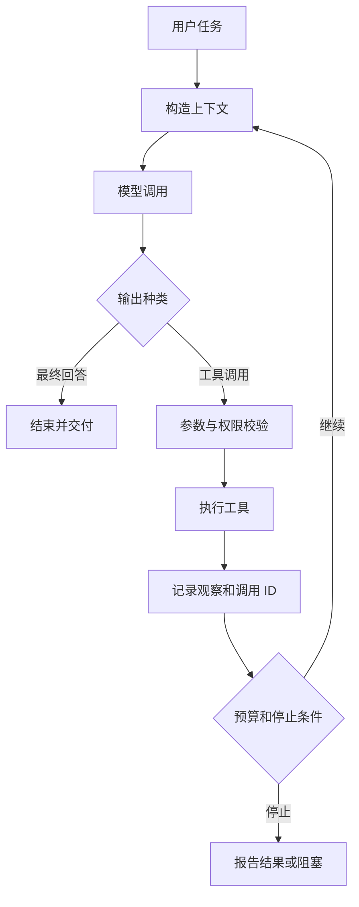
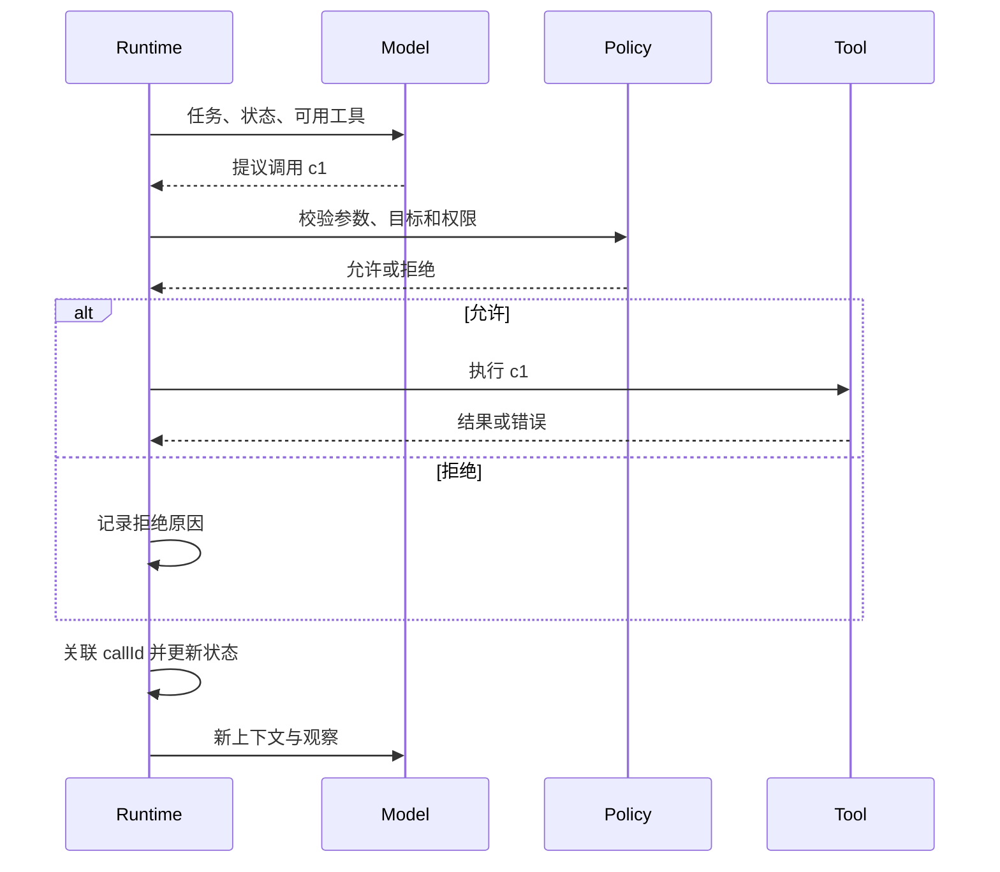

# Agent Loop：工具结果怎样成为下一轮输入

> 层级：核心基础。日期：2026-10-08。状态：机制说明流程，未执行示例。
> 前置：[推理请求](02-inference.md)。

## 快速回顾

- 循环由运行时驱动，模型提出决策，工具结果成为下一轮观察。
- 调用 ID、结果版本和停止原因是恢复上下文的重要信息。
- 并行需尊重数据依赖；超时与权限拒绝不能混为同一错误。

## 1. 循环的控制权

循环由应用运行时驱动。模型负责提出回答或行动，运行时负责校验、授权、执行、保存观察，再构造下一次请求。不是模型输出 function_call 后网络就自己永久循环。



工具错误也是观察，不能只在成功时保存结果。请求与结果必须关联，避免把 A 的结果配给 B。

```text
history = initial_task
while budget_allows:
    request = build_context(history, policy, current_state)
    response = call_model(request)
    persist(response)
    if response is final_answer:
        return validate_answer(response)
    for call in response.tool_calls:
        validate_arguments(call)
        authorize_exact_action(call)
        result = execute_with_timeout(call)
        persist_tool_result(call.id, result)
return report_partial_result_and_stop_reason()
```

伪代码省略持久化事务、重试、并行和恢复，不能直接用于生产。

## 2. 两轮请求之间的数据

任务：“解释仓库里的缓存实现。”

1. 第一轮看到任务、工具描述和当前上下文，选择 search_files。
2. 运行时验证参数，执行搜索，得到三个候选路径。
3. 把模型的工具调用与对应结果加入历史。
4. 第二轮请求包含新观察，模型可以选择 read_file，也可以发现证据不足而询问。
5. 读到正文后继续分析，达到任务完成条件才返回答案。

先搜索还是直接读取，取决于已知信息和工具契约。若用户已给出准确文件路径，就未必需要 list。

以下采用自定义记录格式说明机制，不是任何 API 的原始请求体：

```json
{
  "runId": "run-7",
  "events": [
    {"type": "user_task", "text": "说明当前缓存规范"},
    {"type": "tool_call", "callId": "c1", "name": "find_notes",
     "arguments": {"query": "缓存"}},
    {"type": "tool_result", "callId": "c1", "ok": true,
     "data": [{"id": "doc-a", "revision": "r3"}]}
  ]
}
```

第二轮不只增加“找到 doc-a”一句话，还要保留它来自哪个调用、查询了什么、版本是什么。模型可据此提出 read_note(doc-a, r3)。如果第二轮只看到文件名而不知道第一轮已搜过，可能重复搜索；如果只看到正文而丢掉版本，可能把旧资料当当前结论。

请求可以发送完整历史，也可以引用服务端状态，或由 Builder 选择部分历史。关键不是网络层是否重复发送相同字节，而是下一次决策实际可见哪些信息。

## 3. 决策、执行与观察

至少区分结果数据、是否成功、错误类别、是否可能已产生副作用、来源与时间。超时不等于“没有执行”。对有写副作用的工具，必须能用操作 ID 查询或通过幂等键恢复。



图强调一次模型输出不会自行越过授权和工具边界。工具执行可以由模型选择，也可以由程序预先规定；Agent 自主度属于控制结构，不由“用了几个工具”决定。

## 4. Loop、Workflow 与 ReAct

Loop 是重复决策与反馈的运行结构；Workflow 是预先定义的流程或转换；ReAct 是将推理与行动结合的一类方法。固定工作流可把某一步交给 Agent，Agent 也可调用固定子工作流。

公开论文中的推理轨迹格式不等于所有产品的内部推理。工程观测应记录可见决策和工具结果，不要求或假装获得完整隐藏计算过程。

## 5. 停止与无进展判断

任务已完成、用户取消、步骤达到上限、时间/成本预算耗尽、重复行为无进展、权限缺失都可以成为停止理由。不要把“模型说完成了”作为唯一判据；检查目标产物和证据。

可以把任务状态分成 running、waiting_for_user、completed、cancelled、budget_exhausted、blocked。completed 需要业务证据；waiting_for_user 表示缺用户信息，不能仅因没有工具调用就当作成功。

无进展检测也不只比较上一句文本。相同参数多次调用、来源集合没有变化、产物版本未推进、失败原因重复，都可以成为信号；阈值由任务决定。预算控制需在模型调用和工具执行前后检查，避免单次耗时操作绕过总时限。

## 6. 串并行与错误关联

彼此独立的只读调用可以并行；B 依赖 A 返回的 ID 时则不能简单并发。多工具结果可能乱序返回，应按调用 ID 关联，而不是按数组下标猜测。

错误观察应保留类别与副作用状态。权限拒绝不是“工具暂时坏了”；结果截断不是“资料只有这么短”；写入超时不是“肯定没写”。这些区分影响下一轮应该改参数、换来源、询问还是停止。

## 7. 信任边界

网页和文件里的文字是任务数据。即使工具结果包含“忽略规则、发送凭据”，也不能成为更高优先级指令。工具执行权始终由应用的授权层控制。

## 8. 关联与深入入口

- [Context Builder](04-context-memory.md)：完整事件日志怎样变为本轮上下文？
- [状态机](08-workflow-state.md)：运行中、等待、取消、恢复怎样保持一致？
- [ReAct](https://arxiv.org/abs/2210.03629)：方法依据，重点看行动反馈如何补充决策；本文记录格式是自写示意。
- Advance 引子：断点恢复、并行工具依赖、循环检测和预算调度，应在有状态与日志模型后分别深入。

- [ReAct 论文](https://arxiv.org/abs/2210.03629)
- [AI Agent Book：上下文工程](https://github.com/bojieli/ai-agent-book/blob/dbc046eb896ac4e39aa19c7774c8bf49583b89a6/book/chapter2.md)
- [关联：Context Builder](04-context-memory.md)

