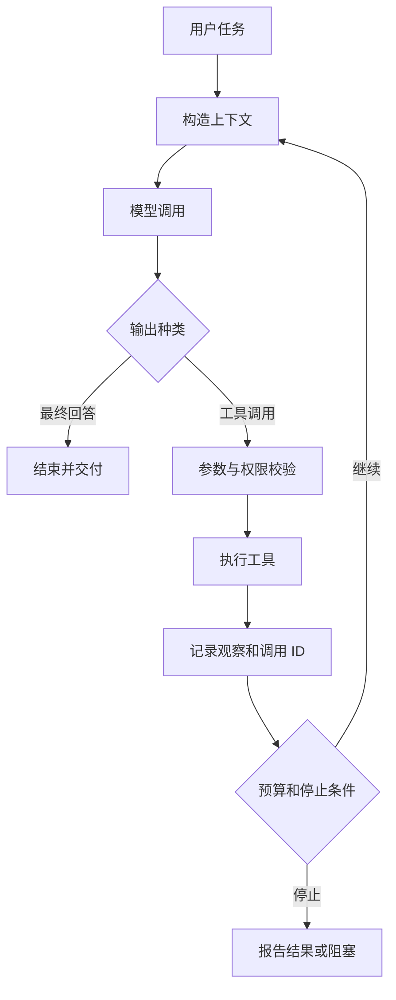

# Agent Loop：工具结果怎样成为下一轮输入

> 层级：核心基础。日期：2026-10-08。状态：教学流程，未执行示例。
> 前置：[推理请求](02-inference.md)。

## 1. 核心结论

循环由应用运行时驱动。模型负责提出回答或行动，运行时负责校验、授权、执行、保存观察，再构造下一次请求。不是模型输出 function_call 后网络就自己永久循环。

## 2. 最小闭环



工具错误也是观察，不能只在成功时保存结果。请求与结果必须关联，避免把 A 的结果配给 B。

## 3. 两轮具体轨迹

任务：“解释仓库里的缓存实现。”

1. 第一轮看到任务、工具描述和当前上下文，选择 search_files。
2. 运行时验证参数，执行搜索，得到三个候选路径。
3. 把模型的工具调用与对应结果加入历史。
4. 第二轮请求包含新观察，模型可以选择 read_file，也可以发现证据不足而询问。
5. 读到正文后继续分析，达到任务完成条件才返回答案。

先搜索还是直接读取，取决于已知信息和工具契约。若用户已给出准确文件路径，就未必需要 list。

## 4. 教学伪代码

```text
history = initial_task
while budget_allows:
    request = build_context(history, policy, current_state)
    response = call_model(request)
    persist(response)
    if response is final_answer:
        return validate_answer(response)
    for call in response.tool_calls:
        validate_arguments(call)
        authorize_exact_action(call)
        result = execute_with_timeout(call)
        persist_tool_result(call.id, result)
return report_partial_result_and_stop_reason()
```

伪代码省略持久化事务、重试、并行和恢复，不能直接用于生产。

## 5. Observation 的内容

至少区分结果数据、是否成功、错误类别、是否可能已产生副作用、来源与时间。超时不等于“没有执行”。对有写副作用的工具，必须能用操作 ID 查询或通过幂等键恢复。

## 6. 如何停止

任务已完成、用户取消、步骤达到上限、时间/成本预算耗尽、重复行为无进展、权限缺失都可以成为停止理由。不要把“模型说完成了”作为唯一判据；检查目标产物和证据。

## 7. 工具输出的信任边界

网页和文件里的文字是任务数据。即使工具结果包含“忽略规则、发送凭据”，也不能成为更高优先级指令。工具执行权始终由应用的授权层控制。

## 8. 练习与验收

构造一个工具连续返回空结果的任务。三轮内怎样检测重复并退出？如果写文件成功但回包丢失，怎样避免重复写入？分别设计状态与可观测字段。

## 9. 参考

- [ReAct 论文](https://arxiv.org/abs/2210.03629)
- [AI Agent Book：上下文工程](https://github.com/bojieli/ai-agent-book/blob/dbc046eb896ac4e39aa19c7774c8bf49583b89a6/book/chapter2.md)
- [下一章：Context Builder](04-context-memory.md)
