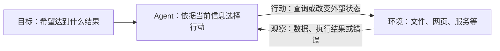
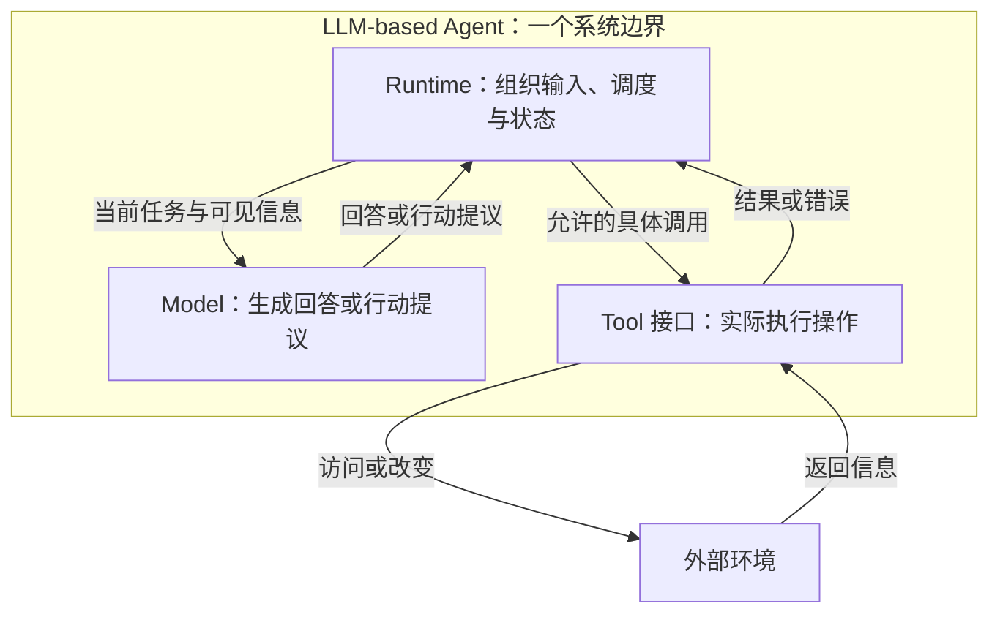
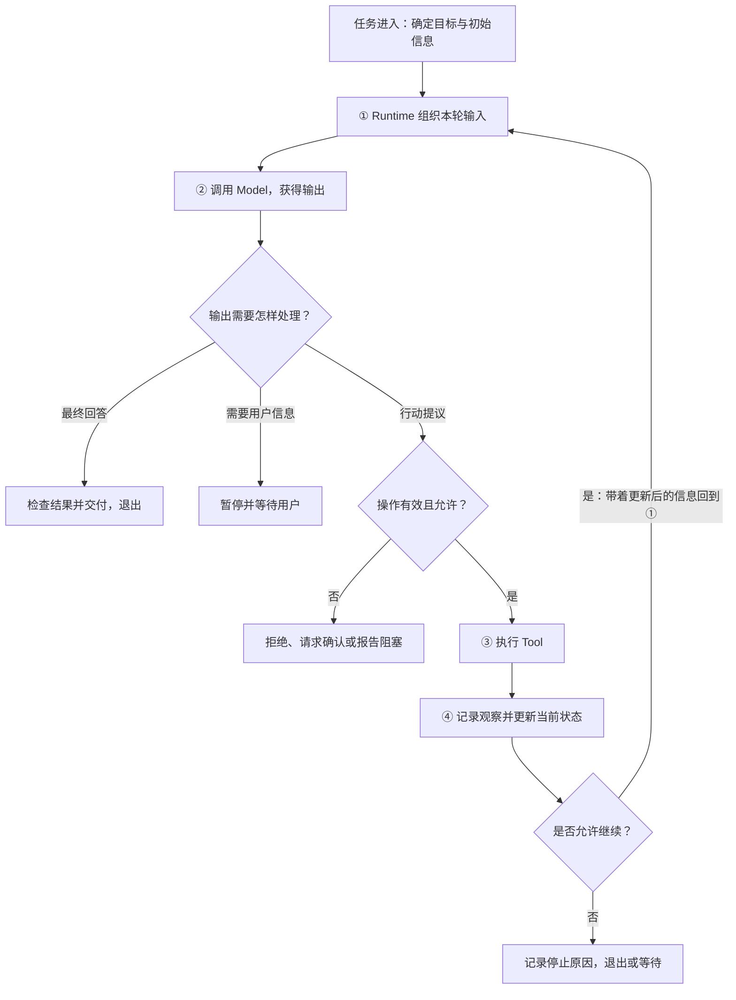
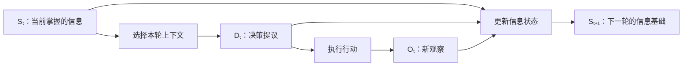

# Agent Loop：目标、行动与反馈构成的运行机制

> 类型：Base / 概念与机制。修订：2026-10-08。
> 范围：以大语言模型参与决策的软件 Agent；不是某个框架的实现规范。
> 阅读方式：先看整体反馈关系，再逐层展开内部职责、信息变化与控制边界。图示和符号模型为原创解释，不依赖一个具体项目案例。

## 快速回顾

**Agent Loop 是一种围绕目标反复进行决策、行动和观察的控制机制：行动带来新的反馈，反馈更新系统当前掌握的信息，并影响下一次决策。**

其中需要区分两条相互配合的路径：

- **控制循环**：程序执行完一次行动后，返回决策步骤，决定继续还是结束。
- **信息反馈**：行动结果进入系统状态与下一次输入，使下一次决策具备新的依据。

只有重复执行，没有利用结果，并不能说明形成了有意义的反馈。反过来，获得结果却没有后续判断或处理，也还没有说明一个 Agent Loop 如何持续运行。

本页依次回答：Agent 是什么 → 为什么需要循环 → 循环内部由谁负责 → 哪些信息沿循环变化 → 如何继续与结束 → 它与其他机制是什么关系。

## 1. Agent 的基本对象：目标、环境、观察和行动

### 1.1 Agent 不是某个模型的另一个名字

在一般 AI 语境中，Agent 可以理解为能够接收环境信息并选择行动的主体或系统。它可以使用规则、搜索或学习模型，并不一定使用大语言模型。

本章讨论的 **LLM-based Agent** 是其中一种：大语言模型参与理解任务和选择下一步，程序负责组织执行，并与外部系统交互。因此，模型是这个系统的组成部分，不能直接把二者画等号。

从整体看，理解 Agent 首先需要四个概念：

| 概念 | 含义 | 为什么必要 |
| --- | --- | --- |
| 目标 Goal | 希望达到的结果或需要持续满足的要求 | 决定行动的方向和完成判据 |
| 环境 Environment | Agent 交互的外部对象与状态 | 提供信息，也承受行动的影响 |
| 观察 Observation | 从环境或执行过程得到的信息 | 成为后续判断的依据 |
| 行动 Action | 为获取信息或改变状态而采取的操作 | 将判断连接到外部世界 |

环境不只指物理世界，也可以是文件、网页、数据库或其他软件服务。行动也不一定产生写入：查询资料是在获取信息，修改文件是在改变外部状态。

### 1.2 为什么“观察”不等于“世界的全部事实”

Agent 通常只能看到环境的一部分。搜索结果可能不完整，工具结果可能过期，执行也可能失败。因此，观察是系统得到的信息，不是天然正确、完整的真相。

这会产生一个根本要求：Agent 必须根据已经得到的信息继续判断，而不是假定自己一开始就知道完成任务所需的一切。Loop 正是组织这种持续判断的机制。

**本节的核心：Agent 是与环境交互的系统；目标提供方向，观察提供依据，行动建立联系。接下来要解释的是，这些对象怎样形成反馈关系。**

## 2. 第一层图解：把 Agent 看成一个整体

先不展开模型、工具或协议，只观察 Agent 与环境的关系：



图中的闭合路径是 **Agent → 环境 → Agent**。它表达：Agent 采取行动，环境返回反馈，Agent 再据此调整后续行为。

这与“输入问题，生成一段文字”的单次调用视角不同。单次调用只描述一次输入到输出；反馈视角还要描述：输出怎样引起行动、行动结果怎样重新进入系统。

但不能据此推断“一次模型调用不是 Agent”。一个 Agent 在信息充分时，也可能一次就完成任务。**Loop 描述的是系统具有怎样的运行结构，不规定每个任务必须循环多少次。**

### 2.1 闭环的意义在于反馈，而不是次数

重复同一请求三次、固定轮询一个接口、让多个模型依次回答，都包含重复或多次调用，但它们不自动等于自主 Agent 的决策机制。

需要继续问：后续行动是否利用了前一次反馈？下一步由固定程序完全规定，还是允许模型依据当前信息选择？因此，“有循环”“有反馈”“有自主决策”是相关但不相同的性质。

为了理解这种结构在 LLM 系统里怎样实现，需要打开图中的 Agent 方框。

## 3. 第二层图解：打开 Agent，区分决策与执行职责

### 3.1 Model：生成决策提议的组件

本章的 Model 指大语言模型。它根据收到的任务、当前信息与可用能力说明，生成回答或下一步行动的提议。

模型输出可以影响决策，但输出本身不意味着外部操作已经发生。模型说“读取文件”，和程序真的读取文件，是两个事件。

### 3.2 Runtime：驱动运行过程的控制程序

**Agent Runtime** 是组织模型调用、工具执行和状态更新的程序逻辑。它负责把各个步骤连接起来，并在适当时机继续、暂停或结束。

它不一定是独立服务，也不一定是大型框架；可以是应用中的一个控制模块。这里的 Runtime 不等于 JavaScript 引擎或 Node.js：后者运行程序，而 Agent Runtime 是程序里管理 Agent 行为的那部分逻辑。

### 3.3 Tool：连接外部能力的接口

Tool 是具有明确输入、输出及副作用约定的可调用操作。其实现可以是普通函数、HTTP API、数据库查询或其他服务。

工具把“能够做什么”开放给决策系统。哪些工具可见、哪些参数合法、哪些操作获准，仍由应用和服务端控制。

将这些职责放进同一个图：



第一张图中的“选择行动”，在这一层被展开成模型参与判断与程序控制执行；“获得观察”被展开成工具返回结果、Runtime 接收并保存。

这里画的是职责关系，不规定部署方式。一个工具可以与 Runtime 在同一进程，图中的多个方框也不必对应多个服务器。

**本节的核心：Model 负责生成提议，Runtime 负责组织过程，Tool 提供实际能力。把三者分开，才能说明“模型想做什么”如何变成“系统实际做了什么”。**

## 4. 工具调用描述：为什么 function_call 不是函数执行

### 4.1 模型与程序之间需要可解释的行动表示

模型不能只返回任意一句“帮我处理一下”，让程序猜测要执行哪个操作。通常需要某种结构化描述，至少明确操作名称与参数。

例如下面的局部示意：

```json
{
  "kind": "tool_call",
  "callId": "call-1",
  "name": "search",
  "arguments": {"query": "目标主题"}
}
```

这是自定义格式，表示一个行动提议，而不是已经搜索成功。部分 API 称此类能力为 function calling 或 tool calling；实际字段和消息格式取决于协议。

Runtime 读取提议后，将名称映射到已登记的工具，检查参数与权限，再执行操作。它不应把模型生成的任意字符串直接作为代码运行。

| 对象 | 它表示什么 | 它不能证明什么 |
| --- | --- | --- |
| 工具定义 | 操作的用途、参数与返回约定 | 模型一定会选它 |
| 工具调用提议 | 本轮想执行的操作及参数 | 操作已经执行 |
| 工具执行 | 程序调用实际函数或服务 | 业务目标一定完成 |
| 工具结果 | 该次执行返回的数据或状态 | 数据一定完整、可信或最新 |

### 4.2 Observation 是行动后的证据

工具结果进入 Agent 的观察范围后，才可能影响下一次决策。成功数据、未找到、参数错误和超时状态，都可能成为观察，但含义不同。

callId 等关联信息用于说明“这个结果回应的是哪次调用”。它不是 Agent Loop 的定义要素，却是存在多个调用、异步回包或恢复需求时的重要实现信息。

由此可见，循环不只是重复调用模型，还需要在两次调用之间完成一次 **行动表示 → 实际执行 → 结果记录** 的转换。

## 5. 第三层图解：完整的最小控制循环

前面两层解释了系统对象和职责。现在按执行顺序，把它们组织成一个可继续、也可退出的过程：



**Loop 的控制回边是 ④ 之后返回 ①。** 程序回到输入构造步骤，再次请求模型决策；如果输出已满足当前完成条件，或不能继续，则走退出/等待分支。

无图时，可以按以下文字恢复同一结构：

```text
本轮信息 → 模型输出
              ├─ 最终结果 → 检查并退出
              ├─ 缺少用户信息 → 等待
              └─ 行动提议 → 检查 → 执行 → 记录结果
                                            ↓
                                 更新信息，回到下一轮模型调用
```

### 5.1 一轮到底包括什么

为便于讨论，本文把“一次模型调用及其输出处理”称为一轮。如果输出是工具提议，本轮还包括相应执行和观察记录；如果输出是最终回答，则本轮结束任务。

框架中的 step、turn、iteration 可能采用不同计数方式，有的还把一次模型调用产生的多个工具调用分别计步。因此，理解机制应先看事件关系，再看日志计数。

### 5.2 谁决定继续，谁决定下一步

这两个问题不能混在一起：

- Model 可以提议继续获取信息、采取行动或给出回答。
- Runtime 判断这份输出怎样处理，并检查时间、步数、权限与用户状态是否允许继续。

模型提议“再搜索一次”，不代表程序必须执行；程序允许继续，也不意味着模型必须使用工具。控制权限与语义决策共同决定运行路径。

到这里，循环的起点、重复部分、回边和出口已经明确。接下来还需要解释：为什么回到同一步，不会只是重复处理完全相同的信息？

## 6. 信息反馈：同一个控制步骤，不同的决策依据

### 6.1 控制流循环，信息状态演进

设本轮开始时系统掌握的信息为 Sₜ。行动完成后，它获得观察 Oₜ，再把该观察与已有记录合并或更新，形成 Sₜ₊₁。

```text
Sₜ    ：本轮开始时的任务状态、事实与事件记录
Dₜ    ：依据本轮信息产生的决策提议
Oₜ    ：本轮行动带来的结果或错误信息
Sₜ₊₁ ：结合 Dₜ、Oₜ 更新后的系统信息
```

这组符号是概念记法，不假定系统符合某个特定数学模型，也不表示观察完全可靠。



这张图把循环的一次信息变化展开成直线，以便观察“什么被带到下一轮”。它与上一节的控制循环是同一机制的两个视角，而不是另一套架构。

控制图解释 **程序回到哪里**；信息图解释 **返回时有什么不同**。只画其中一个，读者往往就会困惑：这是简单重试，还是利用反馈继续推理？

### 6.2 信息变化不只意味着增加文本

一次查询可能得到新事实，也可能表明某来源不存在；一次写入可能确认成功，也可能让结果进入未知状态。因此，更新不仅是“追加工具文本”，还可能包括：

- 新增证据或修正已有判断。
- 将某个步骤标记为已完成、失败或待核对。
- 记录某种尝试已经无效，避免机械重复。
- 保存仍未解决的问题及其来源。

反馈不会保证每轮都进步。错误结果、重复结果或错误解释，仍可能使系统停滞或偏离目标。Loop 提供修正的机会，不提供自动收敛的保证。

### 6.3 系统状态、模型上下文与参数是三层不同的东西

| 层次 | 保存什么 | 一轮行动后通常怎样变化 |
| --- | --- | --- |
| 系统状态/事件记录 | 任务、事实、工具结果和操作状态 | 由 Runtime 更新 |
| 本轮模型上下文 | 此次决策实际可见的输入 | 由程序选择和装配 |
| 模型参数 | 训练得到的数值 | 普通工具循环通常不更新 |

系统保存了一个结果，不等于模型已经看见它。结果必须进入下一次输入，或经服务端会话状态提供给下一次调用，才能成为决策依据。

因此，“Agent 从执行反馈中继续判断”通常不是“Agent 在每一轮重新训练模型”。[Context Builder](04-context-memory.md)负责展开状态如何变为输入；[后训练](13-training-inference-systems.md)讨论参数怎样变化。

**本节的核心：Loop 重复的是控制规则，演进的是系统信息。新观察通过上下文影响后续决策，而不是自动改变模型权重。**

## 7. 闭环如何成立，又如何结束

### 7.1 三个连接缺一不可

一个有意义的行动反馈闭环，至少需要把以下关系连接起来：

1. 决策能够影响实际行动。
2. 行动结果能够被系统识别并记录。
3. 后续决策能够利用这些结果。

如果第一步缺失，系统只有行动描述；第二步缺失，系统不知道操作发生了什么；第三步缺失，新的模型调用可能仍在依据旧信息重复判断。

这也是审查 Agent 架构图时最有用的检查方式：不要只数有多少组件，而要找这三条连接是否清楚。

### 7.2 完成、等待与失败不是同一个出口

| 状态 | 含义 | 为什么要区分 |
| --- | --- | --- |
| 完成 | 结果达到当前任务判据 | 需要产物或证据支持 |
| 等待 | 缺用户输入、批准或外部事件 | 之后可能恢复 |
| 阻塞 | 当前权限、能力或环境不支持继续 | 不应伪装成功 |
| 取消 | 用户不再要求继续当前任务 | 后续回包仍需正确处理 |
| 预算耗尽 | 步数、时间或费用达到边界 | 可返回部分成果，但不是完整完成 |

模型输出“完成”只是一份声明。对于有外部动作的任务，仍需确认实际结果；对于内容任务，则需检查相应内容判据。

### 7.3 循环不等于无限运行

次数限制约束重复多少轮；超时限制约束单次调用或整个任务等多久；取消机制响应用户意图；无进展判断识别重复但无新增价值的行为。

这几项互不替代。比如某个工具一直不返回，外层轮数不会增加，单靠最大轮数无法结束它。具体恢复、重试与幂等留在[可靠性](09-reliability-security.md)，但基础层必须明确存在这些控制边界。

## 8. Policy：行动约束，不是另一个“思考角色”

本章中，Policy 指哪些动作被允许、应满足哪些条件的规则及检查逻辑。例如对象访问范围、写入批准、资源上限。

Policy 可以分布在 Runtime 与工具服务端，不一定是独立组件。它控制的是 **提议能否成为实际操作**，而不是替模型回答知识问题。

需要特别区分两个同名用法：

- **安全/授权 policy**：规定某个主体在具体条件下是否允许执行动作。
- **强化学习 policy**：描述如何根据状态或观察选择行动的决策策略。

两者都可能出现在 Agent 文献中，但不是同一层次。看见 Policy 方框时，必须先确认作者采用哪种含义。

同样，工具结果中的文本只是观察数据，不能凭一句“忽略规则”就改变系统权限。反馈进入决策，不意味着反馈拥有重新定义授权的权力。

## 9. Agent Loop、Workflow 与 ReAct 的知识关系

### 9.1 Loop 是运行结构，Workflow 是流程组织

本页的 Loop 回答“怎样反复推进并利用反馈”；Workflow 则关注“步骤和分支怎样被组织、哪些决策预先确定”。

工程上常用以下区分：固定工作流由程序预先规定主要路径；Agent 式组织把部分下一步选择交给模型。但这不是互斥关系：

- Workflow 可以包含循环。
- Workflow 的一个节点可以调用 Agent。
- Agent 可以把某个子任务交给固定流程。
- 同一个系统不同阶段可以采用不同自主程度。

所以，“有循环就是 Agent”“没有循环就是 Workflow”都不成立。应比较决策分工，而不是只看流程图有没有回边。

### 9.2 ReAct 是结合推理与行动的方法

ReAct 研究怎样把推理与行动交替结合，使外部观察参与后续问题求解。它属于求解方法视角，而不是 Runtime 的同义词，也不是某种工具调用字段。

理解三者关系，可以分别问：

| 概念 | 回答的问题 |
| --- | --- |
| Agent Loop | 决策、行动与反馈怎样在运行中反复连接？ |
| Workflow | 任务步骤与分支怎样组织，哪些由程序预定？ |
| ReAct | 推理与行动怎样交替参与求解？ |

ReAct 可以由一个循环执行器承载，但并非所有工具循环都采用论文中的显式轨迹形式。可见的推理文字也不等于模型全部真实内部计算，不能把“展示了思考”当作可靠性的证明。[ReAct 原始论文](https://arxiv.org/abs/2210.03629)

### 9.3 外层 Agent Loop 与内层 token 生成不是一回事

一次模型调用内部，通常存在逐 token 的生成过程；Agent Loop 则位于应用层，处理模型输出、外部行动和下一次调用。

| 层次 | 重复单元 | 反馈来源 |
| --- | --- | --- |
| 模型生成过程 | 下一个 token 的计算/选择 | 已有序列与模型计算状态 |
| 应用层 Agent Loop | 一轮决策及其处理 | 工具、环境、用户与任务状态 |

一个模型调用可能生成很多 token，但没有执行任何外部工具。反过来，一个 Agent 任务可能跨越多次模型调用。服务产品也可能在内部托管工具循环，外部 API 看起来只有一次请求；不能仅用客户端请求数判断是否存在 Agent Loop。

## 10. 从基础模型通向相关知识

| 想继续理解的问题 | 本页已经建立的连接 | 深入入口 |
| --- | --- | --- |
| 系统信息怎样选入下一次调用？ | 状态 → 上下文 → 决策 | [Context Builder](04-context-memory.md) |
| 工具怎样被发现和调用？ | 行动描述 → 执行接口 | [Tool、MCP、Skill](05-tools-mcp-skills.md) |
| 暂停、取消、恢复怎样表达？ | 控制状态与出口 | [Workflow 与状态机](08-workflow-state.md) |
| 写入超时后如何避免重复操作？ | 观察不一定确认副作用 | [可靠性与安全](09-reliability-security.md) |
| 怎样判断循环真的解决问题？ | 完成声明与完成证据 | [Evals](10-evaluation.md) |
| 多个决策单元怎样协作？ | 一条循环之外的任务依赖 | [多 Agent](11-multi-agent.md) |

这些主题不是定义 Agent Loop 的必要前提，而是基础模型在规模、风险和复杂性增加后需要进一步解决的问题。Base 保留机制主线，Advance 再讨论并行调度、持久化恢复、策略改进等具体设计。

## 11. 概念速查与常见误解

| 术语 | 本页定义 | 不应等同于 |
| --- | --- | --- |
| Agent | 根据观察选择行动并与环境交互的系统 | 某个 LLM 模型 |
| Model | 根据输入生成回答或提议的模型组件 | 外部操作执行器 |
| Runtime | 驱动调用、执行和状态变化的控制程序 | 必须独立部署的框架 |
| Tool | 有输入/结果合同的可调用能力 | 已获批准的任意操作 |
| function_call / tool call | 模型或协议中的调用描述 | 函数已经执行 |
| Observation | 执行或环境返回的信息 | 完整、可靠的世界真相 |
| Loop | 返回前面步骤并继续的控制结构 | 必然进步或无限运行 |
| Policy（权限语境） | 具体动作的允许条件与检查 | 模型自称“被允许” |

- **多次调用不自动意味着更智能。** 如果没有新的证据或有效状态更新，循环可能只增加成本。
- **反馈不等于训练。** 普通循环主要改变上下文和应用状态，不自动更新权重。
- **组件越多不等于闭环越完整。** 关键是决策、行动和反馈之间的连接。
- **有闭环不等于有可靠性保证。** 模型判断、工具结果和停止判据都可能出错。
- **知识的核心不是某段调用轨迹。** 轨迹只是机制的一次展开；定义、职责和反馈关系应能脱离具体任务成立。

## 12. 来源、组织参考与修订

### 概念与机制依据

- [AIMA 官方 Agent 伪代码，第 2 章](https://aima.cs.berkeley.edu/algorithms.pdf#page=2)：观察、内部状态与行动的基础视角；不要求 Agent 使用 LLM。
- [Building Effective Agents](https://www.anthropic.com/engineering/building-effective-agents)：固定流程与动态决策的工程区分；具体系统可能采用不同术语边界。
- [ReAct](https://arxiv.org/abs/2210.03629)：推理与行动结合的方法来源，不作为所有 Agent 的统一协议。
- [Hugging Face Agent Cycle](https://huggingface.co/learn/agents-course/en/unit1/agent-steps-and-structure)：可对照决策、行动与观察关系；本文另行区分执行控制与模型提议。

### 表达组织参考

- [Jay Alammar：The Illustrated Transformer](https://jalammar.github.io/illustrated-transformer/)：借鉴从整体到局部逐层打开的图解方法，不复制其图。
- [Aman’s AI Journal：Transformers](https://aman.ai/primers/ai/transformers/)：借鉴主定义、机制、辨析、局限与细粒度查阅的条目组织。
- [Lilian Weng：LLM Powered Autonomous Agents](https://lilianweng.github.io/posts/2023-06-23-agent/)：借鉴专题之间的关联与带范围的引用；其 2023 年文章不等于当前实现规范。

> 本轮修订：取消以单个笔记任务为全文主线；改为“外部反馈关系 → 内部职责 → 控制循环 → 信息演进 → 概念关联”的知识模型。仅保留局部调用格式示意。图表完成源文本检查，未在现有站点逐图渲染；本文未运行模型或工具实验。
