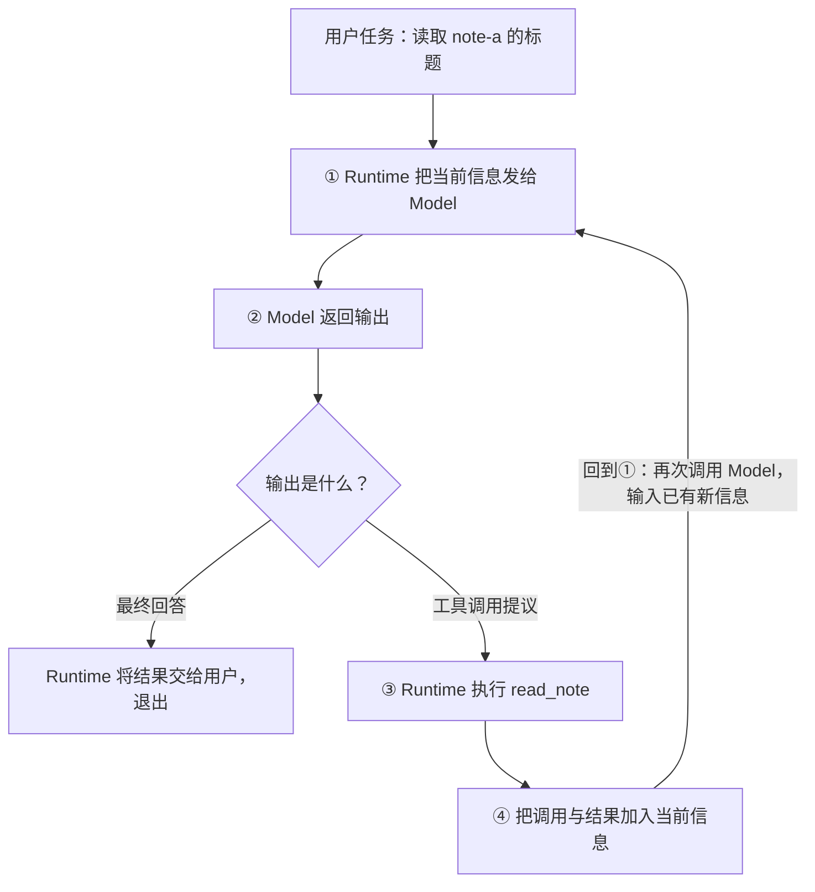
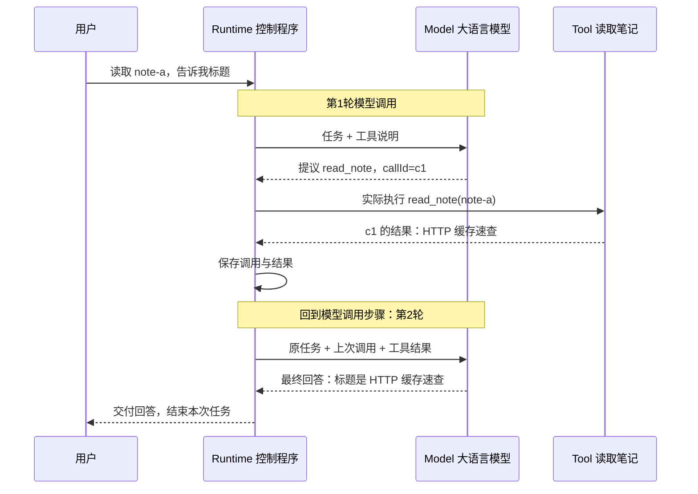

# Agent Loop：一次工具执行，怎样变成下一轮模型输入

> 类型：Base / 自包含机制说明。修订：2026-10-08。
> 前置：知道函数接收输入并返回结果，知道程序可以重复执行；不要求已经理解 Agent 框架、MCP 或 ReAct。
> 本文所有笔记内容、调用记录和模型响应均为构造的说明案例，未调用真实模型或工具服务。

## 核心结论

**Agent Loop 是程序反复执行“把当前信息交给模型 → 根据模型输出采取行动 → 把行动结果加入当前信息 → 再调用模型”的控制过程。**

“Loop”不是某个模型名称，也不是工具调用协议中的特殊字段。它指这个过程会回到前面的模型调用步骤。每次返回时，输入因为新获得的结果而发生变化；当可以给出最终结果，或遇到停止条件，程序退出。

理解它首先需要回答四个问题：谁负责重复？每次重复执行什么？下一轮多知道了什么？什么时候结束？下面围绕同一个例子依次回答。

## 1. 为什么一次模型调用可能不够

假设用户提出：

> 读取笔记 note-a，告诉我它的标题。

笔记保存在应用数据库中，当前请求里没有正文。仅凭这句话，模型不知道标题；模型也不能因为“知道有一个数据库”，就直接访问数据库。

程序可以给模型介绍一个可用工具：read_note，输入笔记 ID，输出笔记内容。模型于是有两种选择：

- 信息已经足够：直接给出回答。
- 还需要外部信息：提出“调用 read_note，参数为 note-a”。

关键在于，**第二种输出还不是笔记内容，而是获取内容的请求**。应用必须执行读取，再把读到的信息交给模型，模型才能基于它作答。这就产生了第二次模型调用。

这不是所有应用都必须采用的方式。如果程序已经确定必须先读 note-a，也可以先直接读取，再只调用一次模型。Agent Loop 的价值在于：当下一步需要由模型依据当前情况选择时，程序仍能把选择、执行和反馈连接起来。

## 2. 先定义四个必要角色

### 2.1 Agent：与环境交互并据此选择行动的系统

在一般 AI 语境中，Agent 可理解为接收环境信息并选择行动的主体或系统，不必使用大语言模型。环境可以是物理世界，也可以是网页、文件或数据库等软件世界。

本章只讨论一种常见形态：**以大语言模型参与决策的软件 Agent**。模型帮助判断下一步，普通程序执行外部操作并保存状态。不要把 Agent 直接等同于“一个大模型”。

在当前例子中，整个笔记助手是 Agent；笔记数据库是它交互的环境。读取后，它掌握了先前没有的标题，再据此回答用户。

### 2.2 Model：根据输入生成回答或行动提议的模型

本章的 Model 指大语言模型。可以先把一次模型调用理解为：

```text
输入：任务 + 当前已知信息 + 可用工具说明
输出：最终回答，或者工具调用提议
```

模型主要负责“根据已知信息，决定接下来输出什么”。它的输出不自动执行数据库操作。

这里的 Model 也不同于经典 Agent 理论中的“环境模型”：后者可能指系统对世界如何变化的内部描述。相同单词在不同上下文中要看其具体含义。

### 2.3 Tool：应用开放给 Agent 的可调用能力

Tool 是一个有明确输入和结果的操作，例如读取笔记、搜索文件或查询天气。底层通常仍由普通函数、API 或服务实现。

本例工具合同是：

```text
名称：read_note
用途：读取指定笔记，不修改它
输入：笔记 ID
输出：笔记 ID、标题、正文
```

工具说明让模型知道“有哪些操作可选”；工具实现真正完成读取。这两者不能混为一谈。

### 2.4 Runtime：把模型与工具组织起来的控制程序

本章的 Runtime 指 **Agent 运行时**，即负责管理这一过程的程序逻辑。它负责：

1. 组织本次模型输入。
2. 调用模型并读取输出。
3. 需要时执行工具。
4. 保存工具结果，准备下一次输入。
5. 决定继续、等待还是结束。

它可以先只是几十行程序，不一定是某个大型框架，也不一定是独立服务。

对前端开发者而言，可以把 Runtime 看成一个协调请求与状态的 controller。它可能运行在 Node.js 上，但这里的 Runtime 不是在说 Node.js 自身的语言运行时。

**到这里，三者的分工是：Model 提议下一步，Tool 执行具体操作，Runtime 负责连接并重复这个过程。Agent 是包含这些协作关系的系统。**

## 3. function_call 是什么：一份描述，不是已经执行的函数

当模型希望读取笔记时，可以返回类似下面的结构：

```json
{
  "kind": "tool_call",
  "callId": "c1",
  "name": "read_note",
  "arguments": {"id": "note-a"}
}
```

这份数据表达的是：“请调用 read_note，传入 note-a。”它没有包含读取结果，也没有让 JavaScript 自行运行。

一些 API 把类似输出称为 function call，另一些使用 tool call；具体字段由协议决定。本文统一用“工具调用提议”，上面是自定义示意格式，不是某个 SDK 的原始报文。

与普通函数调用作对照：

| 场景 | 发生的事情 |
| --- | --- |
| 程序执行 read_note("note-a") | 控制流程进入函数或发出对应服务请求 |
| 模型输出 read_note 的名称与参数 | 生成一份待处理数据，尚未执行 |
| Runtime 解析提议并调用工具 | 把这份描述映射到允许的实际操作 |

Runtime 应查找预先登记的工具，而不是把模型生成的字符串当任意代码执行。callId 用于把这次请求与稍后结果关联；“模型提出什么”和“工具返回什么”是两个独立事件。

明确了这个区别，接下来才能看清：为什么调用工具之后还需要回到模型。

## 4. 最小闭环：Loop 就在“回到第 ① 步”

为了突出基本机制，这里先假设只有一个已经允许使用的只读工具，并且读取成功。权限拒绝、超时和并行放到理解闭环之后再讨论。



**图中的回边是 ④ → ①。** 它使原本的一次模型调用变成可重复的过程。

如果图表没有渲染，也可以按下面的文字读：

```text
① 调用模型
   ↓
② 看模型输出
   ├─ 最终回答 → 交付并退出
   └─ 工具调用 → ③ 执行工具 → ④ 保存结果 → 回到①
```

循环体并不是“只重复问同一个问题”，而是“使用更新后的信息，再次请求模型判断”。若执行了工具却没有让下一轮看到结果，虽然程序可能仍在重复调用模型，却没有形成有用的行动反馈。

本例以一次模型调用为一轮：第一轮请求读取，Runtime 执行工具；第二轮模型看到标题并回答。它包含两轮模型调用、一次工具执行、一次回到起点，最后明确退出。

不同框架对 step、turn 的计数口径可能不同，阅读日志时应先核对定义。

## 5. 用同一个例子，完整走完两轮

### 5.1 第一轮：知道任务，但还不知道标题

Runtime 准备的输入可以概括为：

```text
任务：读取 note-a，告诉我它的标题。
当前信息：尚未读取 note-a。
工具：read_note(id)，读取笔记，返回标题与正文。
```

Model 返回第 3 节的工具调用提议 c1。此时“该做什么”有了答案，但“标题是什么”仍然没有答案。

Runtime 收到提议后，检查工具和参数是否有效，并执行读取。假设工具返回：

```json
{
  "kind": "tool_result",
  "callId": "c1",
  "ok": true,
  "data": {
    "id": "note-a",
    "title": "HTTP 缓存速查",
    "body": "用于说明的笔记正文"
  }
}
```

这份结果就是一次 **Observation（观察）**：Agent 从外部操作中得到的新信息。观察可以是成功数据，也可以是错误或“未找到”；它并不保证结果永远正确。

### 5.2 两轮之间：Runtime 更新了什么

Runtime 保存三件事：用户任务、模型提出的调用、工具返回的结果。第二次输入因此可以包含：

```text
用户任务：
读取 note-a，告诉我它的标题。

上一次模型输出：
调用 read_note(id="note-a")，callId="c1"。

对应工具结果：
c1 成功，标题为“HTTP 缓存速查”。
```

这里的变化不是模型参数更新，而是 **下一次调用可见的信息增加了**。

模型不会因为某个 JavaScript 函数在旁边执行过，就自动知道它的返回值。Runtime 必须把结果放进下一次输入，或者通过服务端会话机制让下一次调用能够访问它。

具体采用完整历史、服务端状态引用还是经过选择的上下文，是实现差异；这些由[Context Builder](04-context-memory.md)进一步解释。本节只需要掌握：下一次判断必须能够利用刚得到的结果。

### 5.3 第二轮：已有标题，可以回答

Model 收到更新后的信息，返回：

```json
{
  "kind": "final",
  "text": "note-a 的标题是《HTTP 缓存速查》。"
}
```

Runtime 识别这是最终回答，完成必要检查后交给用户，并退出循环。本例只需返回一个已读取字段，检查的重点就是回答是否与工具结果一致。

全程对应如下：



第一张图展示可重复的控制结构；这张图展示一次具体运行，包含第二轮响应和最终退出。两张图讲的是同一个过程。

## 6. 为什么下一轮可以做出不同决定

我们可以只跟踪三个量：

| 时刻 | 任务 | 当前已知信息 | 下一步的合理选择 |
| --- | --- | --- | --- |
| 第 1 轮前 | 获取 note-a 标题 | 不知道标题 | 提议读取 |
| 工具返回后 | 任务不变 | 得到标题 | 回到模型，更新判断 |
| 第 2 轮后 | 任务已能回答 | 标题和来源都明确 | 给出最终回答 |

这正是闭环中的反馈：行动结果改变后续决策的依据。模型可能仍然判断错误，所以“有反馈”不是“必然正确”；但没有这条信息反馈路径，就无法根据工具结果继续处理。

若用户的问题改为“找到一篇缓存笔记，再告诉我标题”，第一轮可能需要 search_notes，第二轮根据搜索返回的 ID 提议 read_note，第三轮才回答。循环结构不变，只是中间获得信息的次数变多。

工具顺序也不必固定：用户已给出准确 ID 时，先搜索可能多余。哪些步骤由模型选择、哪些由程序固定，是系统设计的一部分。

## 7. 把机制对应到最小程序结构

下面只展示控制顺序，采用伪代码；不是可以直接连接某个 API 的生产实现：

```text
history = [用户任务]

最多重复 max_steps 次:
    response = 调用模型(history, 工具说明)
    history 加入 response

    如果 response 是最终回答:
        检查并返回 response
        结束

    如果 response 不是合法的工具调用:
        报告无法继续
        结束

    如果该调用不被允许:
        报告需要确认或权限不足
        结束

    result = 执行指定工具(response.name, response.arguments)
    history 加入 与 response.callId 关联的 result

    回到循环开头，再次调用模型

报告达到步骤上限，返回已知的部分结果
```

逐项对应前面的四个问题：

- 谁重复：Runtime 中的控制程序。
- 重复什么：调用模型，处理输出，必要时执行工具并记录结果。
- 什么发生变化：history 中加入了新的决策与观察。
- 怎么停止：最终回答、无效输出、权限阻塞或步骤上限。

真实程序还需要处理异常、超时和用户取消。这里不把它们混进第一张图，是为了先讲清机制；实际运行时不能因此省略安全边界。

另外，外层步骤上限只限制次数。如果一次网络调用永远不返回，次数不会继续增加，因此还需要单次调用的超时或取消控制。次数与时间是不同维度。

## 8. Policy 是什么，为什么它不放在第一步讲

Policy 在本章指 **允许哪些操作的规则及其执行检查**。例如：只能读取当前用户有权访问的笔记；发布需要对指定版本的批准；单次读取不得超过某个大小。

它不一定是单独服务，可以是 Runtime 中的检查逻辑，也可以部分位于工具服务端。为了画清职责，架构图常把它画成独立方框，但方框不代表必须单独部署。

模型选择“我想调用什么”，Policy 检查“这个具体动作是否允许”。因此它位于行动提议与实际执行之间，而不是由模型的一句“我已获批准”代替。

还要注意：强化学习中的 policy 通常指从观察/状态到行动的决策策略，和这里的权限规则不是同一个用法。没有说明上下文就直接写 Policy，容易让读者误以为所有资料都在指同一机制。

本章的主例先选定已获允许的只读操作，是为了减少初次理解的变量。理解循环后，再补权限检查，就能知道它控制的是哪一步。

## 9. Loop、Workflow、ReAct：分别回答不同问题

### 9.1 Loop：控制结构是否会重复

Loop 回答“程序怎样反复推进”。本章讲的是每次得到新观察后重新调用模型的结构。

并不是所有 loop 都是 Agent：重试 HTTP 请求也是循环，但不一定包含基于语义目标的行动选择。也不是每次 Agent 任务都一定使用工具：信息足够时，第一轮即可回答。

### 9.2 Workflow：步骤和分支由谁预先规定

这里的 Workflow 指程序预先规定的工作流程。例如：

```text
程序固定：读取 note-a → 调用模型概括 → 校验结果 → 交付
```

Agent 式循环则允许模型根据当前信息提出下一步，比如先搜索还是直接读取。区别主要是决策如何分配，不是“有无箭头”“有无循环”。

Workflow 本身也可以包含循环，可以在某个节点嵌入 Agent；Agent 也可以调用固定的子流程。本文采用这个常见工程区分，不把它当作所有产品唯一的命名规则。

### 9.3 ReAct：怎样结合推理与行动

ReAct 是一类把推理与行动交替结合的方法。直观上，系统根据当前信息判断需要什么证据，采取行动，获得观察，再继续判断。它提供的是求解方法视角，不是负责执行代码的 Runtime，也不是 function_call 协议。

例如“目前不知道标题，需要读取笔记”可以说明行动的依据；读取结果又支持下一步回答。这里的说明文字是给读者的解释，不声称披露任何模型真实的内部思考过程。

并非所有工具循环都显式采用 ReAct 论文的格式；也不需要为了称作 Agent，就让模型公开输出长篇推理轨迹。

| 概念 | 核心问题 | 所属层次 |
| --- | --- | --- |
| Agent | 谁根据观察选择并采取行动？ | 系统/主体 |
| Model | 谁生成本次回答或行动提议？ | 决策组件 |
| Runtime | 谁组织并驱动整个过程？ | 控制程序 |
| Tool | 哪个操作实际获取信息或改变环境？ | 执行能力 |
| function_call | 模型怎样描述想调用的操作？ | 输出/调用描述 |
| Loop | 过程怎样返回并重复？ | 控制结构 |
| Workflow | 哪些步骤由程序预先规定？ | 流程组织 |
| ReAct | 怎样把推理与行动结合？ | 求解方法 |
| Policy（本章） | 具体动作是否允许？ | 约束与检查 |

这些词不是互斥的同类选项，一个系统可以同时包含它们。

## 10. 基础闭环之外，还有哪些必要边界

完成基本模型后，再看真实系统中的扩展，就知道每个机制在补哪个缺口：

| 问题 | 缺口在哪里 | 对应知识 |
| --- | --- | --- |
| 历史太长 | 下一次输入装不下 | [Context Builder](04-context-memory.md) |
| 工具拒绝或超时 | 行动没有确定的可用结果 | [工具合同](05-tools-mcp-skills.md) |
| 写成功但响应丢失 | 不能把“没收到”当“没发生” | [可靠性与幂等](09-reliability-security.md) |
| 用户取消后旧结果回来 | 结果归属与当前状态冲突 | [状态机](08-workflow-state.md) |
| 模型说完成但实际不正确 | 退出声明缺业务证据 | [评测](10-evaluation.md) |
| 工具结果夹带命令 | 外部数据被误当指令 | [安全边界](09-reliability-security.md) |

这些不是用来堆砌“生产级”名词的附录，而是最小模型在更多条件下暴露出的具体问题。相关页面负责展开，本页不要求读者先读完它们才能理解基本循环。

## 11. 回顾：用一句完整的话还原机制

**用户给任务；Runtime 把任务和已有信息交给 Model；Model 提出回答或工具调用；若需要工具，Runtime 执行并保存结果，再带着新结果调用 Model；直到可以交付结果或必须停止。**

因此，Loop 在“工具结果返回以后，再次调用模型”这条回路上；Runtime 控制重复；信息通过上下文传递；工具调用描述本身不会执行函数。理解了这四点，再看协议字段、状态管理和失败恢复，就有明确的归属位置。

## 12. 来源与进一步阅读

- [AIMA 官方 Agent 伪代码，第 2 章](https://aima.cs.berkeley.edu/algorithms.pdf#page=2)：从观察输入、状态与行动输出理解一般 Agent；其中的 Agent 不必使用 LLM。本文未复制其算法或假装已阅读整本教材。
- [Composing Programs 1.5.5：Iteration](https://composingprograms.com/pages/15-control.html#iteration)：参考其先说明执行规则、再跟踪状态变化的解释方式；本文例子与图均独立编写，不设置课程或作业。
- [Building Effective Agents](https://www.anthropic.com/engineering/building-effective-agents)：了解固定流程与自主决策的工程分工；术语使用仍需结合具体系统。
- [ReAct 原始论文](https://arxiv.org/abs/2210.03629)：了解方法的研究问题与贡献，不把某个论文格式等同于所有 Agent 实现。
- [推理请求](02-inference.md)解释单次调用，[上下文](04-context-memory.md)解释下一轮输入的选择；两者分别对应循环中的不同位置。

> 2026-10-08 修订：从“组件/注意事项清单”改为“问题动机 → 术语定义 → 最小闭环 → 同例逐轮追踪 → 控制结构 → 方法辨析”。纠正先前默认读者已经知道关键术语、时序缺少最终退出以及 Policy 含义不清的问题。
