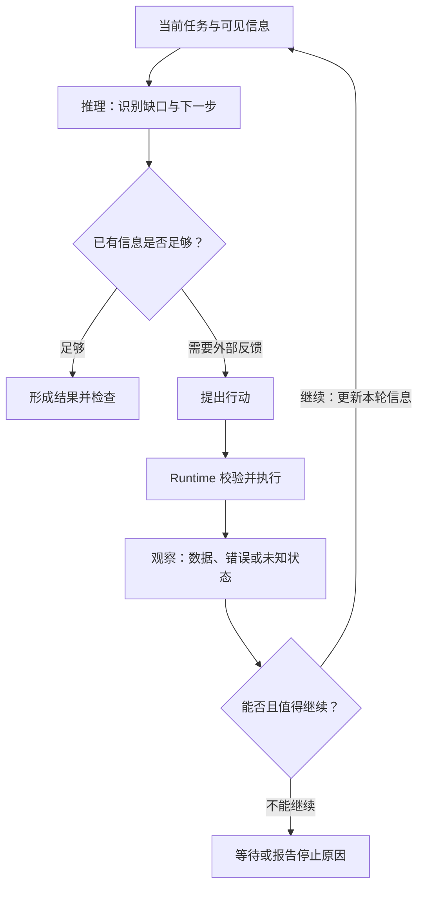
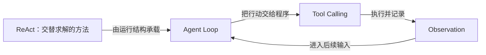

# ReAct：推理与行动如何交替参与求解

> Base / 方法与机制 · 修订：2026-10-10。范围：ReAct 论文提出的方法及其与现代工具调用系统的概念关系。
> 前置：[Agent Loop](03-agent-loop.md) · [Tool Calling](03-tool-calling.md)。ReAct 不是前端 React 库，也不是某个 SDK 的统一接口规范。
> 主定义在本页维护；具体运行控制回到 Loop，调用格式回到 Tool Calling。

## 先用这条主线回答

1. **ReAct 将推理与行动交替结合**：推理帮助选择和调整行动，行动带来外部观察，观察再影响后续判断。
2. **核心是信息反馈参与求解**：不是把 Thought、Action、Observation 三个词写进 Prompt 就必然有效。
3. **它是求解方法，不是完整运行系统**：执行、授权、状态、预算和停止条件仍由 Runtime 等程序设施支撑。
4. **优势依赖条件**：有价值的工具与可用反馈可能改善任务表现；错误观察、反复尝试和多轮调用也会增加风险与成本。

## 完整口语答案

ReAct 讲的是，模型解决问题时，可以把推理和行动交替起来，而不是先把所有事情想完，再一次性给出结果。

推理帮助判断当前缺什么信息、下一步该做什么；行动让系统去查询信息或者与环境交互；返回的观察再成为下一次判断的依据。它的关键并不是“多调用几次”，而是后一步真的利用了前一步得到的反馈。

经典讲法常用 Thought、Action、Observation 三个词。Thought 是轨迹中表达的推理，Action 是要采取的动作，Observation 是环境返回的信息。不过这些词不是所有 API 必须遵守的消息字段。现代系统可以用结构化工具调用来交接行动，也未必向用户展示推理文本。

它和 CoT 的差别，可以从信息来源理解：单纯增加推理步骤，不能凭空获得缺失的外部事实；行动可以帮助取得新的证据。但取得证据也不保证证据正确，更不保证模型解释正确。

所以 ReAct 比较适合下一步依赖外部结果、无法提前完全确定路线的任务。简单问题可能直接回答就够了，路径固定的任务也可能更适合工作流。是否值得多走几轮，要看正确率、成本、延迟和失败风险的实际变化。

最后，把它放回系统里看：ReAct 说明怎么交替求解，Agent Loop 负责把这种过程运行起来，Tool Calling 负责表达和交接行动。上线还必须有权限检查、停止条件、取消和错误处理。我们希望的是有依据地继续，也有依据地停下。

## 书面精讲

### 1. ReAct 要连接哪两种能力

语言推理可以帮助拆解问题、跟踪已有判断和调整行动计划；外部行动可以带回模型当前输入中没有的信息。ReAct 的研究重点，是让二者在求解过程中交替配合，而不是各自孤立地使用。[原始论文](https://arxiv.org/abs/2210.03629)

这里的“框架”指方法组织，不应直接理解为可安装的软件框架。论文的任务、动作空间和提示示例有具体条件，不能把实验中的改善当作对所有任务的保证。

### 2. Thought、Action、Observation 分别是什么

| 术语 | 在概念模型中的职责 | 需要避免的误解 |
| --- | --- | --- |
| Thought | 表达当前判断、计划或异常处理思路 | 可见文本不等于模型全部真实内部计算 |
| Action | 对环境采取动作，或请求执行某项操作 | 模型输出动作文本不代表操作已经发生 |
| Observation | 环境或执行程序返回的信息 | 不天然完整、准确、可信或最新 |

三者构成的是依赖关系，不要求每一轮都输出同样长度的解释。也不能只从界面有没有“思考过程”判断系统采用了什么方法。

### 3. 最小循环与停止条件

当前任务与已有信息支持一次判断；判断产生行动提议；程序执行获准行动并得到观察；观察被选入后续输入，再支持下一次判断。图解见[交替反馈](#react-cycle)。

当证据足够时，可以形成答案；当缺少权限、信息或预算时，应该等待、报告阻塞或停止。停止不是 ReAct 外的一句装饰话，而是运行系统必须提供的控制。

一个局部例子：如果要比较两份文档的更新时间，系统先要取得时间信息，再比较；第一份文档无法访问时，后续动作应根据这个失败调整，而不是假装已经获得数据。这只用于说明反馈依赖，不作为整篇教学任务。

### 4. 与 CoT、Tool Calling、Workflow 的区别

| 概念 | 主要回答什么 | 与 ReAct 的关系 |
| --- | --- | --- |
| CoT | 如何用中间推理步骤组织求解 | 单独的推理链不要求外部行动，能够与其他机制组合 |
| Tool Calling | 怎样把行动提议结构化交给程序 | 可作为 ReAct 中 Action 的交接方式 |
| Agent Loop | 怎样驱动调用、执行、反馈和出口 | 可承载 ReAct，也可承载其他方法 |
| Workflow | 怎样预先组织步骤、分支与约束 | 固定流程可包含 ReAct 子过程；动态 Agent 也可调用固定流程 |

不要把“单次调用”与“只靠参数记忆”画等号：一次调用也可以输入充分的检索证据。比较方法时应控制可用信息和任务条件，而不是用最弱的单次回答充当所有基线。

### 5. 何时有价值，何时未必值得

| 条件 | 可能收益 | 必须付出的代价或限制 |
| --- | --- | --- |
| 下一步依赖新获得的外部信息 | 根据反馈调整行动 | 工具可用性与信息质量影响全过程 |
| 任务路径不完全确定 | 动态选择搜索或操作 | 决策错误可能累积，需要观测与终止 |
| 问题简单，输入已充分 | 多轮收益可能很小 | 额外调用增加延迟与费用 |
| 步骤固定、可严格校验 | 固定 Workflow 可能更容易控制 | 不应为了“Agent 化”增加自主分支 |

这些是选择时的分析维度，不是跑过基准后的结论。若要判断具体系统是否受益，应比较成功率、事实依据、耗时、调用成本和安全失败，而不只看思考轨迹长短。

### 6. 三个容易被包装成优点的误区

- **“有真实反馈兜底，所以不会幻觉。”** 工具本身可能返回错误，模型也可能误读；反馈提供纠正机会，不提供正确性担保。
- **“能看到 Thought，所以完全可解释。”** 可见轨迹有助于排查行为，但不等于忠实暴露全部内部机制。
- **“工具循环就是 ReAct。”** 一个循环可能只是固定重试或预设步骤。是否采用 ReAct，需要看推理与行动如何结合，而不是数模型调用次数。

### 7. 深入入口与修订

- [ReAct 原始论文，2022 提交 / 2023 修订](https://arxiv.org/abs/2210.03629)：核对方法目标、任务设置和实验边界。本文没有复现实验，也不引用其数字作为当前应用性能承诺。
- [作者项目页](https://react-lm.github.io/)：查看论文轨迹示例如何连接推理与外部行动。
- [Building Effective Agents](https://www.anthropic.com/engineering/building-effective-agents)：对照工作流与动态决策的工程边界，不作为 ReAct 的唯一实现规范。
- 进一步问题：长任务是否需要独立计划？观察冲突怎样裁决？什么时候反思会增加无效调用？进入规划、记忆与评测专题，不把所有 Agent 技术都塞进 ReAct 的定义。

表达方式借鉴问题式阅读页，文字和图独立编写。2026-10-10 从原 03 的概念关系小节展开为主条目；没有模型实验或生产效果验证。

## 概念图解

### 图 1：推理与行动通过观察连接

**读图结论：** 方法的核心是推理与行动互相提供条件；授权、执行和预算属于承载它的运行设施。观察回到输入，才可能改变下一步。

### 图 2：方法、运行结构与调用交接

**读图结论：** 三者分属不同问题层次；图中的箭头表达配合方式，不是唯一架构或固定部署拓扑。并非每个 Loop 都需要 ReAct，也并非每种 Action 都采用同一调用协议。

继续查阅：[Agent Loop](03-agent-loop.md) · [Tool Calling](03-tool-calling.md) · [Context Builder](04-context-memory.md)。
