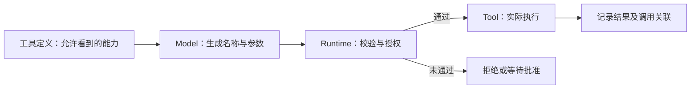
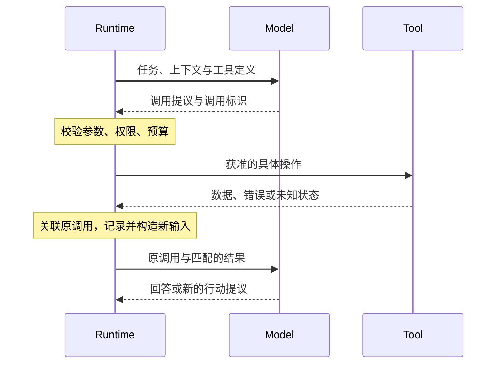

# Tool Calling：模型提议怎样成为受控执行

> Base / 概念与机制 · 修订：2026-10-10。范围：应用自定义工具；托管工具的执行方可以是服务提供方。
> 前置与关联：[Agent Loop](03-agent-loop.md) · [ReAct](03-react.md) · [Tool、MCP 与 Skill](05-tools-mcp-skills.md)。
> 本页是调用描述、调用关联和结果回传的主解释；不绑定某一家 API 字段。代码为未执行的自定义协议示意。

## 先用这条主线回答

1. **Tool Calling 是模型与执行程序之间的结构化交接**：模型给出工具名与参数，程序把提议解释为具体操作。
2. **定义、提议、执行、结果必须分开**：符合格式的调用不等于有权限，更不等于业务操作成功。
3. **结果需要关联原调用并进入后续输入**：调用标识解决“回应哪次操作”，上下文构造解决“模型看见什么”。
4. **协议负责表达，Runtime 与服务端负责控制**：验证、授权、限流、错误处理及副作用核对不能依赖模型自觉。

## 完整口语答案

Tool Calling 不是模型自己运行一个函数，而是模型向应用提出一个结构化的调用请求。

应用先告诉模型有哪些工具、各自做什么、参数有什么约束。模型根据任务选择工具并给出参数。接下来程序才会检查这个工具是否存在、参数是否合法、当前用户有没有权限，以及这次操作是否需要确认。通过后，程序调用真正的函数或服务。

这里最容易混淆的是“请求合法”和“事情做成了”。JSON 写对了，账户可能没有权限；接口返回了，业务也可能失败；写操作超时，甚至可能已经成功但回包丢失。所以结果要明确区分成功、失败和未知，不能一律当作可以重试。

工具执行后，程序还需要把结果与原调用对应起来。多个工具同时返回时，不能只凭返回顺序猜测。关联完成后，把必要的结果放进下一次模型输入，模型才能据此回答或继续行动。

因此，Tool Calling 解决的是“模型怎样表达要做什么、程序怎样接住并返回结果”。它可以只发生一次，也可以成为 Agent Loop 的一部分。它和 MCP 也不是替代关系：前者描述模型侧的调用交接，后者可以提供连接外部工具服务的协议。

## 书面精讲

### 1. 为什么需要结构化的行动描述

自然语言里的“请查一下”缺少稳定的操作标识、参数边界和结果关联。Tool Calling 将模型的行动提议转换为程序能够解析的结构；它减少猜测，但没有取消执行前的检查。

工具不必是本地函数。它可以包装 HTTP 服务、数据库查询或文件操作。function calling 是常见命名，实际工具能力和协议形态取决于所使用的系统。[官方流程参考](https://developers.openai.com/api/docs/guides/function-calling)

### 2. 四个对象，四种不同的事实

| 对象 | 表达什么 | 不能据此推出什么 |
| --- | --- | --- |
| 工具定义 | 名称、用途、参数合同，必要时声明结果与副作用 | 模型必然选择该工具 |
| 调用提议 | 本轮希望调用哪个工具、使用哪些参数 | 权限已通过或操作已发生 |
| 实际执行 | 程序或服务端执行一次具体操作 | 最终任务一定完成 |
| 结果记录 | 数据、错误或未知状态及其调用关联 | 内容天然真实，或已经被模型看见 |

主线见[职责图](#calling-roles)。这四层的日志应能相互关联，但不应混成一个“调用成功”标记。

### 3. 一次完整交接包含什么

1. **声明能力**：为本轮提供允许看到的工具及参数说明。可见性过滤能减少误选，但服务端仍必须独立授权。
2. **接收提议**：得到零个、一个或多个调用；不要假设每个输出都是最终文本。
3. **校验与授权**：解析结构、检查参数类型和业务约束，核对资源范围、用户权限、预算及确认要求。
4. **执行并记录**：将提议映射到已登记实现，设置超时，并记录实际状态。
5. **回传并继续**：按照 API 合同关联调用与结果，将必要信息加入下一次输入。模型可以给出答案、请求更多信息或再次调用。

“多个调用”不等于“都能并行”。依赖关系、共享资源和写入冲突可能要求串行执行。完整时序见[往返图](#calling-roundtrip)。

### 4. 调用标识与结果合同

下面是概念示意，不是 OpenAI、Anthropic 或 MCP 的原样消息格式：

```json
{
  "kind": "tool_call",
  "callId": "call-1",
  "name": "search",
  "arguments": { "query": "目标主题" }
}
```

```json
{
  "kind": "tool_result",
  "callId": "call-1",
  "status": "success",
  "data": { "items": [] }
}
```

这里的成功只表示搜索操作正常返回；空结果不等于已经回答了任务。调用标识用于配对提议与结果；业务幂等键用于识别重复写入，二者的职责不同，不能默认互换。

参数 Schema 描述结构约束。即使提供方支持严格结构输出，也仍要检查资源是否存在、用户是否获准访问、金额或路径是否符合业务限制。**结构正确、语义正确、操作获准，是三件事。**

### 5. 失败、不确定与安全边界

| 情况 | 应保留的信息 | 为什么不能简单继续 |
| --- | --- | --- |
| 参数非法 | 哪个约束未满足，可否修正 | 不应执行无法解释的请求 |
| 未授权 | 拒绝原因与允许的后续路径 | 模型重试不会增加权限 |
| 读请求超时 | 超时、重试预算、来源 | 重试也可能增加成本或触发限流 |
| 写请求超时 | 是否已产生副作用尚不确定 | 盲目重试可能重复写入 |
| 不可信工具文本 | 来源、时间与数据边界 | 观察不能升级为系统指令或授权 |

JSON 字段合法不代表安全。禁止把模型生成的任意命令字符串直接当作授权代码执行；应通过明确登记的操作及服务端边界落实权限。具体恢复设计见[可靠性与安全](09-reliability-security.md)。

### 6. 与相邻概念的关系

- **Agent Loop**：调用结果被用于后续决策时，工具交接成为反馈循环的一段。
- **ReAct**：一种推理与行动交替的方法，可以利用 Tool Calling 承载行动；它不规定统一 API 字段。
- **MCP**：可承载应用到外部工具服务的发现和调用；不替代模型决策、业务授权和运行控制。
- **结构化输出**：可用于生成有 Schema 的最终产物；生成一个结构正确的对象，不一定意味着要执行工具。

进一步阅读：[Tool、MCP 与 Skill](05-tools-mcp-skills.md) 维护外部能力与协议的主定义，本页只解释调用交接，避免两处各写一套 MCP 教程。

### 7. 来源、深入问题与核查范围

- [OpenAI Function Calling](https://developers.openai.com/api/docs/guides/function-calling)：对照工具定义、模型调用、应用执行及结果回传；具体消息以目标 API 为准。
- [Anthropic Tool Use](https://platform.claude.com/docs/en/agents-and-tools/tool-use/overview)：对照客户端工具和服务端工具的执行责任；不能把一种实现推广到全部工具。
- 深入问题：多个结果乱序返回时怎样配对？取消后的迟到回包如何处理？写入结果未知时怎样核对？分别进入调用关联、状态管理与幂等专题，而不是继续扩张本页。

本页为独立概念整理，不复用参考网站的口语稿或图片。未调用真实模型、未连接外部工具服务；页面渲染验证另见样板验收记录。

## 概念图解

<a id="calling-roles"></a>

### 图 1：谁提出，谁批准，谁执行



**读图结论：** 从模型输出到工具执行，中间有控制边界。工具可见不等于有权执行，格式通过不等于授权通过。

<a id="calling-roundtrip"></a>

### 图 2：一次调用怎样完成往返



**读图结论：** 时间向下，箭头表达交接，不代表每一步都成功。这是应用执行一个工具的正常路径；拒绝、取消和超时需要各自分支。结果被记下之后，还要进入模型输入。

### 图解后的关联

返回 [Agent Loop](03-agent-loop.md) 看回边和出口；进入 [ReAct](03-react.md) 看为什么交替使用推理与观察。图中的调用标识与具体消息字段只是职责示意，不能直接作为某家 API 请求。
