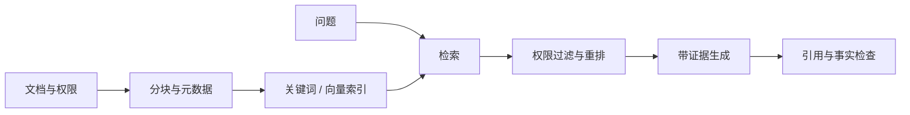

# RAG 与长期记忆：从找得到到用得对

> 层级：进阶。日期：2026-10-08。状态：概念与工程方案审阅，无检索基准实测。

## 1. 两种需求

RAG 让生成过程使用外部检索证据；长期记忆保存跨任务有用的信息。它们可以共享存储与检索组件，但不等价。用户偏好、项目事实和公开知识需要不同的权限与更新策略。

## 2. 典型管道

权限过滤必须进入检索路径，不能在输出后才想起用户是否有权读取。删除文档后也要更新索引和缓存。

## 3. 分块不是只数长度

以标题、段落、代码单元和业务对象为边界，保留文档 ID、版本、路径及上下文关系。小块容易失去定义，大块容易带入噪音。最优大小由查询和数据决定，不能固定“每 500 字最优”。

## 4. 检索方式

| 方式 | 优点 | 典型失败 |
| --- | --- | --- |
| 关键词/BM25 | 精确术语、错误码、标识符 | 同义表达漏召回 |
| 稠密向量 | 语义近似 | 相似但不支持结论 |
| 混合检索 | 兼顾多种信号 | 融合权重需验证 |
| 重排 | 改善候选顺序 | 增加成本与延迟 |
| 图/结构化索引 | 明确实体关系与路径 | 构建和更新复杂 |

知识图谱不是向量检索的必然升级；先证明问题需要关系推理，再承担维护成本。

## 5. 证据怎样进入答案

答案中的每个关键结论应可定位到来源。搜索命中、读到正文、来源可信、结论被支持是四个不同关卡。来源冲突时保留冲突和时间，而不是强行拼成一致说法。

对 Footprint，可用 path + commit SHA + heading + excerpt 保存证据，避免引用随主分支变化而失效。

## 6. 记忆写入与更新

记录事实、来源时间、有效期与可信度。一次选择不自动变成长期偏好；新事实与旧事实冲突时，要判断是过期、情境不同还是误提取。用户要求删除时，要覆盖索引、缓存与派生摘要的相关副本。

敏感信息按最少必要原则保存，不保存无必要的秘密。记忆中的历史批准不能无条件升级为当前授权。

## 7. 如何测

分开评测召回、相关性、答案忠实性与引用准确率。若正确文档根本没检索到，换提示词可能无效；若证据已在上下文但仍编造，问题在生成或约束。

## 8. 练习

准备十个真实问题，包含同义表达、错误码、跨文档关系和不存在答案。记录命中文档、答案是否被支持以及拒答是否合理。先用关键词基线，再比较向量方案的实际增益。

## 9. 参考

- [RAG 原始论文](https://arxiv.org/abs/2005.11401)
- [AI Agent Book：记忆和知识库](https://github.com/bojieli/ai-agent-book/blob/dbc046eb896ac4e39aa19c7774c8bf49583b89a6/book/chapter3.md)
