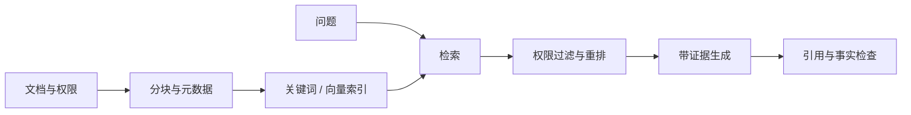
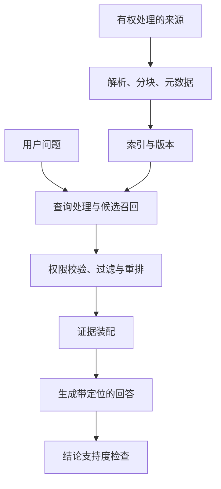

# RAG 与长期记忆：从找得到到用得对

> 层级：进阶。日期：2026-10-08。状态：概念与工程方案审阅，无检索基准实测。

## 快速回顾

- 索引维护与在线问答是两条链路；检索命中不等于答案成立。
- 来源版本、权限和定位与向量本身同样重要。
- 召回、排序、上下文装配、生成与引用应分别诊断。

## 1. RAG 与记忆的任务边界

RAG 让生成过程使用外部检索证据；长期记忆保存跨任务有用的信息。它们可以共享存储与检索组件，但不等价。用户偏好、项目事实和公开知识需要不同的权限与更新策略。

## 2. 离线索引与在线管道



权限过滤必须进入检索路径，不能在输出后才想起用户是否有权读取。删除文档后也要更新索引和缓存。



来源更新、删除和权限变化走索引维护路径；一次问答走在线路径。离线索引成功不代表在线回答一定正确。权限约束宜在候选检索中尽早应用；任何未授权片段都不应先发送给外部重排/模型服务再在最终页面隐藏。

## 3. 分块、元数据与版本

以标题、段落、代码单元和业务对象为边界，保留文档 ID、版本、路径及上下文关系。小块容易失去定义，大块容易带入噪音。最优大小由查询和数据决定，不能固定“每 500 字最优”。

```json
{
  "chunkId": "cache-r3-02",
  "documentId": "cache",
  "revision": "r3",
  "heading": "no-store",
  "text": "用于说明的片段",
  "sourceLocation": "path + commit + section",
  "validFrom": "2026-10-01",
  "accessScope": "由服务端解释的权限标识"
}
```

chunk ID 用于引用，document ID 表达归属，revision 表达版本。仅存一段文本和向量，会使更新去重、冲突判断和来源追踪变难。访问范围字段不是可让模型自行填写的授权凭据。

分块会改变检索对象：定义与例外被切开时，命中定义可能产生错误的全称结论；整章作为一个块又可能稀释相关信息。保留父子关系、相邻段落与标题路径，有助于检索后补充上下文。

## 4. 检索方式与方案取舍

| 方式 | 优点 | 典型失败 |
| --- | --- | --- |
| 关键词/BM25 | 精确术语、错误码、标识符 | 同义表达漏召回 |
| 稠密向量 | 语义近似 | 相似但不支持结论 |
| 混合检索 | 兼顾多种信号 | 融合权重需验证 |
| 重排 | 改善候选顺序 | 增加成本与延迟 |
| 图/结构化索引 | 明确实体关系与路径 | 构建和更新复杂 |

知识图谱不是向量检索的必然升级；先证明问题需要关系推理，再承担维护成本。

| 需求 | 优先检查 | 不能单独解决的部分 |
| --- | --- | --- |
| 最新可引用事实 | 检索、版本与来源 | 固定权重不会自动更新 |
| 少量完整材料跨段分析 | 长上下文与装配质量 | 窗口更长不保证正确利用 |
| 稳定风格或重复行为 | 示例、提示、必要时适配 | 不保证实时知识完整 |
| 复杂对象关系 | 结构化查询/图关系 | 向量相似不是精确关系运算 |

## 5. 证据支持与故障定位

答案中的每个关键结论应可定位到来源。搜索命中、读到正文、来源可信、结论被支持是四个不同关卡。来源冲突时保留冲突和时间，而不是强行拼成一致说法。

对 Footprint，可用 path + commit SHA + heading + excerpt 保存证据，避免引用随主分支变化而失效。

自写问题：“no-cache 是否表示不能存储？”

| 阶段 | 观察 | 判断 |
| --- | --- | --- |
| 召回 | 只找到 no-store 页面 | 查询理解或索引覆盖不足 |
| 重排 | 正确段落在候选中，被排出预算 | 排序或证据配额问题 |
| 装配 | 标题存在，关键例外被截断 | 上下文裁剪问题 |
| 生成 | 原文已说明可存储，答案却否认 | 生成利用证据失败 |
| 引用 | 答案正确，却引用无关段落 | 引用映射/支持度问题 |

因此“换一个更强模型”不一定解决前面三个阶段。故障归因应保存阶段产物，不能只有最终答案截图。

## 6. 记忆维护与失效

记录事实、来源时间、有效期与可信度。一次选择不自动变成长期偏好；新事实与旧事实冲突时，要判断是过期、情境不同还是误提取。用户要求删除时，要覆盖索引、缓存与派生摘要的相关副本。

敏感信息按最少必要原则保存，不保存无必要的秘密。记忆中的历史批准不能无条件升级为当前授权。

记忆写入可理解为：提取候选 → 判断是否值得长期保存 → 绑定来源/时间 → 解决冲突 → 更新检索入口。一次临时选择不应直接变成长期偏好。

冲突并不一定要覆盖：同一人在工作与个人项目中可能偏好不同工具；同一技术规则在不同版本下也可同时有效。实体、时间和情境比单一“最新文本”更重要。

删除还涉及索引、缓存、摘要和备份策略。工程上应说明哪些副本会何时失效，不能因为删了数据库一行就宣称所有派生数据立即消失。

## 7. 检索与答案的评测

分开评测召回、相关性、答案忠实性与引用准确率。若正确文档根本没检索到，换提示词可能无效；若证据已在上下文但仍编造，问题在生成或约束。

Recall@k 看前 k 个候选是否覆盖应找到的相关项；Precision@k 看前 k 个候选里有多少相关项。MRR 关注第一个相关结果的位置，nDCG 可体现分级相关性与排序位置。它们需要明确标注准则；不同任务的“相关”不能混用。

答案层另看真实性、证据忠实性、引用支持度与覆盖。答案与来源一致，来源仍可能过期；引用真实 URL，段落仍可能不支持断言。检索命中、来源可靠、结论成立要分别判断。

若资料库没有答案，适当说明缺证据是一种有效行为；不能为了提高“回答率”强行生成。

## 8. 关联与深入入口

- [RAG 原始论文](https://arxiv.org/abs/2005.11401)：理解参数化与非参数化知识结合的原始研究；今天工程中“RAG”常指更广的一类检索增强管道。
- [评测](10-evaluation.md)：把阶段诊断与最终任务质量连接起来。
- Advance 引子：查询改写、混合检索、重排、图检索的收益应怎样消融？权限变化时索引与缓存怎样保持一致？先保留问题，不把新框架名称当答案。

- [RAG 原始论文](https://arxiv.org/abs/2005.11401)
- [AI Agent Book：记忆和知识库](https://github.com/bojieli/ai-agent-book/blob/dbc046eb896ac4e39aa19c7774c8bf49583b89a6/book/chapter3.md)

