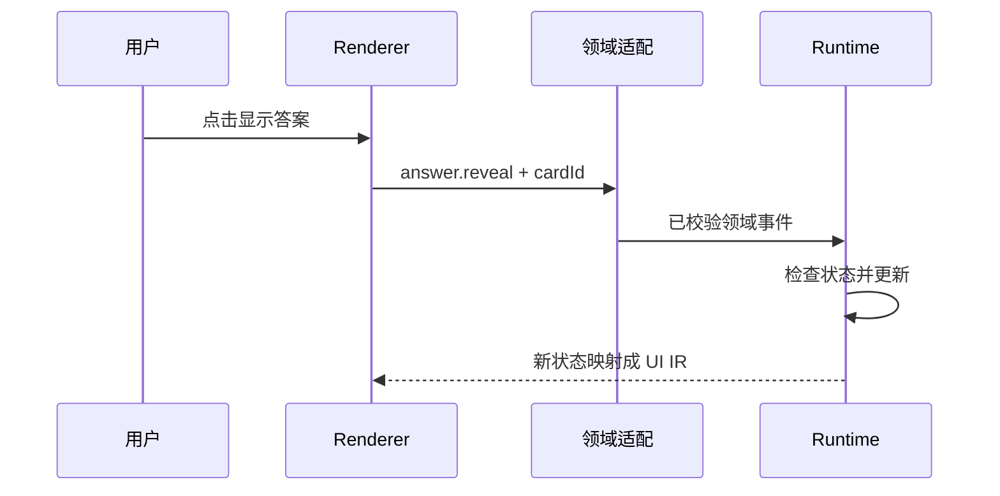

# AI 原生界面：Catalog、UI IR、Event IR 与可信执行

> 层级：前端进阶。日期：2026-10-08。状态：机制说明架构，不代表 ChatGPT 或其他产品的内部协议。
> 本章不引入仓库依赖，不选定项目级架构。

## 快速回顾

- Catalog/IR 是应用合同，不是模型内部结构或通用产品标准。
- Flat IR 仍可能形成复杂引用图，需要显式图结构约束。
- 事件表达意图，运行时检查状态，服务端检查实际权限。

## 1. IR 的用途与定位

模型可以生成 JSX，也可以生成受限的数据结构。后者把“允许表达的 UI 能力”与任意代码执行分开，方便校验和迁移，但会增加 Schema、Renderer 与版本维护成本。

UI IR 是应用对模型输出建立的契约。它不需要模型内部也使用同样的 IR，也不要求整站都被改造成生成式界面。固定导航、复杂交互和自由内容可以采用不同渲染路径，但跨路径的数据与权限边界要清楚。

这里的 Catalog、Flat IR 和 Event IR 是解释性设计术语。项目可以借用这些分工，但本文不宣称存在一个所有产品遵守的统一标准。

内容自由度很高而复用少时，维护一套 Schema 与 renderer 可能成本过高；成熟固定页面也不必为了“AI 友好”重写。IR 更适合组件集合受限、需要校验和复用、输出跨渠道或存在版本迁移的内容。

## 2. 职责与语义合同

| 层 | 职责 | 不承担 |
| --- | --- | --- |
| Semantic Component Catalog | 定义允许组件及语义属性 | 任意业务策略 |
| UI IR | 描述当前界面结构 | 直接执行副作用 |
| Renderer | 把已验证 IR 映射成 UI | 相信未知组件 |
| Event IR | 描述用户交互的业务含义 | 作为授权凭证 |
| Workflow / Runtime | 判断转换与执行业务动作 | 由模型绕过策略 |

一个组件库描述“有 Button”；语义 Catalog 还描述“这个按钮在什么业务场景代表什么动作”。

一个 Button 的视觉属性可能只有颜色和文本；语义按钮还要说明动作意图、目标对象、可用状态、无障碍名称和失败反馈。Catalog 应限制模型能表达什么，而不是暴露整个组件库的所有内部属性。

| 合同 | 例子 | 检查位置 |
| --- | --- | --- |
| 表现 | 文本长度、允许组件 | Schema/Renderer |
| 结构 | 根节点、子节点规则 | 图校验 |
| 语义 | cardId 指向有效卡片 | 领域层 |
| 行为 | reveal 不等于 publish | 事件适配/运行时 |
| 权限 | 当前用户可操作该卡片 | 服务端 |

允许事件名不能直接等同于授权。模型可以建议一个按钮，但真正点击后仍要以当前状态与权限决定动作。

## 3. Flat IR 与引用图约束

```json
{
  "schemaVersion": "1",
  "root": "card",
  "nodes": {
    "card": {"type": "ConceptCard", "children": ["title", "action"]},
    "title": {"type": "Text", "props": {"text": "闭包"}},
    "action": {
      "type": "Button",
      "props": {"label": "显示答案"},
      "event": {"type": "answer.reveal", "cardId": "c1"}
    }
  }
}
```

本例为原创机制说明协议。扁平结构减少深层嵌套，但引入 ID 唯一性、引用完整性、环检测和孤立节点问题。不能只检查 JSON Schema 就认为图结构合法。

原示例用 nodes 映射减少 JSON 嵌套，但“扁平”只改变编码形式。若允许多个父节点引用同一节点，结构是 DAG；若禁止共享，则应检查每个非根节点恰有一个父节点。若允许环而渲染器递归遍历，可能导致死循环。

此外，JSON 中重复键可能在常用解析器中被后值覆盖。需要拒绝重复 ID 时，不能只在解析后的对象上检查“键是否重复”，应在输入格式或解析阶段处理。

维护时应明确：节点是否可共享、是否允许孤立节点、渲染深度上限、事件是否可引用树外对象。这些是协议选择，不由 flat 这个词自动决定。

## 4. 校验与降级

先解析传输，再校验 Schema，接着校验引用、允许的组件组合、事件白名单和资源限制。URL、富文本、HTML 与外链应有单独策略。

未知组件可以显示降级卡片；缺失引用要给出诊断，不能递归到崩溃。限制节点数、深度和文本长度，防止合法结构耗尽资源。

## 5. 事件、运行时与新界面

对相同的已验证状态和事件，状态转换规则可预测；不是整个 AI 系统没有随机性。模型、网络和时间结果是外部输入，进入运行时前先记录、校验和授权。

UI 允许点击只是体验层控制，服务端仍需检查真实身份、对象权限与状态版本。



事件描述“发生什么”；状态转换决定“允许下一步是什么”；effect 执行外部工作。把数据库写函数名直接塞进 UI 节点，会让表示层承担它不该拥有的执行权限。

## 6. 流式候选与最终提交

可把模型增量输出转成候选节点，再把完整且已校验的节点提交到可见树。要明确临时态、稳定态和最终态，支持中途断流后的恢复或回退。

“支持流式”不等于每个字符都应触发完整重渲染。需要节流、增量校验与稳定节点身份。最终提交前不得执行模型提议的外部副作用。

候选态可能缺少子节点；稳定态表示当前片段已满足局部规则；最终态表示整份输出完成全局校验。局部合法不能证明最终没有环、孤立节点或冲突 ID。

一个可行思路是保留候选缓冲区，只将已验证的完整单元发布给视图；断流后明确显示部分结果。另一种是显示不可交互预览，完成后统一激活。二者是设计选择，不是所有框架默认支持的能力。

## 7. 版本迁移

协议带 schemaVersion，维护明确的旧版适配器和弃用期限。不能假设某个闭源产品的 UI 输出格式稳定公开，也不能承诺升级时一对一自动同步。对接外部聊天内容应先定义自己的可维护输入合同。

## 8. 关联与深入入口

[状态与工作流](08-workflow-state.md)给出事件后的控制边界；[多模态](18-multimodal.md)说明媒体进入界面前的信息风险。Advance 可以分别研究增量校验、协议迁移、可访问性、编辑回写和混合渲染，而不把所有问题堆成一张架构图。

- [工作流与状态机](08-workflow-state.md)
- [安全与恢复](09-reliability-security.md)
- Catalog + IR 适合受限、可组合内容；高度定制页面仍可保留普通组件实现。

