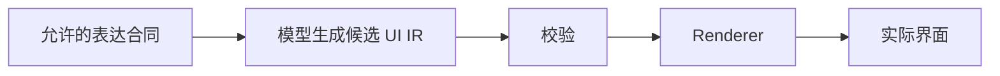
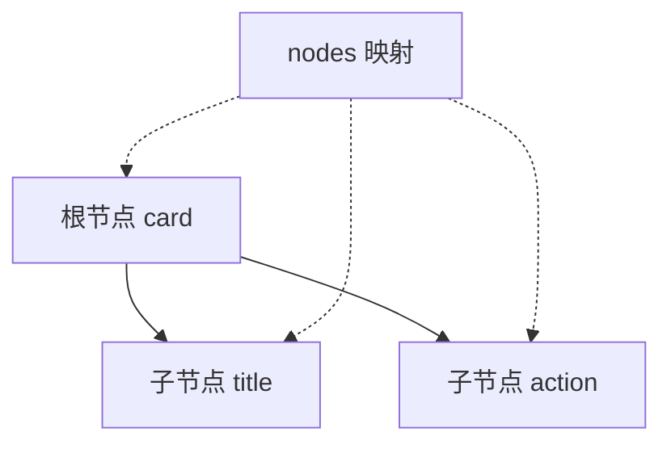
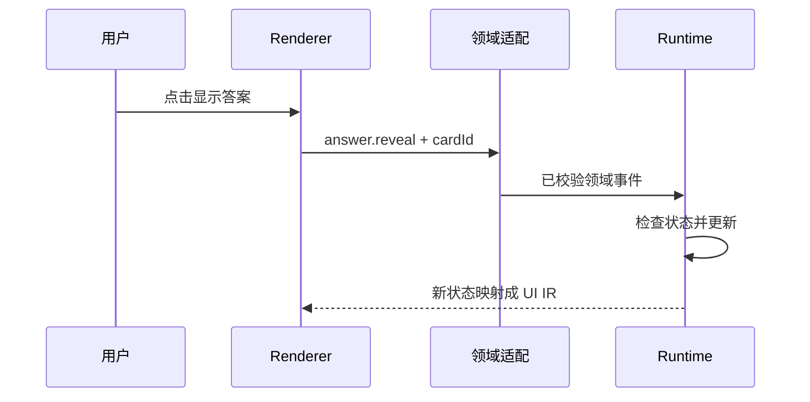

# AI 原生界面：Catalog、UI IR、Event IR 与可信执行

> Base / 结构化交互。核查：2026-10-08。本文提出解释性合同，不代表 ChatGPT 或其他产品的内部协议。
> 衔接：[02](02-inference.md)负责通用输出校验；[08](08-workflow-state.md)负责状态转换；本页连接内容表示、渲染和事件。
> 本章不引入仓库依赖，不选定项目级架构。

## 快速回顾

- Catalog/IR 是应用合同，不是模型内部结构或通用产品标准。
- Flat IR 仍可能形成复杂引用图，需要显式图结构约束。
- 事件表达意图，运行时检查状态，服务端检查实际权限。

## 1. IR 为什么存在：把生成内容与界面实现分开

**IR（Intermediate Representation，中间表示）**是源信息与最终执行/展示形式之间的一种明确数据表示。**UI IR**描述界面应包含哪些允许的内容与结构；**Renderer（渲染器）**按规则把它映射成实际组件。这里借用编译器中的中间表示思想，不意味着某个固定 UI IR 已成为行业标准。

### 图 1：模型描述内容，程序解释描述



这条链路把两个变化分开：模型可以在允许范围内组合内容，组件实现则由程序维护。生成失败时能在数据边界拒绝，而不必执行一段任意 JSX。代价是需要维护合同与实现之间的一致性。

模型可以生成 JSX，也可以生成受限的数据结构。后者把“允许表达的 UI 能力”与任意代码执行分开，方便校验和迁移，但会增加 Schema、Renderer 与版本维护成本。

UI IR 是应用对模型输出建立的契约。它不需要模型内部也使用同样的 IR，也不要求整站都被改造成生成式界面。固定导航、复杂交互和自由内容可以采用不同渲染路径，但跨路径的数据与权限边界要清楚。

这里的 Catalog、Flat IR 和 Event IR 是解释性设计术语。项目可以借用这些分工，但本文不宣称存在一个所有产品遵守的统一标准。

内容自由度很高而复用少时，维护一套 Schema 与 renderer 可能成本过高；成熟固定页面也不必为了“AI 友好”重写。IR 更适合组件集合受限、需要校验和复用、输出跨渠道或存在版本迁移的内容。

## 2. Catalog：不仅描述组件长什么样

**Semantic Component Catalog（语义组件目录）**规定可用组件、属性、组合方式及其业务含义。普通组件库提供实现；Catalog 提供受限、可生成和可校验的能力表面。它们可以基于同一套组件，不要求复制两套完整 UI 实现。

| 层 | 职责 | 不承担 |
| --- | --- | --- |
| Semantic Component Catalog | 定义允许组件及语义属性 | 任意业务策略 |
| UI IR | 描述当前界面结构 | 直接执行副作用 |
| Renderer | 把已验证 IR 映射成 UI | 相信未知组件 |
| Event IR | 描述用户交互的业务含义 | 作为授权凭证 |
| Workflow / Runtime | 判断转换与执行业务动作 | 由模型绕过策略 |

一个 Button 的视觉属性可能只有颜色和文本；语义按钮还要说明动作意图、目标对象、可用状态、无障碍名称和失败反馈。Catalog 应限制模型能表达什么，而不是暴露整个组件库的所有内部属性。

| 合同 | 例子 | 检查位置 |
| --- | --- | --- |
| 表现 | 文本长度、允许组件 | Schema/Renderer |
| 结构 | 根节点、子节点规则 | 图校验 |
| 语义 | cardId 指向有效卡片 | 领域层 |
| 行为 | reveal 不等于 publish | 事件适配/运行时 |
| 权限 | 当前用户可操作该卡片 | 服务端 |

允许事件名不能直接等同于授权。模型可以建议一个按钮，但真正点击后仍要以当前状态与权限决定动作。

## 3. Flat IR：编码扁平，不等于结构简单

嵌套表示直接把子节点放在父节点内部；**Flat IR**把节点放入 ID 到对象的映射，再用 ID 表达关系。它降低 JSON 文本的嵌套深度，并方便单节点寻址，但逻辑层级依然存在。

### 图 2：一份关系，两种编码视角



实线是逻辑父子关系，虚线是按 ID 查找节点。扁平化改变存放方式，没有让父子关系消失。下方 JSON 只用于说明这一个概念，不是完整应用协议。

```json
{
  "schemaVersion": "1",
  "root": "card",
  "nodes": {
    "card": {"type": "ConceptCard", "children": ["title", "action"]},
    "title": {"type": "Text", "props": {"text": "闭包"}},
    "action": {
      "type": "Button",
      "props": {"label": "显示答案"},
      "event": {"type": "answer.reveal", "cardId": "c1"}
    }
  }
}
```

本例为原创机制说明协议。扁平结构减少深层嵌套，但引入 ID 唯一性、引用完整性、环检测和孤立节点问题。不能只检查 JSON Schema 就认为图结构合法。

若允许多个父节点引用同一节点，且不存在环，结构可以是 DAG（有向无环图）；若要求一棵树，则应检查非根节点的父节点数量与根可达性。共享节点和环是两回事，不能仅因多父引用就断言一定无环。递归渲染遇到环而没有保护，可能导致无法终止。

此外，JSON 中重复键可能在常用解析器中被后值覆盖。需要拒绝重复 ID 时，不能只在解析后的对象上检查“键是否重复”，应在输入格式或解析阶段处理。

维护时应明确：节点是否可共享、是否允许孤立节点、渲染深度上限、事件是否可引用树外对象。这些是协议选择，不由 flat 这个词自动决定。

## 4. 从对象合法到图结构可渲染

通用语法和 Schema 检查见 [02](02-inference.md)。UI 还需要图约束：引用的 ID 是否存在、是否形成环、节点能否从根到达、组件组合是否允许。局部字段都正确，整张图仍可能不合法。

先解析传输，再校验 Schema，接着校验引用、允许的组件组合、事件白名单和资源限制。URL、富文本、HTML 与外链应有单独策略。

未知组件可以显示降级卡片；缺失引用要给出诊断，不能递归到崩溃。限制节点数、深度和文本长度，防止合法结构耗尽资源。

## 5. Event IR：交互含义如何回到状态

**Event IR**是对交互意图或事实的结构化描述，例如“展开答案”，而不是任意函数指针。**领域适配**把视图事件转换为业务可理解的事件；状态与权限决定后续是否允许处理。

**Deterministic Runtime**在这里指按明确规则处理已验证状态和事件的运行部分。它是本页的职责描述，不是指某个统一产品，也不表示模型和网络整体变得确定。

对相同的已验证状态和事件，状态转换规则可预测；不是整个 AI 系统没有随机性。模型、网络和时间结果是外部输入，进入运行时前先记录、校验和授权。

UI 允许点击只是体验层控制，服务端仍需检查真实身份、对象权限与状态版本。

### 图 3：界面反馈回路



事件描述“发生什么”；状态转换决定“允许下一步是什么”；effect 执行外部工作。把数据库写函数名直接塞进 UI 节点，会让表示层承担它不该拥有的执行权限。

## 6. 流式 UI：候选可见性与执行资格分开

[02](02-inference.md)解释为什么字节流不等于完整对象。本页进一步区分一个界面节点在生成过程中的状态：可以预览、可以稳定渲染、可以交互，不必同时发生。

可把模型增量输出转成候选节点，再把完整且已校验的节点提交到可见树。要明确临时态、稳定态和最终态，支持中途断流后的恢复或回退。

“支持流式”不等于每个字符都应触发完整重渲染。需要节流、增量校验与稳定节点身份。最终提交前不得执行模型提议的外部副作用。

候选态可能缺少子节点；稳定态表示当前片段已满足局部规则；最终态表示整份输出完成全局校验。这里三个名称是解释性约定，需要具体协议明确。局部合法不能证明最终没有环、孤立节点或冲突 ID。

一个可行思路是保留候选缓冲区，只将已验证的完整单元发布给视图；断流后明确显示部分结果。另一种是显示不可交互预览，完成后统一激活。二者是设计选择，不是所有框架默认支持的能力。

## 7. 版本与适用范围：合同也需要维护

协议带 schemaVersion，维护明确的旧版适配器和弃用期限。不能假设某个闭源产品的 UI 输出格式稳定公开，也不能承诺升级时一对一自动同步。对接外部聊天内容应先定义自己的可维护输入合同。

## 8. 关联、深入问题与来源

| 本页之外的职责 | 主条目 | 保留的边界 |
| --- | --- | --- |
| 传输与通用结构校验 | [02 推理请求](02-inference.md) | 不重复定义 SSE 或 JSON 完整性 |
| 状态、事件与副作用 | [08 状态机](08-workflow-state.md) | UI 事件不能直接绕过领域规则 |
| 身份与对象权限 | [09 安全](09-reliability-security.md) | 按钮可见不代表服务端授权 |
| 图像、音频内容 | [18 多模态](18-multimodal.md) | 媒体资产同样需要来源和信息边界 |

- [json-render](https://github.com/vercel-labs/json-render)：可观察受限组件目录、结构化描述与渲染分工的开源实现；具体 API 以所用版本为准，本文示例不是其官方协议。
- [JSON Schema](https://json-schema.org/understanding-json-schema/about)：理解数据结构约束；图的环、对象权限与业务引用往往仍需应用检查。
- [React：Keeping Components Pure](https://react.dev/learn/keeping-components-pure)：进一步理解渲染与副作用分离的基本理由，不把纯渲染等同于整个 AI 系统确定。
- 深入问题：候选节点什么时候可提交？局部校验如何与全局图约束配合？编辑后的界面怎样映射回内容对象？这些可以独立进入 [Advance](ADVANCE.md)，不要求整站迁移到生成式 UI。
