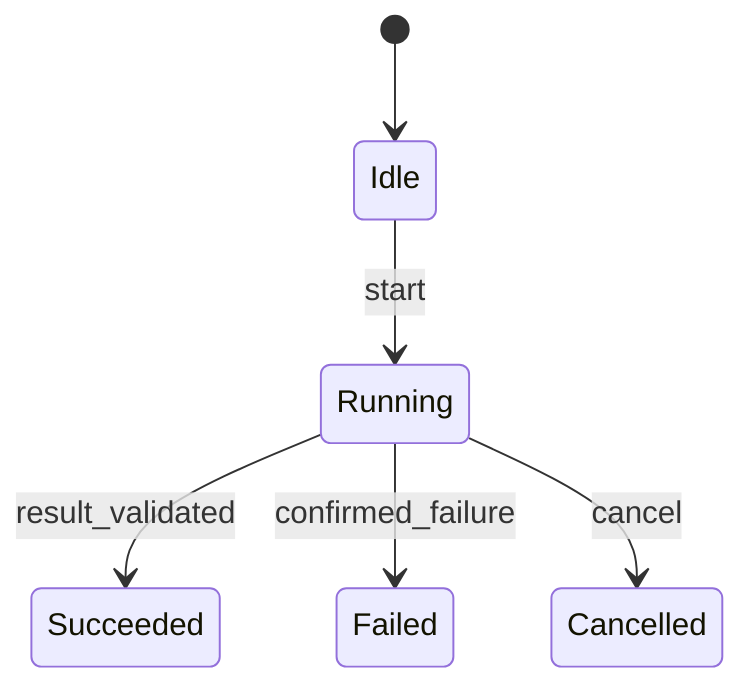
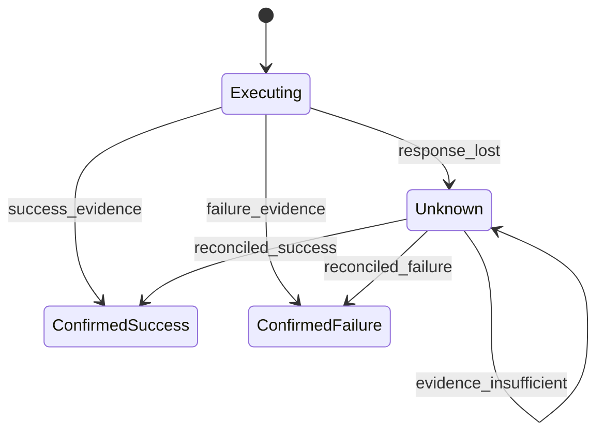

# Workflow、状态机与 XState：把行为边界写清楚

> Base / 运行控制。核查：2026-10-08。XState 概念参照官方 Actor 文档；未选择或安装具体版本。
> 衔接：[03 Loop](03-agent-loop.md)解释反馈循环；本页解释循环中的状态、允许转换与异步生命周期。
> 状态：机制说明建模，未运行状态机。

## 快速回顾

- 状态图表达路径，转换表补足条件，副作用结果通过事件进入状态。
- 批准发布不等于发布成功；结果未知需要核对状态。
- Actor、Agent 与线程不是同一概念，取消也不等于撤销外部副作用。

## 1. Workflow 与状态机分别描述什么

**Workflow（工作流）**描述工作如何被组织成步骤、分支、依赖与交接。**状态机（State Machine）**描述系统处于什么状态，以及在某个事件和条件下允许怎样变化。前者侧重工作组织，后者侧重有效转换；同一个工作流可以由状态机实现，也可以由普通程序表达。

Agent Loop 说明“行动之后根据观察继续决策”。状态机进一步约束：现在能接收什么事件、哪些结果已经过期、哪些动作需要先等待。模型可以参与选择下一步，而运行规则仍由程序限定，这并不矛盾。

### 图 1：工作流中的一个模型决策节点

图展示的是工作依赖，不足以说明节点内部是否正在执行、已取消或结果未知。要表达这些时间上的差异，就需要展开状态。

## 2. State、Event 与 Transition 的最小模型

**状态（State）**表示对未来处理有影响的当前情况；**事件（Event）**表示发生的输入或事实；**转换（Transition）**把当前状态与事件映射到后续状态。状态不是所有业务数据的别名，事件也不是一条必须执行的命令。

| 元素 | 含义 | 例子 |
| --- | --- | --- |
| State | 当前所处阶段 | Reviewing |
| Event | 发生了什么 | review.approved |
| Guard | 判断转换是否允许的条件 | 结果属于当前 runId |
| Action | 转换发生时安排的动作 | 更新状态数据或发出受控效果 |
| Actor | 独立运行并通信的工作单元 | 生成请求或子流程 |

XState 的 Actor 能帮助管理生命周期，但不是自动提供数据库事务和分布式恢复的完整平台。

isLoading、isApproved、hasError 三个布尔可能产生无意义组合。用判别联合或状态机可以减少非法状态空间。简单流程先用 TypeScript reducer 即可；层级、并行、取消和子任务复杂时再评估库。

状态标记表达所处阶段；扩展 context 保存 runId、revision、错误等数据；派生值如 canPublish 由二者和权限计算。把 canPublish 单独持久化而不处理失效，可能与真实条件矛盾。

状态机减少某些非法组合，但错误 Guard、过期权限和外部竞争仍会导致问题。服务端写入前必须再次核对版本，不能把前端按钮灰置当作最终保障。

## 3. 先看最小状态图，再打开异步执行

### 图 2：一个任务的生命周期

状态是节点，事件是边上的标签。成功依赖结果被接受与校验，不只是有一条消息返回；取消表示当前流程不再接收正常完成转换，不证明远端动作从未发生。

### 3.1 为什么还需要“结果未知”

当 Running 里的工作涉及外部写入，响应丢失会产生新的认知状态：系统无法确认效果是否发生。下面把这种情况单独展开，不要求所有任务都具有发布流程。

### 图 3：外部操作的结果确认状态

图 2 表达任务生命周期，图 3 表达外部动作结果的确认状态。它们是两个层次：任务可以已经取消，某次外部操作的效果却仍需核对。把所有含义压进一个 loading 或 error 字段，会丢掉这种区别。

Unknown 不是“失败”的同义词，而是关于结果的信息不足。幂等、状态查询和补偿怎样帮助核对，由 [09 可靠性](09-reliability-security.md)主讲。

## 4. Guard 与不变量：哪些转换必须被拒绝

状态图展示路径，转换表补足“同一事件在什么条件下才有效”。**不变量（Invariant）**是希望所有可达状态始终满足的性质；Guard 则是实现这些性质的一种局部检查。

| 当前状态 | 事件 | 必须成立的条件 | 后续处理 |
| --- | --- | --- | --- |
| Idle | start | 输入符合合同 | 建立 runId，进入 Running |
| Running | result_validated | 属于当前 runId | 保存产物并进入 Succeeded |
| Running | confirmed_failure | 失败已确认且属于当前运行 | 进入 Failed |
| Running | cancel | 当前运行仍有效 | 进入 Cancelled，停止本地后续处理 |
| 任意状态 | 旧运行回包 | runId 不匹配 | 不覆盖当前状态 |
| 等待批准 | approval_received | 主体、动作、目标与版本有效 | 进入允许的执行阶段 |

一个典型不变量是“旧运行的结果不能覆盖新运行的产物”。runId 校验是实现它的手段之一；单独增加字段却不在接受结果处检查，不能保护该性质。

另一个不变量是“获准的内容版本与执行版本一致”。它涉及外部权限与版本竞争，不能只靠前端状态图证明，见 [09](09-reliability-security.md)。

## 5. 纯转换与 Effect：把确定规则和外部结果分开

**副作用（Effect）**指除返回计算结果外还与外部世界交互，例如网络请求、写库或发消息。转换规则负责决定应安排什么工作，外部执行结果再通过事件返回。

纯转换可表达为 nextState = transition(state, event)。若还读网络、随机数或当前时间，回放相同事件未必得到相同结果。常见做法是把这些结果作为显式事件输入，将网络写入等交给受控 effect。

这不要求所有代码都是纯函数，也不保证整个分布式系统确定。它让不确定性的位置清楚，便于回放和恢复。[UI IR](07-ui-ir.md)负责表达界面，而不应偷偷承担 effect。

## 6. Actor：把独立工作的生命周期封装起来

**Actor**是具有自身状态或行为、通过消息与外界协作的运行单元。XState 使用 Actor 组织机器、异步任务及其生命周期；Actor 不必调用模型，也不等于操作系统线程。一个 Agent 可以由多个 Actor 协作实现，二者是不同抽象。

用户取消 run-1 后开始 run-2，run-1 的迟到结果不能覆盖新状态。需要 runId/revision 判断。状态机停止 Actor 不等于远端服务器已撤销操作；网络取消、补偿与幂等分别设计。

层级状态可把多个子状态共同适用的转换放在上层；并行区域表达同时存在的相对独立子状态，例如连接状态与内容编辑状态。它们减少机械枚举，却仍需定义同步与完成条件，不是让所有工作天然并行。

XState 用 Actor 等概念组织运行；具体 API 与快照格式依赖版本。Actor 停止后的本地处理、远端请求取消与已发生副作用的补偿是三件事。[官方 Actor 文档](https://stately.ai/docs/actors)用于核对术语，不作为数据库事务的保证。

## 7. 持久化之后，为什么还不能直接重放所有动作

保存状态快照只是起点。恢复时还要判断正在执行的工具是否已完成、外部世界是否变化、批准是否仍有效。不能简单恢复到 Publishing 就再次调用发布接口。

快照回答“现在是什么状态”；事件日志回答“怎样到达这里”。只保存快照可能丢失进行中动作的原因；只保留事件也需要兼容的转换逻辑和外部结果才能回放。

恢复不应重新执行每个历史 effect。通常需要区分已确认完成、待核对与尚未开始的操作；状态模型与[幂等/操作日志](09-reliability-security.md)共同定义恢复语义。

## 8. 与 UI、Loop 和安全机制的连接

Renderer 发出 Event IR，业务适配层把它转成领域事件。状态机更新状态，选择器再产出新的 UI IR。避免让渲染节点直接持有数据库写权限或任意函数名。

何时 reducer 足够，何时层级状态机更清楚？长任务在代码升级后怎样恢复？并行分支完成条件如何表达？这些问题应根据真实状态复杂度分析，不把“用了状态机”本身当质量结论。

- [XState Actors](https://stately.ai/docs/actors)：核对 Actor 的消息和生命周期概念；不据此推导数据库事务或远端撤销保证。
- [Workflow 与 Agent 的工程区分](https://www.anthropic.com/engineering/building-effective-agents)：参考预设流程与动态选择的组织差异；本文状态图是自写概念模型。

