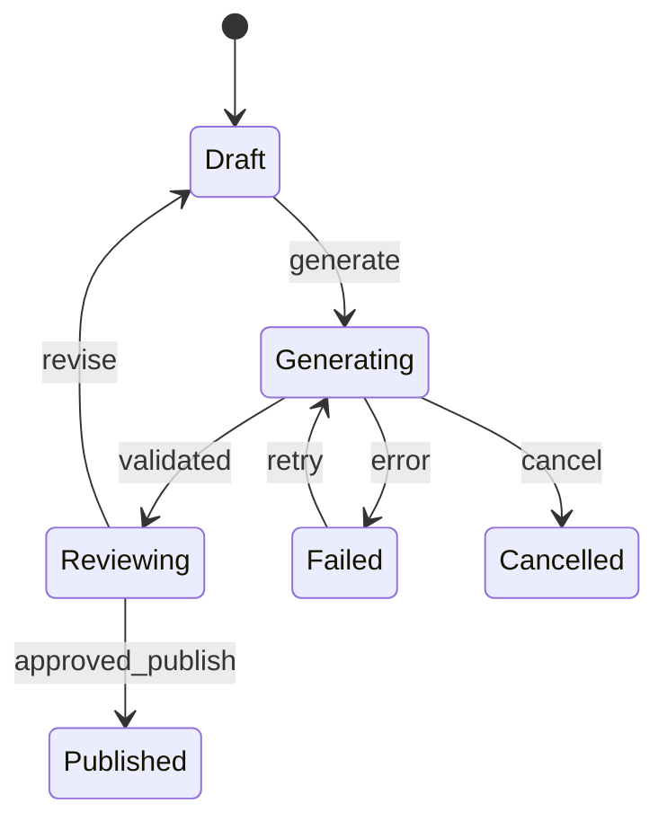

# Workflow、状态机与 XState：把行为边界写清楚

> 层级：进阶。日期：2026-10-08。XState 概念参照官方 Actor 文档；未选择或安装具体版本。
> 状态：教学建模，未运行状态机。

## 1. 工作流与 Agent 可以组合

固定流程适合步骤明确的任务；Agent 适合需要根据观察动态选择工具的任务。可在固定工作流某个节点使用模型判断，而不让模型控制所有转换。

## 2. 卡片发布状态

这张图表达业务条件，不是实际发布授权。真实实现还要检查批准主体、内容版本和目标。

## 3. 状态、事件、Guard、Action、Actor

| 元素 | 含义 | 例子 |
| --- | --- | --- |
| State | 当前所处阶段 | Reviewing |
| Event | 发生了什么 | review.approved |
| Guard | 转换是否成立 | 审核的是当前 revision |
| Action | 转换时做什么 | 记录批准信息 |
| Actor | 独立运行并通信的工作单元 | 生成请求或子流程 |

XState 的 Actor 能帮助管理生命周期，但不是自动提供数据库事务和分布式恢复的完整平台。

## 4. 从布尔变量到合法状态

isLoading、isApproved、hasError 三个布尔可能产生无意义组合。用判别联合或状态机可以减少非法状态空间。简单流程先用 TypeScript reducer 即可；层级、并行、取消和子任务复杂时再评估库。

## 5. 取消与竞态

用户取消 run-1 后开始 run-2，run-1 的迟到结果不能覆盖新状态。需要 runId/revision 判断。状态机停止 Actor 不等于远端服务器已撤销操作；网络取消、补偿与幂等分别设计。

## 6. 保存与恢复

保存状态快照只是起点。恢复时还要判断正在执行的工具是否已完成、外部世界是否变化、批准是否仍有效。不能简单恢复到 Publishing 就再次调用发布接口。

## 7. 与 UI IR 连接

Renderer 发出 Event IR，业务适配层把它转成领域事件。状态机更新状态，选择器再产出新的 UI IR。避免让渲染节点直接持有数据库写权限或任意函数名。

## 8. 验证

枚举禁止的转换：Draft 不可直接发布、旧版本批准不可发布新内容、Cancelled 不接受旧成功回包。将这些做成表驱动测试，比只验证 happy path 更能体现状态模型的收益。

## 9. 参考

- [XState Actors](https://stately.ai/docs/actors)
- [Workflow 与 Agent 的工程区分](https://www.anthropic.com/engineering/building-effective-agents)
