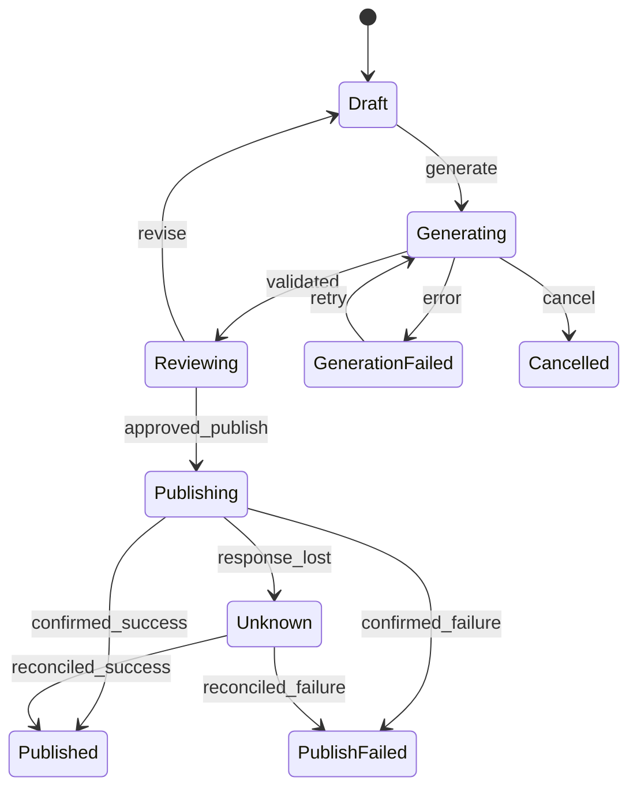

# Workflow、状态机与 XState：把行为边界写清楚

> 层级：进阶。日期：2026-10-08。XState 概念参照官方 Actor 文档；未选择或安装具体版本。
> 状态：机制说明建模，未运行状态机。

## 快速回顾

- 状态图表达路径，转换表补足条件，副作用结果通过事件进入状态。
- 批准发布不等于发布成功；结果未知需要核对状态。
- Actor、Agent 与线程不是同一概念，取消也不等于撤销外部副作用。

## 1. 工作流与 Agent

固定流程适合步骤明确的任务；Agent 适合需要根据观察动态选择工具的任务。可在固定工作流某个节点使用模型判断，而不让模型控制所有转换。

## 2. 状态机的概念与数据

| 元素 | 含义 | 例子 |
| --- | --- | --- |
| State | 当前所处阶段 | Reviewing |
| Event | 发生了什么 | review.approved |
| Guard | 转换是否成立 | 审核的是当前 revision |
| Action | 转换时做什么 | 记录批准信息 |
| Actor | 独立运行并通信的工作单元 | 生成请求或子流程 |

XState 的 Actor 能帮助管理生命周期，但不是自动提供数据库事务和分布式恢复的完整平台。

isLoading、isApproved、hasError 三个布尔可能产生无意义组合。用判别联合或状态机可以减少非法状态空间。简单流程先用 TypeScript reducer 即可；层级、并行、取消和子任务复杂时再评估库。

状态标记表达所处阶段；扩展 context 保存 runId、revision、错误等数据；派生值如 canPublish 由二者和权限计算。把 canPublish 单独持久化而不处理失效，可能与真实条件矛盾。

状态机减少某些非法组合，但错误 Guard、过期权限和外部竞争仍会导致问题。服务端写入前必须再次核对版本，不能把前端按钮灰置当作最终保障。

## 3. 状态图与异步中间态

生成失败与发布失败分开，重试不能误走到不相关阶段；图中省略的恢复边不代表无条件允许。

这张图表达业务条件，不是实际发布授权。真实实现还要检查批准主体、内容版本和目标。

“用户确认发布”只是事件；“发布已成功”是外部事实。它们之间可能经过网络请求、服务端写入和响应返回，所以不能直接把确认事件画成 Published。

如果响应丢失，系统知道发生了请求，却不知道副作用结果，应保留 Unknown 并核对操作状态。把 Unknown 直接当 Failed 自动重试，可能重复发布；直接当 Published 则可能向用户虚报成功。

## 4. 转换表与不变量

| 当前状态 | 事件 | 必须成立的条件 | 下一个状态/效果 |
| --- | --- | --- | --- |
| Draft | generate | 输入有效 | Generating，建立 runId |
| Generating | validated | 结果属于当前 runId | Reviewing，保存 revision |
| Generating | cancel | 当前任务仍有效 | Cancelled，取消本地等待 |
| Reviewing | approved_publish | 批准绑定当前 revision 与目标 | Publishing，建立 operationId |
| Publishing | confirmed_success | 操作与产物对应 | Published |
| Publishing | response_lost | 无法确认外部结果 | Unknown，进入核对 |
| Unknown | reconciled_success | 查询获得成功证据 | Published |
| 任意状态 | 旧 run 的回包 | runId 不匹配 | 保持状态并记录忽略 |

最后一行展示：事件存在不意味着必须发生转换。转换表便于检查输入与状态组合；状态图便于看整体路径，二者互补。

枚举禁止的转换：Draft 不可直接发布、旧版本批准不可发布新内容、Cancelled 不接受旧成功回包。将这些做成表驱动测试，比只验证 happy path 更能体现状态模型的收益。

## 5. 纯转换与副作用

纯转换可表达为 nextState = transition(state, event)。若还读网络、随机数或当前时间，回放相同事件未必得到相同结果。常见做法是把这些结果作为显式事件输入，将网络写入等交给受控 effect。

这不要求所有代码都是纯函数，也不保证整个分布式系统确定。它让不确定性的位置清楚，便于回放和恢复。[UI IR](07-ui-ir.md)负责表达界面，而不应偷偷承担 effect。

## 6. 取消、并发与 Actor

用户取消 run-1 后开始 run-2，run-1 的迟到结果不能覆盖新状态。需要 runId/revision 判断。状态机停止 Actor 不等于远端服务器已撤销操作；网络取消、补偿与幂等分别设计。

层级状态能共享公共转换；并行区域表达相对独立的子状态，但也带来同步条件。Actor 是有自身生命周期和消息处理的工作单元，不等于操作系统线程，也不等于一个 LLM Agent。

XState 用 Actor 等概念组织运行；具体 API 与快照格式依赖版本。Actor 停止后的本地处理、远端请求取消与已发生副作用的补偿是三件事。[官方 Actor 文档](https://stately.ai/docs/actors)用于核对术语，不作为数据库事务的保证。

## 7. 快照、日志与恢复

保存状态快照只是起点。恢复时还要判断正在执行的工具是否已完成、外部世界是否变化、批准是否仍有效。不能简单恢复到 Publishing 就再次调用发布接口。

快照回答“现在是什么状态”；事件日志回答“怎样到达这里”。只保存快照可能丢失进行中动作的原因；只保留事件也需要兼容的转换逻辑和外部结果才能回放。

恢复不应重新执行每个历史 effect。通常需要区分已确认完成、待核对与尚未开始的操作；状态模型与[幂等/操作日志](09-reliability-security.md)共同定义恢复语义。

## 8. 连接 UI 与深入入口

Renderer 发出 Event IR，业务适配层把它转成领域事件。状态机更新状态，选择器再产出新的 UI IR。避免让渲染节点直接持有数据库写权限或任意函数名。

何时 reducer 足够，何时层级状态机更清楚？长任务在代码升级后怎样恢复？并行分支完成条件如何表达？这些问题应根据真实状态复杂度分析，不把“用了状态机”本身当质量结论。

- [XState Actors](https://stately.ai/docs/actors)
- [Workflow 与 Agent 的工程区分](https://www.anthropic.com/engineering/building-effective-agents)

