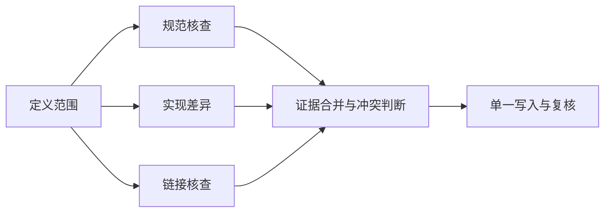

# 多 Agent：分工收益、上下文成本与单一责任人

> 层级：进阶。日期：2026-10-08。状态：工程分析，无多 Agent 性能实测。

## 快速回顾

- 多 Agent 的收益取决于任务独立性、依赖和协调成本。
- 并行可缩短墙钟时间，但不自动降低总 token 或资源消耗。
- 角色名称不等于权限隔离；多数意见不等于独立证据。

## 1. 多 Agent 的边界

拆分适合独立研究、不同工具权限、不同专业验证和上下文隔离。若任务高度顺序依赖，多个角色可能只增加交接与重复阅读。更多 Agent 不保证更准确、更快或更便宜。

一个进程可以管理多个 Agent 状态；多个进程也可以服务同一个 Agent。提示里写“架构师”“测试员”只是角色描述，不自动产生独立权限、独立记忆或不同模型。

多 Agent 的工程含义应说明：任务由谁分配、各自能看到什么、能执行什么、怎样共享产物、怎样终止并汇总。否则只是把同一次思考换了几种角色名称。

## 2. 组织模式与依赖

| 模式 | 优点 | 代价 |
| --- | --- | --- |
| 流水线 | 顺序与责任清楚 | 上游错误向下传播 |
| 调度者 + 专家 | 并行、按需能力 | 调度者上下文膨胀 |
| 独立审查 + 汇总 | 发现不同错误 | 相关性偏差、冲突仲裁 |

自写例子：审阅网络知识，需要查 HTTP 规范、检查浏览器实现差异、核对文档链接，最后统一改文档。前三项可以部分并行；最终修改依赖前面的证据，因此在关键路径上。



并行降低的是可以重叠的等待，不能消除合并依赖。若每个角色都必须先读完整仓库，重复输入成本也会显著增加。

## 3. 时间与资源成本

总成本包括各角色输入输出、重复上下文、协调轮次、验证和重试。并行可能缩短墙钟时间，却提高总 token。串行关键路径不会因为增加闲置 Agent 而缩短。

对小型应用，可用“一个实现角色 + 一个有界审查角色”作为对照，而不是先搭 PMO、前后端、测试、架构师全套。

假设独立研究 A/B/C 各 5 分钟，分派与汇总共 4 分钟。顺序研究约需 15 分钟，理想并行约 9 分钟；这不是实测，只说明关键路径的计算方式。若共享工具串行、任务互相等待或汇总发现冲突，实际收益会缩水。

总资源并未从 15 分钟工作量自动变成 5 分钟。还需计入每个 Agent 的上下文、输出、重试和验证。延迟、总 token、费用和质量是四个不同维度，不能只用“同时在工作”判断效率。

## 4. 上下文交接合同

交接应包含目标、输入来源、约束、允许动作、预期产物和验收条件。回报应包含结论、证据、未验证项和产物版本，而不是复制全部对话。

共享文件不等于共享正确认知。谁写入、谁审核、谁有权合并都需要清楚。

```json
{
  "task": "核对缓存术语",
  "scope": ["GET 响应缓存"],
  "sourceRevision": "r3",
  "allowedActions": ["read", "report"],
  "expectedResult": "结论、依据、冲突与未验证项",
  "artifactOwner": "唯一写入者"
}
```

这是自定义任务合同，不是跨产品标准。合同应足够使接收方独立理解，但不复制无关长历史。输出也应保留证据定位，而不是只说“我检查过了”。

## 5. 共享状态与冲突

为文件或产物指定所有者，使用独立分支或版本号。审查角色默认只读，汇总者检查冲突。不能让每个 Agent 都在同一文件上自由覆盖。

共享目录便利但容易覆盖；独立分支隔离写入但增加合并成本；共享数据库需要对象版本和并发控制。权限应按任务最小化，而不根据角色名称自动授予。

不同 Agent 给出相反结论时，应回到证据、版本和范围。多数票只反映输出分布，不能替代真伪判断；若模型、数据源和提示相似，它们的错误可能高度相关。

## 6. 审查与常见失败

角色边界含糊、重复搜索、互相等待、共同引用错误资料、把其他 Agent 的猜测当证据、无人负责最终交付。需要超时、状态追踪和明确的汇总责任。

独立审查应有自己的判据和证据入口，而不是只阅读实现者的总结。审查者也会错，因此需要可复核的具体问题和反例。“第二个 Agent 说没问题”不是自动验收。

高风险动作保留单一决策与批准边界。多角色分工可以减少某些遗漏，也可能形成无人负责最终结果的空隙。

## 7. 收益判断与深入入口

同一任务分别用单 Agent 与多 Agent，保持质量门槛一致，比较最终正确率、人工返工、总耗时和费用。只有在可重复收益出现时才扩大并行。

当任务有可分离子问题、工具权限不同、上下文需要隔离或独立验证确实带来收益时，多 Agent 值得评估。高度耦合的小任务、共享资源瓶颈严重或简单脚本可解决的任务，未必需要它。

[Workflow 与 Agent 的工程分析](https://www.anthropic.com/engineering/building-effective-agents)可作为组织模式参考；具体成本模型和任务例子为本文分析，不代表厂商基准。Advance 可继续研究调度、异步消息、冲突仲裁和多角色评测。

- [AI Agent Book：多 Agent 协作](https://github.com/bojieli/ai-agent-book/blob/dbc046eb896ac4e39aa19c7774c8bf49583b89a6/book/chapter10.md)
- 本章关注可验证工程收益，不将群体智能或 AGI 预测当作系统选型依据。

