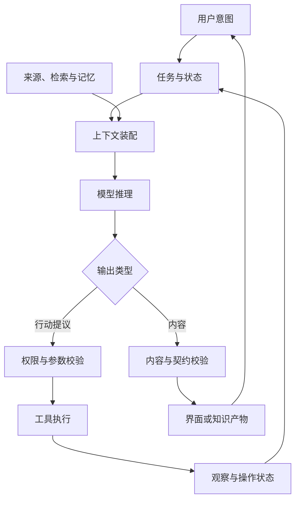

# AI 应用全景：知识关联、典型链路与实践印证

> 类型：Base / 综合地图。核查：2026-10-08。
> 本页由原“卡片助手项目练习”调整为知识关联入口，保留文件路径。不是课程、任务列表或应用实现方案。

## 快速回顾

AI 应用由模型能力、知识供给、运行控制、交互和验证共同组成。一个失败现象可能来自多个层；全景图的价值是定位问题与关联知识，而不是要求所有应用都采用图中的全部组件。

## 1. 从用户意图到可验证结果

模型给出内容或行动提议；运行时管理状态和外部结果。检索、工具、UI IR 和多 Agent 都是可选机制，不是每个应用的必选依赖。

## 2. 四类典型应用

| 形态 | 决策结构 | 核心知识 | 常见误区 |
| --- | --- | --- | --- |
| 单轮文本处理 | 一次请求与输出处理 | 提示、推理、校验 | 误以为必须做成 Agent |
| 检索问答 | 固定检索/生成链 | RAG、来源、评测 | 搜到即答对 |
| 固定工作流 | 程序控制步骤 | 状态、工具、失败恢复 | 把流程图当事务保证 |
| 自主工具循环 | 模型按观察选择行动 | Loop、Context、权限、预算 | 工具可见即允许执行 |

自主性与风险不是一条简单直线。固定脚本也可产生重大副作用；只读 Agent 也可能泄露敏感数据。风险取决于数据和动作边界。

## 3. 用一条知识整理链路串联主题

假设系统根据已有材料整理一张“缓存机制”知识卡：

1. 用户提出主题：需要界定范围，见[提示](17-prompt-behavior.md)。
2. 读取相关材料：来源版本与权限，见[RAG](06-retrieval.md)。
3. 组装请求：规则、来源与历史预算，见[Context](04-context-memory.md)。
4. 模型生成：token 与输出约束，见[推理请求](02-inference.md)。
5. 输出可见卡片：结构、引用与事件合同，见[UI IR](07-ui-ir.md)。
6. 用户修改并确认：revision、状态和批准，见[状态机](08-workflow-state.md)。
7. 保存或发布：幂等与结果核对，见[可靠性](09-reliability-security.md)。
8. 判断质量：事实支持、覆盖和失败类别，见[Evals](10-evaluation.md)。

这条链路是知识关系的说明，并未在本仓库创建卡片应用。

## 4. 领域对象为什么要分开

| 对象 | 表示什么 | 不宜与什么混合 |
| --- | --- | --- |
| Document/Source | 原始材料与权限 | 模型生成的结论 |
| Excerpt | 可定位证据片段 | 没有出处的摘要 |
| Draft/Revision | 内容及其版本 | 执行状态 |
| Run/Observation | 一次运行及外部反馈 | 永久事实 |
| Approval | 对固定范围的授权 | 模型自称允许 |
| Operation | 外部副作用的意图与结果 | UI loading 标记 |

这是建模视角，不规定必须创建这些数据库表。区分概念后，才更容易判断一个字段属于内容、状态还是权限。

## 5. 同一个症状的不同解释

“卡片引用不对”可能是检索错、来源版本变了、模型误引、ID 映射错或渲染链接错；“一直转圈”可能是模型未结束、工具未返回、循环无进展、状态未更新或界面未订阅。

因此知识库不只保存“解决方案列表”，还应保存问题定位关系。先检查观察证据，再选择相应机制条目，能避免用熟悉的框架解释所有问题。

## 6. 与普通软件工程的连续性

AI 系统仍需要清晰的数据模型、模块边界、版本控制、测试、权限和可观测性。变化主要在于部分决策或内容生成变成概率性组件，不能再只靠静态输入输出假设。

确定性程序适合约束与可验证操作；模型适合处理某些开放语义任务。二者配合不是“旧技术与新技术二选一”。[AI Coding/Harness](12-ai-coding.md)讨论这些原则在开发流程中的体现。

## 7. 实践印证怎样回流

知识库保存可迁移结论；实践项目保存代码和运行环境。一次印证记录可以写成：

| 字段 | 应记录的信息 |
| --- | --- |
| 印证的结论 | 例如旧 run 响应必须按 runId 拒绝 |
| 项目与版本 | 已核实、读者可访问的仓库/提交 |
| 条件 | 输入、环境、约束 |
| 观察 | 实际日志、状态变化、产物 |
| 支持范围 | 哪些结论被支持 |
| 未覆盖 | 没有测到的故障或版本 |

未提供项目证据时，本页不伪造链接或声称已在生产验证。实际项目中的隐私、凭据和受限资料不应直接复制进公开知识库。

## 8. 怎样逐步扩充

新知识点先判断主定义属于哪里：模型、知识、控制、界面还是验证。已有主定义时补充机制或链接；只在有独立问题边界时拆新页。一个专题从 Base 延伸到 Advance，应新增可回答的问题，而不是重复定义换标题。

- 需要查术语：[术语索引](GLOSSARY.md)。
- 需要定位知识面：[知识关系图](KNOWLEDGE_MAP.md)。
- 需要继续深入：[问题索引](ADVANCE.md)。
- 需要新增条目：[知识条目规范](KNOWLEDGE_SPEC.md)。

## 9. 延伸来源

[AI Agent Book 固定版本](https://github.com/bojieli/ai-agent-book/tree/dbc046eb896ac4e39aa19c7774c8bf49583b89a6)提供 Agent 工程主题参考；本页全景图、对象划分和案例是自写解释模型，不宣称是该书、任何框架或闭源产品的统一架构。
