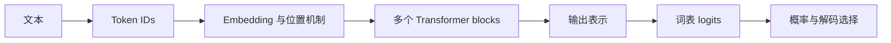

# 语言模型机制：Token、表示、Attention 与自回归生成

> 类型：Base / 模型计算。核查：2026-10-08。前置：[机器学习](15-machine-learning.md)。
> 范围：以 Transformer 自回归语言模型为主，公式是简化机制表达，不是某个闭源模型的实现披露。

## 快速回顾

- tokenizer 把文本编码为 token ID；embedding 把 ID 映射为向量；二者不是同一步。
- 注意力在序列位置之间组合信息；FFN 对每个位置的表示作非线性变换。
- 模型先计算分布，再由解码策略选择 token；选择结果会成为下一步输入。
- 训练可并行计算多个位置的目标，标准自回归生成仍存在逐步依赖。
- 参数、激活、KV Cache 与应用记忆分别属于不同层。

## 1. 从字符串到 token

token 可以对应词、子词、字符或字节片段；具体取决于词表与编码算法。相同文字在不同 tokenizer 下长度可能不同。中文字符数、英文单词数和 token 数不能固定换算。

特殊 token 或消息模板还能表示角色、边界等结构。用户看到的聊天文本，不一定等于模型收到的完整序列。估算窗口时，工具定义和消息包装也可能计入。

token ID 只是词表索引，没有“ID 越近语义越近”的含义。embedding 矩阵将其映射为向量；用于检索的句向量模型还涉及如何把整段文本编码和聚合，不能直接把 LLM 任一层向量当作通用语义搜索向量。

## 2. 一次前向计算的形状



每个 block 改变表示，但不会给每个位置“存一段中文解释”。图中的词表输出发生在数值空间；自然语言只出现在编码之前和解码之后。

设序列长 n、隐藏维度 d，X 可记为 n×d。实现还含 batch 维、多个 head 和不同布局；不能仅凭二维教学图推断真实内存排布。

## 3. 注意力怎样组合信息

单头缩放点积注意力常写为（下方同时给出普通文本形式）：

$$
\operatorname{Attention}(Q,K,V)=\operatorname{softmax}\left(\frac{QK^\top}{\sqrt{d_k}}+M\right)V
$$

M 是用于屏蔽不可见位置的 mask；softmax 沿每个 query 的 key 维度计算。

```text
Q = X Wq
K = X Wk
V = X Wv
A = softmax(Q K^T / sqrt(dk) + mask)
Y = A V
```

| 量 | 简化形状 | 含义 |
| --- | --- | --- |
| Q、K | n×dk | 查询与匹配表示 |
| V | n×dv | 被组合的信息 |
| QKᵀ | n×n | 每个 query 对各 key 的分数 |
| A | n×n | 每行归一化后的权重 |
| Y | n×dv | 按权重组合的结果 |

若某位置对两个可见位置的权重为 0.25、0.75，对应 V 为 [2,0]、[0,4]，则输出为 [0.5,3]。这是线性加权例子；权重怎样得到，由输入与训练出的参数共同决定。不能把高注意力权重直接解释成可靠的因果解释。

多头注意力在不同投影空间计算，再组合结果。它增加表示方式，不是每个 head 都具有稳定、可命名的人类专业分工。

## 4. Mask、位置与顺序

自回归训练中，位置 t 不应读取 t 之后的目标内容；causal mask 禁止未来位置参与该位置的注意力。否则训练可能通过偷看未来获得好分数，生成时却没有这份信息。

仅有全注意力的排列关系不足以表达预期顺序，需要位置机制。绝对位置编码、相对位置方法、RoPE 等设计不同；RoPE 作用于注意力相关表示，不等于给输入附上一段“位置文字”。

长上下文的支持范围受训练、位置处理和实现影响，不能只修改一个窗口参数就保证长距离检索质量。

## 5. 一个 block 不只有 Attention

FFN 通常对每个 token 的表示独立应用同一组变换，其中非线性让网络不退化为线性映射。残差路径帮助信息和梯度传播；归一化控制表示尺度。LayerNorm/RMSNorm、pre-norm/post-norm 等是具体实现差异。

因此“Attention 就是大模型全部计算”不准确。参数量和计算开销还来自 embedding、FFN、输出层及其他模块。MoE 则按路由激活部分专家计算；总参数量与每 token 激活参数量不同，路由与通信也有成本。

## 6. 三类架构的阅读坐标

| 类型 | 信息可见性与常见用途 | 不应误解为 |
| --- | --- | --- |
| Encoder-only | 常用双向上下文，表示/理解任务 | 只能分类、绝不能组合生成系统 |
| Decoder-only | 常见因果建模与续写生成 | 全部现代语言模型都只有这一种 |
| Encoder-decoder | 编码输入，再条件生成输出 | 原始 Transformer 与所有新模型完全一致 |

这是常见结构与用法，不是任务能力的绝对边界。原始 Transformer 论文主要讨论 encoder-decoder；阅读它时应把通用运算与具体模型配置分开。[原始论文](https://arxiv.org/html/1706.03762v7)

## 7. 训练与生成的差别

常见 next-token 训练给出整段序列，以 causal mask 保证每个位置只能利用合法前缀，多个位置的损失可在一次前向中计算。生成时，尚未生成的 token 未知，通常先生成一个，再继续。

```text
前缀：“缓存可以”
→ 分布 p(token | 前缀)
→ 选择 token a
→ 新前缀：“缓存可以” + a
→ 再计算后续分布
```

logits 不是概率；softmax 完成归一化。temperature 对分布进行缩放，top-k/top-p 再限制候选范围，具体顺序与支持项依赖服务。贪心选择不保证整条序列最优，也不保证事实正确。

## 8. KV Cache 为什么有用

生成下一个 token 时，过去位置的 K/V 在常见因果模型中可以复用，避免重复计算全部前缀对应状态。新 query 仍需要与可见历史交互，因此 decode 并不是“历史越长成本仍完全不变”。

KV Cache 是计算状态，不是知识库。它的生命周期、共享方式与访问边界由推理服务决定。容量估算与 prefill/decode 的资源差异见[推理系统](13-training-inference-systems.md)。

## 9. 易混概念

- 向量维度不是模型理解的“概念数量”，参数量不是知识条目的个数。
- 更高 token 概率只表示当前条件下更符合分布，不直接给出事实置信度。
- 单次 attention 中间矩阵的二次规模，不等于所有实现都完整物化该矩阵。
- 模型输出分析文字，不构成其内部机制的完整观测。

## 10. 深入引子与来源

- [Attention Is All You Need](https://arxiv.org/abs/1706.03762)：机制依据，重点看 scaled dot-product、multi-head 和模型结构；性能数字仅对原实验有效。
- [LLM Visualization](https://github.com/bbycroft/llm-viz)：交互印证，观察 GPT 风格计算的数据形状；不是所有架构的模拟器。
- [推理请求](02-inference.md)：区分模型计算与服务/API 层。
- Advance 引子：FlashAttention 怎样减少访存而不简单改变数学目标？GQA 怎样改变 KV 容量？MoE 为什么不是“多个 Agent”？这些是不同层次的问题。
