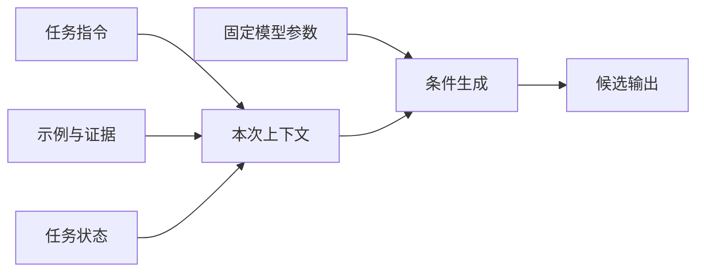
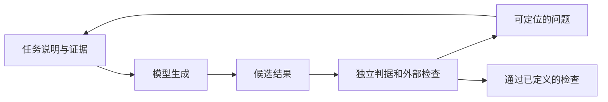

# 提示与模型行为：指令、示例、证据和不确定性

> 类型：Base / 行为引导。核查：2026-10-08。范围：应用层认知；具体角色优先级与 API 能力按产品文档确认。
> 衔接：[语言模型](16-language-models.md)解释条件生成；本页讨论怎样提供条件；[Context Builder](04-context-memory.md)解释系统怎样持续选择和组织信息。
> 例子为自写机制说明，未声称某个提示在真实模型上达到特定成功率。

## 快速回顾

提示词不是独立于上下文的魔法字符串。任务、约束、示例、证据、历史和输出形式共同影响行为。提示改进能减少歧义，但不能取代权限、事实来源与程序校验。

## 1. Prompt 为什么能影响输出

**Prompt（提示）**广义上是提供给模型、用于引导当前行为的输入；在工程交流中也常狭义指任务指令文本。本文用“提示设计”指任务、约束与示例的设计，用“上下文装配”指包含证据、状态和工具说明在内的整个输入组织过程。

语言模型根据当前条件产生输出。改变输入，就改变它面对的条件，而不必改变参数。这就是提示能影响输出的基础；它仍然是行为影响机制，不是强制执行的访问控制。

### 图 1：在参数不变时改变条件

图的关键是两种输入各走一条线：参数决定已学得的映射，当前上下文决定此次求解条件。提示并没有凭空提供新工具，也不授予操作权限。

### 1.1 四类信息分别解决什么问题

| 信息 | 作用 | 失败表现 |
| --- | --- | --- |
| 指令 | 规定做什么、怎样输出 | 目标不明确或互相冲突 |
| 示例 | 展示任务映射与风格 | 学到无意的格式/位置偏差 |
| 证据 | 支持本次具体事实 | 过期、矛盾、无权访问 |
| 状态 | 告知已做什么、还缺什么 | 重复行动或覆盖新决定 |

把它们分区，是为了便于审查，不代表用 XML 标签包起来就具备安全隔离。模型仍在处理同一个输入序列，真正的权限边界在运行时。

## 2. ICL：示例改变当前行为，训练改变参数

上下文学习指模型利用当前输入中的说明和示例改变本次任务表现，通常不在应用调用中更新模型参数。[Few-shot 论文](https://arxiv.org/abs/2005.14165)展示了重要的早期规模化研究，但不能据此保证所有模型、所有任务都获得相同增益。

微调通过训练更新权重或适配参数；检索把外部证据放入请求。示例回答“怎样完成任务”，检索证据回答“本次应依据什么”。两者可以重叠，但维护策略不同：示例重视任务代表性，证据重视真实性、版本和相关性。

## 3. 任务描述的语义结构：目标、约束和判据

一段任务说明应让模型知道“要产出什么”“依据是什么”“什么情况下不能继续推断”。这些内容各自解决不同歧义，不宜全部压缩成“专业、详细、准确”三个形容词。

| 成分 | 概念作用 | 局部对照 |
| --- | --- | --- |
| 目标 | 确定要解决的问题 | “比较两个机制”比“介绍一下”更限定任务 |
| 范围 | 确定讨论边界 | 指定版本、平台、对象，而不是默认普遍成立 |
| 依据 | 确定可用信息 | 原始材料、允许查询的来源 |
| 输出合同 | 确定结果结构 | 定义、区别、条件、引用 |
| 缺证处理 | 控制无依据扩展 | 标注未知、提出所缺证据 |
| 判据 | 说明怎样判断结果合格 | 每项关键结论可定位到来源 |

角色描述可以设定语言风格和专业语境，但“你是顶级专家”没有给出事实依据，也没有说明输出如何验收。约束过于模糊时，模型只能补足未说明的假设；约束过多且互相冲突时，又可能无法同时满足。

这里的“输出合同”是对期望行为的描述；JSON Schema 等程序可校验的结构合同见 [02 推理请求](02-inference.md)。自然语言要求本身不保证每个约束都会被满足。

### 图 2：提示设计与外部核查形成反馈

回边携带的是检查证据，不只是“请再认真一点”。如果检查仍完全依赖同一模型对自己的主观评价，反馈可能保留同一个错误。评测怎样建立独立性，在 [10 Evals](10-evaluation.md)展开。

## 4. 示例怎样帮助，也怎样误导

一个示例可以明确字段、粒度和表达风格。多个示例应覆盖任务差异，而不是反复复制同一简单情况。若全部示例都给肯定答案，模型可能忽视无答案场景；若每次正例都放第一位，可能引入位置线索。

示例中的业务秘密、错误答案或过期规则也会成为输入。示例选择与版本维护属于 Context Engineering，不只是写作技巧。过多示例还会挤占真正证据的空间。

## 5. 推理策略与可观察证据

分解问题、生成候选、调用工具、检查结果，是不同的求解策略。它们可能改善某些任务，也增加成本和错误传播路径。让模型“再检查一次”不是独立验证：第二次回答可能继承第一次错误。

可以要求简洁依据、来源定位和可执行检查，却不应把输出的长篇思考文字等同于完整内部推理或真实因果解释。计算交给计算工具、引用回到原文、程序结果由测试检查，通常比只延长解释更可审计。

## 6. 行为要求、格式约束与执行约束

提示可以要求 JSON，约束解码可以限制某些合法输出形式，应用校验可以拒绝不合格对象，运行时权限可以阻止越权动作。它们作用于不同环节。

| 机制 | 主要约束对象 | 即使通过仍不能说明 |
| --- | --- | --- |
| 自然语言指令 | 模型应尝试满足的行为 | 指令必然被遵守 |
| 结构化生成约束 | 支持范围内的输出形状 | 内容真实、引用有效 |
| 业务校验 | 对象与领域规则 | 已获得用户批准 |
| 权限与执行检查 | 当前可执行的动作 | 动作一定成功 |

本页只划清关系，不重复完整校验管道。语法、Schema、业务和流式完整性由 [02](02-inference.md)主讲；批准与信任边界由 [09](09-reliability-security.md)主讲。

## 7. 幻觉：把错误表现与根因分开

“幻觉”常泛指缺乏依据或不真实的输出，但排查时应拆开：

- 事实错误：与可靠来源冲突。
- 引用错误：来源存在但并不支持该结论。
- 任务不忠实：没有按输入范围或要求处理。
- 推断越界：从局部证据推出不成立的全称结论。
- 能力虚报：没有执行却说已经执行。

模型不知道、上下文没给、检索没找到、证据被截断、模型没利用证据，是不同原因。系统需要保留这些区分，才能决定补资料、改请求还是调整模型。

## 8. 不确定性：把证据范围说清楚

“我有 90% 把握”通常不是经过校准的统计概率。更有用的是说明证据覆盖到哪里：已核对定义，未验证实现；有两个冲突版本，暂不能确认；缺运行日志，不能判断实际执行。

拒答也不是越多越好。知识库问答可以提供确定部分并指出缺口；有副作用的动作则可能必须停在确认或权限边界。表达策略由风险和任务决定。

## 9. 外部数据为什么不能升级为指令

外部材料可能把自己伪装成系统指令。应用应分离指令来源与数据来源，并限制工具动作、目标与数据流。仅在提示中写“忽略恶意指令”不是完整防线，见[安全边界](09-reliability-security.md)。

## 10. 关联与深入入口

- [Context Builder](04-context-memory.md)：提示是装配结果的一部分，来源选择与预算不应全部塞进一个长模板。
- [Language Models are Few-Shot Learners](https://arxiv.org/abs/2005.14165)：机制与历史依据，关注无需梯度更新的任务适配。
- [ReAct](https://arxiv.org/abs/2210.03629)：了解推理与行动结合；不要把其特定格式当作所有 Agent 的固定协议。
- [评测](10-evaluation.md)：判断提示改动是否带来可重复收益。
- Advance 引子：示例检索如何影响泛化？模型评审为什么会偏好某种文风？长上下文中的信息位置如何影响利用率？
