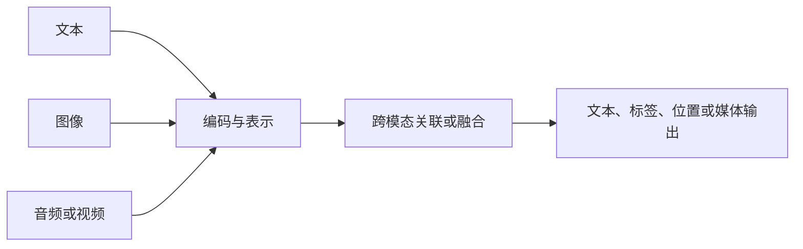
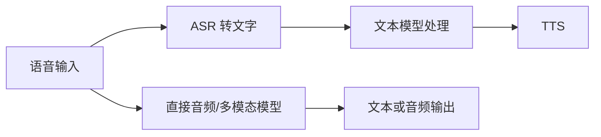

# 多模态基础：图像、语音、视频与跨模态表示

> 类型：Base / 能力地图。核查：2026-10-08。范围：理解输入输出与信息路径，不覆盖完整视觉/语音学科。
> 模型形态与服务能力不同；本文不宣称某个产品支持所有模态，也没有调用媒体生成服务。
> 衔接：[16](16-language-models.md)建立文本表示的基础；本页扩展到其他信号及跨模态关联；[06](06-retrieval.md)负责证据检索，[09](09-reliability-security.md)负责信任边界。

## 快速回顾

模态是信息的表示通道。多模态系统需要把不同通道的内容编码、关联或生成；“支持上传图片”并不能说明系统采用哪种内部架构，也不代表精确读懂所有细节。

## 1. 模态与任务：不同信息通道能表达什么

**模态（Modality）**指信息呈现和被处理的形式，如文字、图像、音频。**多模态（Multimodal）**系统处理两个或更多模态，可能只融合输入，也可能跨模态生成。视频还包含时间连续性，不能仅按一组静态图片理解。

文字擅长明确符号，图像保留空间布局，音频保留音色与时间变化。把一种模态转换成另一种，通常会丢失部分信息。因此系统能否回答问题，不只取决于模型能力，还取决于相关信号是否在预处理时保留下来。

### 图 1：输入、关联与输出是三个问题

图描述共同职责，不假定所有模态使用同一个编码器。理解、检索与生成也不必由同一个模型完成。

### 1.1 先区分任务，而不是只看输入按钮

| 任务 | 输入 → 输出 | 核心问题 |
| --- | --- | --- |
| OCR | 图像 → 文本 | 字符与版面识别 |
| 图像分类/检测 | 图像 → 类别/位置 | 物体是什么、在哪里 |
| 视觉问答 | 图像＋问题 → 回答 | 问题与视觉证据怎样关联 |
| ASR | 音频 → 文字 | 声音对应哪些词 |
| TTS | 文字 → 音频 | 语音与韵律怎样生成 |
| 图像/视频生成 | 条件 → 媒体 | 按条件产生内容 |
| 跨模态检索 | 文本/图像 → 相关对象 | 表示空间与相似性 |

OCR 识别到字不等于理解图表；ASR 转录正确不等于识别说话者；看到某人不代表可以推断其身份或敏感属性。任务合同需要比“多模态理解”更具体。

## 2. 编码：空间信号怎样进入数值计算

**视觉编码器**把图像变成供后续模块使用的表示。**Patch**是图像的局部块；将 patch 序列编码是一类常见机制，但不是唯一视觉输入路线。像素网格、patch 序列与文本 token 都有离散组织形式，却不能因此假定它们语义单位相同。

### 图 2：把图 1 的图像编码部分打开

每一步都会影响可见信息。原图存在小字，不代表缩放后的输入仍保留可辨别的小字；编码之后的回答也不应被当作未经损失的原图复刻。

一种常见方式是把图像处理为 patch 或其他视觉特征，再通过视觉编码器获得表示。[ViT](https://arxiv.org/abs/2010.11929)提供了把图像 patch 序列用于 Transformer 的代表性研究。实际多模态系统还可能使用裁剪、多尺度或动态分辨率，不能把某个 patch 大小当通用规格。

更高分辨率可能保留小字，也可能增加计算和上下文成本。图像缩放、压缩、裁剪会改变信息；模型回答错误时，首先确认它实际看到了什么，而不只看用户上传了什么。

## 3. 对齐与融合：比较两个模态，或让它们共同推断

**对齐（Alignment）**在本节指让不同模态的对应关系在表示中可用，与“模型价值对齐”不是同一用法。**融合（Fusion）**指在计算中让来自不同模态的信息相互作用。可比较的表示能支持检索，但不必然具备完整对话或生成能力。

[CLIP](https://arxiv.org/abs/2103.00020)通过图文配对训练可比较的表示，是理解跨模态检索的重要例子。对比目标使匹配对更容易被区分，但相似度不证明某段描述在逻辑上完全正确。

视觉编码器接语言模型的系统，还需要把视觉表示转换或连接到语言处理路径。投影器、cross-attention、统一 token 建模等是不同设计。不能根据外部 API 的统一 messages 字段推断内部已完全统一。

## 4. 级联与直接建模：中间表示决定保留什么

**级联（Cascade）**把多个专门模块串接，例如语音先转文字再交给文本模型。它让中间结果更容易检查，也把后续模块能看到的内容限定在中间表示内。

### 图 3：音频经过文本中间层，或保留音频路径

级联方式便于分别观察转录和文本处理，但可能丢失语气、停顿等信息并累积延迟。直接方式可能保留更多模态信息，但错误归因和中间状态未必同样透明。具体优劣依赖模型与任务，不能泛化为“端到端一定更好”。

[Whisper 论文](https://arxiv.org/abs/2212.04356)适合作为语音识别研究入口；它不代表整个语音对话系统。

## 5. 时序与 Grounding：结论对应哪个片段

在视觉语境中，**Grounding**常指把语言中的对象或关系定位到图像区域、视频片段等实际信号上；[06](06-retrieval.md)的证据支撑是相关但更广的来源关系。它们都强调结论与证据的对应，不只是输出听起来合理。

视频不是任意一张关键帧。动作、先后、持续时间和音画同步都可能影响结论。抽帧节省成本，却可能漏掉短暂事件；只看画面也可能忽略声音中的关键证据。

引用视频结论时，时间戳、片段范围和抽样方式比只贴视频链接更有用。若声称“全过程没有某事件”，有限抽帧通常不足以支持这种全称结论。

## 6. 生成：从条件到媒体，而非从媒体提取事实

条件生成根据文字、图像或其他信号产生新媒体。输出是模型生成的产物，即使逼真也不能据此当作现实观测。

图像生成可采用扩散、自回归等路线；经典扩散模型通过训练学习去噪相关目标，采样时逐步从噪声恢复结构。[DDPM](https://arxiv.org/abs/2006.11239)是代表性入口，不应将其所有细节推广到每个现代生成系统。

理解图像正确，不保证生成图中的文字或精确布局正确；能生成好看的图，也不保证适合解释严格事实。知识库中的机制图优先保证结构和标注准确，不能用视觉逼真代替证据。

## 7. 信息保真：每一层转换都需要保留定位

从图像到 OCR 文本、从语音到转录、从视频到关键帧，转换都可能丢失内容与关系。知识整理应区分原始信号、机器提取结果和后续解释，不让三者悄悄合并成一个“事实”。

| 层次 | 应保留的定位 | 典型信息损失 |
| --- | --- | --- |
| 原始媒体 | 来源、版本、文件或访问标识 | 来源本身可能不完整 |
| 图像区域 | 裁剪坐标、缩放条件 | 小字、边缘和空间关系 |
| 音频片段 | 时间范围、声道与转录状态 | 停顿、音色、专有词 |
| 视频片段 | 时间范围、抽帧方式、音画信息 | 短暂事件、先后关系 |
| 提取与重画 | 对应原片段及修改说明 | 错读箭头、补造缺失关系 |
| 最终结论 | 支持它的区域或片段 | 从局部证据推出全称结论 |

局部反例：仅抽取一分钟视频的若干帧，可能支持“这些帧中未观察到某事件”，通常不足以支持“一分钟内从未发生”。限制来自采样证据，而不是措辞是否足够自信。

重画机制图时，原图里未提供的解释应标成补充推断或另附来源。知识图的表达美观与事实支持是两个独立质量维度。

## 8. 任务级评估与跨模态安全

| 风险 | 需要保留的信息或限制 |
| --- | --- |
| 小字/布局误读 | 原图、区域、清晰度和人工核对 |
| 转录错误 | 音频时间戳、专有名词与不确定片段 |
| 媒体中的提示注入 | 将 OCR/转录文字当外部数据，不提升其指令权限 |
| 隐私与授权 | 人脸、声音、位置等信息的合法用途与最少传输 |
| 生成内容误作事实 | 显著标记合成/示意，不伪造证据 |
| 版权 | 区分链接、引用、改编和再分发许可 |

多模态错误需要按任务衡量。文字识别率、视觉问答质量、图文对齐和生成审美，不是同一指标。

## 9. 关联、深入问题与来源

- [模型表示](16-language-models.md)：文本 token 与视觉表示如何进入同一计算路径？
- [RAG](06-retrieval.md)：怎样为图表、语音片段保存可引用证据？
- [安全](09-reliability-security.md)：图像里的命令为何不能获得更高权限？
- [ViT](https://arxiv.org/abs/2010.11929)：图像 patch 与 Transformer 的代表性机制。
- [CLIP](https://arxiv.org/abs/2103.00020)：图文对比表示与跨模态检索的研究入口。
- [Whisper](https://arxiv.org/abs/2212.04356)：语音识别研究，不等于完整语音对话架构。
- [DDPM](https://arxiv.org/abs/2006.11239)：经典扩散生成机制，不覆盖全部现代媒体模型。
- 深入问题：语音直达模型时怎样审计错误？视频抽帧如何影响事件召回？空间定位误差怎样影响图表结论？继续见 [Advance](ADVANCE.md)。
