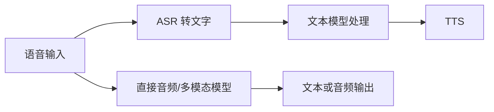

# 多模态基础：图像、语音、视频与跨模态表示

> 类型：Base / 能力地图。核查：2026-10-08。范围：理解输入输出与信息路径，不覆盖完整视觉/语音学科。
> 模型形态与服务能力不同；本文不宣称某个产品支持所有模态，也没有调用媒体生成服务。

## 快速回顾

模态是信息的表示通道。多模态系统需要把不同通道的内容编码、关联或生成；“支持上传图片”并不能说明系统采用哪种内部架构，也不代表精确读懂所有细节。

## 1. 先区分任务，而不是只看输入按钮

| 任务 | 输入 → 输出 | 核心问题 |
| --- | --- | --- |
| OCR | 图像 → 文本 | 字符与版面识别 |
| 图像分类/检测 | 图像 → 类别/位置 | 物体是什么、在哪里 |
| 视觉问答 | 图像＋问题 → 回答 | 问题与视觉证据怎样关联 |
| ASR | 音频 → 文字 | 声音对应哪些词 |
| TTS | 文字 → 音频 | 语音与韵律怎样生成 |
| 图像/视频生成 | 条件 → 媒体 | 按条件产生内容 |
| 跨模态检索 | 文本/图像 → 相关对象 | 表示空间与相似性 |

OCR 识别到字不等于理解图表；ASR 转录正确不等于识别说话者；看到某人不代表可以推断其身份或敏感属性。任务合同需要比“多模态理解”更具体。

## 2. 图像怎样成为模型输入

一种常见方式是把图像处理为 patch 或其他视觉特征，再通过视觉编码器获得表示。[ViT](https://arxiv.org/abs/2010.11929)提供了把图像 patch 序列用于 Transformer 的代表性研究。实际多模态系统还可能使用裁剪、多尺度或动态分辨率，不能把某个 patch 大小当通用规格。

更高分辨率可能保留小字，也可能增加计算和上下文成本。图像缩放、压缩、裁剪会改变信息；模型回答错误时，首先确认它实际看到了什么，而不只看用户上传了什么。

## 3. 共享表示与跨模态连接

[CLIP](https://arxiv.org/abs/2103.00020)通过图文配对训练可比较的表示，是理解跨模态检索的重要例子。对比目标使匹配对更容易被区分，但相似度不证明某段描述在逻辑上完全正确。

视觉编码器接语言模型的系统，还需要把视觉表示转换或连接到语言处理路径。投影器、cross-attention、统一 token 建模等是不同设计。不能根据外部 API 的统一 messages 字段推断内部已完全统一。

## 4. 级联与直接多模态的区别

级联方式便于分别观察转录和文本处理，但可能丢失语气、停顿等信息并累积延迟。直接方式可能保留更多模态信息，但错误归因和中间状态未必同样透明。具体优劣依赖模型与任务，不能泛化为“端到端一定更好”。

[Whisper 论文](https://arxiv.org/abs/2212.04356)适合作为语音识别研究入口；它不代表整个语音对话系统。

## 5. 视频多了时间轴

视频不是任意一张关键帧。动作、先后、持续时间和音画同步都可能影响结论。抽帧节省成本，却可能漏掉短暂事件；只看画面也可能忽略声音中的关键证据。

引用视频结论时，时间戳、片段范围和抽样方式比只贴视频链接更有用。若声称“全过程没有某事件”，有限抽帧通常不足以支持这种全称结论。

## 6. 生成与理解不是同一种能力

图像生成可采用扩散、自回归等路线；经典扩散模型通过训练学习去噪相关目标，采样时逐步从噪声恢复结构。[DDPM](https://arxiv.org/abs/2006.11239)是代表性入口，不应将其所有细节推广到每个现代生成系统。

理解图像正确，不保证生成图中的文字或精确布局正确；能生成好看的图，也不保证适合解释严格事实。知识库中的机制图优先保证结构和标注准确，不能用视觉逼真代替证据。

## 7. 一个截图转知识条目的数据路径

自写说明案例：从架构截图提取模块关系。

1. 保存原图来源和版本。
2. 确认分辨率足以识别模块文字与箭头。
3. 提取节点、连线和标签，保留不确定项。
4. 对照原图核对方向，而不是补出“看起来合理”的依赖。
5. 用 Mermaid 重画，并记录重画而非原图复用。
6. 将原图里没有的信息标为解释或补充来源。

如果截图只显示局部，就不能声称还原了整个系统。这个过程展示的是信息保真问题，不要求在本仓库实现截图处理应用。

## 8. 评估与安全边界

| 风险 | 需要保留的信息或限制 |
| --- | --- |
| 小字/布局误读 | 原图、区域、清晰度和人工核对 |
| 转录错误 | 音频时间戳、专有名词与不确定片段 |
| 媒体中的提示注入 | 将 OCR/转录文字当外部数据，不提升其指令权限 |
| 隐私与授权 | 人脸、声音、位置等信息的合法用途与最少传输 |
| 生成内容误作事实 | 显著标记合成/示意，不伪造证据 |
| 版权 | 区分链接、引用、改编和再分发许可 |

多模态错误需要按任务衡量。文字识别率、视觉问答质量、图文对齐和生成审美，不是同一指标。

## 9. 关联与深入问题

- [模型表示](16-language-models.md)：文本 token 与视觉表示如何进入同一计算路径？
- [RAG](06-retrieval.md)：怎样为图表、语音片段保存可引用证据？
- [安全](09-reliability-security.md)：图像里的命令为何不能获得更高权限？
- Advance 入口：跨模态对齐、视觉 grounding、视频时间建模、实时语音延迟。上面的 ViT、CLIP、Whisper、DDPM 分别提供机制起点，不作为完整多模态系统的统一标准。
