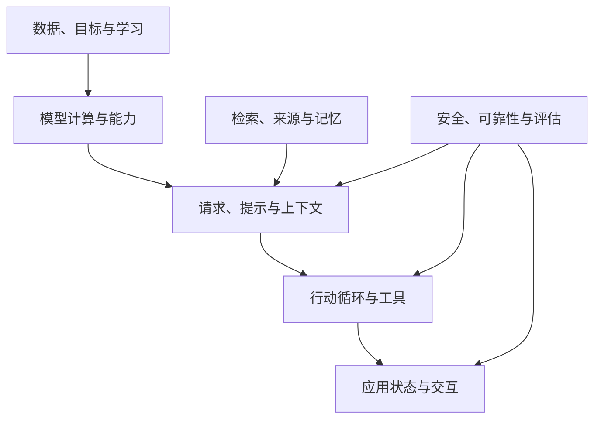

# AI 知识关系图：按问题定位概念

> 导航页，更新：2026-10-08。箭头表示理解或信息依赖，不表示必须使用的产品架构。

## 1. 知识依赖与系统数据流分开看

本图表示知识之间的理解关系，而不是运行顺序。模型解释输出怎样产生，知识供给解释依据从哪里来，控制解释行为怎样推进，交互解释人如何观察和介入，验证贯穿全程。真实系统中的信息流和控制流另见 [14 全景](14-learning-project.md)。

## 2. 按问题查找

| 当前疑问 | 首先阅读 | 继续关联 |
| --- | --- | --- |
| 贴资料为什么不等于训练？ | [AI 全景](01-foundations.md) | [提示](17-prompt-behavior.md)、[后训练](13-training-inference-systems.md) |
| token、向量、参数是什么关系？ | [语言模型](16-language-models.md) | [机器学习](15-machine-learning.md) |
| 为什么相同请求结果会变化？ | [推理](02-inference.md) | [评测](10-evaluation.md) |
| 谁决定调用下一次工具？ | [Loop](03-agent-loop.md) | [Workflow](08-workflow-state.md) |
| 历史保存了，为何模型没看见？ | [Context](04-context-memory.md) | [记忆/RAG](06-retrieval.md) |
| MCP 与 Skill 能否互相替代？ | [工具与协议](05-tools-mcp-skills.md) | [Loop](03-agent-loop.md) |
| 找到资料为何还是答错？ | [RAG](06-retrieval.md) | [提示行为](17-prompt-behavior.md)、[Evals](10-evaluation.md) |
| 生成 UI 为何不能直接执行事件？ | [UI IR](07-ui-ir.md) | [安全](09-reliability-security.md) |
| 取消后为何还有副作用？ | [状态机](08-workflow-state.md) | [可靠性](09-reliability-security.md) |
| 多 Agent 为什么可能更贵更慢？ | [多 Agent](11-multi-agent.md) | [Context](04-context-memory.md) |
| 测试通过为何仍不能发布？ | [Harness](12-ai-coding.md) | [安全](09-reliability-security.md) |
| 量化为什么未必更快？ | [模型系统](13-training-inference-systems.md) | [模型机制](16-language-models.md) |
| 图像里有字为何识别不准？ | [多模态](18-multimodal.md) | [证据处理](06-retrieval.md) |

## 3. 容易跨层混淆的概念对

| 概念对 | 区别 | 主定义 |
| --- | --- | --- |
| inference / reasoning | 计算执行 / 问题求解行为 | [全景](01-foundations.md) |
| 参数知识 / 外部知识 | 训练形成 / 应用存储并检索 | [01 全景](01-foundations.md)、[06 RAG](06-retrieval.md) |
| KV Cache / 长期记忆 | 计算状态 / 跨任务信息 | [13 推理系统](13-training-inference-systems.md)、[04 Context](04-context-memory.md) |
| Tool / MCP / Skill | 能力 / 协议 / 过程知识 | [工具](05-tools-mcp-skills.md) |
| UI 事件 / 业务授权 | 行为描述 / 执行许可 | [UI IR](07-ui-ir.md) |
| 超时 / 失败 | 等待期限届满 / 按合同确认失败 | [可靠性](09-reliability-security.md) |
| 格式正确 / 事实正确 | 数据结构 / 内容成立 | [推理](02-inference.md) |
| Actor / Agent / 线程 | 生命周期单元 / 决策系统 / 执行调度单元 | [状态机](08-workflow-state.md)、[多 Agent](11-multi-agent.md) |
| 微调目标 / LoRA | 学什么 / 怎样参数化适配 | [模型系统](13-training-inference-systems.md) |

## 4. 主定义归属：同一概念在哪里完整展开

跨章可以有一句必要提醒，但完整机制、图和条件集中在主条目。下表也是新增内容时的归属判断表。

| 主条目 | 本页拥有的核心定义与机制 | 其他页怎样引用 |
| --- | --- | --- |
| [01 全景](01-foundations.md) | AI/ML/模型/系统的分类轴；参数与当前输入 | 总览只定位，不重写各专题 |
| [15 ML](15-machine-learning.md) | 学习范式、参数/超参数、损失/梯度、泛化/泄漏 | 训练和评测页引用基础定义 |
| [16 语言模型](16-language-models.md) | token、embedding、Attention、Block、自回归 | 应用页不重复模型内部推导 |
| [17 提示](17-prompt-behavior.md) | 指令/示例/证据、ICL、幻觉与不确定性 | Context 页讲装配，不另讲提示写法 |
| [02 请求](02-inference.md) | 采样、输出 Schema、流式分帧、请求结束 | UI 页只补图结构与交互约束 |
| [03 Loop](03-agent-loop.md) | Agent、Model/Runtime 分工、Observation、控制回边与出口 | 专题页只打开其中一个职责 |
| [Tool Calling](03-tool-calling.md) | 工具定义、调用提议、结果关联与完整往返 | MCP 与工具发现转到 05，恢复转到 09 |
| [ReAct](03-react.md) | 推理与行动交替、与 CoT 的区别、方法边界 | Loop 讲运行结构，不重写 ReAct 方法 |
| [04 Context](04-context-memory.md) | 历史/状态/上下文/记忆生命周期、装配与压缩 | 检索页从候选获取继续 |
| [05 工具](05-tools-mcp-skills.md) | Tool 合同、MCP 角色与消息、Skill 披露 | Loop 保留工具的最短定义 |
| [06 RAG](06-retrieval.md) | 索引/召回/重排、证据支持、记忆维护、检索指标 | Evals 不复制检索指标定义 |
| [08 状态](08-workflow-state.md) | Workflow、State/Event/Guard/Actor、纯转换、生命周期 | UI 与 Harness 只讲应用关系 |
| [09 安全](09-reliability-security.md) | 认证/授权/批准、幂等、注入、Outbox/补偿 | 其他页只提示执行边界 |
| [10 Evals](10-evaluation.md) | 判据、评分器、比较、Trace/Metric 与归因 | 各专题只补自己的观测对象 |
| [07 UI IR](07-ui-ir.md) | Catalog、UI/Event IR、引用图、渲染合同 | 通用状态机制链接回 08 |
| [11 协作](11-multi-agent.md) | 多决策边界、依赖、交接、关键路径和相关错误 | 不重新定义单 Agent Loop |
| [12 Coding](12-ai-coding.md) | Harness、仓库可导航性、变更证据绑定 | 编译与测试作为工程反馈 |
| [13 系统](13-training-inference-systems.md) | 后训练、LoRA、KV/prefill/decode、调度与资源指标 | 16 只定位缓存，不复制容量分析 |
| [18 多模态](18-multimodal.md) | 模态、编码、对齐/融合、时序与媒体保真 | 共通信任机制链接回 09 |
| [14 全景](14-learning-project.md) | 跨层组合与故障定位 | 不新增第二套核心术语定义 |

“主定义唯一”不等于完全禁止复述。读者独立进入某页时，必要的一句定义与链接能保持可读性；要避免的是重复维护完整段落、图解或另一套冲突定义。

## 5. 回顾路径与深入路径

回顾一个知识点：术语 → 主定义 → 渐进机制图 → 边界 → 关联。探索一个新问题：现象 → 相关知识面 → 缺少的证据 → 原始资料 → 新条目。

不必把所有页面从头顺序读完。主定义保持稳定，专题逐渐增加；只有某个独立问题已形成足够内容时才拆页。

## 6. 相关入口

[全部主题](README.md) · [术语索引](GLOSSARY.md) · [深入问题](ADVANCE.md) · [维护规范](KNOWLEDGE_SPEC.md)

## 新版作者入口

本页保留旧路由链接供当前站点使用；新版作者源及三模式导航见 [topics/README](topics/README.md)。接入时统一将旧入口映射到新源，不另建冲突定义。
