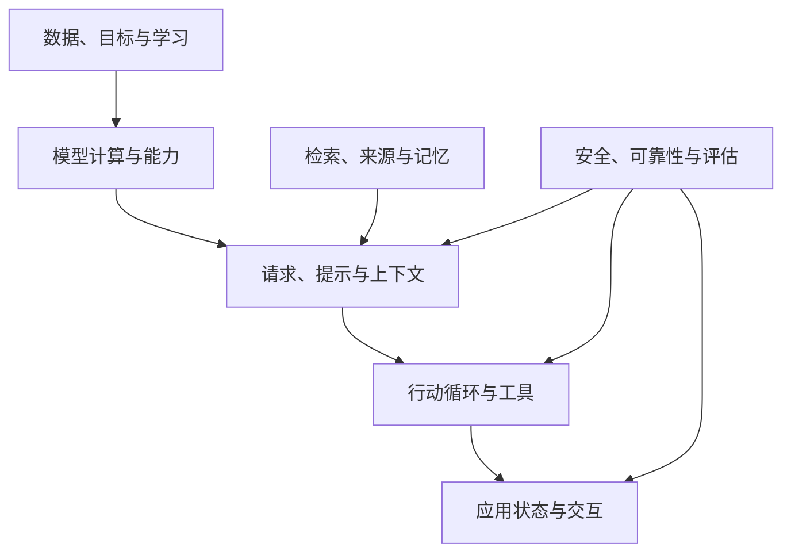

# AI 知识关系图：按问题定位概念

> 导航页，更新：2026-10-08。箭头表示理解或信息依赖，不表示必须使用的产品架构。

## 1. 五个知识面

模型层解释输出怎样产生；知识层解释依据从哪里来；控制层解释行为怎样推进；界面层解释人如何观察和介入；验证层贯穿全程。

## 2. 按问题查找

| 当前疑问 | 首先阅读 | 继续关联 |
| --- | --- | --- |
| 贴资料为什么不等于训练？ | [AI 全景](01-foundations.md) | [提示](17-prompt-behavior.md)、[后训练](13-training-inference-systems.md) |
| token、向量、参数是什么关系？ | [语言模型](16-language-models.md) | [机器学习](15-machine-learning.md) |
| 为什么相同请求结果会变化？ | [推理](02-inference.md) | [评测](10-evaluation.md) |
| 谁决定调用下一次工具？ | [Loop](03-agent-loop.md) | [Workflow](08-workflow-state.md) |
| 历史保存了，为何模型没看见？ | [Context](04-context-memory.md) | [记忆/RAG](06-retrieval.md) |
| MCP 与 Skill 能否互相替代？ | [工具与协议](05-tools-mcp-skills.md) | [Loop](03-agent-loop.md) |
| 找到资料为何还是答错？ | [RAG](06-retrieval.md) | [提示行为](17-prompt-behavior.md)、[Evals](10-evaluation.md) |
| 生成 UI 为何不能直接执行事件？ | [UI IR](07-ui-ir.md) | [安全](09-reliability-security.md) |
| 取消后为何还有副作用？ | [状态机](08-workflow-state.md) | [可靠性](09-reliability-security.md) |
| 多 Agent 为什么可能更贵更慢？ | [多 Agent](11-multi-agent.md) | [Context](04-context-memory.md) |
| 测试通过为何仍不能发布？ | [Harness](12-ai-coding.md) | [安全](09-reliability-security.md) |
| 量化为什么未必更快？ | [模型系统](13-training-inference-systems.md) | [模型机制](16-language-models.md) |
| 图像里有字为何识别不准？ | [多模态](18-multimodal.md) | [证据处理](06-retrieval.md) |

## 3. 容易跨层混淆的概念对

| 概念对 | 区别 | 主定义 |
| --- | --- | --- |
| inference / reasoning | 计算执行 / 问题求解行为 | [全景](01-foundations.md) |
| 参数知识 / 外部知识 | 训练形成 / 应用存储并检索 | [RAG](06-retrieval.md) |
| KV Cache / 长期记忆 | 计算状态 / 跨任务信息 | [Context](04-context-memory.md) |
| Tool / MCP / Skill | 能力 / 协议 / 过程知识 | [工具](05-tools-mcp-skills.md) |
| UI 事件 / 业务授权 | 行为描述 / 执行许可 | [UI IR](07-ui-ir.md) |
| 超时 / 失败 | 等待结束 / 操作确定未成功 | [可靠性](09-reliability-security.md) |
| 格式正确 / 事实正确 | 数据结构 / 内容成立 | [推理](02-inference.md) |
| Actor / Agent / 线程 | 生命周期单元 / 决策系统 / 执行调度单元 | [状态机](08-workflow-state.md)、[多 Agent](11-multi-agent.md) |
| 微调目标 / LoRA | 学什么 / 怎样参数化适配 | [模型系统](13-training-inference-systems.md) |

## 4. 回顾路径与深入路径

回顾一个知识点：术语 → 主定义 → 机制图/例子 → 边界 → 关联。探索一个新问题：现象 → 相关知识面 → 缺少的证据 → 原始资料 → 新条目。

不必把所有页面从头顺序读完。主定义保持稳定，专题逐渐增加；只有某个独立问题已形成足够内容时才拆页。

## 5. 相关入口

[全部主题](README.md) · [术语索引](GLOSSARY.md) · [深入问题](ADVANCE.md) · [维护规范](KNOWLEDGE_SPEC.md)
