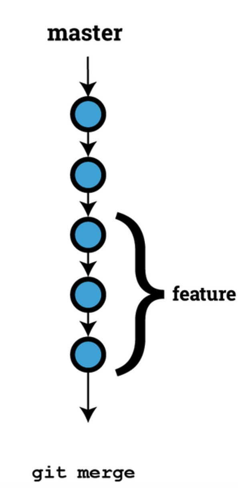
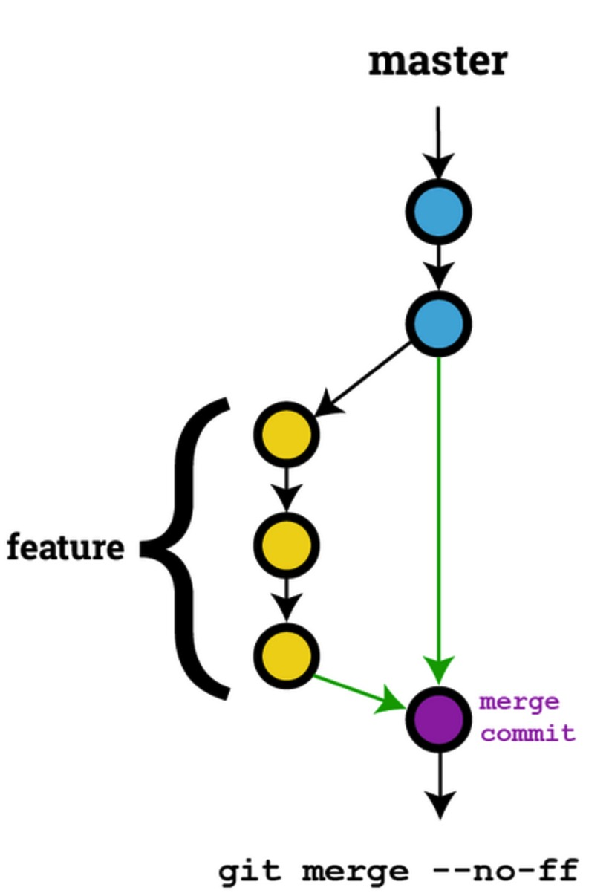
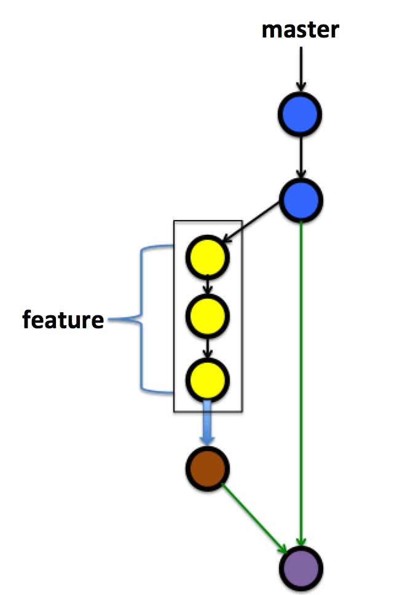

## git 常用命令及技巧

#### 查看 ssh 公钥方法

###### 通过命令窗口

a.打开你的 git bash 窗口

b.进入.ssh 目录：cd ~/.ssh

c.找到 id_rsa.pub 文件：ls

d.查看公钥：cat id_rsa.pub 或者 vim id_rsa.pub

###### 直接输入命令

cat ~/.ssh/id_rsa.pub

###### .ssh 文件夹

#### 何谓公钥

1.很多服务器都是需要认证的，ssh 认证是其中的一种。在客户端生成公钥，把生成的公钥添加到服务器，你以后连接服务器就不用每次都输入用户名和密码了。

2.很多 git 服务器都是用 ssh 认证方式，你需要把你生成的公钥发送给代码仓库管理员，让他给你添加到服务器上，你就可以通过 ssh 自由地拉取和提交代码了。

#### 生成公钥：

1.如果通过上面的方式找不到公钥，你就需要先生成公钥了：ssh-keygen

`ssh-keygen -t rsa -C "youremail@example.com"`

2.接着会确认存放公钥的地址，默认就是上面说的路径，直接 enter 键确认

3.接着会要求输入密码和确认密码，如果不想设置密码直接不输入内容 按 enter 键

#### git merge --no-ff

默认情况下，如果没有冲突那么 `git merge` 采用 `fast-forward`(快进) 的模式进行合并，所谓 `fast-forward` 指的是：不产生新的提交历史，直接移动 `HEAD` 至要合并的分支，显而易见的缺点是合并历史信息不清晰，如下图(一条线)：

所以为了保留分支的 `commit` 历史记录，我们可以采用 `--no-ff` 选项，这样合并后的历史记录图类似于这样：

#### git merge --squash

`--squash` 选项用于压缩多个“无用”的 `commit` 为一个 `commit`，效果类似下图：

