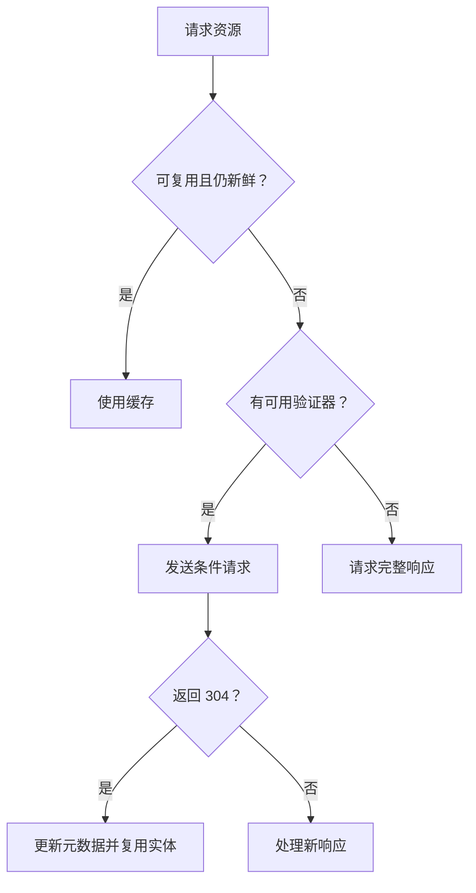

# HTTP 缓存：存储、新鲜度与重新验证

> 适用：浏览器与共享 HTTP 缓存。核查日期：2026-10-08。
> 状态：规范核查；以下报文为教学示例，未实测。

## 1. 核心模型

先判断响应能否存储，再判断存储的响应是否可直接复用。过期不等于删除：仍可能用验证器向服务端确认。



这是常见流程的简化模型；请求指令、Vary、认证、缓存分区和网络错误会影响实际决策。

## 2. 常见指令

| 指令 | 含义 | 典型用途 |
| --- | --- | --- |
| max-age=60 | 设置新鲜度寿命 | 短时可复用数据 |
| no-cache | 复用前需要验证 | 希望每次确认更新的入口 HTML |
| no-store | 不应存储这次请求/响应 | 敏感响应 |
| private | 不让共享缓存存储 | 个性化内容 |
| public | 在满足条件时允许共享缓存 | 公共资源 |
| s-maxage | 共享缓存新鲜度 | CDN 策略 |
| must-revalidate | 陈旧后不得随意复用 | 要求严格重新验证的资源 |

no-cache 不是禁止保存；no-store 也不是清除过去所有缓存的命令。private 不等于加密。

新鲜度计算会考虑 Date、Age、传输时间等因素，不应简化成“本地第一次请求时间 + max-age”。有效 max-age 通常优先于 Expires。

## 3. 验证器

```http
GET /api/catalog
If-None-Match: "catalog-v3"
```

未变化时，服务端可返回 304；变化时返回新的表示。ETag 是服务端给出的不透明验证标识，不一定是内容哈希，也不是永久唯一 ID。

Last-Modified 配合 If-Modified-Since 使用；两类条件并存时有规范规定的优先级。304 不是“没有任何响应头”，它仍需要传递相关验证与缓存元数据。旧文断言 304 不会返回 Last-Modified，应删除。

## 4. 工程例子

- 内容哈希命名的静态文件：可使用长缓存；内容变化必须改变 URL。
- 入口 HTML：让浏览器及时重新验证，避免长期指向旧资源。
- 登录用户数据：先判断是否允许存储，再决定 private 或 no-store 等策略。
- 按语言返回不同表示：正确设置 Vary，避免把甲的表示给乙。

Service Worker Cache API、HTTP 缓存和页面内存中的状态是不同层；“清缓存”排查时必须说明清哪一层。

## 5. 如何验证

打开开发者工具，分别观察正常访问、再次访问、强制刷新、改变 ETag 的行为。记录响应头、请求头、状态码和传输大小。“Disable cache”开启时的结果不能代表正常用户路径。

自测：no-cache 与 no-store 有何区别？304 为什么仍会有网络耗时？相同 URL 在不同语言下为什么可能需要 Vary？

## 6. 来源

- [RFC 9111](https://httpwg.org/specs/rfc9111.html)
- [MDN HTTP Caching](https://developer.mozilla.org/en-US/docs/Web/HTTP/Guides/Caching)
