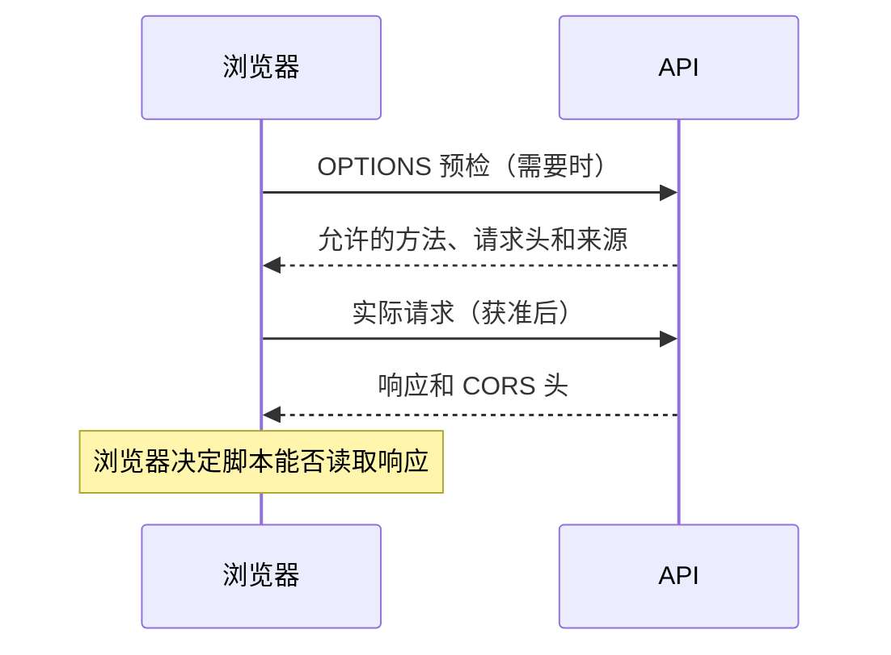

# 跨源访问：同源策略、CORS 与窗口通信

> 核查日期：2026-10-08。状态：官方文档核查与静态示例；未实测。
> 前置知识：URL、HTTP 请求和响应、浏览器与服务端的边界。

## 1. 核心结论

源由协议、主机、端口组成。路径不同不会改变源；同一主域下的不同子域通常是不同源。

同源策略限制不同来源之间的访问能力，不能概括为“跨域请求发不出去”。部分请求可以发出，但脚本不能读取响应；需要预检的请求可能在实际请求发送前被拦下。

| 机制 | 主要解决什么 | 不解决什么 |
| --- | --- | --- |
| CORS | 浏览器脚本跨源读取响应的许可 | 服务端身份认证、所有 CSRF |
| 同源后端代理 | 让浏览器访问自身后端，由后端访问目标 | 目标授权、SSRF、访问控制 |
| postMessage | 不同窗口之间的显式消息通信 | 自动信任任何发送者 |
| WebSocket | 双向连接 | 自动消除 Origin 和认证校验 |
| JSONP | 历史脚本回调方案 | 通用安全数据请求 |

## 2. CORS 的请求路径



并非所有跨源请求都有预检。Content-Type、方法、自定义请求头等会影响是否需要预检。预检通过也不代替实际响应的 CORS 检查。

## 3. 携带凭据

如果跨源 fetch 需要 Cookie，客户端凭据选项和服务端许可都需要匹配。允许凭据时不能把 Access-Control-Allow-Origin 简单设成星号。动态反射来源必须先对照允许列表，并考虑 Vary: Origin。

CORS 由浏览器执行，普通服务端 HTTP 客户端不靠它完成授权。敏感接口仍需认证、授权、输入验证和 CSRF 防护。

## 4. 安全的窗口通信骨架

```js
const allowedOrigin = "https://viewer.example.com";
const frame = document.querySelector("#viewer");

window.addEventListener("message", (event) => {
  if (event.origin !== allowedOrigin) return;
  if (event.source !== frame?.contentWindow) return;
  const data = event.data;
  if (!data || typeof data !== "object") return;
  if (data.type !== "card:selected" || typeof data.id !== "string") return;
  console.log("已校验的卡片 ID", data.id);
});
```

示例仅展示接收端验证，不含真实页面。发送端使用明确 targetOrigin；接收端检查 origin、source 和消息结构。不要因为消息来自 iframe 就信任其中的 HTML、URL 或操作指令。

postMessage 是 Web 平台 API，不是 ES5 语言特性；支持结构化克隆，并非必须 JSON.stringify。

## 5. 历史方案的处理

旧文列举 document.domain、window.name、hash iframe 和 Flash 的技巧，主要用于理解历史系统。新系统优先使用明确的 CORS、后端代理或 postMessage 契约。document.domain 已弃用；不能用旧浏览器技巧推断现代浏览器仍允许该行为。

JSONP 会执行远端脚本，不能把它当作与 JSON 数据等价的安全输入。mode: "no-cors" 也不会使任意跨源响应变得可读。

## 6. 排查与练习

依次区分：DNS/TLS/网络失败 → 预检失败 → 实际请求失败 → CORS 读取失败 → 业务授权失败。不要见到前端报错就断言服务端没有收到请求。

练习：同一个 API 在 curl 成功、浏览器失败，列出三种可验证原因。答案至少包括 CORS 许可、凭据差异和网络环境差异，不能只写“浏览器有问题”。

## 7. 来源

- [MDN CORS](https://developer.mozilla.org/en-US/docs/Web/HTTP/Guides/CORS)
- [MDN postMessage](https://developer.mozilla.org/en-US/docs/Web/API/Window/postMessage)
- [同源策略](https://developer.mozilla.org/en-US/docs/Web/Security/Same-origin_policy)
