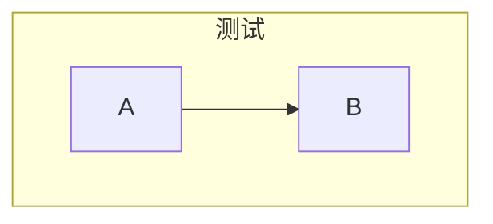
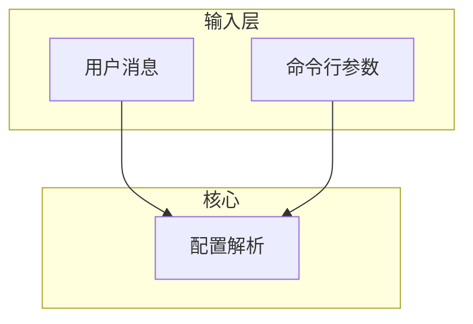
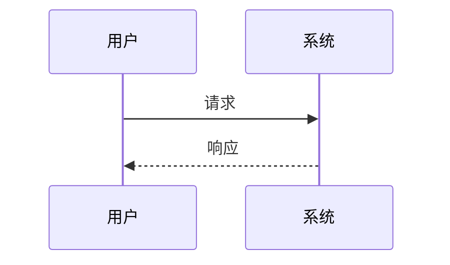
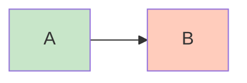

# Mermaid 错误诊断

## 测试 1: 基础流程图

```mermaid
graph LR
    A --> B
```

## 测试 2: 带中文

```mermaid
graph LR
    A[开始] --> B[结束]
```

## 测试 3: subgraph

```mermaid
graph TB
    subgraph "测试"
        A --> B
    end
```

## 测试 4: 复杂 subgraph（来自 ch01）

```mermaid
graph TB
    subgraph "输入层"
        User[用户消息]
        Cmd[命令行参数]
    end
    
    subgraph "核心"
        Config[配置解析]
    end
    
    User --> Config
    Cmd --> Config
```

## 测试 5: sequenceDiagram

```mermaid
sequenceDiagram
    participant A as 用户
    participant B as 系统
    A->>B: 请求
    B-->>A: 响应
```

## 测试 6: 带 style

```mermaid
graph LR
    A --> B
    style A fill:#c8e6c9
    style B fill:#ffccbc
```
