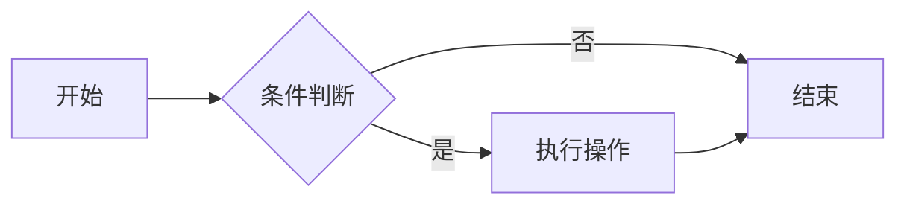
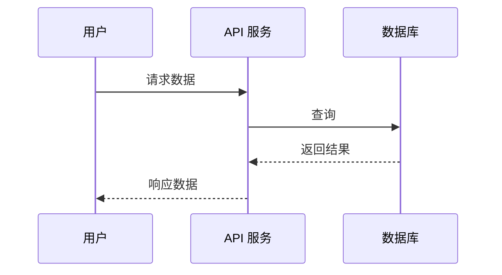
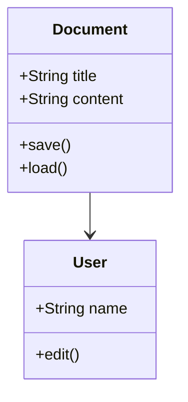
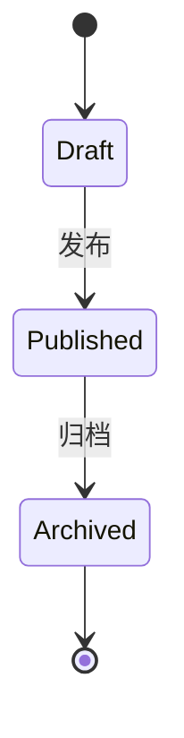

# Mermaid 图表测试

> 审阅日期：2026-10-08。状态：测试夹具静态检查，未在 Docute/浏览器中运行。测试成功需覆盖首次加载、切页、后退和重新进入，不能仅凭代码块存在认定支持。

## 1. 流程图

```mermaid
graph LR
    A[开始] --> B{条件判断}
    B -->|是 | C[执行操作]
    B -->|否 | D[结束]
    C --> D
```

## 2. 时序图

```mermaid
sequenceDiagram
    participant User as 用户
    participant API as API 服务
    participant DB as 数据库
    
    User->>API: 请求数据
    API->>DB: 查询
    DB-->>API: 返回结果
    API-->>User: 响应数据
```

## 3. 类图

```mermaid
classDiagram
    class Document {
        +String title
        +String content
        +save()
        +load()
    }
    class User {
        +String name
        +edit()
    }
    Document --> User
```

## 4. 状态图

```mermaid
stateDiagram-v2
    [*] --> Draft
    Draft --> Published: 发布
    Published --> Archived: 归档
    Archived --> [*]
```
