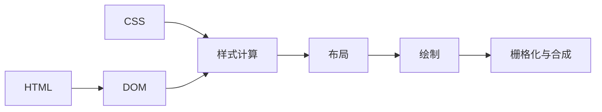

# 浏览器渲染：从 DOM 与样式到屏幕

> 核查日期：2026-10-08。状态：教学模型，未对某个引擎源码逐行验证。

## 1. 常见阶段

图表示依赖，不要求浏览器总是完整、串行执行。解析可以增量进行，脚本和资源加载会影响进度，引擎内部数据结构也可能不同。

## 2. 阶段含义

布局计算盒几何，绘制生成绘制内容，栅格化与合成最终形成画面。DOM 节点与渲染对象不是一一对应；display:none、伪元素、匿名盒都会影响关系。

## 3. 更新

状态变化后可跳过不受影响的阶段。不要把每次 render、DOM 写入、布局和绘制视为同一个动作。React 的 render 与浏览器渲染尤其需要区分。

## 4. 验证练习

修改文字、背景色和 transform，分别观察 Performance 中出现哪些阶段。说明为什么相同 CSS 属性在不同内容和图层条件下成本可能不同。

## 5. 继续阅读

- [布局与绘制的成本](reflow-repaint.md)
