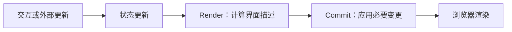

# React：组件、状态、渲染与副作用

> 适用：React 18/19 的常用客户端模型；核查日期：2026-10-08。
> 状态：官方资料对照，示例静态审阅；本仓库未安装或运行 React 示例。

## 1. 导读

React 用组件描述 UI。理解时先分开三个问题：数据放在哪里、更新如何产生新 UI 描述、何时与外部系统同步。React 组件不是自动带有完整合法转换约束的有限状态机；复杂流程仍需要显式建模。

## 2. 核心模型



Render 不等于 DOM 必然改变，也不等于浏览器已经绘制。虚拟 DOM 是描述与协调的一部分，不保证任意场景比手写 DOM 更快，更不保证求得数学意义的全局最少编辑。

## 3. 函数组件可以有状态

```jsx
import { useState } from "react";

export function AnswerCard({ answer }) {
  const [visible, setVisible] = useState(false);
  return (
    <section>
      <button type="button" onClick={() => setVisible(v => !v)}
        aria-expanded={visible}>
        {visible ? "隐藏答案" : "显示答案"}
      </button>
      {visible && <p>{answer}</p>}
    </section>
  );
}
```

函数组件使用 Hooks 管理状态、引用及外部同步。旧文“函数组件无状态、无法用 ref”属于 Hooks 之前的历史认知，不适用于现代 React。

## 4. 状态快照与身份

一次渲染里的变量不会因为调用 setter 而立即原地改变。依赖前值的更新可使用 updater 函数。对象和数组需要避免直接修改现有状态。

组件类型、位置与 key 参与身份判断。更换 key 可以重置状态，但随机 key 会造成反复卸载和挂载。列表 key 应稳定且在同级唯一。

## 5. Effect 的边界

Effect 用于与外部系统同步，例如订阅或连接；能够由 props/state 直接计算的值通常不需要额外 Effect。清理函数要与建立资源对应：解绑监听、关闭连接、取消或忽略过期结果。

开发模式 Strict Mode 的额外检查可以暴露不对称清理，不能据此断言生产一定执行两次。异步竞态仍需要请求标识、取消信号与结果时效判断。

## 6. 入口与旧 API

客户端入口通常由框架管理，独立示例使用 react-dom/client 的 createRoot；服务端已输出 HTML 时需要对应的 hydration 入口。旧 ReactDOM.render 与早期 componentWill* 生命周期只适合历史迁移阅读，不作为新代码模板。

类组件仍能出现在现有项目中；PureComponent 做浅比较，不能弥补直接修改对象的错误。不要为了“现代化”无差别重写所有类组件。

## 7. 方案选择

| 需求 | 起点 | 何时升级 |
| --- | --- | --- |
| 单卡片显示/隐藏 | useState | 多事件约束出现 |
| 复杂本地状态更新 | useReducer | 跨页面共享 |
| 远端数据缓存 | 专门的数据请求与缓存层 | 复杂失效和离线策略 |
| 取消、重试、审批流程 | 显式状态与事件 | 层级并发复杂时评估状态机 |

库的引入需要实际复杂度证据，不能仅因为 AI 能生成更多代码就增加层次。

## 8. 练习与验收

连续点击、切换卡片、重新挂载、慢请求后切页：检查状态是否属于正确组件。分别解释组件函数再次执行、DOM 变更和浏览器绘制的区别。

## 9. 来源与修订

本次纠正无状态函数组件、唯一根 DOM、旧入口和虚拟 DOM 性能保证等表述；不再把旧源码片段当作当前内部实现。

- [Render and Commit](https://react.dev/learn/render-and-commit)
- [useState](https://react.dev/reference/react/useState)
- [useEffect](https://react.dev/reference/react/useEffect)
- [createRoot](https://react.dev/reference/react-dom/client/createRoot)
