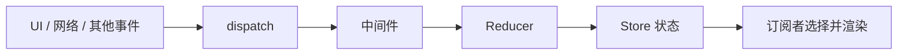

# Redux：事件、Reducer 与状态所有权

> 核查日期：2026-10-08。适用：Redux 核心模型及 Redux Toolkit 推荐用法。
> 状态：官方说明核查；未安装依赖或运行示例。

## 1. 核心结论

Redux 提供集中、可预测的状态更新机制。Action 描述发生的事，Reducer 根据旧状态和 Action 计算新状态。Action 可以来自 UI、网络、定时器或其他逻辑，不是只能由 View 发出。

一个应用通常使用一个 store，但“技术上只能有一个 store”不正确。也没有要求把输入框临时状态和所有远端缓存都放进 Redux。

## 2. 工作机制



Reducer 不直接执行网络、随机数或当前时间读取。需要的外部结果通过事件传入，让更新过程可测试。

## 3. 最小模型

```js
function reducer(state = { count: 0 }, action) {
  if (action.type === "counter/incremented") {
    return { ...state, count: state.count + 1 };
  }
  return state;
}
```

未知事件返回原引用是合法且有益的；不是每次都必须复制出新对象。浅复制也不能自动保护嵌套状态。

## 4. 现代用法

Redux 官方推荐 Redux Toolkit。configureStore 减少配置，createSlice 整合 Action 与 Reducer 定义；其 Immer 支持的 draft 写法不能推广成“任意位置可以修改 store 对象”。

异步请求可根据需求使用 thunk、listener middleware 或 RTK Query 等机制。比较时分清客户端业务状态、远端缓存和流程状态，避免每层保存一份相同真相。

## 5. 状态与 UI 不是双射

多个状态可能渲染相同界面；相同 store 状态也可能受路由、props 和环境影响。可预测性依赖完整输入和纯更新逻辑，不能从一个截图倒推出唯一 store。

Redux 也不是默认限制所有非法转换的状态机。要保证“未审批不可发布”，仍需在领域逻辑、状态转换和服务端授权处表达规则。

## 6. 练习

为“卡片加载成功”事件定义数据；说明 requestId 应怎样防止旧请求覆盖新请求。写三条 Reducer 测试：未知事件返回原状态、正常更新、过期结果不更新。

## 7. 来源

- [Redux Toolkit 是官方推荐的 Redux 使用方式](https://redux.js.org/introduction/why-rtk-is-redux-today)
