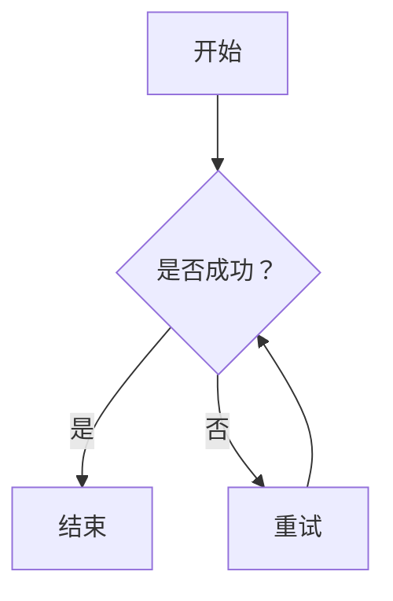
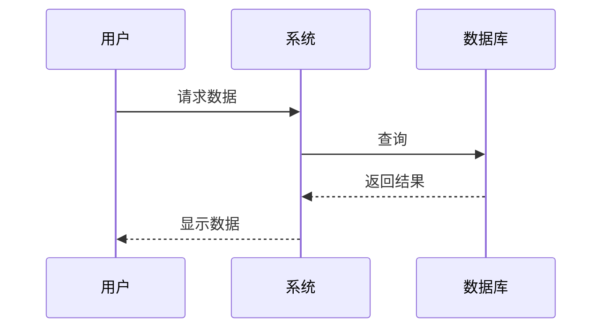
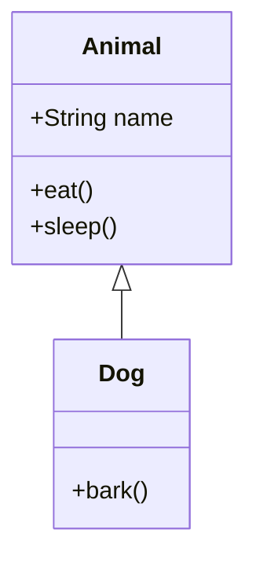

# Mermaid 测试

## 流程图示例

```mermaid
graph TD
    A[开始] --> B{是否成功？}
    B -->|是 | C[结束]
    B -->|否 | D[重试]
    D --> B
```

## 时序图示例

```mermaid
sequenceDiagram
    participant 用户
    participant 系统
    participant 数据库
    用户->>系统: 请求数据
    系统->>数据库: 查询
    数据库-->>系统: 返回结果
    系统-->>用户: 显示数据
```

## 类图示例

```mermaid
classDiagram
    class Animal {
        +String name
        +eat()
        +sleep()
    }
    class Dog {
        +bark()
    }
    Animal <|-- Dog
```
