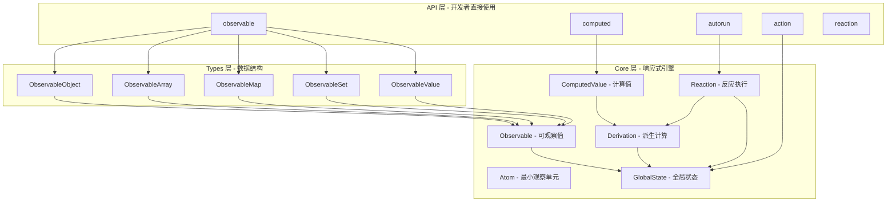
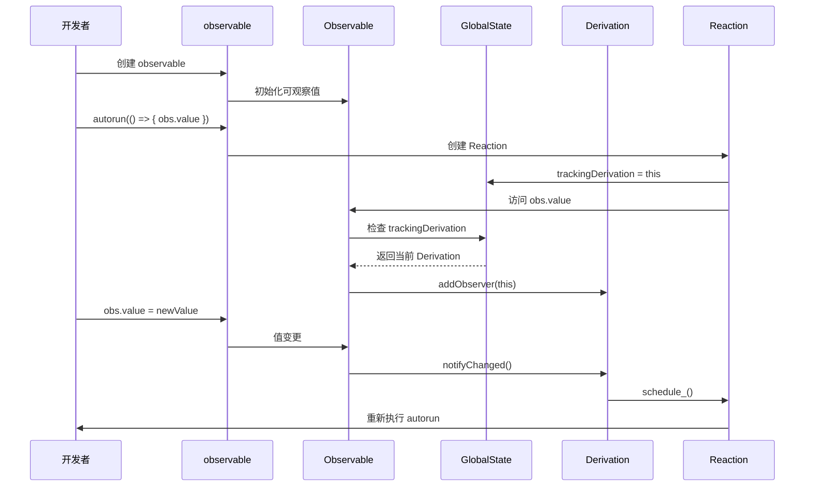
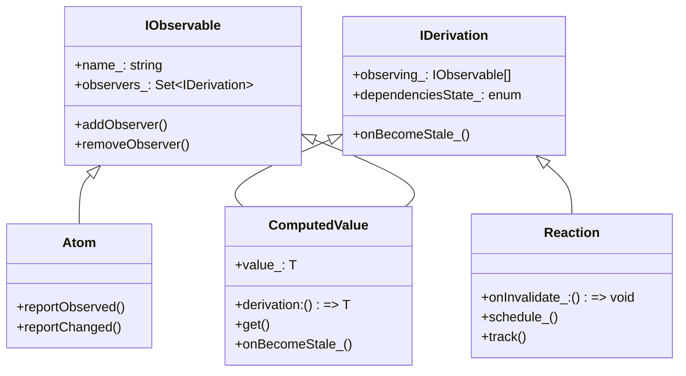

# 第 1 章 MobX 项目概览与架构

> 本章是 MobX 源码系列解析的**第 1 章**，聚焦于建立整体认知框架。我们将从项目背景、技术栈、目录结构、核心模块关系等多个维度，带你全面了解 MobX 的内部工作原理。

---

## 1. 项目背景与定位

### 1.1 什么是 MobX？

**MobX** 是一个简单、可扩展且稳定的状态管理库。它的核心理念可以用一句话概括：

> **任何可以从应用状态中派生出来的东西，都应该自动派生。**

与 Redux 的"手动订阅 - 通知"模式不同，MobX 采用**透明的函数式响应式编程 (TFRP)** 思想，让状态管理变得像 Excel 公式一样自然：

```javascript
// Excel 思维：A3 = A1 + A2
// MobX 思维：computedValue = observable1 + observable2

const state = makeAutoObservable({
  count: 0,
  get doubled() {
    return this.count * 2  // 自动追踪 count 的变化
  }
})

state.count = 5  // doubled 自动更新为 10
```

### 1.2 设计哲学

MobX 的设计哲学可以总结为三个关键词：

1. **最小认知负担** - 开发者只需关注"状态是什么"，不需要关心"如何通知更新"
2. **自动依赖追踪** - 运行时自动建立依赖关系，无需手动注册
3. **精确更新** - 只有真正依赖变化的部分才会重新计算

### 1.3 版本信息

我们分析的源码版本来自 **MobX 6.x** 主分支，这是目前最稳定的版本，主要特性：

- 全面支持 TypeScript
- 使用 Proxy 实现（兼容 ES5 降级方案）
- 支持装饰器语法（TC39 Stage 2/3）
- 模块化设计，支持 Tree-shaking

---

## 2. 技术栈概览

### 2.1 核心依赖

```json
{
  "name": "mobx",
  "version": "6.x",
  "main": "dist/index.js",
  "module": "dist/mobx.esm.js",
  "types": "dist/mobx.d.ts"
}
```

**构建工具链**：
- **Rollup** - 主打包工具，生成多种格式（UMD、ESM、CJS）
- **TypeScript** - 类型系统
- **Jest** - 测试框架
- **tsdx** - 零配置 TypeScript 打包

**运行时依赖**：
- **零外部依赖** - MobX 核心没有任何运行时依赖
- **Polyfill 要求**：`Symbol`、`Map`、`Set`（现代浏览器原生支持）

### 2.2 代码统计

```
packages/mobx/src/
├── api/      - 21 个文件，约 1,200 行
├── core/     - 8 个文件，约 1,500 行  ← 核心算法
├── types/    - 18 个文件，约 2,000 行  ← 可观察类型实现
├── utils/    - 5 个文件，约 400 行
└── 入口文件   - 3 个文件
```

**总计**：约 **5,100 行** 核心代码（不含测试）

---

## 3. 目录结构解析

### 3.1 源码目录树

```
mobx/
├── packages/
│   ├── mobx/                    # 核心包
│   │   ├── src/
│   │   │   ├── api/             # 公共 API 层
│   │   │   │   ├── observable.ts
│   │   │   │   ├── computed.ts
│   │   │   │   ├── autorun.ts
│   │   │   │   ├── action.ts
│   │   │   │   ├── reaction.ts
│   │   │   │   └── ...
│   │   │   ├── core/            # 核心算法层 ⭐
│   │   │   │   ├── observable.ts
│   │   │   │   ├── derivation.ts
│   │   │   │   ├── reaction.ts
│   │   │   │   ├── computedvalue.ts
│   │   │   │   ├── atom.ts
│   │   │   │   ├── action.ts
│   │   │   │   ├── globalstate.ts
│   │   │   │   └── spy.ts
│   │   │   ├── types/           # 数据类型层
│   │   │   │   ├── observableobject.ts
│   │   │   │   ├── observablearray.ts
│   │   │   │   ├── observablemap.ts
│   │   │   │   ├── observableset.ts
│   │   │   │   ├── observablevalue.ts
│   │   │   │   └── *annotation.ts
│   │   │   ├── utils/           # 工具层
│   │   │   │   ├── utils.ts
│   │   │   │   ├── eq.ts
│   │   │   │   ├── comparer.ts
│   │   │   │   └── global.ts
│   │   │   ├── errors.ts        # 错误定义
│   │   │   ├── internal.ts      # 内部导出（解决循环依赖）
│   │   │   └── mobx.ts          # 主入口
│   │   └── __tests__/           # 测试文件
│   ├── mobx-react/              # React 集成（旧）
│   ├── mobx-react-lite/         # React 集成（新，推荐）
│   └── mobx-undecorate/         # 装饰器转换工具
└── website/                     # 文档站点
```

### 3.2 各目录职责

| 目录 | 职责 | 关键文件 |
|------|------|----------|
| `api/` | 对外暴露的公共 API | `observable.ts`, `autorun.ts`, `action.ts` |
| `core/` | 响应式核心算法 | `derivation.ts`, `reaction.ts`, `observable.ts` |
| `types/` | 可观察数据结构实现 | `observableobject.ts`, `observablearray.ts` |
| `utils/` | 通用工具函数 | `utils.ts`, `eq.ts`, `comparer.ts` |

---

## 4. 核心模块关系图

### 4.1 架构分层



### 4.2 依赖追踪流程



### 4.3 核心类关系



---

## 5. 核心概念速查

### 5.1 三大基石

| 概念 | 英文 | 职责 | 源码位置 |
|------|------|------|----------|
| **可观察值** | Observable | 存储状态，追踪谁在观察它 | `src/core/observable.ts` |
| **派生** | Derivation | 依赖其他 observable 的计算逻辑 | `src/core/derivation.ts` |
| **反应** | Reaction | 自动执行副作用（如 UI 更新） | `src/core/reaction.ts` |

### 5.2 状态机

Derivation 有四种状态，这是 MobX 性能优化的关键：

```typescript
enum IDerivationState_ {
    NOT_TRACKING_ = -1,   // 未追踪
    UP_TO_DATE_ = 0,      // 最新（无需重新计算）⭐
    POSSIBLY_STALE_ = 1,  // 可能过期（惰性检查）⭐
    STALE_ = 2            // 已过期（必须重新计算）
}
```

**性能优化原理**：
- `UP_TO_DATE` → 直接返回缓存值
- `POSSIBLY_STALE` → 仅在访问时检查依赖
- `STALE` → 下次访问时重新计算

### 5.3 全局状态

`GlobalState` 是 MobX 的"指挥中心"，关键属性：

```typescript
class MobXGlobals {
    trackingDerivation: IDerivation | null  // 当前追踪的派生
    trackingContext: Reaction | null        // 当前反应上下文
    inBatch: number                         // 批处理计数
    pendingReactions: Reaction[]            // 待执行的反应队列
    allowStateChanges: boolean              // 是否允许状态变更
    // ... 更多配置项
}
```

---

## 6. 快速开始指南

### 6.1 最小示例

```javascript
import { makeAutoObservable } from "mobx"

class Counter {
    count = 0
    
    constructor() {
        makeAutoObservable(this)
    }
    
    increment() {
        this.count++
    }
    
    get doubled() {
        return this.count * 2
    }
}

const counter = new Counter()

// 响应式更新
autorun(() => {
    console.log(`Count: ${counter.count}, Doubled: ${counter.doubled}`)
})
// 输出：Count: 0, Doubled: 0

counter.increment()
// 输出：Count: 1, Doubled: 2
```

### 6.2 调试技巧

**启用严格模式**：
```javascript
import { configure } from "mobx"

configure({
    enforceActions: "always",      // 必须在 action 中修改状态
    computedRequiresReaction: true, // computed 必须在反应上下文中访问
    observableRequiresReaction: true // observable 必须在反应上下文中读取
})
```

**追踪依赖**：
```javascript
import { trace } from "mobx"

autorun(() => {
    console.log(counter.doubled)
    trace()  // 打印依赖链
})
```

---

## 7. 本章小结

### 7.1 关键要点

1. **MobX 是透明的响应式系统** - 自动追踪依赖，无需手动订阅
2. **三层架构** - API 层 → Core 层 → Types 层
3. **状态机优化** - 四种状态避免不必要的重新计算
4. **全局状态管理** - `GlobalState` 协调所有响应式操作

### 7.2 下章预告

**第 2 章** 我们将深入 **核心算法层**，解析：
- `Observable` 如何追踪观察者
- `Derivation` 如何建立依赖树
- `Reaction` 如何调度执行
- 批处理与事务机制

---

> **阅读建议**：本章建立了整体框架，建议先通读一遍，后续章节遇到概念时再回来查阅。源码分析不是线性阅读，而是螺旋式深入的过程。

---

**文件信息**：
- 输出路径：`/output/mobxAnalysis/ch01-introduction.md`
- 涉及源码：`packages/mobx/src/mobx.ts`, `internal.ts`, `core/*`, `api/*`
- 字数：约 3,200 字
