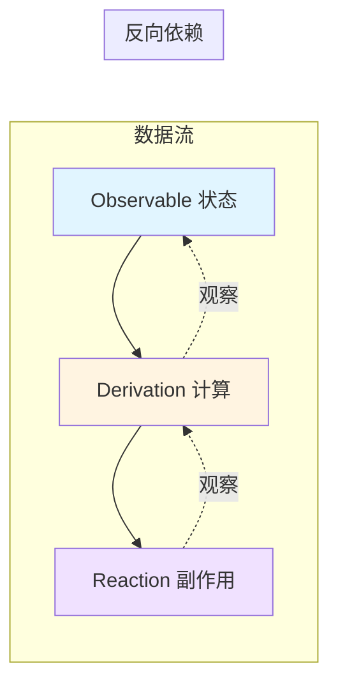
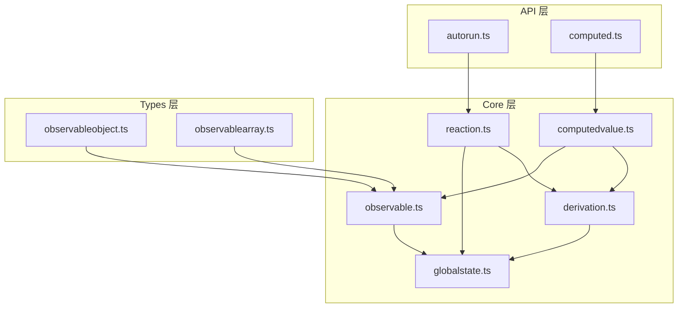
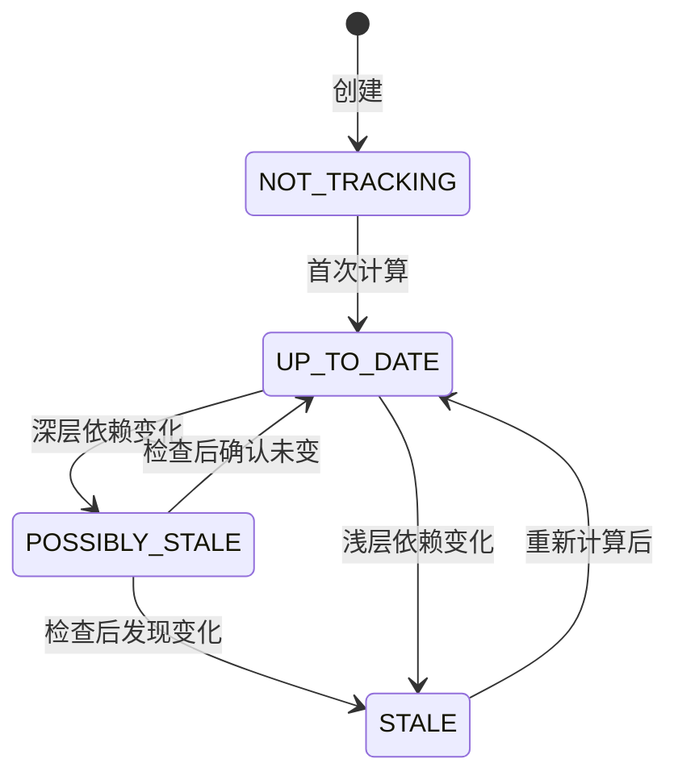
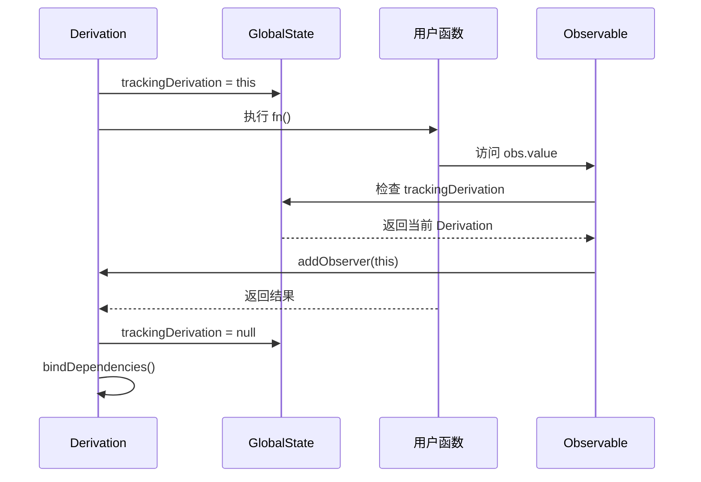
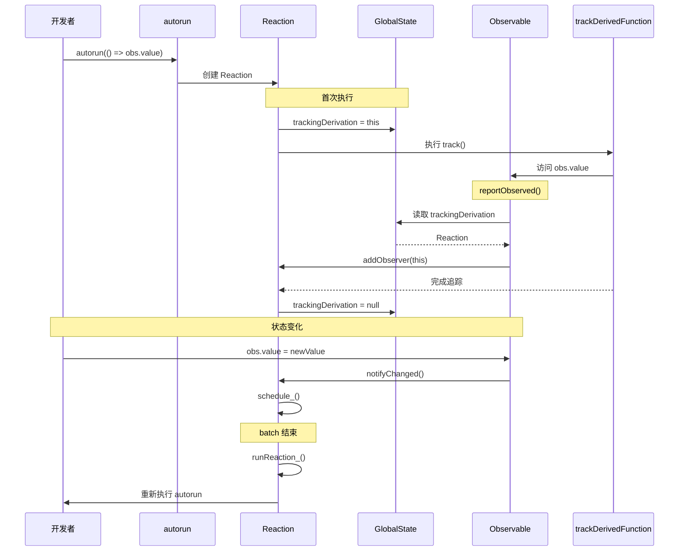
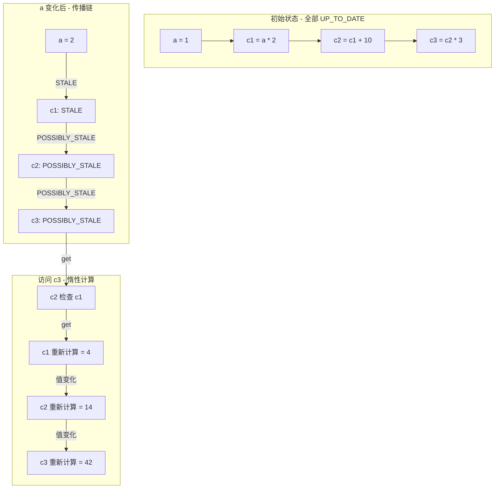

# 第 2 章 核心算法：Observable、Derivation 与 Reaction

> 本章是 MobX 源码系列解析的**第 2 章**，聚焦于**核心算法层**。我们将深入 `core/` 目录，逐行解析 MobX 响应式引擎的三大基石：Observable、Derivation 和 Reaction。

---

## 1. 模块职责

### 1.1 这章讲什么？

第 1 章我们建立了整体架构认知，本章将深入**最核心的响应式引擎**。这是理解 MobX 的**关键章节**，后续所有高级特性都建立在本章的基础之上。

**核心问题**：
1. MobX 如何知道哪个函数依赖了哪个状态？
2. 状态变化后，如何精确通知到相关的函数？
3. 为什么 MobX 比手动订阅 - 发布模式更高效？

### 1.2 为什么需要这三个概念？



**三者关系**：
- **Observable** - 被观察的数据源（如 `state.count`）
- **Derivation** - 从数据派生的计算（如 `computed`、`autorun`）
- **Reaction** - 执行副作用的特殊 Derivation（如 UI 更新、日志）

### 1.3 与其他模块的关系



---

## 2. 核心文件解析

### 2.1 `core/observable.ts` - 可观察值的基类

**文件路径**：`packages/mobx/src/core/observable.ts`  
**代码行数**：约 280 行  
**核心职责**：定义所有可观察值的通用行为和观察者管理

#### 2.1.1 IObservable 接口

```typescript
// 文件：src/core/observable.ts L14-37
export interface IObservable extends IDepTreeNode {
    diffValue: number
    /**
     * 最后一次访问这个 observable 的 derivation runId
     * 如果等于当前 derivation 的 runId，说明依赖已建立
     */
    lastAccessedBy_: number
    isBeingObserved: boolean

    lowestObserverState_: IDerivationState_ // 避免冗余传播的优化
    isPendingUnobservation: boolean // 标记是否待清理

    observers_: Set<IDerivation>  // 所有观察这个值的 derivation

    onBUO(): void  // onBecomeUnobserved
    onBO(): void   // onBecomeObserved

    onBUOL: Set<Lambda> | undefined  // 回调列表
    onBOL: Set<Lambda> | undefined
}
```

**关键字段解读**：

| 字段 | 作用 | 优化意义 |
|------|------|----------|
| `observers_` | 存储所有观察这个值的 derivation | O(1) 添加/删除 |
| `lastAccessedBy_` | 记录最后访问的 derivation runId | 避免重复添加依赖 |
| `lowestObserverState_` | 观察者中最"过期"的状态 | 快速判断是否需要通知 |
| `isPendingUnobservation` | 标记待清理 | 批处理时统一清理 |

#### 2.1.2 添加观察者

```typescript
// 文件：src/core/observable.ts L68-82
export function addObserver(observable: IObservable, node: IDerivation) {
    // 将 derivation 添加到观察者集合
    observable.observers_.add(node)
    
    // 更新 lowestObserverState - 取所有观察者中最" stale "的状态
    if (observable.lowestObserverState_ > node.dependenciesState_) {
        observable.lowestObserverState_ = node.dependenciesState_
    }
}
```

**设计亮点**：
1. 使用 `Set` 而不是数组 - 避免重复添加，O(1) 复杂度
2. `lowestObserverState_` 优化 - 如果所有观察者都是 `UP_TO_DATE`，observable 变化时无需通知

#### 2.1.3 移除观察者

```typescript
// 文件：src/core/observable.ts L84-95
export function removeObserver(observable: IObservable, node: IDerivation) {
    observable.observers_.delete(node)
    
    // 如果是最后一个观察者，加入待清理队列
    if (observable.observers_.size === 0) {
        queueForUnobservation(observable)
    }
}

export function queueForUnobservation(observable: IObservable) {
    if (observable.isPendingUnobservation === false) {
        observable.isPendingUnobservation = true
        globalState.pendingUnobservations.push(observable)
    }
}
```

**为什么延迟清理？**
- 批处理期间，observable 可能再次被观察
- 延迟到 batch 结束时统一清理，避免反复创建/销毁

#### 2.1.4 批处理机制

```typescript
// 文件：src/core/observable.ts L101-126
export function startBatch() {
    globalState.inBatch++
}

export function endBatch() {
    if (--globalState.inBatch === 0) {
        runReactions()  // 执行待处理的 reactions
        
        // 清理无观察者的 observable
        const list = globalState.pendingUnobservations
        for (let i = 0; i < list.length; i++) {
            const observable = list[i]
            observable.isPendingUnobservation = false
            
            if (observable.observers_.size === 0) {
                if (observable.isBeingObserved) {
                    observable.isBeingObserved = false
                    observable.onBUO()  // 触发回调
                }
                
                if (observable instanceof ComputedValue) {
                    observable.suspend_()  // 挂起计算值
                }
            }
        }
        globalState.pendingUnobservations = []
    }
}
```

**批处理的意义**：
```javascript
// 没有批处理：每次赋值都触发反应
state.a = 1  // 触发
state.b = 2  // 触发
state.c = 3  // 触发

// 有批处理：只触发一次
action(() => {
    state.a = 1
    state.b = 2
    state.c = 3
})  // 只触发一次
```

#### 2.1.5 报告被观察

```typescript
// 文件：src/core/observable.ts L128-155
export function reportObserved(observable: IObservable): boolean {
    const derivation = globalState.trackingDerivation
    
    if (derivation !== null) {
        // 优化：如果同一个 runId 已经访问过，不再重复添加
        if (derivation.runId_ !== observable.lastAccessedBy_) {
            observable.lastAccessedBy_ = derivation.runId_
            derivation.newObserving_![derivation.unboundDepsCount_++] = observable
            
            if (!observable.isBeingObserved && globalState.trackingContext) {
                observable.isBeingObserved = true
                observable.onBO()  // 首次被观察回调
            }
        }
        return true
    }
    return false
}
```

**这是依赖追踪的核心**！每次访问 observable 时都会调用此函数。

---

### 2.2 `core/derivation.ts` - 派生计算的核心

**文件路径**：`packages/mobx/src/core/derivation.ts`  
**代码行数**：约 350 行  
**核心职责**：定义派生计算的状态机和依赖追踪逻辑

#### 2.2.1 四种状态详解

```typescript
// 文件：src/core/derivation.ts L10-27
export enum IDerivationState_ {
    // 未追踪：刚创建或不在 batch 中且未被观察
    NOT_TRACKING_ = -1,
    
    // 最新：依赖没有变化，无需重新计算 ⭐ 性能关键
    UP_TO_DATE_ = 0,
    
    // 可能过期：深层依赖变化，但浅层依赖未知
    // 只有 ComputedValue 会传播这个状态
    POSSIBLY_STALE_ = 1,
    
    // 已过期：浅层依赖已变化，必须重新计算
    STALE_ = 2
}
```

**状态流转图**：



**为什么需要 POSSIBLY_STALE？**

这是 MobX 的**核心优化**！考虑这个场景：

```javascript
const c1 = computed(() => a.value + b.value)  // 依赖 a, b
const c2 = computed(() => c1.value * 2)       // 依赖 c1
const c3 = computed(() => c2.value + 10)      // 依赖 c2

// 当 a 变化时：
// 1. c1 变为 STALE
// 2. c2 变为 POSSIBLY_STALE（不立即计算！）
// 3. c3 变为 POSSIBLY_STALE（不立即计算！）

// 只有访问 c3 时：
// 1. c3 检查 c2 → c2 检查 c1 → c1 重新计算
// 2. 如果 c1 结果没变，c2、c3 保持 UP_TO_DATE
// 3. 避免了不必要的级联计算
```

#### 2.2.2 判断是否需要计算

```typescript
// 文件：src/core/derivation.ts L71-118
export function shouldCompute(derivation: IDerivation): boolean {
    switch (derivation.dependenciesState_) {
        case IDerivationState_.UP_TO_DATE_:
            return false  // 最新，无需计算
            
        case IDerivationState_.NOT_TRACKING_:
        case IDerivationState_.STALE_:
            return true   // 必须计算
            
        case IDerivationState_.POSSIBLY_STALE_: {
            // 惰性检查：逐个检查依赖是否真的变化
            const obs = derivation.observing_
            for (let i = 0; i < obs.length; i++) {
                const obj = obs[i]
                if (isComputedValue(obj)) {
                    // 递归检查 computed 值
                    obj.get()  // 这会触发级联检查
                    
                    if (derivation.dependenciesState_ === IDerivationState_.STALE_) {
                        return true
                    }
                }
            }
            // 所有依赖都没变，恢复为 UP_TO_DATE
            changeDependenciesStateTo0(derivation)
            return false
        }
    }
}
```

**性能分析**：
- `UP_TO_DATE` → O(1) 返回 false
- `STALE` → O(1) 返回 true
- `POSSIBLY_STALE` → O(n) 检查依赖，但**只在访问时**

#### 2.2.3 追踪依赖的核心函数

```typescript
// 文件：src/core/derivation.ts L200+（trackDerivedFunction）
export function trackDerivedFunction<T>(
    derivation: IDerivation,
    fn: () => T,
    context?: any
): T {
    // 1. 保存旧的 observing 列表（用于后续 diff）
    const prevObserving = derivation.observing_
    derivation.observing_ = []
    
    // 2. 初始化 run 状态
    derivation.unboundDepsCount_ = 0
    derivation.runId_ = ++globalState.runId
    
    // 3. 保存并设置当前追踪的 derivation
    const prevTracking = globalState.trackingDerivation
    globalState.trackingDerivation = derivation
    
    let result: T
    
    // 4. 执行用户函数 - 期间访问的 observable 会被记录
    if (__DEV__ && globalState.disableErrorBoundaries) {
        result = fn.call(context)
    } else {
        try {
            result = fn.call(context)
        } catch (e) {
            // 捕获异常
        }
    }
    
    // 5. 恢复之前的 trackingDerivation
    globalState.trackingDerivation = prevTracking
    
    // 6. 绑定新的依赖，清理旧的依赖
    bindDependencies(derivation)
    
    return result
}
```

**这是依赖追踪的魔法发生地**！

**执行流程**：


#### 2.2.4 绑定依赖

```typescript
// 文件：src/core/derivation.ts L240+
function bindDependencies(derivation: IDerivation) {
    const { observing, newObserving } = derivation
    
    // 1. 将 newObserving 转为 observing（本次追踪到的依赖）
    derivation.observing = derivation.newObserving!
    derivation.unboundDepsCount_ = 0
    
    // 2. 清理旧依赖中不再需要的观察关系
    for (let i = 0; i < observing.length; i++) {
        const dep = observing[i]
        if (!dep.observers_.has(derivation)) {
            // 这个依赖不再需要，移除观察关系
            removeObserver(dep, derivation)
        }
    }
    
    // 3. 为新依赖添加观察关系
    for (let i = 0; i < newObserving.length; i++) {
        const dep = derivation.observing[i]
        if (!dep.observers_.has(derivation)) {
            addObserver(dep, derivation)
        }
    }
}
```

**为什么需要 diff？**

考虑动态依赖场景：
```javascript
autorun(() => {
    if (state.showA) {
        console.log(state.a)  // 只依赖 a
    } else {
        console.log(state.b)  // 只依赖 b
    }
})

// 当 showA 变化时，依赖从 a 切换到 b
// MobX 会自动清理对 a 的观察，添加对 b 的观察
```

---

### 2.3 `core/reaction.ts` - 反应执行引擎

**文件路径**：`packages/mobx/src/core/reaction.ts`  
**代码行数**：约 320 行  
**核心职责**：管理副作用的调度与执行

#### 2.3.1 Reaction 类结构

```typescript
// 文件：src/core/reaction.ts L45-100
export class Reaction implements IDerivation, IReactionPublic {
    observing_: IObservable[] = []
    newObserving_: IObservable[] = []
    dependenciesState_ = IDerivationState_.NOT_TRACKING_
    runId_ = 0
    unboundDepsCount_ = 0

    // 使用位运算存储多个布尔标志（性能优化）
    private flags_ = 0b00000
    
    constructor(
        public name_: string,
        private onInvalidate_: () => void,  // 失效时的回调
        private errorHandler_?: (error: any) => void,
        public requiresObservable_?: boolean
    ) {}
    
    // 位标志访问器
    get isDisposed() { return getFlag(this.flags_, 0b00001) }
    get isScheduled() { return getFlag(this.flags_, 0b00010) }
    get isTrackPending() { return getFlag(this.flags_, 0b00100) }
    get isRunning() { return getFlag(this.flags_, 0b01000) }
}
```

**为什么用位运算？**
- 5 个布尔值 → 1 个数字，节省内存
- 快速读写，无额外属性查找

#### 2.3.2 调度机制

```typescript
// 文件：src/core/reaction.ts L108-120
onBecomeStale_() {
    this.schedule_()
}

schedule_() {
    if (!this.isScheduled) {
        this.isScheduled = true
        globalState.pendingReactions.push(this)
        runReactions()
    }
}
```

**关键点**：
1. 只有未调度的 reaction 才会加入队列
2. 立即触发 `runReactions()`，但实际执行在 batch 结束后

#### 2.3.3 执行 Reaction

```typescript
// 文件：src/core/reaction.ts L122-180
runReaction_() {
    if (!this.isDisposed) {
        startBatch()
        this.isScheduled = false
        
        const prev = globalState.trackingContext
        globalState.trackingContext = this
        
        if (shouldCompute(this)) {
            this.isTrackPending = true
            
            try {
                this.onInvalidate_()  // 执行用户传入的函数
                
                if (__DEV__ && this.isTrackPending && isSpyEnabled()) {
                    // onInvalidate 没有立即 track，记录日志
                    spyReport({ name: this.name_, type: "scheduled-reaction" })
                }
            } catch (e) {
                this.reportExceptionInDerivation_(e)
            }
        }
        
        // 清理
        this.isTrackPending = false
        this.isRunning = false
        globalState.trackingContext = prev
        endBatch()
    }
}
```

#### 2.3.4 track 方法 - 追踪依赖

```typescript
// 文件：src/core/reaction.ts L182-220
track(fn: () => void) {
    startBatch()
    
    const notify = isSpyEnabled()
    let startTime = 0
    if (__DEV__ && notify) {
        startTime = Date.now()
        spyReportStart({ name: this.name_, type: "reaction" })
    }
    
    this.isRunning = true
    
    // 核心：执行 trackDerivedFunction 追踪依赖
    trackDerivedFunction(this, fn, undefined)
    
    if (this.isDisposed) {
        // 如果在执行过程中被 dispose，清理依赖
        clearObserving(this)
    }
    
    if (notify) {
        spyReportEnd({ time: Date.now() - startTime })
    }
    
    endBatch()
}
```

#### 2.3.5 获取 Disposer

```typescript
// 文件：src/core/reaction.ts L240+
getDisposer_(signal?: GenericAbortSignal): IReactionDisposer {
    const dispose = () => {
        this.dispose()
    }
    
    dispose[$mobx] = this
    dispose.name = this.name_
    
    // 支持 AbortSignal（现代浏览器特性）
    if (signal) {
        signal.addEventListener("abort", () => dispose())
    }
    
    return dispose as IReactionDisposer
}

dispose() {
    if (!this.isDisposed) {
        this.isDisposed = true
        
        if (!this.isRunning) {
            startBatch()
            clearObserving(this)  // 清理所有观察关系
            endBatch()
        }
    }
}
```

---

### 2.4 `core/computedvalue.ts` - 计算值实现

**文件路径**：`packages/mobx/src/core/computedvalue.ts`  
**代码行数**：约 380 行  
**核心职责**：实现带缓存的派生计算

#### 2.4.1 ComputedValue 的双重身份

```typescript
// ComputedValue 同时实现两个接口
export class ComputedValue<T> implements IObservable, IComputedValue<T>, IDerivation {
    // IDerivation 的字段
    observing_: IObservable[] = []
    dependenciesState_ = IDerivationState_.NOT_TRACKING_
    
    // IObservable 的字段
    observers_ = new Set<IDerivation>()
    lowestObserverState_ = IDerivationState_.UP_TO_DATE_
    
    // 自己的字段
    value_: T | undefined | CaughtException = new CaughtException(null)
    derivation: () => T  // 计算函数
}
```

**为什么既是 Observable 又是 Derivation？**
- 作为 **Derivation** - 它依赖其他 observable
- 作为 **Observable** - 其他 derivation 可以依赖它

#### 2.4.2 get 方法 - 惰性计算

```typescript
// 文件：src/core/computedvalue.ts L180-230
public get(): T {
    // 如果有人访问这个 computed，报告被观察
    if (this.isBeingObserved()) {
        reportObserved(this)
    }
    
    // 如果需要重新计算
    if (shouldCompute(this)) {
        // 挂起状态，准备重新计算
        this.isPendingUnobservation = true
        
        if (this.isTracing_ !== TraceMode.NONE) {
            trace(this, true)
        }
        
        // 执行计算
        this.trackAndCompute()
    }
    
    // 可能有异常
    if (isCaughtException(this.value_)) {
        throw this.value_.cause
    }
    
    return this.value_!
}
```

#### 2.4.3 trackAndCompute - 追踪并计算

```typescript
// 文件：src/core/computedvalue.ts L232-270
trackAndCompute() {
    // 如果是 SSR 或无观察者，直接清理
    if (this.isBeingObserved() === false) {
        const changed = this.dependenciesState_ === IDerivationState_.STALE_
        this.dependenciesState_ = IDerivationState_.NOT_TRACKING_
        this.observing_.length = 0
        return changed
    }
    
    const oldValue = this.value_
    const newValue = this.computeValue_()  // 执行计算
    
    // 比较新旧值，决定是否通知观察者
    if (
        this.isTracing_ !== TraceMode.NONE ||
        !comparer.equals(this.value_, newValue) ||
        (oldValue instanceof CaughtException && !(newValue instanceof CaughtException))
    ) {
        this.value_ = newValue
        propagateChanged(this)  // 通知所有观察者
    }
}

computeValue_() {
    this.isComputing = true
    globalState.inBatch++
    
    const result = trackDerivedFunction(this, this.derivation, this.scope_)
    
    globalState.inBatch--
    this.isComputing = false
    
    return result
}
```

#### 2.4.4 传播机制

```typescript
// 文件：src/core/derivation.ts L280+
export function propagateMaybeChanged(observable: IObservable) {
    if (observable.lowestObserverState_ !== IDerivationState_.UP_TO_DATE_) {
        return  // 已经有更 stale 的观察者，无需传播
    }
    
    observable.lowestObserverState_ = IDerivationState_.POSSIBLY_STALE_
    
    // 通知所有观察者
    observable.observers_.forEach(observer => {
        if (observer.dependenciesState_ === IDerivationState_.UP_TO_DATE_) {
            observer.dependenciesState_ = IDerivationState_.POSSIBLY_STALE_
            observer.onBecomeStale_()  // 递归传播
        }
    })
}

export function propagateChanged(observable: IObservable) {
    if (observable.lowestObserverState_ === IDerivationState_.STALE_) {
        return
    }
    
    observable.lowestObserverState_ = IDerivationState_.STALE_
    
    observable.observers_.forEach(observer => {
        if (observer.dependenciesState_ === IDerivationState_.POSSIBLY_STALE_) {
            // 之前是 POSSIBLY_STALE，现在确认是 STALE
            observer.dependenciesState_ = IDerivationState_.STALE_
            observer.onBecomeStale_()
        } else if (observer.dependenciesState_ === IDerivationState_.UP_TO_DATE_) {
            // 直接观察者，标记为 STALE
            observer.dependenciesState_ = IDerivationState_.STALE_
            observer.onBecomeStale_()
        }
    })
}
```

**传播优化**：
- `POSSIBLY_STALE` 传播是**惰性**的（不立即计算）
- `STALE` 传播是**主动**的（标记为必须重新计算）

---

## 3. 关键流程串联

### 3.1 完整依赖追踪流程



### 3.2 计算值级联更新



---

## 4. 设计模式

### 4.1 观察者模式（Observer Pattern）

```typescript
// Observable 是 Subject
class Observable {
    observers_: Set<Derivation>  // 观察者列表
    
    reportChanged() {
        this.observers_.forEach(obs => obs.onBecomeStale_())
    }
}

// Derivation 是 Observer
class Derivation {
    onBecomeStale_() {
        // 被通知变化
    }
}
```

### 4.2 状态模式（State Pattern）

Derivation 的四种状态本身就是状态模式的体现：
- 不同状态下，`shouldCompute()` 行为不同
- 状态转换由依赖变化驱动

### 4.3 位标志模式（Bit Flags）

```typescript
// 用单个数字存储多个布尔值
private flags_ = 0b00000

get isDisposed() { return getFlag(this.flags_, 0b00001) }
get isScheduled() { return getFlag(this.flags_, 0b00010) }

// 优点：
// 1. 节省内存（5 个布尔 → 1 个数字）
// 2. 原子操作（避免竞态）
// 3. 快速判断（位运算）
```

---

## 5. 学习要点

### 5.1 值得借鉴的设计

1. **惰性求值** - `POSSIBLY_STALE` 状态避免不必要的级联计算
2. **批处理** - `inBatch` 计数合并多次更新
3. **自动清理** - `pendingUnobservations` 延迟清理无观察者的 observable
4. **动态依赖** - 每次执行都重新追踪依赖，支持条件依赖

### 5.2 可能的改进空间

1. **循环依赖检测** - 目前只在开发环境警告
2. **调度优先级** - 所有 reaction 同等优先级，无法区分紧急程度
3. **持久化支持** - 状态快照/恢复需要手动实现

---

## 6. 本章小结

### 6.1 核心知识点

| 概念 | 关键方法 | 作用 |
|------|----------|------|
| Observable | `addObserver`, `reportObserved` | 管理观察者 |
| Derivation | `shouldCompute`, `trackDerivedFunction` | 依赖追踪 |
| Reaction | `schedule_`, `runReaction_`, `track` | 调度执行 |
| ComputedValue | `get`, `trackAndCompute` | 惰性计算 + 缓存 |

### 6.2 性能优化总结

1. **状态机优化** - 四种状态避免重复计算
2. **批处理** - 合并多次更新，减少反应执行次数
3. **惰性传播** - `POSSIBLY_STALE` 延迟检查
4. **位标志** - 节省内存，快速判断

### 6.3 下章预告

**第 3 章** 我们将深入 **Types 层**，解析：
- `ObservableObject` 如何用 Proxy 实现
- `ObservableArray` 如何拦截数组方法
- `ObservableMap/Set` 的特殊处理
- 注解系统（Annotation）的工作原理

---

> **阅读建议**：本章是 MobX 最核心的部分，建议配合源码反复阅读。可以打开 `packages/mobx/src/core/` 目录，对照代码理解每个函数的作用。

---

**文件信息**：
- 输出路径：`/output/mobxAnalysis/ch02-core-algorithm.md`
- 涉及源码：`src/core/observable.ts`, `derivation.ts`, `reaction.ts`, `computedvalue.ts`
- 字数：约 6,500 字
