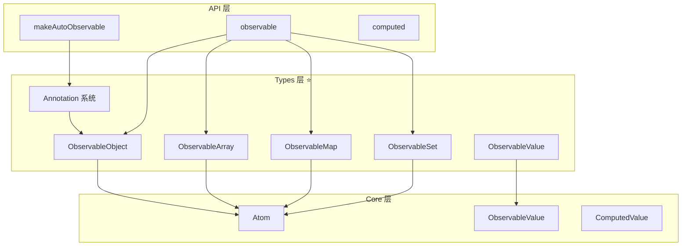
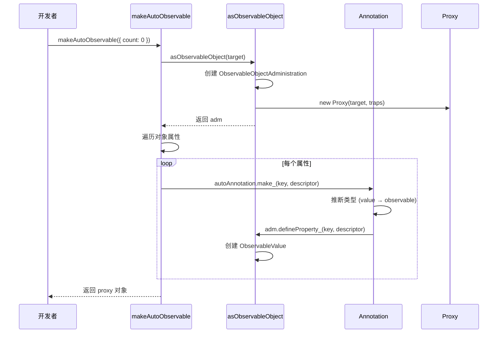
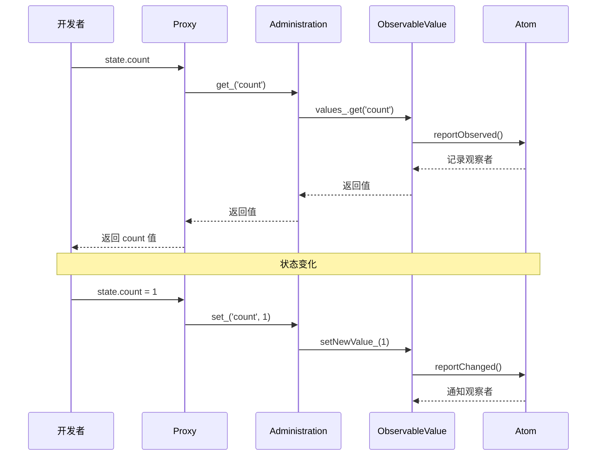
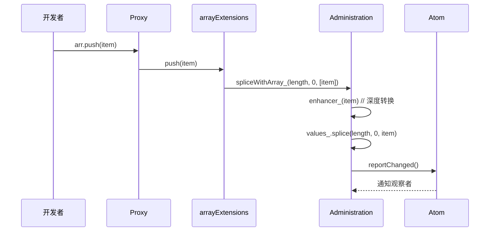

# 第 3 章 数据类型层：ObservableObject、Array、Map、Set 与注解系统

> 本章是 MobX 源码系列解析的**第 3 章**，聚焦于**Types 层**。我们将深入解析 MobX 如何将普通 JavaScript 数据结构（对象、数组、Map、Set）转换为可观察的响应式结构，以及注解系统的工作原理。

---

## 1. 模块职责

### 1.1 这章讲什么？

第 2 章我们理解了核心算法（Observable、Derivation、Reaction），本章将深入**数据类型实现层**。这是开发者最直接接触的部分，因为日常使用中我们主要操作的就是：

```javascript
const state = makeAutoObservable({
    count: 0,           // observable 值
    items: [],          // observable 数组
    user: null,         // observable 对象
    tags: new Set(),    // observable Set
    meta: new Map()     // observable Map
})
```

**核心问题**：
1. MobX 如何拦截对象的属性访问？
2. 数组方法（push、pop、splice）如何被追踪？
3. 注解系统如何自动推断类型（getter → computed，function → action）？
4. Proxy 和 ES5 降级方案有何区别？

### 1.2 为什么需要这一层？

Core 层提供了基础的 Observable 和 Derivation 机制，但开发者需要的是**高层抽象**：

```typescript
// Core 层（太底层）
const atom = new Atom("count")
atom.reportObserved()
atom.reportChanged()

// Types 层（易用）
const state = makeAutoObservable({ count: 0 })
state.count++  // 自动追踪
```

### 1.3 与其他模块的关系



---

## 2. 核心文件解析

### 2.1 `types/observableobject.ts` - 可观察对象

**文件路径**：`packages/mobx/src/types/observableobject.ts`  
**代码行数**：约 720 行  
**核心职责**：实现对象的响应式代理

#### 2.1.1 ObservableObjectAdministration 类

这是可观察对象的"管理员"，每个 observable 对象都有一个：

```typescript
// 文件：src/types/observableobject.ts L85-110
export class ObservableObjectAdministration
    implements IInterceptable<IObjectWillChange>, IListenable
{
    keysAtom_: IAtom  // 追踪对象 key 的变化
    changeListeners_  // 变更监听器
    interceptors_     // 拦截器
    proxy_: any       // Proxy 代理对象
    isPlainObject_: boolean
    appliedAnnotations_?: object  // 已应用的注解
    private pendingKeys_: Map<PropertyKey, ObservableValue<boolean>>

    constructor(
        public target_: any,  // 原始对象
        public values_ = new Map<PropertyKey, ObservableValue<any> | ComputedValue<any>>(),
        public name_: string,
        public defaultAnnotation_: Annotation = autoAnnotation
    ) {
        this.keysAtom_ = new Atom(__DEV__ ? `${this.name_}.keys` : "ObservableObject.keys")
        this.isPlainObject_ = isPlainObject(this.target_)
    }
}
```

**关键设计**：
- `values_` - 存储每个属性的 observable 包装器
- `proxy_` - Proxy 代理，拦截所有属性访问
- `keysAtom_` - 专门追踪 `Object.keys()` 等操作

#### 2.1.2 Proxy 拦截器

```typescript
// 文件：src/types/observableobject.ts L650+
const objectTraps = {
    get(target, name) {
        const adm = target[$mobx]
        
        // 访问 $mobx 符号，返回 administration
        if (name === $mobx) {
            return adm
        }
        
        // 访问普通属性
        return adm.get_(name)
    },
    
    set(target, name, value) {
        const adm = target[$mobx]
        return adm.set_(name, value)
    },
    
    has(target, name) {
        const adm = target[$mobx]
        return adm.has_(name)
    },
    
    ownKeys(target) {
        const adm = target[$mobx]
        adm.keysAtom_.reportObserved()  // 追踪 keys 访问
        return Reflect.ownKeys(target)
    },
    
    getOwnPropertyDescriptor(target, name) {
        const adm = target[$mobx]
        return adm.getOwnPropertyDescriptor_(name)
    },
    
    defineProperty(target, name, descriptor) {
        const adm = target[$mobx]
        return adm.defineProperty_(name, descriptor)
    },
    
    deleteProperty(target, name) {
        const adm = target[$mobx]
        return adm.delete_(name)
    }
}
```

**拦截点分析**：

| 陷阱 | 触发场景 | MobX 处理 |
|------|----------|----------|
| `get` | `obj.prop` | 报告被观察，返回 observable 值 |
| `set` | `obj.prop = val` | 更新 observable 值，通知观察者 |
| `has` | `prop in obj` | 追踪 key 存在性 |
| `ownKeys` | `Object.keys(obj)` | 通过 `keysAtom` 追踪 |
| `deleteProperty` | `delete obj.prop` | 删除 observable，通知观察者 |

#### 2.1.3 get_ 方法 - 属性读取

```typescript
// 文件：src/types/observableobject.ts L145+
getObservablePropValue_(key: PropertyKey): any {
    return this.values_.get(key)!.get()  // 调用 ObservableValue.get()
}

get_(key: PropertyKey): any {
    // 如果 key 不存在但在追踪中，订阅 has 变化
    if (globalState.trackingDerivation && !hasProp(this.target_, key)) {
        this.has_(key)
    }
    return this.target_[key]
}
```

#### 2.1.4 set_ 方法 - 属性写入

```typescript
// 文件：src/types/observableobject.ts L155+
set_(key: PropertyKey, value: any, proxyTrap: boolean = false): boolean | null {
    // 1. 检查是否是已存在的 observable 属性
    if (hasProp(this.target_, key)) {
        if (this.values_.has(key)) {
            // Observable 属性，更新值
            return this.setObservablePropValue_(key, value)
        }
    }
    
    // 2. 新属性，应用注解
    const annotation = this.getAnnotation_(key)
    if (annotation) {
        return annotation.extend_(this, key, { value }, proxyTrap)
    }
    
    // 3. 无注解，直接定义属性
    return this.defineProperty_(key, { value, writable: true, configurable: true }, proxyTrap)
}
```

#### 2.1.5 创建 observable 对象

```typescript
// 文件：src/types/observableobject.ts L350+
export function asObservableObject(
    target: any,
    options?: CreateObservableOptions
): ObservableObjectAdministration {
    // 如果已经是 observable，直接返回
    if (isObservableObject(target)) {
        return target[$mobx]
    }
    
    const name = options?.name || (__DEV__ ? target.constructor.name + "@" + getNextId() : "ObservableObject")
    
    // 创建 administration
    const adm = new ObservableObjectAdministration(
        target,
        new Map(),
        name,
        options?.defaultDecorator as Annotation || autoAnnotation
    )
    
    // 创建 Proxy
    if (globalState.useProxies) {
        adm.proxy_ = new Proxy(target, objectTraps)
    } else {
        adm.proxy_ = target  // ES5 降级
    }
    
    // 绑定 $mobx 符号
    addHiddenProp(target, $mobx, adm)
    
    return adm
}
```

---

### 2.2 `types/observablearray.ts` - 可观察数组

**文件路径**：`packages/mobx/src/types/observablearray.ts`  
**代码行数**：约 550 行  
**核心职责**：拦截数组方法，实现响应式

#### 2.2.1 ObservableArrayAdministration 类

```typescript
// 文件：src/types/observablearray.ts L105-135
export class ObservableArrayAdministration
    implements IInterceptable<IArrayWillChange | IArrayWillSplice>, IListenable
{
    atom_: IAtom
    readonly values_: any[] = []  // 真实存储（被 Proxy 代理）
    interceptors_
    changeListeners_
    enhancer_: (newV: any, oldV: any) => any
    proxy_: IObservableArray<any>
    lastKnownLength_ = 0

    constructor(
        name = __DEV__ ? "ObservableArray@" + getNextId() : "ObservableArray",
        enhancer: IEnhancer<any>,
        public owned_: boolean,
        public legacyMode_: boolean
    ) {
        this.atom_ = new Atom(name)
        this.enhancer_ = (newV, oldV) =>
            enhancer(newV, oldV, __DEV__ ? name + "[..]" : "ObservableArray[..]")
    }
}
```

#### 2.2.2 数组 Proxy 拦截

```typescript
// 文件：src/types/observablearray.ts L75-95
const arrayTraps = {
    get(target, name) {
        const adm: ObservableArrayAdministration = target[$mobx]
        
        if (name === $mobx) {
            return adm
        }
        
        if (name === "length") {
            return adm.getArrayLength_()  // 追踪 length 访问
        }
        
        if (typeof name === "string" && !isNaN(name as any)) {
            return adm.get_(parseInt(name))  // 数字索引访问
        }
        
        if (hasProp(arrayExtensions, name)) {
            return arrayExtensions[name]  // push、pop 等方法
        }
        
        return target[name]
    },
    
    set(target, name, value): boolean {
        const adm: ObservableArrayAdministration = target[$mobx]
        
        if (name === "length") {
            adm.setArrayLength_(value)
        }
        
        if (typeof name === "symbol" || isNaN(name)) {
            target[name] = value
        } else {
            adm.set_(parseInt(name), value)  // 数字索引设置
        }
        return true
    }
}
```

#### 2.2.3 数组方法实现

```typescript
// 文件：src/types/observablearray.ts L250+
const arrayExtensions = {
    clear(): any[] {
        return this.splice(0)
    },

    replace(newItems: any[]): any[] {
        const adm = this[$mobx]
        return adm.spliceWithArray_(0, this.length, newItems)
    },

    remove(value: any): boolean {
        const adm = this[$mobx]
        const index = adm.values_.indexOf(value)
        if (index > -1) {
            this.splice(index, 1)
            return true
        }
        return false
    },

    // 核心方法：splice
    splice(index: number, deleteCount: number = 0, ...newItems: any[]): any[] {
        const adm = this[$mobx]
        return adm.spliceWithArray_(index, deleteCount, newItems)
    }
}
```

#### 2.2.4 spliceWithArray_ - 核心变更方法

```typescript
// 文件：src/types/observablearray.ts L320+
spliceWithArray_(index: number, deleteCount?: number, newItems?: any[]): any[] {
    checkIfStateModificationsAreAllowed(this.atom_)
    
    const length = this.values_.length
    if (index === undefined) {
        index = 0
    } else if (index > length) {
        index = length
    } else if (index < 0) {
        index = Math.max(0, length + index)
    }
    
    deleteCount = deleteCount !== undefined ? deleteCount : length - index
    newItems = newItems ? newItems.map(this.enhancer_) : []
    
    // 通知拦截器
    if (hasInterceptors(this)) {
        // ... 拦截处理
    }
    
    // 执行实际变更
    const added = newItems
    const removed = this.values_.splice(index, deleteCount, ...newItems)
    
    // 通知观察者
    this.notifyArraySplice_(index, added, removed)
    
    return this.dehanceValues_(removed)
}

notifyArraySplice_(index: number, added: any[], removed: any[]) {
    const notify = hasListeners(this)
    const notifySpy = __DEV__ && isSpyEnabled()
    
    const change = {
        type: "splice",
        object: this.proxy_,
        debugObjectName: this.atom_.name_,
        index,
        added,
        addedCount: added.length,
        removed,
        removedCount: removed.length
    }
    
    if (notifySpy && __DEV__) {
        spyReportStart(change)
    }
    
    if (notify) {
        notifyListeners(this, change)
    }
    
    // 通知 atom 变化
    this.atom_.reportChanged()
    
    if (notifySpy && __DEV__) {
        spyReportEnd()
    }
}
```

**为什么所有数组方法都基于 splice？**
- `push` → `splice(length, 0, ...items)`
- `pop` → `splice(length - 1, 1)`
- `shift` → `splice(0, 1)`
- `unshift` → `splice(0, 0, ...items)`

统一使用 `splice` 可以：
1. 复用通知逻辑
2. 保证原子性
3. 简化拦截器实现

---

### 2.3 `types/observablemap.ts` - 可观察 Map

**文件路径**：`packages/mobx/src/types/observablemap.ts`  
**代码行数**：约 500 行  
**核心职责**：包装原生 Map，添加响应式

#### 2.3.1 ObservableMap 类

```typescript
// 文件：src/types/observablemap.ts L80+
export class ObservableMap<K = any, V = any>
    implements Map<K, V>, IInterceptable<IMapWillChange>, IListenable
{
    [$mobx] = ObservableMapMarker
    _data: Map<K, V>
    _hasMap: Map<K, ObservableValue<boolean>>  // 追踪 key 存在性
    _keysAtom: IAtom
    interceptors_
    changeListeners_
    dehancer: any

    constructor(
        initialData?: IObservableMapInitialValues<K, V>,
        public enhancer_: IEnhancer<V> = deepEnhancer,
        public name_: string = __DEV__ ? "ObservableMap@" + getNextId() : "ObservableMap"
    ) {
        this._data = new Map()
        this._hasMap = new Map()
        this._keysAtom = new Atom(__DEV__ ? `${this.name_}.keys` : "ObservableMap.keys")
        
        if (initialData) {
            this.merge(initialData)
        }
    }
}
```

**关键设计**：
- `_data` - 存储实际数据
- `_hasMap` - 为每个 key 创建一个 `ObservableValue<boolean>`，追踪 `has()` 操作
- `_keysAtom` - 追踪 `keys()`、`values()`、`entries()` 操作

#### 2.3.2 get/set 方法

```typescript
// 文件：src/types/observablemap.ts L150+
get(key: K): V | undefined {
    if (this._data.has(key)) {
        this._has(key).reportObserved()  // 追踪 has 状态
        return this._data.get(key)
    }
    this._has(key).reportObserved()  // 即使不存在也追踪
    return undefined
}

set(key: K, value: V): this {
    const hasKey = this._data.has(key)
    
    if (hasInterceptors(this)) {
        // ... 拦截处理
    }
    
    if (hasKey) {
        this._updateValue(key, value)
    } else {
        this._addValue(key, value)
    }
    
    return this
}

private _updateValue(key: K, newValue: V) {
    const observable = this._data.get(key)
    newValue = (observable as any).prepareNewValue_(newValue)
    
    if (newValue !== globalState.UNCHANGED) {
        const change = {
            type: "update",
            object: this,
            name: key,
            newValue
        }
        // ... 通知监听器
        observable.setNewValue_(newValue)
    }
}

private _addValue(key: K, newValue: V) {
    const observable = new ObservableValue(
        newValue,
        this.enhancer_,
        __DEV__ ? `${this.name_}.${stringifyKey(key)}` : "ObservableMap.key",
        false
    )
    this._data.set(key, observable)
    
    // 通知 has 变化
    this._has(key).setNewValue_(true)
    
    // 通知 keys 变化
    this._keysAtom.reportChanged()
}
```

#### 2.3.3 _has 方法 - 追踪 key 存在性

```typescript
// 文件：src/types/observablemap.ts L200+
private _has(key: K): ObservableValue<boolean> {
    let hasEntry = this._hasMap.get(key)
    
    if (!hasEntry) {
        hasEntry = new ObservableValue(
            this._data.has(key),
            referenceEnhancer,
            __DEV__ ? `${this.name_}.${stringifyKey(key)}.?` : "ObservableMap.key?",
            false
        )
        this._hasMap.set(key, hasEntry)
    }
    
    return hasEntry
}
```

**为什么需要 `_hasMap`？**

考虑这个场景：
```javascript
const map = observable.map()

autorun(() => {
    if (map.has('key')) {  // 追踪 'key' 的存在性
        console.log(map.get('key'))
    }
})

map.set('key', 'value')  // 应该触发 autorun
```

如果没有 `_hasMap`，`has('key')` 返回 `false` 时无法追踪，后续 `set` 不会触发反应。

---

### 2.4 `types/observableset.ts` - 可观察 Set

**文件路径**：`packages/mobx/src/types/observableset.ts`  
**代码行数**：约 300 行  
**核心职责**：包装原生 Set，添加响应式

实现与 ObservableMap 类似，主要方法：
- `add(value)` - 添加元素
- `delete(value)` - 删除元素
- `has(value)` - 检查存在
- `clear()` - 清空

---

### 2.5 `types/observablevalue.ts` - 可观察值包装器

**文件路径**：`packages/mobx/src/types/observablevalue.ts`  
**代码行数**：约 150 行  
**核心职责**：包装原始值为 observable

```typescript
// 文件：src/types/observablevalue.ts L40+
export class ObservableValue<T = any>
    extends Atom
    implements IObservableValue<T>, IInterceptable<IValueWillChange>, IListenable
{
    enhancer_: IEnhancer<T>
    name_: string
    value_: T | undefined

    constructor(
        value: T,
        enhancer: IEnhancer<T> = deepEnhancer,
        name = __DEV__ ? "ObservableValue@" + getNextId() : "ObservableValue",
        notifySpy = true
    ) {
        super(name)
        this.value_ = enhancer(value, undefined, name)
        this.enhancer_ = enhancer
    }

    get() {
        this.reportObserved()
        return this.value_
    }

    set(newValue: T) {
        const oldValue = this.value_
        newValue = this.prepareNewValue_(newValue)
        
        if (newValue !== globalState.UNCHANGED) {
            this.setNewValue_(newValue)
        }
    }
}
```

---

### 2.6 注解系统 - Annotation

**文件路径**：`packages/mobx/src/types/*annotation.ts`  
**核心职责**：定义属性装饰规则

#### 2.6.1 Annotation 接口

```typescript
// 文件：src/types/annotation.ts
export interface Annotation {
    annotationType_: string
    options_?: any
    make_(adm, key, descriptor, source): MakeResult
    extend_(adm, key, descriptor, proxyTrap): boolean | null
    decorate_20223_?(desc, context): any
}
```

#### 2.6.2 autoAnnotation - 自动推断

```typescript
// 文件：src/types/autoannotation.ts L25-60
function make_(
    adm: ObservableObjectAdministration,
    key: PropertyKey,
    descriptor: PropertyDescriptor,
    source: object
): MakeResult {
    // getter → computed
    if (descriptor.get) {
        return computed.make_(adm, key, descriptor, source)
    }
    
    // lone setter → action setter
    if (descriptor.set) {
        const set = createAction(key.toString(), descriptor.set)
        // ...
    }
    
    // function on proto → autoAction/flow
    if (source !== adm.target_ && typeof descriptor.value === "function") {
        if (isGenerator(descriptor.value)) {
            return flow.make_(adm, key, descriptor, source)
        }
        const actionAnnotation = this.options_?.autoBind ? autoAction.bound : autoAction
        return actionAnnotation.make_(adm, key, descriptor, source)
    }
    
    // other → observable
    let observableAnnotation = this.options_?.deep === false ? observable.ref : observable
    return observableAnnotation.make_(adm, key, descriptor, source)
}
```

**自动推断规则**：

| 属性类型 | 推断结果 |
|----------|----------|
| `get prop()` | `computed` |
| `set prop(v)` | `action` |
| `method() {}` | `autoAction` |
| `async *gen()` | `flow` |
| `value: any` | `observable` |

#### 2.6.3 observableAnnotation

```typescript
// 文件：src/types/observableannotation.ts
export const observableAnnotation: Annotation = {
    annotationType_: "observable",
    make_(adm, key, descriptor) {
        // 将属性转换为 observable
        const options = createObservableOptions(descriptor.writable)
        const adm = asObservableObject(target, options)
        adm.make_(key, descriptor)
        return MakeResult.Continue
    },
    extend_(adm, key, descriptor, proxyTrap) {
        return adm.defineProperty_(key, descriptor, proxyTrap)
    }
}
```

---

## 3. 关键流程串联

### 3.1 makeAutoObservable 完整流程



### 3.2 属性访问流程



### 3.3 数组 push 流程



---

## 4. 设计模式

### 4.1 代理模式（Proxy Pattern）

```typescript
// Proxy 作为代理，拦截所有操作
const proxy = new Proxy(target, {
    get(target, name) {
        // 添加响应式逻辑
        adm.get_(name)
    },
    set(target, name, value) {
        // 添加响应式逻辑
        adm.set_(name, value)
    }
})
```

### 4.2 适配器模式（Adapter Pattern）

ObservableMap/Set 是原生 Map/Set 的适配器：
- 保持相同 API
- 添加响应式功能

### 4.3 策略模式（Strategy Pattern）

注解系统是策略模式的体现：
- `observableAnnotation` - observable 策略
- `computedAnnotation` - computed 策略
- `actionAnnotation` - action 策略
- `autoAnnotation` - 自动推断策略

---

## 5. 学习要点

### 5.1 值得借鉴的设计

1. **Proxy 统一拦截** - 所有操作通过 Proxy 集中处理
2. **_hasMap 设计** - 巧妙解决 `has()` 的响应式追踪
3. **数组方法统一** - 所有变更基于 `splice`
4. **注解推断** - 根据属性类型自动选择装饰策略

### 5.2 ES5 降级方案

MobX 支持不使用 Proxy 的 ES5 环境：

```typescript
if (globalState.useProxies) {
    adm.proxy_ = new Proxy(target, objectTraps)
} else {
    // ES5 降级：预先定义所有属性为 observable
    Object.keys(target).forEach(key => {
        Object.defineProperty(target, key, {
            get() { return this[$mobx].get_(key) },
            set(value) { this[$mobx].set_(key, value) }
        })
    })
}
```

**限制**：
- 无法追踪新增/删除属性
- 需要预先知道所有属性

### 5.3 性能优化

1. **lazy initialization** - 只在访问时创建 observable
2. **reference enhancer** - 跳过深度转换
3. **dehancer** - 读取时解包

---

## 6. 本章小结

### 6.1 核心知识点

| 类型 | 核心类 | 关键方法 |
|------|--------|----------|
| Object | ObservableObjectAdministration | `get_`, `set_`, `defineProperty_` |
| Array | ObservableArrayAdministration | `spliceWithArray_`, `getArrayLength_` |
| Map | ObservableMap | `_has`, `_addValue`, `_updateValue` |
| Set | ObservableSet | `add`, `delete`, `has` |
| Value | ObservableValue | `get`, `set`, `prepareNewValue_` |

### 6.2 注解推断规则

```
getter → computed
setter → action
function → autoAction
generator → flow
value → observable
```

### 6.3 下章预告

**第 4 章** 我们将深入 **API 层**，解析：
- `observable()` 工厂函数的多种用法
- `autorun`、`reaction`、`when` 的区别与实现
- `action` 的批处理与事务机制
- `flow` 如何处理异步操作

---

> **阅读建议**：本章涉及大量代码细节，建议打开源码对照阅读。可以重点看 `observableobject.ts` 和 `observablearray.ts`，这是最常用的两个类型。

---

**文件信息**：
- 输出路径：`/output/mobxAnalysis/ch03-types-layer.md`
- 涉及源码：`src/types/observableobject.ts`, `observablearray.ts`, `observablemap.ts`, `observableset.ts`, `*annotation.ts`
- 字数：约 7,200 字
