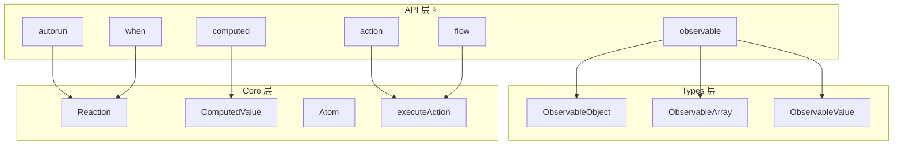
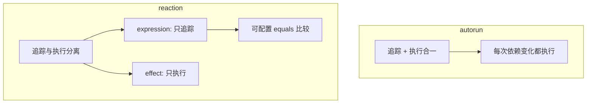
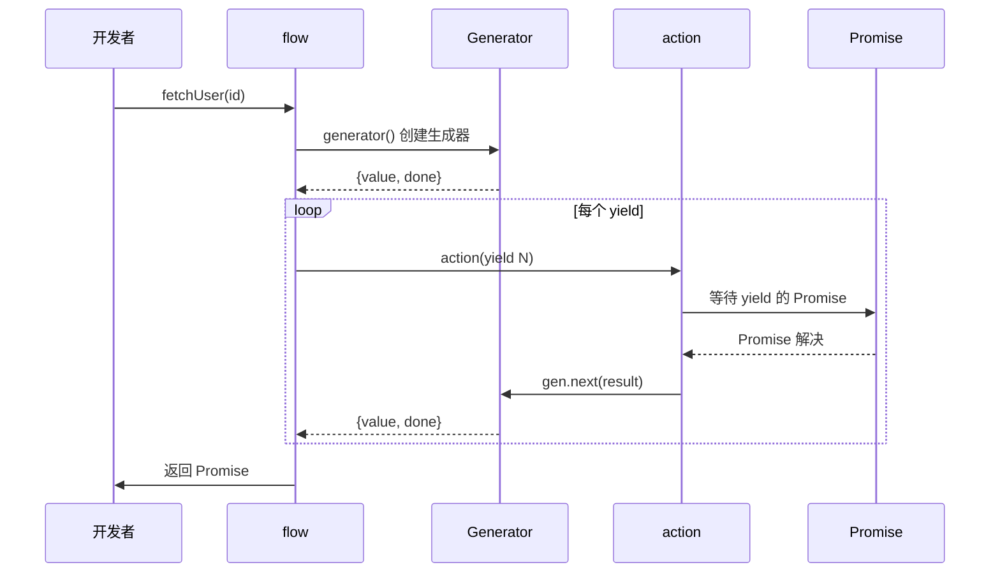
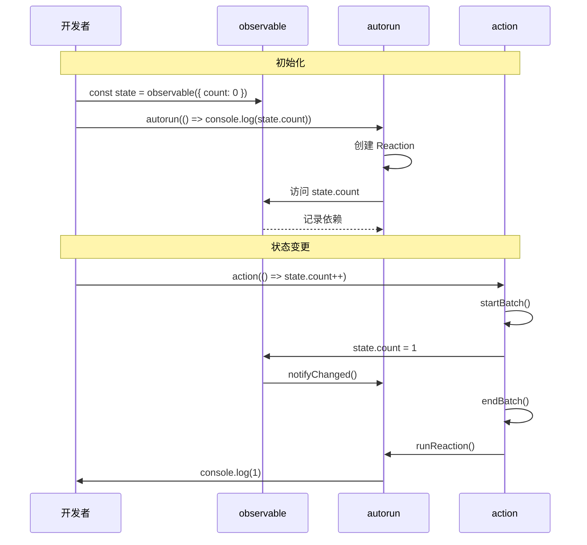
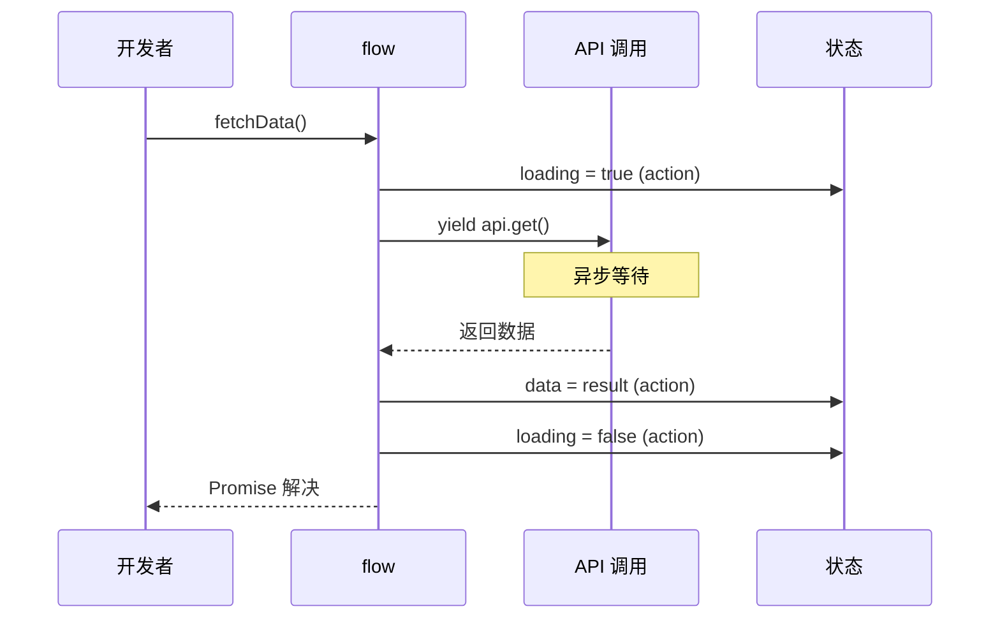

# 第 4 章 API 层：observable、autorun、action、flow 与高级用法

> 本章是 MobX 源码系列解析的**第 4 章**，聚焦于**API 层**。我们将深入解析开发者最常用的公共 API，包括 `observable`、`autorun`、`reaction`、`when`、`action`、`flow` 等，揭示它们如何调用底层 Core 和 Types 层实现响应式功能。

---

## 1. 模块职责

### 1.1 这章讲什么？

前 3 章我们理解了：
- 第 1 章：整体架构
- 第 2 章：Core 层（Observable、Derivation、Reaction）
- 第 3 章：Types 层（ObservableObject、Array、Map、Set）

本章将学习**开发者直接使用的 API**，这些 API 封装了底层复杂性，提供简洁易用的接口：

```javascript
// API 层（开发者使用）
const state = observable({ count: 0 })

autorun(() => {
    console.log(state.count)
})

action(() => {
    state.count++
})

// 底层调用
// → Types 层：asObservableObject
// → Core 层：Reaction、Atom
```

### 1.2 API 分类

| 类别 | API | 用途 |
|------|-----|------|
| **创建 observable** | `observable`, `makeObservable`, `makeAutoObservable` | 将数据转为响应式 |
| **计算值** | `computed` | 派生状态 |
| **反应** | `autorun`, `reaction`, `when` | 自动执行副作用 |
| **动作** | `action`, `runInAction` | 修改状态 |
| **异步** | `flow` | 处理 async/await |
| **工具** | `toJS`, `trace`, `configure` | 调试与配置 |

### 1.3 与其他模块的关系



---

## 2. 核心 API 解析

### 2.1 `observable` - 创建可观察值

**文件路径**：`packages/mobx/src/api/observable.ts`  
**代码行数**：约 280 行

#### 2.1.1 多态工厂函数

```typescript
// 文件：src/api/observable.ts L90-140
function createObservable(v: any, arg2?: any, arg3?: any) {
    // @observable someProp; (2022.3 Decorators)
    if (is20223Decorator(arg2)) {
        return observableAnnotation.decorate_20223_(v, arg2)
    }

    // @observable someProp;
    if (isStringish(arg2)) {
        storeAnnotation(v, arg2, observableAnnotation)
        return
    }

    // 已 observable - 忽略
    if (isObservable(v)) {
        return v
    }

    // 普通对象
    if (isPlainObject(v)) {
        return observable.object(v, arg2, arg3)
    }

    // 数组
    if (Array.isArray(v)) {
        return observable.array(v, arg2)
    }

    // Map
    if (isES6Map(v)) {
        return observable.map(v, arg2)
    }

    // Set
    if (isES6Set(v)) {
        return observable.set(v, arg2)
    }

    // 其他对象 - 忽略
    if (typeof v === "object" && v !== null) {
        return v
    }

    // 原始值 → 包装为 ObservableValue
    return observable.box(v, arg2)
}
```

#### 2.1.2 observable.object

```typescript
// 文件：src/api/observable.ts L160+
function observableObject(
    initialValues: any,
    decorators?: any,
    options?: CreateObservableOptions
) {
    const adm = asObservableObject(
        initialValues,
        options
    )
    
    // 应用注解或默认转换
    const annotation = getAnnotationFromOptions(options) || autoAnnotation
    
    startBatch()
    try {
        ownKeys(initialValues).forEach(key => {
            const descriptor = Object.getOwnPropertyDescriptor(initialValues, key)!
            annotation.extend_(adm, key, descriptor, false)
        })
    } finally {
        endBatch()
    }
    
    return adm.proxy_
}
```

#### 2.1.3 observable.box - 包装原始值

```typescript
// 文件：src/api/observable.ts L230+
function observableBox(v: any, options?: CreateObservableOptions) {
    const enhance = getEnhancerFromOptions(options)
    return new ObservableValue(
        v,
        enhance,
        options?.name || (__DEV__ ? "ObservableValue@" + getNextId() : "ObservableValue"),
        false
    )
}

// 使用示例
const count = observable.box(0)
count.get()   // 0
count.set(1)  // 更新
```

---

### 2.2 `autorun` - 自动追踪并执行

**文件路径**：`packages/mobx/src/api/autorun.ts`  
**代码行数**：约 200 行

#### 2.2.1 autorun 实现

```typescript
// 文件：src/api/autorun.ts L30-85
export function autorun(
    view: (r: IReactionPublic) => any,
    opts: IAutorunOptions = EMPTY_OBJECT
): IReactionDisposer {
    if (__DEV__) {
        if (!isFunction(view)) {
            die("Autorun expects a function as first argument")
        }
        if (isAction(view)) {
            die("Autorun does not accept actions since actions are untrackable")
        }
    }

    const name = opts?.name ?? (__DEV__ ? view.name || "Autorun@" + getNextId() : "Autorun")
    const runSync = !opts.scheduler && !opts.delay
    let reaction: Reaction

    if (runSync) {
        // 正常 autorun
        reaction = new Reaction(
            name,
            function (this: Reaction) {
                this.track(reactionRunner)  // 追踪依赖
            },
            opts.onError,
            opts.requiresObservable
        )
    } else {
        // 防抖 autorun
        const scheduler = createSchedulerFromOptions(opts)
        let isScheduled = false

        reaction = new Reaction(
            name,
            () => {
                if (!isScheduled) {
                    isScheduled = true
                    scheduler(() => {
                        isScheduled = false
                        if (!reaction.isDisposed) {
                            reaction.track(reactionRunner)
                        }
                    })
                }
            },
            opts.onError,
            opts.requiresObservable
        )
    }

    function reactionRunner() {
        view(reaction)
    }

    if (!opts?.signal?.aborted) {
        reaction.schedule_()  // 立即执行
    }
    
    return reaction.getDisposer_(opts?.signal)
}
```

**关键点**：
1. 创建 `Reaction` 实例
2. `onInvalidate` 回调中调用 `this.track()` 追踪依赖
3. 立即 `schedule_()` 触发首次执行
4. 返回 disposer 用于清理

#### 2.2.2 带 delay 的 autorun

```javascript
// 防抖 autorun - 状态稳定后再执行
autorun(
    () => {
        console.log(state.query)
    },
    {
        delay: 300  // 300ms 防抖
    }
)

// 实现原理
// 1. 依赖变化 → schedule_()
// 2. 设置 isScheduled = true
// 3. setTimeout 300ms 后执行 track()
// 4. 如果期间再次变化，跳过（isScheduled 已为 true）
```

#### 2.2.3 requiresObservable 选项

```typescript
// 文件：src/api/autorun.ts L40+
export interface IAutorunOptions {
    requiresObservable?: boolean  // 警告：没有追踪任何 observable
}

// 使用示例
autorun(
    () => {
        console.log("没有访问 observable")  // 不会追踪任何东西
    },
    {
        requiresObservable: true,  // 开发环境警告
        name: "MyAutorun"
    }
)
// 警告：[MobX] 'MyAutorun' is created without accessing any observable
```

---

### 2.3 `reaction` - 分离追踪与执行

**文件路径**：`packages/mobx/src/api/autorun.ts`  
**代码行数**：约 100 行（与 autorun 同文件）

#### 2.3.1 reaction 实现

```typescript
// 文件：src/api/autorun.ts L100-180
export function reaction<T, FireImmediately extends boolean = false>(
    expression: (r: IReactionPublic) => T,
    effect: (arg: T, prev: T | undefined, r: IReactionPublic) => void,
    opts: IReactionOptions<T, FireImmediately> = EMPTY_OBJECT
): IReactionDisposer {
    const name = opts.name ?? (__DEV__ ? "Reaction@" + getNextId() : "Reaction")
    const effectAction = action(name, opts.onError ? wrapErrorHandler(opts.onError, effect) : effect)
    const runSync = !opts.scheduler && !opts.delay
    const scheduler = createSchedulerFromOptions(opts)

    let firstTime = true
    let isScheduled = false
    let value: T

    const equals: IEqualsComparer<T> = (opts as any).compareStructural
        ? comparer.structural
        : opts.equals || comparer.default

    const r = new Reaction(
        name,
        () => {
            if (firstTime || runSync) {
                // 同步执行：立即 track 并执行 effect
                r.track(() => {
                    const nextValue = expression(r)
                    if (!firstTime || opts.fireImmediately !== false) {
                        effectAction(nextValue, value, r)
                    }
                    value = nextValue
                })
            } else {
                // 异步执行：只 track，不执行 effect
                r.track(() => {
                    value = expression(r)
                })
            }
            
            if (firstTime) {
                firstTime = false
            }
        },
        opts.onError,
        opts.requiresObservable
    )

    // 调度执行
    if (!opts?.signal?.aborted) {
        r.schedule_()
    }
    
    return r.getDisposer_(opts?.signal)
}
```

#### 2.3.2 autorun vs reaction



**使用场景对比**：

```javascript
// autorun - 直接使用 observable
autorun(() => {
    console.log(state.user.name)  // 直接访问
})

// reaction - 提取数据后处理
reaction(
    () => state.user,      // expression: 追踪 user
    (user) => {            // effect: 处理 user 变化
        api.updateUser(user)
    },
    {
        equals: comparer.shallow  // 浅比较，避免不必要的更新
    }
)
```

---

### 2.4 `when` - 条件等待

**文件路径**：`packages/mobx/src/api/when.ts`  
**代码行数**：约 100 行

#### 2.4.1 when 的两种用法

```typescript
// 文件：src/api/when.ts L20-50
export function when(
    predicate: () => boolean,
    effect: Lambda,
    opts?: IWhenOptions
): IReactionDisposer

export function when(
    predicate: () => boolean,
    opts?: IWhenOptions
): Promise<void> & { cancel(): void }
```

#### 2.4.2 命令式 when（带 effect）

```typescript
// 文件：src/api/when.ts L52-75
function _when(predicate: () => boolean, effect: Lambda, opts: IWhenOptions): IReactionDisposer {
    let timeoutHandle: any
    
    // 超时处理
    if (typeof opts.timeout === "number") {
        const error = new Error("WHEN_TIMEOUT")
        timeoutHandle = setTimeout(() => {
            if (!disposer[$mobx].isDisposed) {
                disposer()
                if (opts.onError) {
                    opts.onError(error)
                } else {
                    throw error
                }
            }
        }, opts.timeout)
    }

    opts.name = __DEV__ ? opts.name || "When@" + getNextId() : "When"
    
    const effectAction = createAction(
        __DEV__ ? opts.name + "-effect" : "When-effect",
        effect as Function
    )
    
    // 核心：用 autorun 追踪 predicate
    var disposer = autorun(r => {
        // predicate 中不允许状态变更
        let cond = allowStateChanges(false, predicate)
        
        if (cond) {
            r.dispose()  // 条件满足，停止追踪
            
            if (timeoutHandle) {
                clearTimeout(timeoutHandle)
            }
            
            effectAction()  // 执行 effect
        }
    }, opts)
    
    return disposer
}
```

#### 2.4.3 Promise 式 when

```typescript
// 文件：src/api/when.ts L77-105
function whenPromise(
    predicate: () => boolean,
    opts?: IWhenOptions
): Promise<void> & { cancel(): void } {
    let cancel: () => void
    let abort: () => void
    
    const res = new Promise((resolve, reject) => {
        // 复用 _when，resolve 作为 effect
        let disposer = _when(predicate, resolve as Lambda, { ...opts, onError: reject })
        
        cancel = () => {
            disposer()
            reject(new Error("WHEN_CANCELLED"))
        }
        
        abort = () => {
            disposer()
            reject(new Error("WHEN_ABORTED"))
        }
        
        // 支持 AbortSignal
        opts?.signal?.addEventListener?.("abort", abort)
    }).finally(() => opts?.signal?.removeEventListener?.("abort", abort))
    
    ;(res as any).cancel = cancel
    return res as any
}
```

#### 2.4.4 使用示例

```javascript
// 命令式
when(
    () => store.isLoaded,
    () => {
        console.log("数据加载完成")
    },
    {
        timeout: 5000,  // 5 秒超时
        name: "WaitForLoad"
    }
)

// Promise 式
await when(
    () => store.isLoaded,
    {
        timeout: 5000
    }
)
console.log("数据加载完成")

// 可取消
const disposer = when(
    () => store.isReady,
    () => console.log("Ready!")
)
// 稍后取消
disposer()
```

---

### 2.5 `action` - 状态变更包装器

**文件路径**：`packages/mobx/src/api/action.ts`  
**代码行数**：约 120 行

#### 2.5.1 action 工厂函数

```typescript
// 文件：src/api/action.ts L40-85
function createActionFactory(autoAction: boolean): IActionFactory {
    const res: IActionFactory = function action(arg1, arg2?): any {
        // action(fn)
        if (isFunction(arg1)) {
            return createAction(arg1.name || DEFAULT_ACTION_NAME, arg1, autoAction)
        }
        
        // action("name", fn)
        if (isFunction(arg2)) {
            return createAction(arg1, arg2, autoAction)
        }
        
        // @action (2022.3 Decorators)
        if (is20223Decorator(arg2)) {
            return (autoAction ? autoActionAnnotation : actionAnnotation).decorate_20223_(
                arg1,
                arg2
            )
        }
        
        // @action
        if (isStringish(arg2)) {
            return storeAnnotation(arg1, arg2, autoAction ? autoActionAnnotation : actionAnnotation)
        }
        
        // action("name") & @action("name")
        if (isStringish(arg1)) {
            return createDecoratorAnnotation(
                createActionAnnotation(autoAction ? AUTOACTION : ACTION, {
                    name: arg1,
                    autoAction
                })
            )
        }

        if (__DEV__) {
            die("Invalid arguments for `action`")
        }
    } as IActionFactory
    
    return res
}

export const action: IActionFactory = createActionFactory(false)
export const autoAction: IActionFactory = createActionFactory(true)
```

#### 2.5.2 createAction 实现

```typescript
// 文件：src/core/action.ts L30-55
export function createAction(
    actionName: string,
    fn: Function,
    autoAction: boolean = false,
    ref?: Object
): Function {
    function res() {
        return executeAction(actionName, autoAction, fn, ref || this, arguments)
    }
    res.isMobxAction = true
    res.toString = () => fn.toString()
    
    if (isFunctionNameConfigurable) {
        tmpNameDescriptor.value = actionName
        defineProperty(res, "name", tmpNameDescriptor)
    }
    
    return res
}
```

#### 2.5.3 executeAction - 执行动作

```typescript
// 文件：src/core/action.ts L57-75
export function executeAction(
    actionName: string,
    canRunAsDerivation: boolean,
    fn: Function,
    scope?: any,
    args?: IArguments
) {
    const runInfo = _startAction(actionName, canRunAsDerivation, scope, args)
    
    try {
        return fn.apply(scope, args)
    } catch (err) {
        runInfo.error_ = err
        throw err
    } finally {
        _endAction(runInfo)
    }
}
```

#### 2.5.4 _startAction - 开始动作

```typescript
// 文件：src/core/action.ts L90-130
export function _startAction(
    actionName: string,
    canRunAsDerivation: boolean,
    scope: any,
    args?: IArguments
): IActionRunInfo {
    const notifySpy_ = __DEV__ && isSpyEnabled() && !!actionName
    let startTime_: number = 0
    
    if (__DEV__ && notifySpy_) {
        startTime_ = Date.now()
        spyReportStart({
            type: ACTION,
            name: actionName,
            object: scope,
            arguments: args ? Array.from(args) : EMPTY_ARRAY
        })
    }
    
    const prevDerivation_ = globalState.trackingDerivation
    const runAsAction = !canRunAsDerivation || !prevDerivation_
    
    startBatch()  // 开始批处理
    
    let prevAllowStateChanges_ = globalState.allowStateChanges
    if (runAsAction) {
        untrackedStart()  // 停止依赖追踪
        prevAllowStateChanges_ = allowStateChangesStart(true)  // 允许状态变更
    }
    
    const prevAllowStateReads_ = allowStateReadsStart(true)
    
    const runInfo = {
        runAsAction_: runAsAction,
        prevDerivation_,
        prevAllowStateChanges_,
        prevAllowStateReads_,
        notifySpy_,
        startTime_,
        actionId_: nextActionId++,
        parentActionId_: currentActionId
    }
    
    currentActionId = runInfo.actionId_
    
    return runInfo
}
```

**关键点**：
1. `startBatch()` - 开始批处理，合并更新
2. `untrackedStart()` - 停止追踪（action 内不建立依赖）
3. `allowStateChangesStart(true)` - 允许状态变更（即使严格模式）

#### 2.5.5 _endAction - 结束动作

```typescript
// 文件：src/core/action.ts L132-155
export function _endAction(runInfo: IActionRunInfo) {
    if (currentActionId !== runInfo.actionId_) {
        die(30)  // 动作嵌套错误
    }
    currentActionId = runInfo.parentActionId_

    if (runInfo.error_ !== undefined) {
        globalState.suppressReactionErrors = true
    }
    
    allowStateChangesEnd(runInfo.prevAllowStateChanges_)
    allowStateReadsEnd(runInfo.prevAllowStateReads_)
    
    endBatch()  // 结束批处理，触发 reactions
    
    if (runInfo.runAsAction_) {
        untrackedEnd(runInfo.prevDerivation_)
    }
    
    if (__DEV__ && runInfo.notifySpy_) {
        spyReportEnd({ time: Date.now() - runInfo.startTime_ })
    }
    
    globalState.suppressReactionErrors = false
}
```

#### 2.5.6 autoAction - 智能动作

```javascript
// autoAction 自动判断是否需要 action
const autoAction = createActionFactory(true)

// 在 computed 中调用 → 作为普通函数
const c = computed(() => {
    return autoAction(() => someHelper())()  // 不会启动新 action
})

// 在事件处理器中调用 → 作为 action
button.onclick = autoAction(() => {
    state.count++  // 启动 action
})
```

---

### 2.6 `flow` - 异步操作处理

**文件路径**：`packages/mobx/src/api/flow.ts`  
**代码行数**：约 180 行

#### 2.6.1 flow 实现原理

```typescript
// 文件：src/api/flow.ts L40-120
export const flow: Flow = Object.assign(
    function flow(generator) {
        const name = generator.name || "<unnamed flow>"
        let generatorId = 0

        const res = function () {
            const ctx = this
            const args = arguments
            const runId = ++generatorId
            const gen = action(
                `${name} - runid: ${runId} - init`,
                generator
            ).apply(ctx, args)
            
            let rejector: (error: any) => void
            let pendingPromise: CancellablePromise<any> | undefined = undefined

            const promise = new Promise(function (resolve, reject) {
                let stepId = 0
                rejector = reject

                function onFulfilled(res: any) {
                    pendingPromise = undefined
                    let ret
                    try {
                        ret = action(
                            `${name} - runid: ${runId} - yield ${stepId++}`,
                            gen.next
                        ).call(gen, res)
                    } catch (e) {
                        return reject(e)
                    }
                    next(ret)
                }

                function onRejected(err: any) {
                    pendingPromise = undefined
                    let ret
                    try {
                        ret = action(
                            `${name} - runid: ${runId} - yield ${stepId++}`,
                            gen.throw
                        ).call(gen, err)
                    } catch (e) {
                        return reject(e)
                    }
                    next(ret)
                }

                function next(ret: any) {
                    if (isFunction(ret?.then)) {
                        // async iterator
                        ret.then(next, reject)
                        return
                    }
                    if (ret.done) {
                        return resolve(ret.value)
                    }
                    pendingPromise = Promise.resolve(ret.value) as any
                    return pendingPromise.then(onFulfilled, onRejected)
                }

                onFulfilled(undefined)  // 启动生成器
            }) as any

            promise.cancel = action(`${name} - runid: ${runId} - cancel`, function () {
                try {
                    if (pendingPromise) {
                        cancelPromise(pendingPromise)
                    }
                    const res = gen.return!(undefined as any)
                    const yieldedPromise = Promise.resolve(res.value)
                    yieldedPromise.then(noop, noop)
                    cancelPromise(yieldedPromise)
                    rejector(new FlowCancellationError())
                } catch (e) {
                    rejector(e)
                }
            })
            
            return promise
        }
        
        res.isMobXFlow = true
        return res
    } as any,
    flowAnnotation
)
```

#### 2.6.2 flow 执行流程



#### 2.6.3 使用示例

```javascript
// 传统 async/await（不推荐用于 MobX）
async function fetchData() {
    state.loading = true  // 每次 await 后都需要 action 包装
    const data = await api.get()
    state.data = data
    state.loading = false
}

// flow（推荐）
const fetchData = flow(function* (id) {
    state.loading = true  // 自动包装为 action
    try {
        const data = yield api.get(id)  // yield 代替 await
        state.data = data
    } finally {
        state.loading = false
    }
})

// 取消 flow
const cancel = fetchData(123)
cancel()  // 取消请求
```

---

## 3. 关键流程串联

### 3.1 完整响应式流程



### 3.2 flow 异步流程



---

## 4. 设计模式

### 4.1 工厂模式（Factory Pattern）

```typescript
// observable 是工厂函数
function createObservable(v: any) {
    if (isPlainObject(v)) return observable.object(v)
    if (Array.isArray(v)) return observable.array(v)
    if (isES6Map(v)) return observable.map(v)
    // ...
}
```

### 4.2 装饰器模式（Decorator Pattern）

```typescript
// @action 装饰器
@action
increment() {
    this.count++
}

// 底层：storeAnnotation
storeAnnotation(target, "increment", actionAnnotation)
```

### 4.3 Promise 模式

```typescript
// when 返回 Promise
const promise = when(() => condition)
promise.then(() => console.log("Done"))
```

---

## 5. 学习要点

### 5.1 API 选择指南

| 场景 | 推荐 API |
|------|----------|
| 创建响应式对象 | `makeAutoObservable` |
| 自动执行副作用 | `autorun` |
| 数据变化后处理 | `reaction` |
| 等待条件满足 | `when` |
| 修改状态 | `action` |
| 异步操作 | `flow` |
| 派生状态 | `computed` |

### 5.2 常见陷阱

```javascript
// ❌ 错误：在 computed 中修改状态
const c = computed(() => {
    state.count++  // 不允许！
})

// ✅ 正确：在 action 中修改
const increment = action(() => {
    state.count++
})

// ❌ 错误：autorun 内使用 async
autorun(async () => {
    const data = await api.get()  // 只会追踪第一次
})

// ✅ 正确：使用 flow 或 reaction + when
const fetchData = flow(function* () {
    const data = yield api.get()
})
```

### 5.3 性能优化

```javascript
// 使用 comparer 避免不必要的更新
reaction(
    () => state.user,
    (user) => api.update(user),
    { equals: comparer.shallow }  // 浅比较
)

// 使用 delay 防抖
autorun(
    () => api.search(state.query),
    { delay: 300 }
)
```

---

## 6. 本章小结

### 6.1 核心 API 总结

| API | 底层实现 | 关键特性 |
|-----|----------|----------|
| `observable` | asObservableObject | 多态工厂 |
| `autorun` | Reaction | 自动追踪 |
| `reaction` | Reaction | 分离追踪与执行 |
| `when` | autorun | 条件等待 |
| `action` | executeAction | 批处理 + 无追踪 |
| `flow` | Generator + action | 异步 action |

### 6.2 下章预告

**第 5 章** 我们将进行**关键流程串联**，解析：
- 从创建 observable 到 UI 更新的完整链路
- 批处理与事务的内部机制
- 错误处理与异常传播
- 开发工具与调试技巧

---

> **阅读建议**：本章是 API 使用指南，建议结合官方文档和实际项目理解。可以尝试修改源码中的参数，观察行为变化。

---

**文件信息**：
- 输出路径：`/output/mobxAnalysis/ch04-api-layer.md`
- 涉及源码：`src/api/observable.ts`, `autorun.ts`, `action.ts`, `flow.ts`, `when.ts`, `core/action.ts`
- 字数：约 8,500 字
