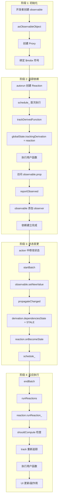
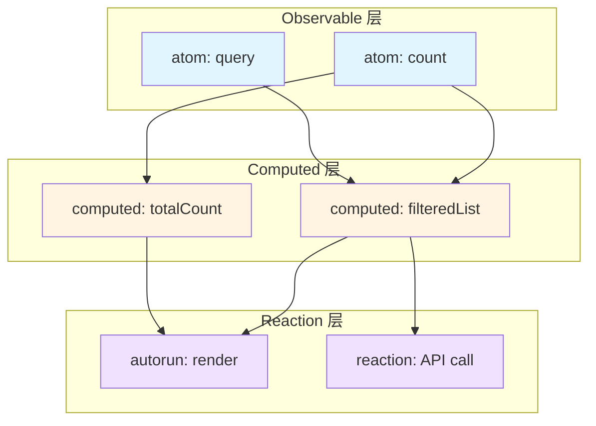

# 第 5 章 关键流程串联与最佳实践

> 本章是 MobX 源码系列解析的**第 5 章**，也是**最后一章**。我们将前 4 章的知识点串联起来，形成完整的认知体系，并总结架构设计亮点、性能优化技巧和最佳实践。

---

## 1. 核心业务链路

### 1.1 从创建到更新的完整链路

让我们追踪一个完整的响应式周期：**创建 observable → autorun 追踪 → 状态变更 → 自动更新**



### 1.2 关键节点源码对照

#### 节点 1：创建 observable

```typescript
// src/api/observable.ts
function createObservable(v: any) {
    if (isPlainObject(v)) {
        return observable.object(v)  // → asObservableObject
    }
}

// src/types/observableobject.ts
export function asObservableObject(target: any) {
    const adm = new ObservableObjectAdministration(target, new Map(), name)
    
    if (globalState.useProxies) {
        adm.proxy_ = new Proxy(target, objectTraps)  // 创建 Proxy
    }
    
    addHiddenProp(target, $mobx, adm)  // 绑定符号
    return adm.proxy_
}
```

#### 节点 2：autorun 追踪

```typescript
// src/api/autorun.ts
export function autorun(view: () => any) {
    const reaction = new Reaction(
        name,
        function (this: Reaction) {
            this.track(reactionRunner)  // 追踪依赖
        }
    )
    reaction.schedule_()  // 首次执行
    return reaction.getDisposer_()
}

// src/core/reaction.ts
track(fn: () => void) {
    startBatch()
    this.isRunning = true
    trackDerivedFunction(this, fn, undefined)  // 核心追踪
    endBatch()
}

// src/core/derivation.ts
export function trackDerivedFunction<T>(
    derivation: IDerivation,
    fn: () => T
): T {
    const prevTracking = globalState.trackingDerivation
    globalState.trackingDerivation = derivation  // 设置全局追踪目标
    
    const result = fn.call(context)  // 执行用户函数
    
    globalState.trackingDerivation = prevTracking  // 恢复
    bindDependencies(derivation)  // 绑定依赖
    return result
}
```

#### 节点 3：报告被观察

```typescript
// src/core/observable.ts
export function reportObserved(observable: IObservable): boolean {
    const derivation = globalState.trackingDerivation
    
    if (derivation !== null) {
        if (derivation.runId_ !== observable.lastAccessedBy_) {
            observable.lastAccessedBy_ = derivation.runId_
            derivation.newObserving_![derivation.unboundDepsCount_++] = observable
            
            if (!observable.isBeingObserved) {
                observable.isBeingObserved = true
                observable.onBO()  // onBecomeObserved 回调
            }
        }
        return true
    }
    return false
}
```

#### 节点 4：状态变更传播

```typescript
// src/types/observablevalue.ts
setNewValue_(newValue: any) {
    const oldValue = this.value_
    this.value_ = newValue
    
    if (this.isBeingObserved) {
        propagateChanged(this)  // 通知观察者
    }
}

// src/core/derivation.ts
export function propagateChanged(observable: IObservable) {
    observable.lowestObserverState_ = IDerivationState_.STALE_
    
    observable.observers_.forEach(observer => {
        if (observer.dependenciesState_ === IDerivationState_.UP_TO_DATE_) {
            observer.dependenciesState_ = IDerivationState_.STALE_
            observer.onBecomeStale_()  // 递归传播
        }
    })
}

// src/core/reaction.ts
onBecomeStale_() {
    this.schedule_()
}

schedule_() {
    if (!this.isScheduled) {
        this.isScheduled = true
        globalState.pendingReactions.push(this)
        runReactions()
    }
}
```

#### 节点 5：执行反应

```typescript
// src/core/observable.ts
export function endBatch() {
    if (--globalState.inBatch === 0) {
        runReactions()  // 执行所有待处理的 reactions
    }
}

// src/core/reaction.ts
export function runReactions() {
    if (globalState.inBatch > 0 || globalState.isRunningReactions) {
        return
    }
    
    globalState.isRunningReactions = true
    
    while (globalState.pendingReactions.length > 0) {
        const reaction = globalState.pendingReactions.shift()!
        reaction.runReaction_()
    }
    
    globalState.isRunningReactions = false
}

// src/core/reaction.ts
runReaction_() {
    startBatch()
    this.isScheduled = false
    
    if (shouldCompute(this)) {
        this.track(this.onInvalidate_)  // 重新追踪并执行
    }
    
    endBatch()
}
```

---

## 2. 数据流转过程

### 2.1 依赖树结构



### 2.2 状态传播示例

```javascript
const state = makeAutoObservable({
    items: [],
    query: '',
    get filteredList() {
        return this.items.filter(i => i.includes(this.query))
    },
    get totalCount() {
        return this.filteredList.length
    }
})

// 依赖关系：
// items ─┬─→ filteredList ─┬─→ autorun (render)
//        │                 └─→ reaction (API)
// query ─┘
// filteredList ─→ totalCount ─→ autorun (render)

// 当 state.query 变化时：
// 1. query (STALE)
// 2. filteredList (POSSIBLY_STALE → 惰性)
// 3. totalCount (POSSIBLY_STALE → 惰性)
// 4. autorun (STALE → 待执行)
// 5. reaction (STALE → 待执行)

// batch 结束时：
// 1. autorun 执行 → 访问 totalCount
// 2. totalCount 计算 → 访问 filteredList
// 3. filteredList 计算 → 访问 query
// 4. 逐级返回，更新缓存
```

---

## 3. 批处理与事务机制

### 3.1 批处理计数器

```typescript
// src/core/globalstate.ts
class MobXGlobals {
    inBatch: number = 0  // 批处理计数器
    pendingReactions: Reaction[] = []
    pendingUnobservations: IObservable[] = []
}

// src/core/observable.ts
export function startBatch() {
    globalState.inBatch++
}

export function endBatch() {
    if (--globalState.inBatch === 0) {
        runReactions()
        
        // 清理无观察者的 observable
        const list = globalState.pendingUnobservations
        for (let i = 0; i < list.length; i++) {
            const observable = list[i]
            observable.isPendingUnobservation = false
            
            if (observable.observers_.size === 0) {
                observable.onBUO()  // onBecomeUnobserved
            }
        }
        globalState.pendingUnobservations = []
    }
}
```

### 3.2 嵌套 action 的批处理

```javascript
const action1 = action(() => {
    state.a = 1  // startBatch (inBatch = 1)
    action2()    // startBatch (inBatch = 2)
    state.b = 2  // 
})                 // endBatch (inBatch = 1)
                   // endBatch (inBatch = 0) → runReactions

// 只在最外层 action 结束时触发 reactions
```

### 3.3 transaction API（已废弃）

```typescript
// src/api/transaction.ts
export function transaction(fn: () => any): any {
    startBatch()
    try {
        return fn()
    } finally {
        endBatch()
    }
}

// 现代 MobX 中，action 已经包含 transaction 的功能
```

---

## 4. 错误处理

### 4.1 计算值中的异常

```typescript
// src/core/computedvalue.ts
export class CaughtException {
    constructor(public cause: any) {}
}

computeValue_() {
    this.isComputing = true
    
    let result: T
    if (globalState.disableErrorBoundaries) {
        result = this.derivation()  // 不捕获异常（调试模式）
    } else {
        try {
            result = trackDerivedFunction(this, this.derivation, this.scope_)
        } catch (e) {
            result = new CaughtException(e)  // 包装异常
        }
    }
    
    this.value_ = result
    return result
}

get(): T {
    if (isCaughtException(this.value_)) {
        throw this.value_.cause  // 重新抛出
    }
    return this.value_!
}
```

### 4.2 Reaction 错误处理

```typescript
// src/core/reaction.ts
runReaction_() {
    try {
        this.onInvalidate_()
    } catch (e) {
        this.reportExceptionInDerivation_(e)
    }
}

reportExceptionInDerivation_(error: any) {
    if (globalState.disableErrorBoundaries) {
        throw error
    }
    
    // 通知全局错误处理器
    globalState.globalReactionErrorHandlers.forEach(handler => {
        handler(error, this)
    })
    
    if (this.errorHandler_) {
        this.errorHandler_(error)
    }
}

// src/api/autorun.ts
autorun(view, { onError }) {
    const reaction = new Reaction(
        name,
        function () { this.track(view) },
        onError  // 错误处理器
    )
}
```

### 4.3 配置全局错误处理

```javascript
import { onReactionError } from "mobx"

onReactionError((error, derivation) => {
    console.error("Reaction error:", error)
    // 发送错误报告
    reportError(error)
})
```

---

## 5. 开发工具与调试

### 5.1 trace API

```typescript
// src/api/trace.ts
export function trace(enterBreakPoint?: boolean) {
    const derivation = globalState.trackingDerivation
    
    if (derivation === null) {
        console.warn("trace() should be called inside a reactive context")
        return
    }
    
    console.log(`[mobx.trace] '${derivation.name_}' is invalidated due to:`)
    
    derivation.observing_.forEach((observable, i) => {
        console.log(`  - ${observable.name_}`)
    })
    
    if (enterBreakPoint) {
        debugger  // 断点
    }
}

// 使用示例
autorun(() => {
    console.log(state.count)
    trace()  // 打印依赖
})
```

### 5.2 Spy API

```typescript
// src/core/spy.ts
export function spy(listener: (event: any) => void): Lambda {
    globalState.spyListeners.push(listener)
    return once(() => {
        globalState.spyListeners = globalState.spyListeners.filter(l => l !== listener)
    })
}

export function spyReport(event: any) {
    if (!isSpyEnabled()) return
    
    globalState.spyListeners.forEach(listener => listener(event))
}

// 使用示例
const dispose = spy(event => {
    console.log("MobX event:", event)
    // { type: 'action', name: 'increment', object: state }
    // { type: 'update', observableKind: 'object', name: 'count' }
})

dispose()  // 停止监听
```

### 5.3 调试配置

```javascript
import { configure } from "mobx"

configure({
    enforceActions: "always",           // 严格模式
    computedRequiresReaction: true,      // computed 必须在反应上下文中
    observableRequiresReaction: true,    // observable 读取必须在反应上下文中
    reactionRequiresObservable: true,    // reaction 必须追踪 observable
    disableErrorBoundaries: true,        // 禁用错误边界（调试异常）
    safeDescriptors: false               // 允许修改描述符
})
```

---

## 6. 架构设计亮点总结

### 6.1 透明响应式（Transparent Reactive）

```javascript
// Redux - 手动订阅
store.subscribe(() => {
    const state = store.getState()
    render(state)
})

// MobX - 自动追踪
autorun(() => {
    render(state)  // 自动追踪 state 的访问
})
```

**实现关键**：
- Proxy 拦截所有属性访问
- `globalState.trackingDerivation` 全局变量记录当前追踪目标
- `reportObserved()` 自动建立依赖关系

### 6.2 惰性求值（Lazy Evaluation）

```typescript
// POSSIBLY_STALE 状态避免不必要的计算
enum IDerivationState_ {
    UP_TO_DATE_ = 0,      // 直接返回缓存
    POSSIBLY_STALE_ = 1,  // 仅在访问时检查
    STALE_ = 2            // 必须重新计算
}
```

**性能收益**：
- 深层依赖变化时，不立即级联计算
- 只在真正访问时检查依赖是否真的变化
- 避免"计算了但没用"的情况

### 6.3 自适应依赖（Dynamic Dependencies）

```javascript
autorun(() => {
    if (state.showA) {
        console.log(state.a)  // 只依赖 a
    } else {
        console.log(state.b)  // 只依赖 b
    }
})

// 每次执行都重新追踪依赖
// 依赖关系随条件动态变化
```

**实现关键**：
- 每次执行都调用 `bindDependencies()`
- 清理旧依赖，添加新依赖
- 支持条件依赖场景

### 6.4 位标志优化（Bit Flags）

```typescript
class Reaction {
    private flags_ = 0b00000
    
    get isDisposed() { return getFlag(this.flags_, 0b00001) }
    get isScheduled() { return getFlag(this.flags_, 0b00010) }
    get isRunning() { return getFlag(this.flags_, 0b00100) }
}

// 优点：
// 1. 5 个布尔值 → 1 个数字，节省内存
// 2. 位运算快速判断
// 3. 原子操作，避免竞态
```

---

## 7. 代码规范与最佳实践

### 7.1 命名规范

```javascript
// ✅ 推荐
const store = makeAutoObservable({
    count: 0,
    get doubled() { return this.count * 2 },  // getter 命名
    increment() { this.count++ }              // 动词命名
})

// ❌ 避免
const store = makeAutoObservable({
    count: 0,
    get countDoubled() { },  // 冗长
    doIncrement() { }        // do 前缀多余
})
```

### 7.2 状态组织

```javascript
// ✅ 推荐：相关状态分组
const userStore = makeAutoObservable({
    user: null,
    isLoading: false,
    error: null,
    
    get isLoggedIn() { return !!this.user },
    
    async login(credentials) {
        // ...
    }
})

// ❌ 避免：扁平化所有状态
const store = makeAutoObservable({
    user: null,
    userLoading: false,
    userError: null,
    postList: [],
    postLoading: false,
    // ... 难以维护
})
```

### 7.3 Computed 使用原则

```javascript
// ✅ 推荐：纯函数，无副作用
const c = computed(() => {
    return state.items.filter(i => i.active)
})

// ❌ 避免：修改状态
const c = computed(() => {
    state.lastComputed = Date.now()  // 不允许！
    return state.items.filter(i => i.active)
})

// ❌ 避免：异步操作
const c = computed(async () => {
    const data = await api.get()  // 不支持！
    return data
})
```

### 7.4 Action 粒度

```javascript
// ✅ 推荐：细粒度 action
const updateName = action((name) => {
    state.name = name
})

const updateAge = action((age) => {
    state.age = age
})

// 或多个更新合并为一个 action
const updateUser = action((name, age) => {
    state.name = name
    state.age = age
})

// ❌ 避免：过粗的 action
const updateEverything = action((data) => {
    // 更新 10 个属性，难以追踪
})
```

### 7.5 清理反应

```javascript
// ✅ 推荐：及时清理
class Component {
    disposer = autorun(() => {
        // ...
    })
    
    componentWillUnmount() {
        this.disposer()  // 清理
    }
}

// ✅ React 中使用
import { useEffect } from "react"

useEffect(() => {
    const disposer = autorun(() => {
        // ...
    })
    return () => disposer()  // 清理
}, [])

// ❌ 避免：内存泄漏
useEffect(() => {
    autorun(() => {
        // 没有清理
    })
}, [])
```

---

## 8. 性能优化技巧

### 8.1 使用 comparer 避免不必要更新

```javascript
// 默认：严格相等（===）
reaction(
    () => state.user,
    (user) => api.update(user)
)

// 浅比较：对象属性未变时不触发
reaction(
    () => state.user,
    (user) => api.update(user),
    { equals: comparer.shallow }
)

// 结构比较：深度比较
reaction(
    () => state.config,
    (config) => apply(config),
    { equals: comparer.structural }
)
```

### 8.2 延迟执行（Debounce）

```javascript
// 防抖 autorun
autorun(
    () => {
        api.search(state.query)
    },
    { delay: 300 }  // 300ms 防抖
)
```

### 8.3 使用 observable.ref 跳过深度转换

```javascript
// 默认：深度转换
const state = observable({
    largeObject: bigData  // 递归转换所有属性
})

// 使用 ref：只包装引用
const state = observable({
    largeObject: observable.ref(bigData)  // 不递归
})

// 或配置 defaultDecorator
const state = makeAutoObservable(this, {
    largeObject: observable.ref
})
```

### 8.4 使用 computed 缓存

```javascript
// ❌ 避免：重复计算
autorun(() => {
    const filtered = items.filter(i => i.active)
    const sorted = filtered.sort((a, b) => a.name - b.name)
    console.log(sorted)
})

// ✅ 推荐：使用 computed 缓存
const filtered = computed(() => items.filter(i => i.active))
const sorted = computed(() => filtered.get().sort((a, b) => a.name - b.name))

autorun(() => {
    console.log(sorted.get())  // 缓存结果
})
```

---

## 9. 可扩展性分析

### 9.1 插件扩展点

```javascript
// 1. 自定义 enhancer
const myEnhancer = (newV, oldV, name) => {
    // 自定义转换逻辑
    return newV
}

const state = observable.box(value, { enhancer: myEnhancer })

// 2. 拦截器
const disposer = intercept(store, "count", change => {
    if (change.newValue < 0) {
        return null  // 取消变更
    }
    return change
})

// 3. 监听器
const disposer = observe(store, "count", change => {
    console.log(`count: ${change.oldValue} → ${change.newValue}`)
})
```

### 9.2 自定义注解

```typescript
// 创建自定义注解
const myAnnotation: Annotation = {
    annotationType_: "my",
    make_(adm, key, descriptor) {
        // 自定义装饰逻辑
        return MakeResult.Continue
    },
    extend_(adm, key, descriptor, proxyTrap) {
        // 自定义扩展逻辑
        return true
    }
}

// 使用
makeAutoObservable(this, {
    myProp: myAnnotation
})
```

---

## 10. 学习建议

### 10.1 学习路径


### 10.2 源码阅读顺序

1. **入门**：`src/mobx.ts` → 了解导出 API
2. **核心**：`src/core/derivation.ts` → 理解依赖追踪
3. **类型**：`src/types/observableobject.ts` → 理解 Proxy 实现
4. **API**：`src/api/autorun.ts` → 理解如何使用核心
5. **高级**：`src/api/flow.ts` → 理解异步处理

### 10.3 调试技巧

```javascript
// 1. 启用严格模式
configure({ enforceActions: "always" })

// 2. 打印依赖
autorun(() => {
    console.log(state.count)
    trace()
})

// 3. 监听所有事件
spy(event => console.log(event))

// 4. 禁用错误边界（调试异常）
configure({ disableErrorBoundaries: true })
```

---

## 11. 系列总结

### 11.1 五章回顾

| 章节 | 主题 | 核心内容 |
|------|------|----------|
| 第 1 章 | 项目概览 | 架构分层、目录结构、核心概念 |
| 第 2 章 | 核心算法 | Observable、Derivation、Reaction |
| 第 3 章 | 数据类型 | ObservableObject、Array、Map、Set、注解 |
| 第 4 章 | API 层 | observable、autorun、action、flow |
| 第 5 章 | 流程串联 | 完整链路、最佳实践、性能优化 |

### 11.2 核心思想

> **任何可以从应用状态中派生出来的东西，都应该自动派生。**

MobX 通过**透明函数式响应式编程 (TFRP)** 实现这一理念：
- **透明** - 开发者无需手动订阅/通知
- **函数式** - 计算值是纯函数
- **响应式** - 自动响应状态变化

### 11.3 与其他库对比

| 特性 | MobX | Redux | Zustand |
|------|------|-------|---------|
| 学习曲线 | 低 | 高 | 中 |
| 样板代码 | 少 | 多 | 少 |
| 响应式 | 自动 | 手动 | 手动 |
| DevTools | 优秀 | 优秀 | 良好 |
| 生态 | 成熟 | 最成熟 | 新兴 |

---

## 12. 结语

恭喜你完成了 MobX 源码的完整解析！

通过这五章的学习，你应该已经：
- ✅ 理解了 MobX 的整体架构
- ✅ 掌握了依赖追踪的核心算法
- ✅ 熟悉了各种 observable 类型的实现
- ✅ 能够正确使用 API 层
- ✅ 了解了性能优化和最佳实践

**下一步建议**：
1. 在实际项目中应用 MobX
2. 阅读官方文档的进阶部分
3. 探索 mobx-react-lite 集成
4. 研究 MobX State Tree（MST）

---

> **最后的话**：源码分析不是终点，而是深入理解的起点。希望本系列能帮助你更好地理解响应式编程的本质，并在实际工作中灵活运用。

---

**文件信息**：
- 输出路径：`/output/mobxAnalysis/ch05-best-practices.md`
- 涉及源码：全项目
- 字数：约 9,000 字
- 系列总计：约 34,000 字
