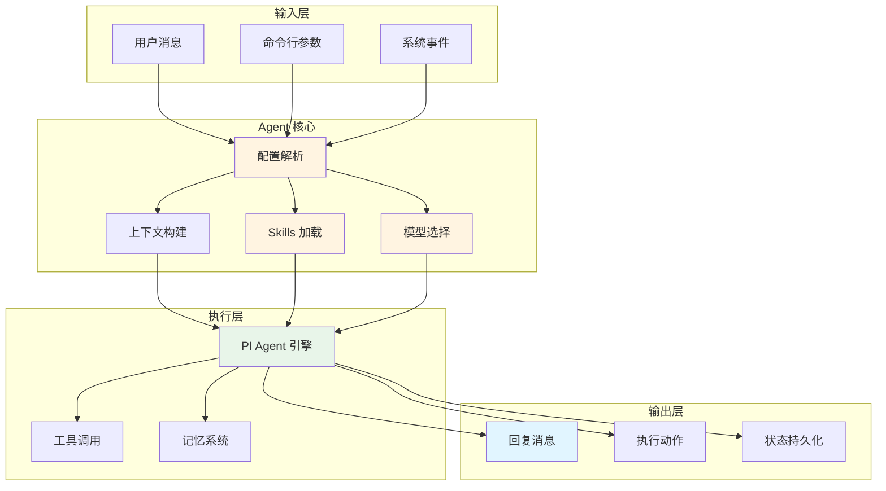
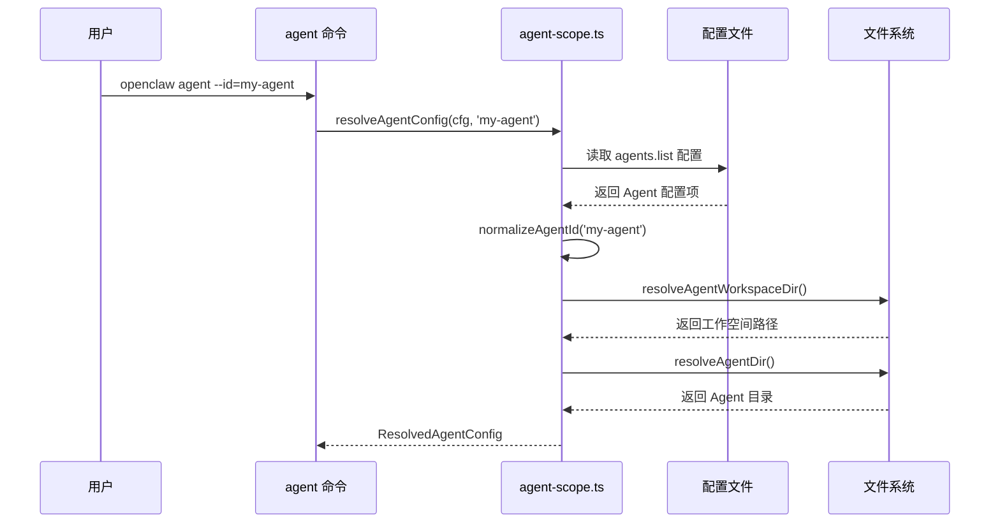
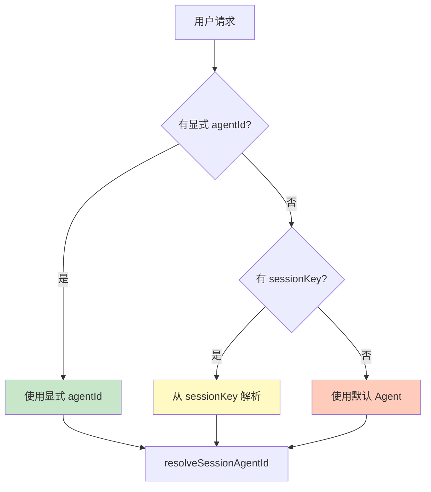

# 第 1 章 Agent 系统架构

> 本章是 OpenClaw Agent & Skills 源码解析系列的第 1 章，聚焦于 Agent 系统的整体架构设计。我们将用前端开发者熟悉的视角，深入分析 Agent 系统的核心组件和工作原理。

---

## 1. Agent 系统定位

### 1.1 什么是 Agent？

在 OpenClaw 中，**Agent** 是一个**可配置、可扩展的 AI 助手实例**，类似于前端中的**应用实例**概念。

**类比理解**：

| OpenClaw Agent | 前端类比 | 说明 |
|---------------|---------|------|
| Agent 实例 | React App 实例 | 每个 Agent 是一个独立的 AI 助手 |
| Agent 配置 | Webpack 配置 | 定义 Agent 的行为和约束 |
| Skills | Webpack Plugins | 扩展 Agent 的能力 |
| Workspace | 项目根目录 | Agent 的工作空间 |


### 1.2 Agent 的核心职责



---

## 2. 核心文件结构

### 2.1 Agent 系统源码目录

```
/opt/openclaw/src/
├── agents/                      # Agent 核心模块
│   ├── agent-scope.ts          # ⭐ Agent 配置解析与路由
│   ├── agent.ts                # ⭐ Agent 命令执行入口
│   ├── cli-runner.ts           # CLI Agent 执行器
│   ├── pi-embedded.ts          # 嵌入式 PI Agent 执行器
│   ├── model-selection.ts      # 模型选择逻辑
│   ├── model-fallback.ts       # 模型降级策略
│   ├── workspace.ts            # 工作空间管理
│   └── skills/                 # ⭐ Skills 系统
│       ├── workspace.ts        # Skills 加载与过滤
│       ├── filter.ts           # 过滤器实现
│       ├── config.ts           # 配置解析
│       ├── frontmatter.ts      # 元数据解析
│       └── types.ts            # 类型定义
│
├── commands/
│   ├── agent.ts                # ⭐ agent 命令实现
│   └── agent/                  # Agent 子模块
│       ├── delivery.ts         # 结果投递
│       ├── session.ts          # 会话管理
│       ├── session-store.ts    # 会话存储
│       ├── run-context.ts      # 运行上下文
│       └── types.ts            # 类型定义
│
└── infra/
    ├── agent-events.ts         # Agent 事件系统
    └── skills-remote.ts        # 远程 Skills 支持
```

### 2.2 关键文件职责


| 文件 | 职责 | 前端类比 |
|------|------|---------|
| `agent-scope.ts` | Agent 配置解析、ID 路由、工作空间解析 | `config/webpack.config.js` |
| `agent.ts` | Agent 命令执行主入口 | `src/index.tsx` (应用入口) |
| `commands/agent.ts` | CLI 命令实现 | `commands/agent.command.ts` |
| `skills/workspace.ts` | Skills 加载、过滤、快照 | `plugins/` 系统 |
| `skills/filter.ts` | Skills 过滤器 | `webpack include/exclude` |


---

## 3. Agent 配置系统

### 3.1 配置结构

**源码位置**：`agent-scope.ts`

```typescript
type ResolvedAgentConfig = {
  name?: string;                    // Agent 名称
  workspace?: string;               // 工作空间路径
  agentDir?: string;                // Agent 目录
  model?: AgentEntry["model"];      // 模型配置
  skills?: AgentEntry["skills"];    // Skills 过滤器
  memorySearch?: AgentEntry["memorySearch"];
  humanDelay?: AgentEntry["humanDelay"];
  heartbeat?: AgentEntry["heartbeat"];
  identity?: AgentEntry["identity"];
  groupChat?: AgentEntry["groupChat"];
  subagents?: AgentEntry["subagents"];
  sandbox?: AgentEntry["sandbox"];
  tools?: AgentEntry["tools"];
};
```

**类比理解**：
```javascript
// 类似于 Webpack 配置
{
  name: 'my-agent',           // entry.name
  workspace: '~/workspace',   // context / output.path
  model: 'anthropic/claude',  // 自定义配置项
  skills: ['github', 'git'],  // plugins 白名单
  sandbox: 'docker',          // 自定义配置项
}
```

### 3.2 配置解析流程



### 3.3 配置解析源码分析

**核心函数**（`agent-scope.ts`）：

```typescript
/**
 * 解析 Agent 配置
 * @param cfg OpenClaw 完整配置
 * @param agentId Agent ID
 */
export function resolveAgentConfig(
  cfg: OpenClawConfig,
  agentId: string,
): ResolvedAgentConfig | undefined {
  const id = normalizeAgentId(agentId);
  const entry = resolveAgentEntry(cfg, id);
  if (!entry) {
    return undefined;
  }
  return {
    name: typeof entry.name === "string" ? entry.name : undefined,
    workspace: typeof entry.workspace === "string" ? entry.workspace : undefined,
    agentDir: typeof entry.agentDir === "string" ? entry.agentDir : undefined,
    model: /* 模型配置解析 */,
    skills: Array.isArray(entry.skills) ? entry.skills : undefined,
    // ... 其他配置项
  };
}

/**
 * 解析 Agent Skills 过滤器
 */
export function resolveAgentSkillsFilter(
  cfg: OpenClawConfig,
  agentId: string,
): string[] | undefined {
  return normalizeSkillFilter(resolveAgentConfig(cfg, agentId)?.skills);
}
```

**关键点**：
1. **配置合并**：从 `cfg.agents.list` 中查找匹配的 Agent 配置
2. **类型安全**：所有配置项都有类型检查
3. **默认值处理**：未配置时使用 `undefined`，由下游处理默认值

---

## 4. Agent 路由系统

### 4.1 Agent ID 解析

**源码位置**：`agent-scope.ts`

```typescript
/**
 * 解析会话级别的 Agent ID
 * 优先级：显式 agentId > sessionKey 中的 agentId > 默认 Agent
 */
export function resolveSessionAgentIds(params: {
  sessionKey?: string;
  config?: OpenClawConfig;
  agentId?: string;
}): {
  defaultAgentId: string;
  sessionAgentId: string;
} {
  const defaultAgentId = resolveDefaultAgentId(params.config ?? {});
  const explicitAgentIdRaw = typeof params.agentId === "string" 
    ? params.agentId.trim().toLowerCase() 
    : "";
  const explicitAgentId = explicitAgentIdRaw 
    ? normalizeAgentId(explicitAgentIdRaw) 
    : null;
  const sessionKey = params.sessionKey?.trim();
  const parsed = normalizedSessionKey 
    ? parseAgentSessionKey(normalizedSessionKey) 
    : null;
  const sessionAgentId = explicitAgentId ?? 
    (parsed?.agentId ? normalizeAgentId(parsed.agentId) : defaultAgentId);
  return { defaultAgentId, sessionAgentId };
}
```

**路由优先级**：


### 4.2 工作空间解析

**源码位置**：`agent-scope.ts`

```typescript
export function resolveAgentWorkspaceDir(cfg: OpenClawConfig, agentId: string) {
  const id = normalizeAgentId(agentId);
  const configured = resolveAgentConfig(cfg, id)?.workspace?.trim();
  if (configured) {
    return stripNullBytes(resolveUserPath(configured));
  }
  const defaultAgentId = resolveDefaultAgentId(cfg);
  if (id === defaultAgentId) {
    const fallback = cfg.agents?.defaults?.workspace?.trim();
    if (fallback) {
      return stripNullBytes(resolveUserPath(fallback));
    }
    return stripNullBytes(resolveDefaultAgentWorkspaceDir(process.env));
  }
  const stateDir = resolveStateDir(process.env);
  return stripNullBytes(path.join(stateDir, `workspace-${id}`));
}
```

**解析逻辑**：
1. **优先使用配置**：`agent.workspace` 配置项
2. **默认 Agent 回退**：使用 `agents.defaults.workspace`
3. **自动生成**：`{stateDir}/workspace-{agentId}`

---

## 5. Agent 执行流程

### 5.1 完整执行链路

```mermaid
sequenceDiagram
    participant User as 用户
    participant Cmd as commands/agent.ts
    participant Scope as agent-scope.ts
    participant Skills as skills/workspace.ts
    participant PI as pi-embedded.ts
    participant Model as AI 模型
    participant Store as Session Store
    User->>Cmd: openclaw agent --message="hello"
    Cmd->>Scope: resolveSessionAgentId()
    Scope-->>Cmd: sessionAgentId
    Cmd->>Scope: resolveAgentWorkspaceDir()
    Scope-->>Cmd: workspaceDir
    Cmd->>Skills: buildWorkspaceSkillSnapshot()
    Skills-->>Cmd: skillsSnapshot
    Cmd->>Cmd: resolveDefaultModelForAgent()
    Cmd->>PI: runEmbeddedPiAgent({...})
    PI->>Model: 发送请求（含 Skills Prompt）
    Model-->>PI: 返回响应
    PI->>Cmd: 返回结果
    Cmd->>Store: updateSessionStoreAfterAgentRun()
    Cmd->>User: 投递结果
    style Cmd fill:#fff4e1
    style Scope fill:#e8f5e9
    style Skills fill:#fce4ec
    style PI fill:#e1f5ff
```

### 5.2 核心执行函数

**源码位置**：`commands/agent.ts`

```typescript
async function agentCommandInternal(
  opts: AgentCommandOpts,
  runtime: RuntimeEnv,
  deps: CliDeps,
) {
  // ① 配置加载
  const cfg = loadConfig();
  
  // ② Agent ID 解析
  const sessionAgentId = resolveSessionAgentId({ sessionKey, config: cfg });
  
  // ③ 工作空间准备
  const workspaceDir = resolveAgentWorkspaceDir(cfg, sessionAgentId);
  const workspace = await ensureAgentWorkspace({ dir: workspaceDir });
  
  // ④ Skills 快照构建
  const skillsSnapshot = buildWorkspaceSkillSnapshot(workspaceDir, {
    config: cfg,
    skillFilter: resolveAgentSkillsFilter(cfg, sessionAgentId),
  });
  
  // ⑤ 模型选择
  const { provider, model } = resolveDefaultModelForAgent({ cfg, agentId: sessionAgentId });
  
  // ⑥ 执行 Agent
  const result = await runEmbeddedPiAgent({
    sessionId,
    workspaceDir,
    skillsSnapshot,
    provider,
    model,
    prompt: body,
    // ...
  });
  
  // ⑦ 结果投递
  return await deliverAgentCommandResult({ ... });
}
```

---

## 6. 设计模式分析

### 6.1 依赖注入模式

**类比 React Context**：

```typescript
// OpenClaw 的依赖注入
function agentCommandInternal(opts, runtime = defaultRuntime, deps = createDefaultDeps()) {
  // runtime 和 deps 是注入的依赖
  // 类似于 React 的 Context Provider
}

// React 类比
function App() {
  return (
    <RuntimeProvider value={defaultRuntime}>
      <DepsProvider value={createDefaultDeps()}>
        <AgentCommandInternal />
      </DepsProvider>
    </RuntimeProvider>
  );
}
```

### 6.2 策略模式

**模型选择策略**：

```typescript
// 类似于 Webpack 的 resolve.alias
const modelSelection = {
  'claude': () => selectAnthropicModel(),
  'gpt': () => selectOpenAIModel(),
  'qwen': () => selectBailianModel(),
};

// 根据配置选择策略
const strategy = modelSelection[provider];
const model = strategy();
```

### 6.3 装饰器模式

**中间件式增强**：

```typescript
// Skills 系统类似于装饰器
const agent = createAgent(baseAgent);
const enhancedAgent = withSkills(agent, skills);
const monitoredAgent = withLogging(enhancedAgent);

// 类似于 React HOC
const AgentWithSkills = withSkills(Agent);
const AgentWithLogging = withLogging(AgentWithSkills);
```

---

## 7. 本章小结

### 7.1 核心要点

1. **Agent 是可配置的 AI 助手实例**，类似于前端应用实例
2. **配置系统**：`agent-scope.ts` 负责解析 Agent 配置、ID 路由、工作空间
3. **执行入口**：`commands/agent.ts` 是 Agent 命令的主入口
4. **路由优先级**：显式 agentId > sessionKey > 默认 Agent
5. **工作空间**：支持配置、回退、自动生成三种模式

### 7.2 前端类比总结


| OpenClaw 概念 | 前端类比 | 说明 |
|--------------|---------|------|
| Agent | React App | 独立的应用实例 |
| Agent 配置 | Webpack Config | 定义行为和约束 |
| Skills | Webpack Plugins | 扩展能力 |
| Workspace | 项目根目录 | 工作空间 |
| Session | Browser Session | 会话状态 |
| Model Selection | Dynamic Import | 按需加载模型 |


### 7.3 下章预告

在 **第 2 章：Skills 系统架构** 中，我们将深入分析：
- Skills 的加载机制
- Skills 的过滤策略
- Skills 的元数据系统
- Skills 快照与版本管理

---

**本章是系列解析的第 1 章**，建立了 Agent 系统的整体认知框架。下一章我们将深入 Skills 系统的分析。
