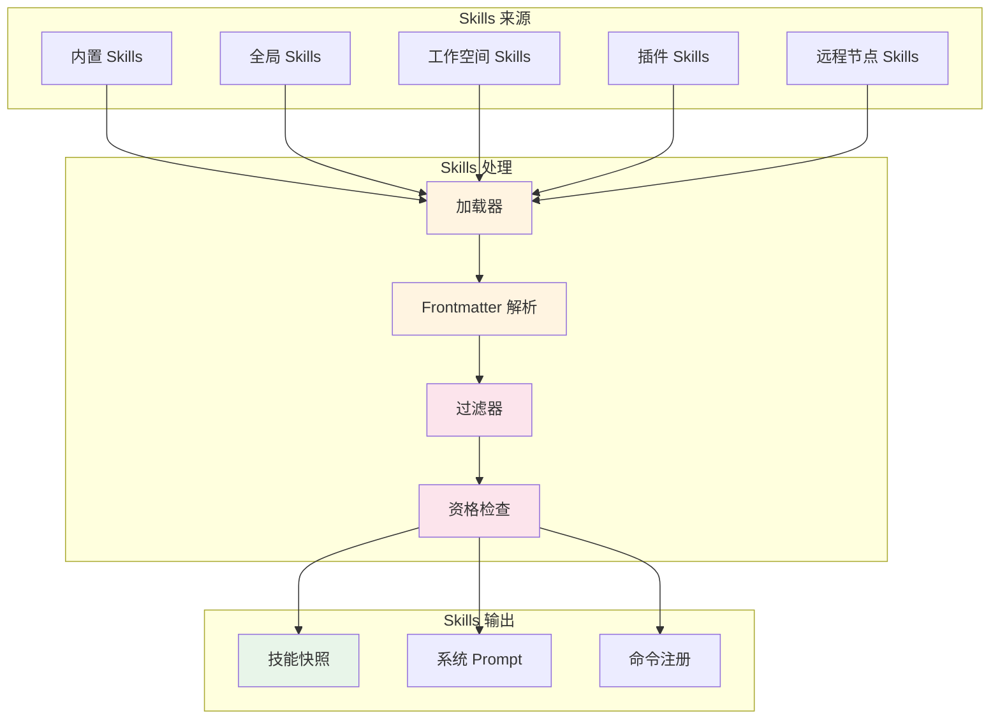
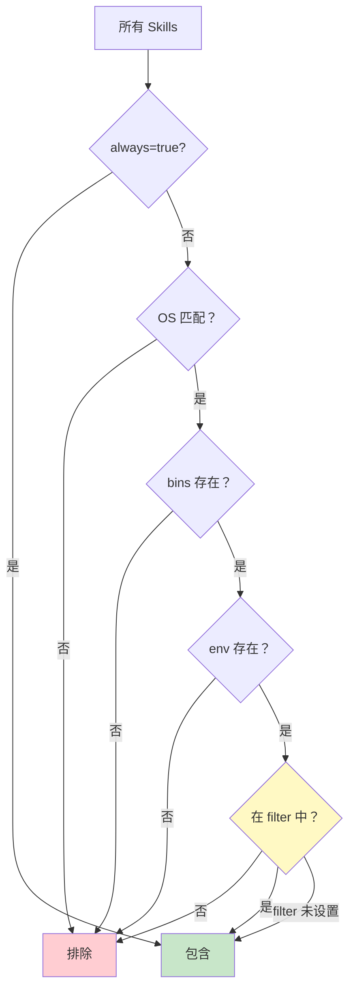

# 第 2 章 Skills 系统架构

> 本章是 OpenClaw Agent & Skills 源码解析系列的第 2 章，聚焦于 Skills 系统的完整架构。我们将深入分析 Skills 的加载机制、过滤策略、元数据系统以及快照管理。

---

## 1. Skills 系统定位

### 1.1 什么是 Skills？

**Skills** 是 OpenClaw 的**能力扩展系统**，类似于：
- **Webpack Plugins**：扩展构建能力
- **VS Code Extensions**：扩展编辑器功能
- **React Components**：可复用的功能单元

**核心定义**：
```typescript
// 源码位置：skills/types.ts
export type SkillEntry = {
  skill: Skill;                    // 技能定义
  frontmatter: ParsedSkillFrontmatter; // 元数据（YAML frontmatter）
  metadata?: OpenClawSkillMetadata;    // OpenClaw 扩展元数据
  invocation?: SkillInvocationPolicy;  // 调用策略
};
```

### 1.2 Skills 目录结构

```
~/.openclaw/skills/                 # 全局 Skills 目录
├── github/                         # GitHub 技能
│   ├── SKILL.md                    # ⭐ 技能定义（含 frontmatter）
│   ├── package.json                # 依赖配置
│   └── index.js                    # 实现代码
├── git/                            # Git 技能
│   ├── SKILL.md
│   └── index.js
└── weather/                        # 天气技能
    ├── SKILL.md
    └── index.js

{workspace}/skills/                 # 工作空间 Skills（优先级更高）
└── custom-skill/
    ├── SKILL.md
    └── index.js
```

### 1.3 Skills 系统架构



---

## 2. Skills 加载机制

### 2.1 加载流程

**源码位置**：`skills/workspace.ts`

```mermaid
sequenceDiagram
    participant WS as Workspace
    participant Loader as loadSkillEntries
    participant Parse as parseSkillFrontmatter
    participant Meta as resolveOpenClawMetadata
    participant Result as SkillEntry[]
    
    WS->>Loader: 扫描 skills 目录
    Loader->>Loader: 查找 SKILL.md 文件
    loop 每个技能目录
        Loader->>Parse: parseFrontmatter(content)
        Parse-->>Loader: frontmatter 对象
        Loader->>Meta: resolveOpenClawMetadata(frontmatter)
        Meta-->>Loader: metadata 对象
        Loader->>Loader: 构建 SkillEntry
    end
    Loader-->>Result: 返回 SkillEntry[]
    
    style Loader fill:#fff4e1
    style Parse fill:#e8f5e9
    style Meta fill:#fce4ec
```

### 2.2 核心加载函数

**源码位置**：`skills/workspace.ts`

```typescript
/**
 * 加载工作空间的 Skills
 */
function loadSkillEntries(
  workspaceDir: string,
  opts?: {
    config?: OpenClawConfig;
    managedSkillsDir?: string;
    bundledSkillsDir?: string;
  },
): SkillEntry[] {
  const limits = resolveSkillsLimits(opts?.config);
  
  // ① 加载内置 Skills
  const bundledSkills = loadSkills({
    dir: opts?.bundledSkillsDir ?? resolveBundledSkillsDir(),
    source: 'bundled',
  });
  
  // ② 加载工作空间 Skills
  const workspaceSkills = loadSkills({
    dir: workspaceDir,
    source: 'workspace',
  });
  
  // ③ 加载插件 Skills
  const pluginSkills = loadPluginSkills();
  
  // ④ 合并（工作空间优先级 > 插件 > 内置）
  const merged = mergeSkillSources([
    ...bundledSkills,
    ...pluginSkills,
    ...workspaceSkills,
  ]);
  
  return merged;
}

/**
 * 从目录加载 Skills
 */
const loadSkills = (params: { dir: string; source: string }): Skill[] => {
  const resolved = resolveNestedSkillsRoot(params.dir);
  const baseDir = resolved.baseDir;
  
  // 检查根目录是否是 skill 目录
  const rootSkillMd = path.join(baseDir, "SKILL.md");
  if (fs.existsSync(rootSkillMd)) {
    // 单个 skill 文件
    return loadSingleSkill(baseDir, rootSkillMd);
  }
  
  // 扫描子目录
  const childDirs = listChildDirectories(baseDir);
  const skills: Skill[] = [];
  
  for (const name of childDirs) {
    const skillMd = path.join(baseDir, name, "SKILL.md");
    if (fs.existsSync(skillMd)) {
      const skill = loadSingleSkill(path.join(baseDir, name), skillMd);
      skills.push(skill);
    }
  }
  
  return skills;
};
```

### 2.3 嵌套 Skills 根目录检测

**源码位置**：`skills/workspace.ts`

```typescript
/**
 * 检测嵌套的 Skills 根目录
 * 
 * 场景：/workspace/skills/github/SKILL.md
 * 期望：skills 目录作为根目录，而不是 workspace
 */
function resolveNestedSkillsRoot(
  dir: string,
  opts?: { maxEntriesToScan?: number },
): { baseDir: string; note?: string } {
  const nested = path.join(dir, "skills");
  
  // 检查 skills 子目录是否存在
  if (!fs.existsSync(nested) || !fs.statSync(nested).isDirectory()) {
    return { baseDir: dir };
  }
  
  // 启发式检测：如果 skills/*/SKILL.md 存在，则 skills 是真正的根
  const nestedDirs = listChildDirectories(nested);
  const scanLimit = opts?.maxEntriesToScan ?? 100;
  
  for (const name of nestedDirs.slice(0, scanLimit)) {
    const skillMd = path.join(nested, name, "SKILL.md");
    if (fs.existsSync(skillMd)) {
      return { 
        baseDir: nested, 
        note: `Detected nested skills root at ${nested}` 
      };
    }
  }
  
  return { baseDir: dir };
}
```

**前端类比**：
```javascript
// 类似于 Webpack 的 context 解析
// resolveNestedSkillsRoot 类似于 resolve.context
const context = dir.endsWith('/skills') ? dir : path.join(dir, 'skills');
```

---

## 3. Frontmatter 元数据系统

### 3.1 Frontmatter 格式

**示例**（`SKILL.md` 文件头部）：

```markdown
---
name: github
description: GitHub 操作技能
emoji: 🐙
homepage: https://github.com
os: [darwin, linux, win32]
requires:
  bins: [gh]
  env: [GITHUB_TOKEN]
install:
  - kind: brew
    formula: gh
    os: [darwin]
  - kind: download
    url: https://github.com/cli/cli/releases
    extract: true
---

# GitHub Skill

这个技能提供 GitHub 相关操作...
```

### 3.2 Frontmatter 解析

**源码位置**：`skills/frontmatter.ts`

```typescript
/**
 * 解析 SKILL.md 的 frontmatter
 */
export function parseFrontmatter(content: string): ParsedSkillFrontmatter {
  return parseFrontmatterBlock(content);
}

/**
 * 解析 OpenClaw 扩展元数据
 */
export function resolveOpenClawMetadata(
  frontmatter: ParsedSkillFrontmatter,
  skill: Skill,
): OpenClawSkillMetadata | undefined {
  const manifestBlock = resolveOpenClawManifestBlock(frontmatter);
  if (!manifestBlock) {
    return undefined;
  }
  
  return {
    always: parseFrontmatterBool(manifestBlock.always),
    skillKey: manifestBlock.skillKey,
    primaryEnv: manifestBlock.primaryEnv,
    emoji: manifestBlock.emoji,
    homepage: manifestBlock.homepage,
    os: resolveOpenClawManifestOs(manifestBlock.os),
    requires: resolveOpenClawManifestRequires(manifestBlock.requires),
    install: parseOpenClawManifestInstallBase(manifestBlock.install),
  };
}
```

### 3.3 元数据类型定义

**源码位置**：`skills/types.ts`

```typescript
export type OpenClawSkillMetadata = {
  always?: boolean;                    // 是否始终启用
  skillKey?: string;                   // 技能唯一标识
  primaryEnv?: string;                 // 主要环境变量
  emoji?: string;                      // 表情符号
  homepage?: string;                   // 主页 URL
  os?: string[];                       // 支持的操作系统
  requires?: {
    bins?: string[];                   // 必需的二进制文件
    anyBins?: string[];                // 可选的二进制文件（有一个即可）
    env?: string[];                    // 必需的环境变量
    config?: string[];                 // 必需的配置项
  };
  install?: SkillInstallSpec[];        // 安装规范
};
```

### 3.4 安全验证

**源码位置**：`skills/frontmatter.ts`

```typescript
/**
 * 验证 Brew Formula 安全性
 */
function normalizeSafeBrewFormula(raw: unknown): string | undefined {
  if (typeof raw !== "string") return undefined;
  const formula = raw.trim();
  
  // 安全检查
  if (!formula || formula.startsWith("-") || 
      formula.includes("\\") || formula.includes("..")) {
    return undefined;
  }
  
  // 格式验证
  if (!BREW_FORMULA_PATTERN.test(formula)) {
    return undefined;
  }
  
  return formula;
}

/**
 * 验证 NPM 包名安全性
 */
function normalizeSafeNpmSpec(raw: unknown): string | undefined {
  if (typeof raw !== "string") return undefined;
  const spec = raw.trim();
  
  if (!spec || spec.startsWith("-")) return undefined;
  
  // 使用 validateRegistryNpmSpec 验证
  if (validateRegistryNpmSpec(spec) !== null) {
    return undefined;
  }
  
  return spec;
}
```

**前端类比**：
```javascript
// 类似于 Webpack 的 schema 验证
// validateRegistryNpmSpec 类似于 schema-utils
const schema = {
  type: 'string',
  pattern: /^[A-Za-z0-9][A-Za-z0-9@+._/-]*$/
};
```

---

## 4. Skills 过滤机制

### 4.1 过滤器实现

**源码位置**：`skills/filter.ts`

```typescript
/**
 * 标准化 Skills 过滤器
 */
export function normalizeSkillFilter(
  skillFilter?: ReadonlyArray<unknown>
): string[] | undefined {
  if (skillFilter === undefined) {
    return undefined;
  }
  return skillFilter
    .map((entry) => String(entry).trim())
    .filter(Boolean);
}

/**
 * 检查技能是否匹配过滤器
 */
export function matchesSkillFilter(
  cached?: ReadonlyArray<unknown>,
  next?: ReadonlyArray<unknown>,
): boolean {
  const cachedNormalized = normalizeSkillFilterForComparison(cached);
  const nextNormalized = normalizeSkillFilterForComparison(next);
  
  if (cachedNormalized === undefined || nextNormalized === undefined) {
    return cachedNormalized === nextNormalized;
  }
  
  if (cachedNormalized.length !== nextNormalized.length) {
    return false;
  }
  
  return cachedNormalized.every((entry, index) => entry === nextNormalized[index]);
}
```

### 4.2 配置级过滤

**源码位置**：`skills/workspace.ts`

```typescript
/**
 * 过滤 Skills
 */
function filterSkillEntries(
  entries: SkillEntry[],
  config?: OpenClawConfig,
  skillFilter?: string[],
  eligibility?: SkillEligibilityContext,
): SkillEntry[] {
  // ① 基础过滤（shouldIncludeSkill）
  let filtered = entries.filter((entry) => 
    shouldIncludeSkill({ entry, config, eligibility })
  );
  
  // ② 应用 Agent 级过滤器
  if (skillFilter !== undefined) {
    const normalized = normalizeSkillFilter(skillFilter) ?? [];
    filtered = normalized.length > 0
      ? filtered.filter((entry) => normalized.includes(entry.skill.name))
      : [];
  }
  
  return filtered;
}
```

### 4.3 资格检查

**源码位置**：`skills/config.ts`

```typescript
/**
 * 检查技能是否应该包含
 */
export function shouldIncludeSkill(params: {
  entry: SkillEntry;
  config?: OpenClawConfig;
  eligibility?: SkillEligibilityContext;
}): boolean {
  const { entry, config, eligibility } = params;
  
  // ① 检查 always 标志
  if (entry.metadata?.always) {
    return true;
  }
  
  // ② 检查操作系统
  const os = entry.metadata?.os;
  if (os && os.length > 0) {
    const currentOS = resolveRuntimePlatform();
    if (!os.includes(currentOS)) {
      return false;
    }
  }
  
  // ③ 检查二进制文件
  const requires = entry.metadata?.requires;
  if (requires?.bins) {
    for (const bin of requires.bins) {
      if (!hasBinary(bin)) {
        return false;
      }
    }
  }
  
  // ④ 检查远程节点能力
  if (eligibility?.remote) {
    const remote = eligibility.remote;
    if (remote.platforms) {
      // 检查平台匹配
    }
    if (requires?.bins && !remote.hasAnyBin(requires.bins)) {
      return false;
    }
  }
  
  return true;
}
```

### 4.4 过滤流程图



---

## 5. Skills 快照系统

### 5.1 快照结构

**源码位置**：`skills/types.ts`

```typescript
export type SkillSnapshot = {
  prompt: string;                              // 格式化后的 Skills Prompt
  skills: Array<{
    name: string;
    primaryEnv?: string;
    requiredEnv?: string[];
  }>;
  skillFilter?: string[];                      // 使用的过滤器
  resolvedSkills?: Skill[];                    // 解析后的 Skills
  version?: number;                            // 快照版本号
};
```

### 5.2 快照构建

**源码位置**：`skills/workspace.ts`

```typescript
/**
 * 构建工作空间 Skills 快照
 */
export function buildWorkspaceSkillSnapshot(
  workspaceDir: string,
  opts: {
    config?: OpenClawConfig;
    eligibility?: SkillEligibilityContext;
    snapshotVersion?: number;
    skillFilter?: string[];
  },
): SkillSnapshot {
  // ① 加载 Skills
  const entries = loadWorkspaceSkillEntries(workspaceDir, { config: opts.config });
  
  // ② 过滤 Skills
  const filtered = filterWorkspaceSkillEntries(entries, {
    config: opts.config,
    skillFilter: opts.skillFilter,
    eligibility: opts.eligibility,
  });
  
  // ③ 构建 Prompt
  const prompt = buildWorkspaceSkillsPrompt(filtered, {
    maxSkillsInPrompt: 150,
    maxSkillsPromptChars: 30000,
  });
  
  // ④ 构建快照
  return {
    prompt,
    skills: filtered.map((e) => ({
      name: e.skill.name,
      primaryEnv: e.metadata?.primaryEnv,
      requiredEnv: e.metadata?.requires?.env,
    })),
    skillFilter: opts.skillFilter,
    resolvedSkills: filtered.map((e) => e.skill),
    version: opts.snapshotVersion,
  };
}
```

### 5.3 快照版本管理

**源码位置**：`skills/refresh.ts`

```typescript
/**
 * 获取快照版本号
 */
export function getSkillsSnapshotVersion(workspaceDir: string): number {
  const versionFile = path.join(workspaceDir, ".openclaw", "skills-version");
  try {
    const content = fs.readFileSync(versionFile, "utf-8");
    return parseInt(content.trim(), 10) || 0;
  } catch {
    return 0;
  }
}

/**
 *  bump 快照版本
 */
export function bumpSkillsSnapshotVersion(params: { reason?: string }): void {
  const newVersion = Date.now();
  // 写入版本文件
  fs.writeFileSync(versionFile, String(newVersion));
  log.info(`Bumped skills snapshot version: ${newVersion} (${params.reason})`);
}
```

**版本触发条件**：
- Skills 目录变化
- 远程节点连接/断开
- 配置变更

---

## 6. Skills Prompt 生成

### 6.1 Prompt 构建

**源码位置**：`skills/workspace.ts`

```typescript
/**
 * 构建 Skills Prompt
 */
export function buildWorkspaceSkillsPrompt(
  entries: SkillEntry[],
  opts: {
    maxSkillsInPrompt?: number;
    maxSkillsPromptChars?: number;
  },
): string {
  const limits = {
    maxSkillsInPrompt: opts.maxSkillsInPrompt ?? 150,
    maxSkillsPromptChars: opts.maxSkillsPromptChars ?? 30000,
  };
  
  // 使用 pi-coding-agent 的 formatSkillsForPrompt
  const skills = entries.map((e) => e.skill);
  const compactedSkills = compactSkillPaths(skills);
  
  let prompt = formatSkillsForPrompt(compactedSkills);
  
  // 截断超出限制的 Prompt
  if (prompt.length > limits.maxSkillsPromptChars) {
    prompt = prompt.slice(0, limits.maxSkillsPromptChars) + "...";
  }
  
  return prompt;
}
```

### 6.2 路径压缩优化

**源码位置**：`skills/workspace.ts`

```typescript
/**
 * 压缩技能路径（用 ~ 替换家目录）
 * 节省约 400-600 tokens
 */
function compactSkillPaths(skills: Skill[]): Skill[] {
  const home = os.homedir();
  if (!home) return skills;
  
  const prefix = home.endsWith(path.sep) ? home : home + path.sep;
  
  return skills.map((s) => ({
    ...s,
    filePath: s.filePath.startsWith(prefix)
      ? "~/" + s.filePath.slice(prefix.length)
      : s.filePath,
  }));
}
```

**效果**：
```
原始：/Users/admin/.openclaw/skills/github/SKILL.md
压缩：~/.openclaw/skills/github/SKILL.md
节省：~5-6 tokens/技能 × N 技能 ≈ 400-600 tokens
```

---

## 7. 远程 Skills 支持

### 7.1 远程节点能力

**源码位置**：`skills-remote.ts`

```typescript
/**
 * 获取远程 Skills 资格
 */
export function getRemoteSkillEligibility(): 
  SkillEligibilityContext["remote"] | undefined {
  
  const macNodes = [...remoteNodes.values()].filter(
    (node) => isMacPlatform(node.platform, node.deviceFamily) && 
              supportsSystemRun(node.commands)
  );
  
  if (macNodes.length === 0) {
    return undefined;
  }
  
  const bins = new Set<string>();
  for (const node of macNodes) {
    for (const bin of node.bins) {
      bins.add(bin);
    }
  }
  
  return {
    platforms: ["darwin"],
    hasBin: (bin) => bins.has(bin),
    hasAnyBin: (bins) => bins.some((bin) => bins.has(bin)),
    note: `Remote macOS node available.`,
  };
}
```

### 7.2 远程节点 Bin 探测

```mermaid
sequenceDiagram
    participant Local as 本地
    participant Registry as NodeRegistry
    participant Remote as 远程节点
    participant FS as 远程文件系统
    
    Local->>Registry: invoke system.which
    Registry->>Remote: 发送命令
    Remote->>FS: which gh
    FS-->>Remote: /opt/homebrew/bin/gh
    Remote-->>Registry: 返回结果
    Registry-->>Local: bins: ['gh']
    Local->>Local: 更新 remoteNodes.bins
    Local->>Local: bumpSkillsSnapshotVersion()
    
    style Local fill:#fff4e1
    style Registry fill:#e8f5e9
    style Remote fill:#e1f5ff
```

---

## 8. 本章小结

### 8.1 核心要点

1. **Skills 是能力扩展系统**，类似于 Webpack Plugins
2. **加载机制**：内置 > 插件 > 工作空间（优先级递增）
3. **Frontmatter**：YAML 元数据定义技能属性
4. **过滤系统**：OS、bins、env、Agent 过滤器多层过滤
5. **快照系统**：版本管理、增量更新
6. **远程支持**：通过节点探测扩展能力

### 8.2 前端类比总结

| Skills 概念 | 前端类比 | 说明 |
|------------|---------|------|
| Skill | Webpack Plugin | 能力扩展单元 |
| SKILL.md | package.json + README | 定义 + 文档 |
| Frontmatter | Webpack Config | 配置元数据 |
| Filter | include/exclude | 过滤规则 |
| Snapshot | Build Manifest | 构建产物清单 |
| Remote Skills | CDN Plugins | 远程能力 |

### 8.3 下章预告

在 **第 3 章：Agent 调用 Skills 机制** 中，我们将分析：
- Agent 如何加载和使用 Skills
- Skills 如何转换为系统 Prompt
- Skills 命令如何注册和执行
- 完整的调用流程时序图

---

**本章是系列解析的第 2 章**，深入剖析了 Skills 系统的完整架构。下一章我们将分析 Agent 如何调用 Skills。
