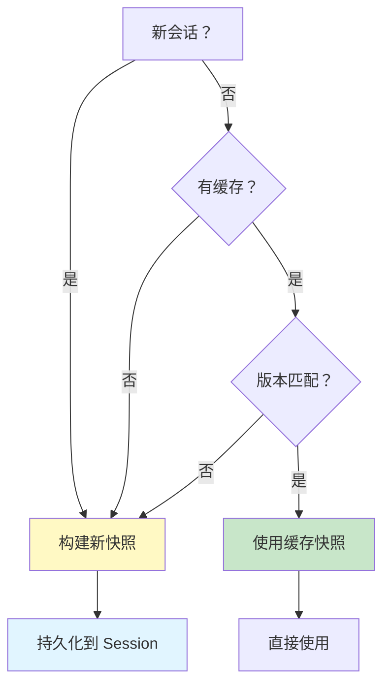
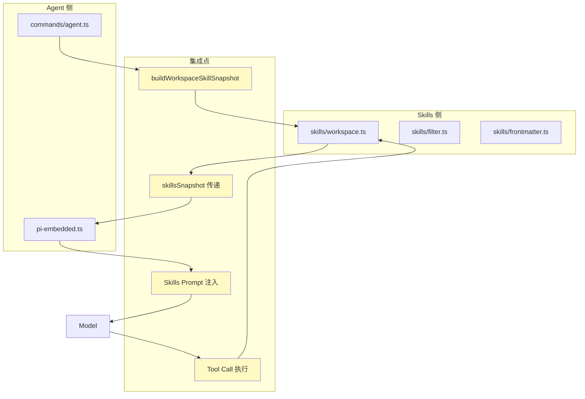

# 第 3 章 Agent 调用 Skills 机制

> 本章是 OpenClaw Agent & Skills 源码解析系列的第 3 章，聚焦于 Agent 如何加载、注册和调用 Skills。我们将深入分析 Skills 到系统 Prompt 的转换过程，以及 Skills 命令的注册和执行机制。

---

## 1. 调用流程概览

### 1.1 完整调用链路

```mermaid
sequenceDiagram
    participant User as 用户
    participant Agent as commands/agent.ts
    participant Scope as agent-scope.ts
    participant Skills as skills/workspace.ts
    Snapshot as Skills Snapshot
    participant PI as pi-embedded.ts
    participant Model as AI 模型
    participant Executor as Skill Executor
    User->>Agent: openclaw agent --message="..."
    Agent->>Scope: resolveAgentSkillsFilter()
    Scope-->>Agent: skillFilter: ['github', 'git']
    Agent->>Skills: buildWorkspaceSkillSnapshot()
    Skills->>Skills: loadWorkspaceSkillEntries()
    Skills->>Skills: filterWorkspaceSkillEntries()
    Skills->>Skills: buildWorkspaceSkillsPrompt()
    Skills-->>Agent: skillsSnapshot
    Agent->>PI: runEmbeddedPiAgent({skillsSnapshot})
    PI->>PI: 解析 skillsSnapshot.prompt
    PI->>Model: 发送请求（含 Skills Prompt）
    alt 模型需要调用 Skill
        Model-->>PI: 返回工具调用请求
        PI->>Executor: 执行 Skill 命令
        Executor->>Executor: 加载 Skill SKILL.md
        Executor->>Executor: 执行 Skill 代码
        Executor-->>PI: 返回执行结果
        PI->>Model: 发送工具调用结果
        Model-->>PI: 返回最终响应
    end
    PI-->>Agent: 返回结果
    Agent-->>User: 投递响应
    style Agent fill:#fff4e1
    style Skills fill:#fce4ec
    style PI fill:#e1f5ff
    style Executor fill:#e8f5e9
```

### 1.2 关键数据流

```typescript
// 数据流概览
User Message
    ↓
Agent Command (commands/agent.ts)
    ↓
Skills Snapshot (buildWorkspaceSkillSnapshot)
    ├── prompt: string (系统 Prompt)
    ├── skills: Array<{name, primaryEnv, requiredEnv}>
    └── version: number
    ↓
PI Agent (pi-embedded.ts)
    ↓
Model API (含 Skills Prompt)
    ↓
Tool Call Request
    ↓
Skill Executor
    ↓
Result
```

---

## 2. Skills 快照构建

### 2.1 快照构建触发时机

**源码位置**：`commands/agent.ts`

```typescript
async function agentCommandInternal(opts: AgentCommandOpts) {
  // ...
  
  // ① 判断是否需要构建新快照
  const needsSkillsSnapshot = isNewSession || !sessionEntry?.skillsSnapshot;
  const skillsSnapshotVersion = getSkillsSnapshotVersion(workspaceDir);
  
  // ② 获取 Agent 级过滤器
  const skillFilter = resolveAgentSkillsFilter(cfg, sessionAgentId);
  
  // ③ 构建快照（新会话或无缓存时）
  const skillsSnapshot = needsSkillsSnapshot
    ? buildWorkspaceSkillSnapshot(workspaceDir, {
        config: cfg,
        eligibility: { remote: getRemoteSkillEligibility() },
        snapshotVersion: skillsSnapshotVersion,
        skillFilter,
      })
    : sessionEntry?.skillsSnapshot;
  
  // ④ 持久化快照到 Session
  if (skillsSnapshot && sessionStore && sessionKey && needsSkillsSnapshot) {
    await persistSessionEntry({
      sessionStore,
      sessionKey,
      storePath,
      entry: { ...sessionEntry, skillsSnapshot },
    });
  }
  
  // ⑤ 传递给 PI Agent
  const result = await runEmbeddedPiAgent({
    // ...
    skillsSnapshot,
    // ...
  });
}
```

### 2.2 快照缓存策略



**缓存条件**：
1. **新会话**：必须构建新快照
2. **有缓存**：检查 `sessionEntry.skillsSnapshot`
3. **版本匹配**：检查 `skillsSnapshotVersion`

---

## 3. Skills 到 Prompt 的转换

### 3.1 Prompt 格式

**示例输出**：

```markdown
## Available Skills

### github 🐙
- Path: ~/.openclaw/skills/github/SKILL.md
- Description: GitHub 操作技能
- Commands: gh-pr-create, gh-issue-create, gh-repo-clone
- Requires: gh binary, GITHUB_TOKEN env

### git
- Path: ~/.openclaw/skills/git/SKILL.md
- Description: Git 版本控制技能
- Commands: git-commit, git-push, git-branch
- Requires: git binary

---
Total: 2 skills loaded
```

### 3.2 Prompt 构建源码

**源码位置**：`skills/workspace.ts`

```typescript
/**
 * 构建 Skills Prompt
 */
export function buildWorkspaceSkillsPrompt(
  entries: SkillEntry[],
  opts: {
    maxSkillsInPrompt?: number;
    maxSkillsPromptChars?: number;
  },
): string {
  const limits = resolveSkillsLimits(opts);
  
  // ① 提取 Skill 对象
  const skills = entries.map((e) => e.skill);
  
  // ② 压缩路径（节省 tokens）
  const compactedSkills = compactSkillPaths(skills);
  
  // ③ 使用 pi-coding-agent 的格式化函数
  let prompt = formatSkillsForPrompt(compactedSkills);
  
  // ④ 截断超出限制
  if (prompt.length > limits.maxSkillsPromptChars) {
    prompt = prompt.slice(0, limits.maxSkillsPromptChars) + "...";
  }
  
  // ⑤ 限制技能数量
  if (entries.length > limits.maxSkillsInPrompt) {
    skillsLogger.warn(`Truncated skills from ${entries.length} to ${limits.maxSkillsInPrompt}`);
  }
  
  return prompt;
}
```

### 3.3 格式化实现（pi-coding-agent）

**外部依赖**：`@mariozechner/pi-coding-agent`

```typescript
// pi-coding-agent 的 formatSkillsForPrompt
import { formatSkillsForPrompt } from "@mariozechner/pi-coding-agent";

/**
 * 格式化 Skills 为 Prompt
 * 
 * @param skills Skill 数组
 * @returns 格式化后的字符串
 */
export function formatSkillsForPrompt(skills: Skill[]): string {
  const lines: string[] = [];
  
  lines.push("## Available Skills\n");
  
  for (const skill of skills) {
    lines.push(`### ${skill.name} ${skill.emoji || ''}`);
    lines.push(`- Path: ${skill.filePath}`);
    lines.push(`- Description: ${skill.description}`);
    
    if (skill.commands?.length > 0) {
      lines.push(`- Commands: ${skill.commands.map(c => c.name).join(', ')}`);
    }
    
    if (skill.metadata?.requires) {
      const reqs: string[] = [];
      if (skill.metadata.requires.bins) {
        reqs.push(`${skill.metadata.requires.bins.join(', ')} binary`);
      }
      if (skill.metadata.requires.env) {
        reqs.push(`${skill.metadata.requires.env.join(', ')} env`);
      }
      if (reqs.length > 0) {
        lines.push(`- Requires: ${reqs.join(', ')}`);
      }
    }
    
    lines.push("");
  }
  
  lines.push(`---\nTotal: ${skills.length} skills loaded`);
  
  return lines.join("\n");
}
```

---

## 4. Skills 命令注册

### 4.1 命令规范

**源码位置**：`skills/types.ts`

```typescript
export type SkillCommandSpec = {
  name: string;           // 命令名称
  skillName: string;      // 所属技能
  description: string;    // 命令描述
  dispatch?: SkillCommandDispatchSpec;  // 分发规范
};

export type SkillCommandDispatchSpec = {
  kind: "tool";           // 分发类型
  toolName: string;       // 工具名称
  argMode?: "raw";        // 参数模式
};
```

### 4.2 命令名称生成

**源码位置**：`skills/workspace.ts`

```typescript
const SKILL_COMMAND_MAX_LENGTH = 32;
const SKILL_COMMAND_FALLBACK = "skill";

/**
 *  sanitization 技能命令名称
 */
function sanitizeSkillCommandName(raw: string): string {
  const normalized = raw
    .toLowerCase()
    .replace(/[^a-z0-9_]+/g, "_")
    .replace(/_+/g, "_")
    .replace(/^_+|_+$/g, "");
  
  const trimmed = normalized.slice(0, SKILL_COMMAND_MAX_LENGTH);
  return trimmed || SKILL_COMMAND_FALLBACK;
}

/**
 * 确保命令名称唯一
 */
function resolveUniqueSkillCommandName(
  base: string, 
  used: Set<string>
): string {
  const normalizedBase = base.toLowerCase();
  
  if (!used.has(normalizedBase)) {
    return base;
  }
  
  // 添加后缀确保唯一性
  for (let index = 2; index < 1000; index += 1) {
    const suffix = `_${index}`;
    const maxBaseLength = Math.max(1, SKILL_COMMAND_MAX_LENGTH - suffix.length);
    const trimmedBase = base.slice(0, maxBaseLength);
    const candidate = `${trimmedBase}${suffix}`;
    
    if (!used.has(candidate.toLowerCase())) {
      return candidate;
    }
  }
  
  // 最终回退
  const fallback = `${base.slice(0, Math.max(1, SKILL_COMMAND_MAX_LENGTH - 2))}_x`;
  return fallback;
}
```

**前端类比**：
```javascript
// 类似于 CSS 类名生成（如 CSS Modules）
// :local(.button) → button___a3b2c1
const uniqueId = generateUniqueName(baseName, usedNames);
```

### 4.3 命令构建流程

```typescript
/**
 * 构建 Skills 命令规范
 */
export function buildWorkspaceSkillCommandSpecs(
  entries: SkillEntry[],
): SkillCommandSpec[] {
  const commands: SkillCommandSpec[] = [];
  const usedNames = new Set<string>();
  
  for (const entry of entries) {
    const skill = entry.skill;
    const baseName = sanitizeSkillCommandName(skill.name);
    const uniqueName = resolveUniqueSkillCommandName(baseName, usedNames);
    
    usedNames.add(uniqueName.toLowerCase());
    
    commands.push({
      name: uniqueName,
      skillName: skill.name,
      description: skill.description.slice(0, SKILL_COMMAND_DESCRIPTION_MAX_LENGTH),
      dispatch: {
        kind: "tool",
        toolName: skill.name,
        argMode: "raw",
      },
    });
  }
  
  return commands;
}
```

---

## 5. Skills 执行机制

### 5.1 执行流程图

```mermaid
sequenceDiagram
    participant Model as AI 模型
    participant PI as PI Agent
    participant Executor as Skill Executor
    participant Skill as Skill 代码
    participant Shell as Shell/Binary
    Model->>PI: Tool Call: github {action: "pr-create"}
    PI->>Executor: executeSkill('github', args)
    Executor->>Executor: 加载 SKILL.md
    Executor->>Executor: 解析 frontmatter
    Executor->>Executor: 检查 requires (bins, env)
    alt 检查通过
        Executor->>Skill: 执行 skill 代码
        Skill->>Shell: 执行命令 (gh pr create)
        Shell-->>Skill: 命令输出
        Skill-->>Executor: 返回结果
        Executor-->>PI: 返回执行结果
        PI->>Model: Tool Result
        Model-->>PI: 最终响应
    else 检查失败
        Executor-->>PI: 返回错误（缺少依赖）
        PI->>Model: Tool Error
        Model-->>PI: 错误响应
    end
    style Executor fill:#fff4e1
    style Skill fill:#e8f5e9
    style Shell fill:#e1f5ff
```

### 5.2 执行器伪代码

```typescript
/**
 * Skill 执行器（简化版）
 */
async function executeSkill(
  skillName: string,
  args: unknown,
): Promise<SkillResult> {
  // ① 加载 Skill
  const skillEntry = loadSkillEntry(skillName);
  if (!skillEntry) {
    throw new Error(`Skill not found: ${skillName}`);
  }
  
  // ② 检查依赖
  const { metadata } = skillEntry;
  if (metadata?.requires?.bins) {
    for (const bin of metadata.requires.bins) {
      if (!hasBinary(bin)) {
        throw new Error(`Missing required binary: ${bin}`);
      }
    }
  }
  
  if (metadata?.requires?.env) {
    for (const env of metadata.requires.env) {
      if (!process.env[env]) {
        throw new Error(`Missing required env: ${env}`);
      }
    }
  }
  
  // ③ 执行 Skill 代码
  const skillModule = await import(skillEntry.skill.filePath);
  const result = await skillModule.execute(args);
  
  return {
    success: true,
    output: result,
  };
}
```

---

## 6. Agent 与 Skills 集成点

### 6.1 集成点概览



### 6.2 关键集成代码

**集成点 1：快照构建**（`commands/agent.ts`）

```typescript
const skillsSnapshot = buildWorkspaceSkillSnapshot(workspaceDir, {
  config: cfg,
  eligibility: { remote: getRemoteSkillEligibility() },
  snapshotVersion: skillsSnapshotVersion,
  skillFilter: resolveAgentSkillsFilter(cfg, sessionAgentId),
});
```

**集成点 2：快照传递**（`commands/agent.ts`）

```typescript
const result = await runEmbeddedPiAgent({
  // ...
  skillsSnapshot,  // ← 传递快照
  workspaceDir,
  // ...
});
```

**集成点 3：Prompt 注入**（`pi-embedded.ts`）

```typescript
const systemPrompt = [
  baseSystemPrompt,
  skillsSnapshot?.prompt,  // ← 注入 Skills Prompt
  extraSystemPrompt,
].filter(Boolean).join("\n\n");
```

---

## 7. 配置驱动的 Skills 管理

### 7.1 Agent 级 Skills 配置

**配置示例**（`openclaw.config.json`）：

```json
{
  "agents": {
    "list": [
      {
        "id": "dev-agent",
        "name": "开发助手",
        "skills": ["github", "git", "npm"],
        "workspace": "~/workspace-dev"
      },
      {
        "id": "ops-agent",
        "name": "运维助手",
        "skills": ["docker", "k8s", "aws"],
        "workspace": "~/workspace-ops"
      }
    ]
  }
}
```

### 7.2 配置解析

**源码位置**：`agent-scope.ts`

```typescript
export function resolveAgentSkillsFilter(
  cfg: OpenClawConfig,
  agentId: string,
): string[] | undefined {
  const config = resolveAgentConfig(cfg, agentId);
  return normalizeSkillFilter(config?.skills);
}
```

### 7.3 过滤器应用


---

## 8. 本章小结

### 8.1 核心要点

1. **快照构建**：新会话或无缓存时构建 Skills 快照
2. **Prompt 转换**：Skills → 格式化字符串 → 系统 Prompt
3. **命令注册**：唯一名称生成、描述截断、分发规范
4. **执行机制**：依赖检查 → 代码执行 → 结果返回
5. **配置驱动**：Agent 级 skills 过滤器

### 8.2 前端类比总结

| Skills 集成 | 前端类比 | 说明 |
|------------|---------|------|
| Snapshot | Build Manifest | 构建产物清单 |
| Prompt | Bundle | 打包输出 |
| Command | CLI Command | 命令行接口 |
| Executor | Plugin Runner | 插件执行器 |
| Filter | Tree Shaking | 按需加载 |

### 8.3 下章预告

在 **第 4 章：架构对比与最佳实践** 中，我们将：
- 对比 Webpack Plugin 系统
- 对比 React HOC 模式
- 总结设计亮点
- 提供最佳实践建议

---

**本章是系列解析的第 3 章**，深入分析了 Agent 调用 Skills 的完整机制。下一章我们将进行架构对比和总结最佳实践。
