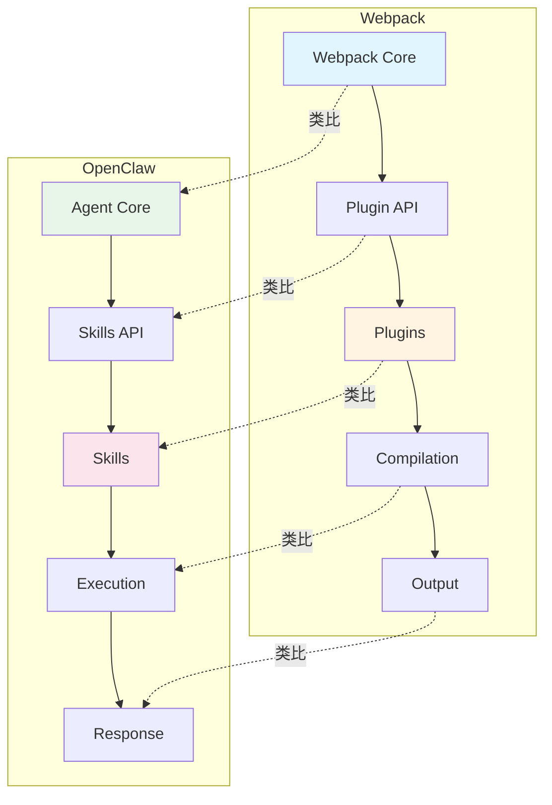
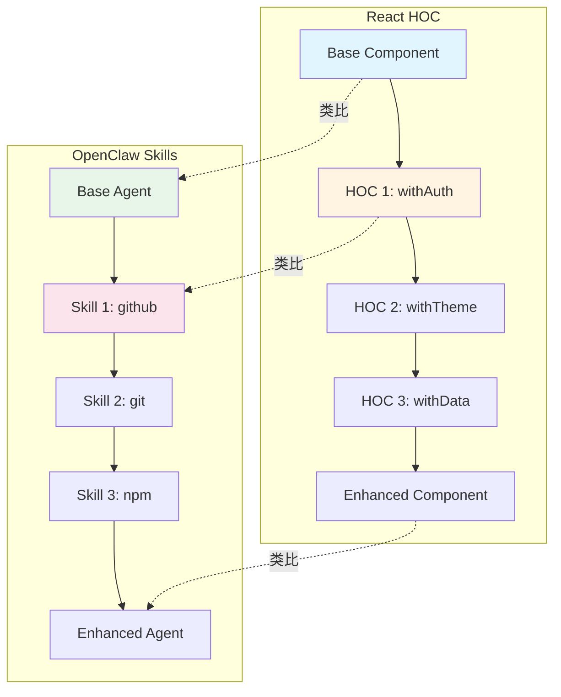
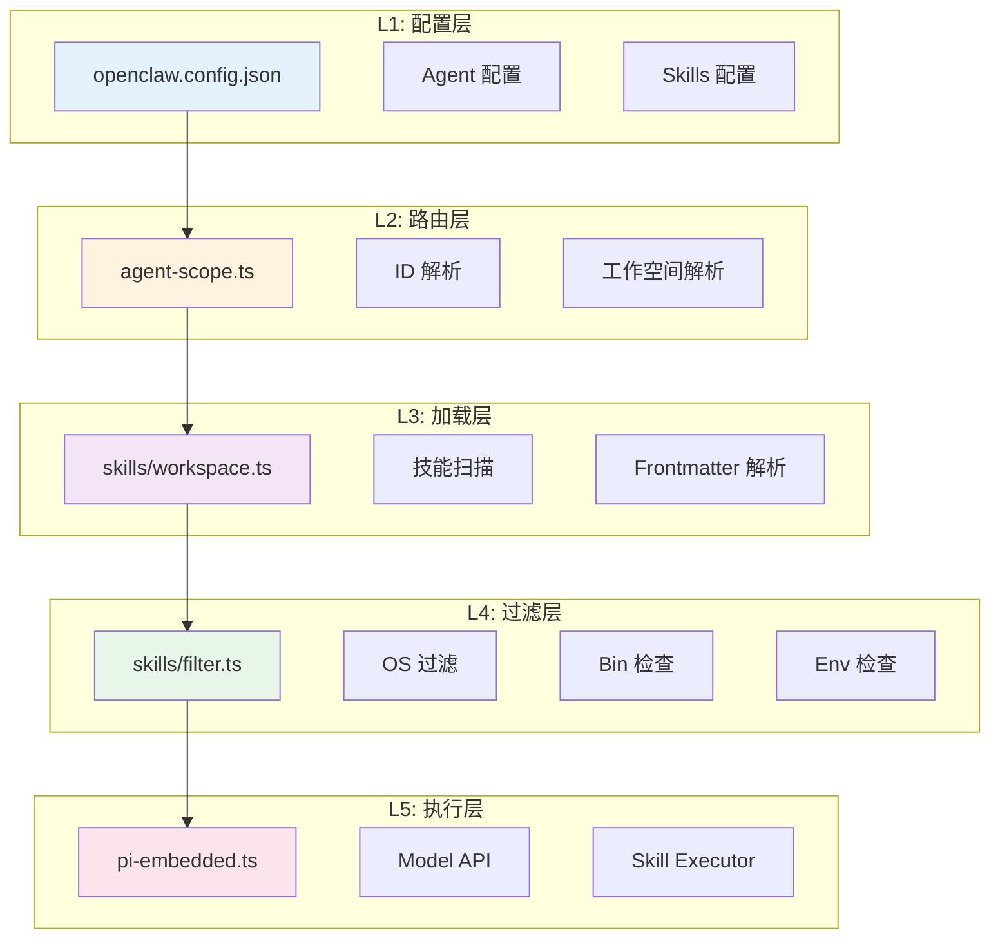
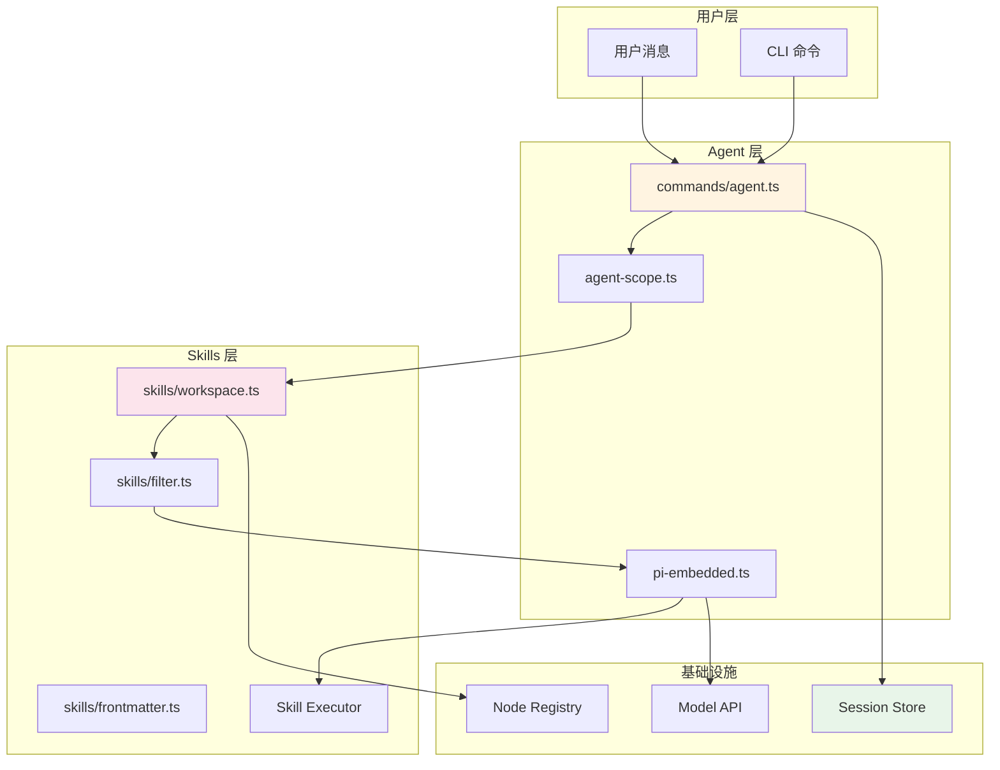

# 第 4 章 架构对比与最佳实践

> 本章是 OpenClaw Agent & Skills 源码解析系列的最后一章，聚焦于架构对比、设计亮点总结以及最佳实践建议。我们将用前端开发者熟悉的模式进行类比分析。

---

## 1. 与 Webpack Plugin 系统对比

### 1.1 架构对比



### 1.2 详细对比表


| 维度 | Webpack Plugin | OpenClaw Skills | 说明 |
|------|---------------|-----------------|------|
| **扩展点** | Compilation Hooks | Skill Commands | 扩展入口 |
| **配置方式** | `plugins: []` | `skills: []` | 数组配置 |
| **加载机制** | `require(plugin)` | `loadSkillEntries()` | 文件系统扫描 |
| **执行时机** | Build Lifecycle | Agent Run Lifecycle | 生命周期 |
| **上下文** | Compilation Object | Skill Context | 执行环境 |
| **过滤** | `include/exclude` | `skillFilter` | 按需加载 |
| **依赖检查** | `peerDependencies` | `requires.bins/env` | 依赖验证 |


### 1.3 代码对比

**Webpack Plugin**：
```javascript
// webpack.config.js
module.exports = {
  plugins: [
    new HtmlWebpackPlugin({ template: './src/index.html' }),
    new CopyPlugin({ patterns: [{ from: 'public' }] }),
  ],
};

// plugin.js
class MyPlugin {
  apply(compiler) {
    compiler.hooks.emit.tapAsync('MyPlugin', (compilation, callback) => {
      // 操作 compilation.assets
      callback();
    });
  }
}
```

**OpenClaw Skills**：
```typescript
// openclaw.config.json
{
  "agents": [{
    "id": "dev-agent",
    "skills": ["github", "git", "npm"]
  }]
}

// SKILL.md
---
name: github
description: GitHub 操作技能
requires:
  bins: [gh]
  env: [GITHUB_TOKEN]
---

// index.js
export async function execute(args) {
  // 执行 GitHub 操作
  return await gh(args);
}
```

### 1.4 设计模式对比


| 模式 | Webpack | OpenClaw | 说明 |
|------|---------|----------|------|
| **Tapable** | Hooks 系统 | Skill Commands | 事件驱动 |
| **Loader** | 文件转换 | Frontmatter 解析 | 预处理 |
| **Plugin** | 功能扩展 | Skills | 能力扩展 |
| **Compilation** | 构建上下文 | Agent Context | 执行上下文 |


---

## 2. 与 React HOC 模式对比

### 2.1 架构对比



### 2.2 代码对比

**React HOC**：
```jsx
// 基础组件
function Agent({ message }) {
  return <div>{message}</div>;
}

// HOC 1: 添加认证
function withAuth(WrappedComponent) {
  return function Authenticated(props) {
    const { user } = useAuth();
    if (!user) return <Login />;
    return <WrappedComponent {...props} user={user} />;
  };
}

// HOC 2: 添加主题
function withTheme(WrappedComponent) {
  return function Themed(props) {
    const theme = useTheme();
    return <WrappedComponent {...props} theme={theme} />;
  };
}

// 组合 HOC
const EnhancedAgent = withTheme(withAuth(Agent));
```

**OpenClaw Skills**：
```typescript
// 基础 Agent
const baseAgent = createAgent({ /* ... */ });

// Skill 1: GitHub
const withGithub = withSkill('github', {
  requires: { bins: ['gh'], env: ['GITHUB_TOKEN'] },
});

// Skill 2: Git
const withGit = withSkill('git', {
  requires: { bins: ['git'] },
});

// 组合 Skills
const enhancedAgent = withGit(withGithub(baseAgent));

// 等价于配置方式
const enhancedAgent = createAgent({
  skills: ['github', 'git'],
});
```

### 2.3 设计模式对比


| 模式 | React HOC | OpenClaw Skills | 说明 |
|------|-----------|-----------------|------|
| **组合** | `hoc1(hoc2(Component))` | `withSkill1(withSkill2(agent))` | 函数组合 |
| **Props 注入** | `props.user` | `skill.context` | 上下文注入 |
| **条件渲染** | `if (!user) return <Login />` | `if (!hasBinary) return error` | 条件执行 |
| **生命周期** | `useEffect` | `onExecute` | 生命周期钩子 |


---

## 3. 与 Vue Mixins 对比

### 3.1 代码对比

**Vue Mixins**：
```javascript
// mixins/github.js
export const githubMixin = {
  data() {
    return { ghToken: process.env.GITHUB_TOKEN };
  },
  methods: {
    async createPR(title, body) {
      return await gh.pr.create({ title, body });
    }
  },
  created() {
    if (!this.ghToken) {
      console.warn('GITHUB_TOKEN not set');
    }
  }
};

// 使用
export default {
  mixins: [githubMixin],
  methods: {
    async submit() {
      await this.createPR('My PR', 'Description');
    }
  }
};
```

**OpenClaw Skills**：
```markdown
---
name: github
requires:
  env: [GITHUB_TOKEN]
---

# GitHub Skill

提供 GitHub 操作能力。

## Commands

### gh-pr-create
创建 Pull Request。
```

**对比分析**：

| 维度 | Vue Mixins | OpenClaw Skills |
|------|-----------|-----------------|
| **复用方式** | `mixins: []` | `skills: []` |
| **命名冲突** | 可能冲突 | 唯一名称生成 |
| **依赖检查** | 运行时检查 | 启动时检查 |
| **文档** | 代码注释 | SKILL.md frontmatter |


---

## 4. 设计亮点总结

### 4.1 分层架构



**亮点**：
1. **职责分离**：每层有明确的职责边界
2. **可测试性**：各层可独立测试
3. **可扩展性**：新增功能不影响其他层

### 4.2 快照系统

**亮点**：
1. **增量更新**：版本管理，避免重复加载
2. **持久化**：Session 级缓存
3. **路径压缩**：节省 400-600 tokens

### 4.3 安全验证

**亮点**：
1. **Frontmatter 验证**：Brew/NPM/Go 包名安全验证
2. **依赖检查**：bins/env 启动时验证
3. **路径 sanitization**：防止路径遍历攻击

### 4.4 类型安全

**亮点**：
1. **完整 TypeScript**：所有模块都有类型定义
2. **配置验证**：运行时类型检查
3. **智能提示**：IDE 友好

---

## 5. 最佳实践建议

### 5.1 Skill 开发最佳实践

#### ✅ 推荐：清晰的 Frontmatter

```markdown
---
name: github
description: GitHub 操作技能（PR、Issue、Repo）
emoji: 🐙
homepage: https://github.com
os: [darwin, linux, win32]
requires:
  bins: [gh]
  env: [GITHUB_TOKEN]
install:
  - kind: brew
    formula: gh
    os: [darwin]
  - kind: download
    url: https://github.com/cli/cli/releases
---
```

#### ✅ 推荐：错误处理

```javascript
// index.js
export async function execute(args) {
  try {
    // 检查依赖
    if (!process.env.GITHUB_TOKEN) {
      throw new Error('GITHUB_TOKEN is required');
    }
    
    // 执行业务逻辑
    const result = await gh(args);
    
    return {
      success: true,
      output: result,
    };
  } catch (error) {
    return {
      success: false,
      error: error.message,
    };
  }
}
```

#### ❌ 避免：硬编码路径

```javascript
// ❌ 不推荐
const ghPath = '/opt/homebrew/bin/gh';

// ✅ 推荐
const ghPath = process.env.GH_PATH || 'gh';
```

### 5.2 Agent 配置最佳实践

#### ✅ 推荐：按场景分离 Agent

```json
{
  "agents": {
    "list": [
      {
        "id": "dev-agent",
        "name": "开发助手",
        "skills": ["github", "git", "npm", "jest"],
        "workspace": "~/workspace-dev"
      },
      {
        "id": "ops-agent",
        "name": "运维助手",
        "skills": ["docker", "k8s", "aws", "terraform"],
        "workspace": "~/workspace-ops"
      },
      {
        "id": "general-agent",
        "name": "通用助手",
        "skills": ["search", "browser", "files"],
        "default": true
      }
    ]
  }
}
```

#### ✅ 推荐：Skills 过滤器

```json
{
  "agents": {
    "list": [
      {
        "id": "minimal-agent",
        "skills": ["files", "search"],
        "sandbox": "strict"
      }
    ]
  }
}
```

### 5.3 性能优化最佳实践

#### 优化 1：减少 Skills 数量

```typescript
// ❌ 加载所有 Skills
const skills = loadAllSkills();

// ✅ 按需加载
const skills = loadSkills({ filter: ['github', 'git'] });
```

#### 优化 2：利用快照缓存

```typescript
// ❌ 每次都构建新快照
const snapshot = buildWorkspaceSkillSnapshot();

// ✅ 检查缓存
const snapshot = sessionEntry?.skillsSnapshot || 
                 buildWorkspaceSkillSnapshot();
```

#### 优化 3：路径压缩

```typescript
// 自动压缩，节省 tokens
const compacted = compactSkillPaths(skills);
```

### 5.4 调试最佳实践

#### 技巧 1：查看 Skills 状态

```bash
openclaw skills status
```

#### 技巧 2：查看 Agent 配置

```bash
openclaw agents list
openclaw agents identity --agent=dev-agent
```

#### 技巧 3：启用调试日志

```bash
OPENCLAW_LOG_LEVEL=debug openclaw agent --message="..."
```

---

## 6. 常见问题解答

### Q1: Skills 不生效怎么办？

**排查步骤**：
1. 检查 `SKILL.md` 是否存在
2. 检查 frontmatter 格式是否正确
3. 检查 `requires.bins` 是否存在
4. 检查 `requires.env` 是否设置
5. 检查 Agent 配置中的 `skills` 过滤器

### Q2: 如何调试 Skill 执行？

**方法**：
```bash
# 启用详细日志
OPENCLAW_LOG_LEVEL=debug openclaw agent --message="..."

# 查看 Skills 状态
openclaw skills status --verbose
```

### Q3: 如何创建自定义 Skill？

**步骤**：
1. 创建目录：`mkdir -p ~/.openclaw/skills/my-skill`
2. 创建 `SKILL.md`：编写 frontmatter 和文档
3. 创建 `index.js`：实现 `execute` 函数
4. 测试：`openclaw agent --message="使用 my-skill"`

### Q4: Skills 加载顺序是什么？

**优先级**：
```
工作空间 Skills > 插件 Skills > 全局 Skills > 内置 Skills
```

---

## 7. 系列总结

### 7.1 完整架构回顾



### 7.2 核心概念总结


| 概念 | 说明 | 关键文件 |
|------|------|---------|
| **Agent** | AI 助手实例 | `agent-scope.ts` |
| **Skills** | 能力扩展 | `skills/workspace.ts` |
| **Snapshot** | 技能快照 | `skills/refresh.ts` |
| **Filter** | 过滤器 | `skills/filter.ts` |
| **Frontmatter** | 元数据 | `skills/frontmatter.ts` |
| **Executor** | 执行器 | `pi-embedded.ts` |


### 7.3 前端类比总结


| OpenClaw | 前端类比 | 核心思想 |
|---------|---------|---------|
| Agent | React App | 应用实例 |
| Skills | Webpack Plugins | 能力扩展 |
| Snapshot | Build Manifest | 构建产物 |
| Filter | Tree Shaking | 按需加载 |
| Frontmatter | package.json | 配置元数据 |
| Executor | Plugin Runner | 执行引擎 |


---

## 8. 输出文件清单

本系列共 4 章，输出到以下文件：


| 文件 | 章节 | 内容 |
|------|------|------|
| `ch01-agent-architecture.md` | 第 1 章 | Agent 系统架构 |
| `ch02-skills-system.md` | 第 2 章 | Skills 系统架构 |
| `ch03-agent-skills-integration.md` | 第 3 章 | Agent 调用 Skills 机制 |
| `ch04-architecture-comparison.md` | 第 4 章 | 架构对比与最佳实践 |


**输出目录**：`/home/admin/.openclaw/workspace-source-code/output/openclaw-agent-skills/`

---

**🎉 恭喜！OpenClaw Agent & Skills 源码解析系列已全部完成！**

希望本系列能帮助你深入理解 OpenClaw 的 Agent 和 Skills 系统设计，并在实际开发中更好地使用和扩展它。
