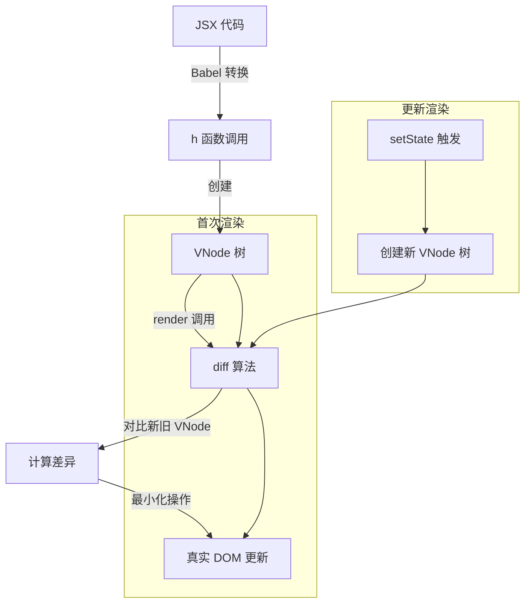
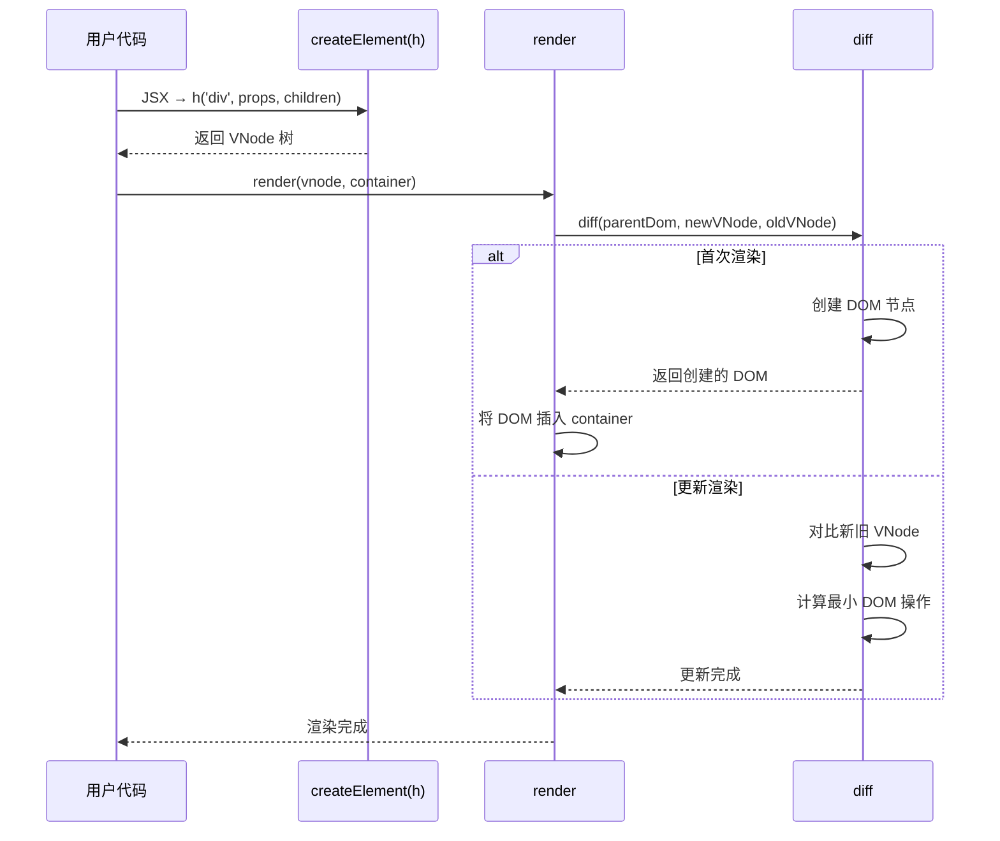

# 第 1 章：Preact 架构概览与虚拟 DOM 设计

> **本章是《Preact 源码解析》系列的第 1 章**，聚焦于建立整体认知框架。在开始深入源码之前，我们需要理解 Preact 的设计哲学、核心模块划分，以及虚拟 DOM 的运作机制。

---

## 1.1 Preact 是什么？

**Preact** 是一个只有 **3kB** 大小的轻量级前端框架，提供了与 React 相同的现代 API。它的核心设计目标是：

- ⚡ **极致轻量** - 压缩后仅 3kB，比 React 小 10 倍以上
- 🎯 **API 兼容** - ES6 Class、Hooks、Functional Components 全部支持
- 🚀 **高性能** - 高度优化的 diff 算法，无缝支持服务端渲染（SSR）
- 🔧 **生态丰富** - 通过 `preact/compat` 可无缝使用 React 生态

### 为什么选择 Preact？

如果你正在开发一个对**包体积敏感**的项目（如移动端 H5、小程序、低带宽环境），Preact 是绝佳选择。它的 API 与 React 几乎一致，迁移成本极低，但能显著减少首屏加载时间。

---

## 1.2 源码目录结构

Preact 的源码组织非常清晰，采用**模块化拆分**策略：

```
preact-10.28.4/
├── src/                      # 核心源码目录
│   ├── index.js              # 📍 入口文件，导出所有公共 API
│   ├── create-element.js     # createElement(h 函数)、VNode 创建
│   ├── render.js             # render() 渲染入口
│   ├── component.js          # Component 基类、生命周期
│   ├── create-context.js     # Context API 实现
│   ├── clone-element.js      # cloneElement 实现
│   ├── options.js            # 全局配置选项
│   ├── constants.js          # 常量定义（NULL、UNDEFINED 等）
│   ├── util.js               # 工具函数
│   ├── internal.d.ts         # TypeScript 类型定义
│   └── diff/                 # 📍 diff 算法核心目录
│       ├── index.js          # diff 主函数
│       ├── children.js       # 子节点 diff
│       ├── props.js          # 属性更新
│       └── catch-error.js    # 错误边界处理
├── hooks/                    # Hooks 实现
│   └── src/index.js          # useState、useEffect 等
├── compat/                   # React 兼容性层
├── jsx-runtime/              # JSX 运行时
├── debug/                    # 开发调试工具
└── test-utils/               # 测试工具
```

**关键观察**：

1. **核心逻辑集中在 `src/` 目录** - 约 10 个文件，总代码量可控
2. **diff 算法独立成目录** - 说明这是框架的核心复杂度所在
3. **Hooks 单独拆分** - 可选功能，按需引入

---

## 1.3 核心 API 与导出

让我们从入口文件开始，看看 Preact 导出了什么：

```javascript
// 文件：src/index.js
// 作用：核心 API 导出入口

export { render, hydrate } from './render';
export {
  createElement,
  createElement as h,           // h 是 createElement 的别名
  Fragment,
  createRef,
  isValidElement
} from './create-element';
export { BaseComponent as Component } from './component';
export { cloneElement } from './clone-element';
export { createContext } from './create-context';
export { toChildArray } from './diff/children';
export { default as options } from './options';
```

**解读**：
| 导出项 | 作用 | 对应源码 |
|--------|------|---------|
| `render` | 将 VNode 树渲染到 DOM | `src/render.js` |
| `h` / `createElement` | 创建 VNode | `src/create-element.js` |
| `Component` | 类组件基类 | `src/component.js` |
| `Fragment` | 片段组件（不产生真实 DOM） | `src/create-element.js` |
| `createContext` | Context API | `src/create-context.js` |
| `options` | 全局配置（钩子函数） | `src/options.js` |

---

## 1.4 虚拟 DOM（VNode）设计

### 1.4.1 为什么需要虚拟 DOM？

**虚拟 DOM**（Virtual DOM）是 Preact（以及 React）的核心抽象。它的本质是一个**轻量级的 JavaScript 对象**，用于描述 UI 应该长什么样。

```javascript
// 这是你写的 JSX
const element = <h1 className="title">Hello World</h1>;

// 这是转换后的 VNode（虚拟节点）
{
  type: 'h1',
  props: {
    className: 'title',
    children: 'Hello World'
  },
  key: null,
  ref: null,
  // ... 其他内部字段
}
```

**关键优势**：

1. **跨平台抽象** - VNode 可以渲染到 DOM、Native、Canvas 等不同环境
2. **批量更新** - 多次 `setState` 只触发一次真实 DOM 操作
3. **diff 优化** - 通过对比两棵 VNode 树，最小化 DOM 操作

### 1.4.2 VNode 的完整结构

Preact 的 VNode 包含 **12 个字段**，每个字段都有特定用途：

```javascript
// 文件：src/create-element.js
// 函数：createVNode() - 创建 VNode 的内部函数

const vnode = {
  type,           // 节点类型：字符串（'div'）或函数（Component）
  props,          // 属性对象（包含 children）
  key,            // 列表渲染时的唯一标识
  ref,            // 用于获取真实 DOM 或组件实例
  _children: NULL,// 指向子节点数组
  _parent: NULL,  // 指向父节点
  _depth: 0,      // 在树中的深度
  _dom: NULL,     // 指向真实 DOM 节点
  _component: NULL,// 指向组件实例（如果是组件 VNode）
  constructor: UNDEFINED, // 固定为 undefined（防止 JSON 注入攻击）
  _original: original == NULL ? ++vnodeId : original, // 创建顺序 ID
  _index: -1,     // 在兄弟节点中的索引
  _flags: 0       // 内部状态标志（如 SUSPENDED、HYDRATE）
};
```

**重点字段解读**：
| 字段 | 作用 | 示例 |
|------|------|------|
| `type` | 节点类型 | `'div'` 或 `function App()` |
| `props` | 属性集合 | `{ className: 'title', children: 'Hello' }` |
| `_dom` | 真实 DOM 引用 | `<h1 class="title">` |
| `_component` | 组件实例引用 | `App { props: {...}, state: {...} }` |
| `_children` | 子节点数组 | `[VNode, VNode, ...]` |

---

## 1.5 核心流程：从 JSX 到 DOM

Preact 的工作流程可以概括为三个阶段：



### 流程详解

**阶段 1：JSX → VNode**

```javascript
// 你写的 JSX
const App = () => <div className="app">Hello</div>;

// Babel 转换后（配置 jsxFactory: h）
const App = () => h('div', { className: 'app' }, 'Hello');

// 执行 h() 后生成的 VNode
{
  type: 'div',
  props: {
    className: 'app',
    children: 'Hello'
  },
  key: null,
  ref: null,
  _children: null,
  _parent: null,
  _depth: 0,
  _dom: null,
  // ...
}
```

**阶段 2：VNode → DOM（首次渲染）**

```javascript
// 文件：src/render.js
// 函数：render(vnode, parentDom)

render(<App />, document.body);
// 1. 创建根 VNode
// 2. 调用 diff() 进行首次渲染
// 3. 将生成的 DOM 插入 parentDom
```

**阶段 3：状态更新 → 重新渲染**

```javascript
// 组件内部调用 setState
this.setState({ count: 1 });
// 1. 合并 state
// 2. 调用 render() 创建新 VNode 树
// 3. diff 对比新旧 VNode
// 4. 更新真实 DOM
```

---

## 1.6 三大核心函数协作关系

Preact 的核心由三个函数驱动：


| 函数 | 职责 | 源码位置 |
|------|------|---------|
| `createElement()` | 创建 VNode 树 | `src/create-element.js` |
| `render()` | 渲染入口，调用 diff | `src/render.js` |
| `diff()` | 对比 VNode，更新 DOM | `src/diff/index.js` |

---

## 1.7 关键设计亮点

### 1.7.1 极致轻量化策略

Preact 通过以下手段实现 3kB 体积：
| 策略 | 说明 | 示例 |
|------|------|------|
| **单字段命名** | 内部字段用 `_dom` 而非 `_domNode` | 节省字节 |
| **常量复用** | `NULL`、`UNDEFINED`、`EMPTY_ARR` 全局复用 | 减少重复定义 |
| **简化 API** | 不支持 React 所有 API（如 PropTypes） | 聚焦核心 |
| **内联优化** | 小函数直接内联，减少调用开销 | 见 diff 源码 |

### 1.7.2 防止 JSON 注入攻击

注意 VNode 的 `constructor` 字段被固定为 `undefined`：

```javascript
// 文件：src/create-element.js
constructor: UNDEFINED,

// 验证函数
export const isValidElement = vnode =>
  vnode != NULL && vnode.constructor === UNDEFINED;
```

**为什么？** 防止恶意代码通过 `JSON.parse()` 注入伪造的 VNode。

---

## 1.8 本章小结
| 知识点 | 核心内容 |
|--------|---------|
| **Preact 定位** | 3kB 轻量化 React 替代方案 |
| **源码结构** | `src/` 核心 + `hooks/` + `compat/` |
| **VNode 结构** | 12 个字段的 JavaScript 对象 |
| **核心流程** | JSX → VNode → diff → DOM |
| **三大函数** | `createElement`、`render`、`diff` |

---

## 📖 下一章预告

**第 2 章：h 函数与 VNode 创建机制**

我们将深入 `createElement()` 的实现细节：

- JSX 如何转换为 `h()` 调用？
- `key` 和 `ref` 是如何从 props 中提取的？
- `defaultProps` 何时合并？
- `options.vnode` 钩子的作用是什么？

---

**本章源码阅读清单**：
| 文件 | 行数 | 阅读重点 |
|------|------|---------|
| `src/index.js` | 15 行 | 导出 API |
| `src/create-element.js` | 90 行 | VNode 创建完整逻辑 |
| `src/constants.js` | 20 行 | 常量定义 |

---

> ✅ **第 1 章完成**  
> 📁 文件位置：`/home/admin/.openclaw/workspace-source-code/output/preactAnalysis/ch01-architecture-overview.md`  
> ⏭️ 请输入 **"继续下一章"** 开始第 2 章
