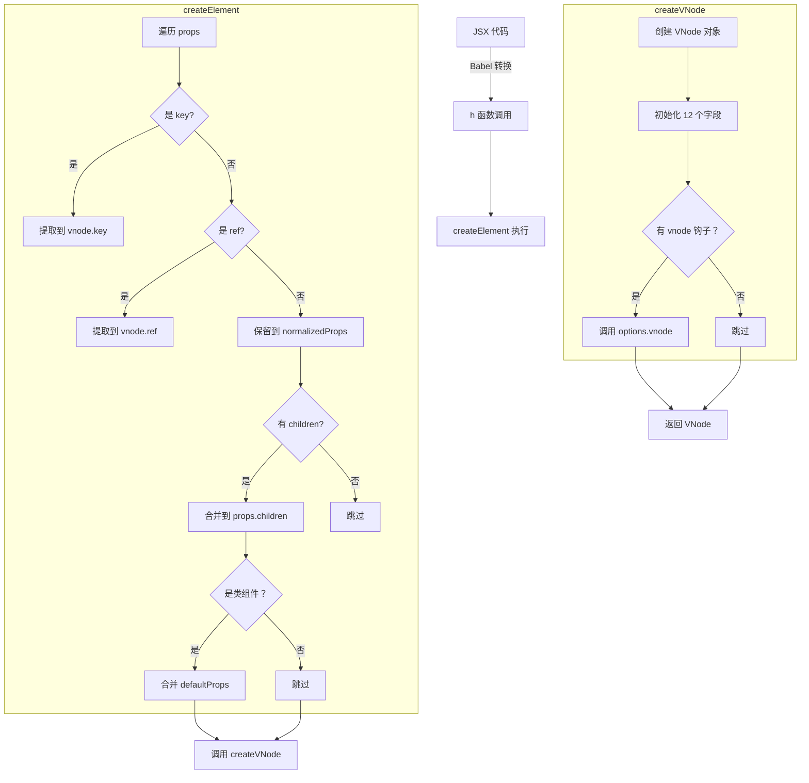

# 第 2 章：h 函数与 VNode 创建机制

> **本章是《Preact 源码解析》系列的第 2 章**，聚焦于 `createElement()`（别名 `h`）的完整实现。我们将深入 JSX 转换、props 处理、key/ref 提取、defaultProps 合并，以及 VNode 创建的每一个细节。

---

## 2.1 从 JSX 到 h() 调用

### 2.1.1 Babel 如何转换 JSX？

当你在代码中写 JSX 时，Babel 会将其转换为 `h()` 函数调用。这个转换过程由 `babel-plugin-transform-react-jsx` 完成。

**示例对比**：

```jsx
// 你写的 JSX
const element = (
  <div className="app">
    <h1 title="hello">Hello World</h1>
    <p>{userName}，欢迎使用 Preact</p>
  </div>
);
```

```javascript
// Babel 转换后（配置 jsxFactory: h）
const element = h(
  'div',
  { className: 'app' },
  h('h1', { title: 'hello' }, 'Hello World'),
  h('p', null, userName, '，欢迎使用 Preact')
);
```

**关键观察**：

1. **标签名变字符串** - `<div>` → `'div'`
2. **属性变对象** - `className="app"` → `{ className: 'app' }`
3. **子节点变参数** - 所有 children 作为第 3 个及后续参数传入
4. **表达式保留** - `{userName}` 直接作为变量传入

### 2.1.2 全局配置 jsxFactory

在项目中配置 `h` 为 JSX factory 有两种方式：

**方式 1：Babel 配置（推荐）**

```json
// .babelrc 或 babel.config.js
{
  "plugins": [
    ["@babel/plugin-transform-react-jsx", {
      "pragma": "h"  // 使用 h 而不是 React.createElement
    }]
  ]
}
```

**方式 2：文件级注释**

```javascript
/** @jsx h */
// 告诉 Babel 这个文件使用 h 作为 JSX factory
```

**方式 3：TypeScript 配置**

```json
// tsconfig.json
{
  "compilerOptions": {
    "jsxFactory": "h",
    "jsxFragmentFactory": "Fragment"
  }
}
```

---

## 2.2 createElement() 完整实现

让我们逐行分析 `createElement()` 的源码：

```javascript
// 文件：src/create-element.js
// 函数：createElement(type, props, children)

export function createElement(type, props, children) {
  let normalizedProps = {},
    key,
    ref,
    i;
  
  // 步骤 1: 遍历 props，提取 key 和 ref
  for (i in props) {
    if (i == 'key') key = props[i];
    else if (i == 'ref') ref = props[i];
    else normalizedProps[i] = props[i];
  }

  // 步骤 2: 处理 children 参数
  if (arguments.length > 2) {
    normalizedProps.children =
      arguments.length > 3 ? slice.call(arguments, 2) : children;
  }

  // 步骤 3: 合并 defaultProps（仅针对类组件）
  if (typeof type == 'function' && type.defaultProps != NULL) {
    for (i in type.defaultProps) {
      if (normalizedProps[i] === UNDEFINED) {
        normalizedProps[i] = type.defaultProps[i];
      }
    }
  }

  // 步骤 4: 创建并返回 VNode
  return createVNode(type, normalizedProps, key, ref, NULL);
}
```

---

## 2.3 关键步骤详解

### 2.3.1 步骤 1：提取 key 和 ref

```javascript
for (i in props) {
  if (i == 'key') key = props[i];
  else if (i == 'ref') ref = props[i];
  else normalizedProps[i] = props[i];
}
```

**为什么要把 key 和 ref 从 props 中分离？**
| 原因 | 说明 |
|------|------|
| **key 用于 diff 优化** | key 是 diff 算法的输入，不应该传递给组件 |
| **ref 用于获取实例** | ref 需要特殊处理，存储到 VNode 的 `ref` 字段 |
| **避免 props 污染** | 组件内部不应该通过 `this.props.key` 访问 key |

**示例对比**：

```jsx
// JSX
<MyComponent key="123" ref={myRef} name="test" />

// 转换后的 h() 调用
h(MyComponent, { 
  key: '123',      // 会被提取到 vnode.key
  ref: myRef,      // 会被提取到 vnode.ref
  name: 'test'     // 保留在 props 中，组件可通过 this.props.name 访问
});

// 最终 VNode 结构
{
  type: MyComponent,
  key: '123',      // ✅ 独立字段
  ref: myRef,      // ✅ 独立字段
  props: {
    name: 'test'   // ✅ 组件可访问
    // ⚠️ 注意：key 和 ref 不在 props 中
  }
}
```

### 2.3.2 步骤 2：处理 children 参数

```javascript
if (arguments.length > 2) {
  normalizedProps.children =
    arguments.length > 3 ? slice.call(arguments, 2) : children;
}
```

**这段代码在做什么？**

JSX 中的子节点会被 Babel 转换为 `h()` 的第 3 个及后续参数：

```jsx
// JSX
<div>
  <span>Child 1</span>
  <span>Child 2</span>
</div>

// Babel 转换
h('div', null, 
  h('span', null, 'Child 1'),  // 第 3 个参数
  h('span', null, 'Child 2')   // 第 4 个参数
);

// createElement 接收到的 arguments
arguments[0] = 'div'
arguments[1] = null
arguments[2] = h('span', null, 'Child 1')
arguments[3] = h('span', null, 'Child 2')
```

**处理逻辑**：
| 场景 | arguments 长度 | 处理方式 |
|------|---------------|---------|
| 无子节点 | `length === 2` | 不处理，children 为 undefined |
| 单个子节点 | `length === 3` | `props.children = arguments[2]` |
| 多个子节点 | `length > 3` | `props.children = [arg2, arg3, ...]` |

**使用 `slice.call` 的原因**：

```javascript
// 当有多个 children 时，需要转换为数组
slice.call(arguments, 2);  // [arg2, arg3, arg4, ...]

// 为什么不用 Array.from 或 [...arguments]？
// 答案：为了节省字节！slice 已经在 util.js 中定义，直接复用
```

### 2.3.3 步骤 3：合并 defaultProps

```javascript
if (typeof type == 'function' && type.defaultProps != NULL) {
  for (i in type.defaultProps) {
    if (normalizedProps[i] === UNDEFINED) {
      normalizedProps[i] = type.defaultProps[i];
    }
  }
}
```

**仅针对类组件** - 注意条件 `typeof type == 'function'`，这意味着：

- ✅ **类组件** - `function MyComponent() {}` 会应用 defaultProps
- ❌ **DOM 元素** - `'div'`、`'span'` 等字符串不会应用
- ⚠️ **函数组件** - 在 Preact 中，函数组件的 defaultProps **不会**在这里处理（这是 Preact 与 React 的一个差异）

**示例**：

```javascript
// 类组件定义
class Button extends Component {
  static defaultProps = {
    color: 'blue',
    size: 'medium'
  };
  
  render() {
    return <button style={{ color: this.props.color }}>Click</button>;
  }
}

// 使用组件时只传了部分 props
<Button size="large" />

// Preact 会合并 defaultProps
// 最终组件接收到的 props:
{
  size: 'large',      // 用户传入的优先
  color: 'blue'       // 使用 defaultProps 的默认值
}
```

**关键细节**：

```javascript
if (normalizedProps[i] === UNDEFINED)
```

只有当用户**没有传入**该 prop 时（值为 `undefined`），才使用默认值。如果用户显式传入 `null` 或 `false`，这些值会被保留：

```jsx
<Button color={null} />  
// props.color = null（不会使用默认值 'blue'）

<Button color={false} /> 
// props.color = false（不会使用默认值 'blue'）
```

---

## 2.4 createVNode() - VNode 工厂函数

`createElement()` 最终会调用 `createVNode()` 来创建 VNode 对象：

```javascript
// 文件：src/create-element.js
// 函数：createVNode(type, props, key, ref, original)

export function createVNode(type, props, key, ref, original) {
  const vnode = {
    type,
    props,
    key,
    ref,
    _children: NULL,
    _parent: NULL,
    _depth: 0,
    _dom: NULL,
    _component: NULL,
    constructor: UNDEFINED,
    _original: original == NULL ? ++vnodeId : original,
    _index: -1,
    _flags: 0
  };

  // 调用 vnode 钩子（如果存在）
  if (original == NULL && options.vnode != NULL) {
    options.vnode(vnode);
  }

  return vnode;
}
```

### 2.4.1 字段初始化详解
| 字段 | 初始值 | 作用 | 何时被赋值 |
|------|--------|------|-----------|
| `type` | 参数传入 | 节点类型 | createElement 时确定 |
| `props` | 参数传入 | 属性对象 | createElement 时确定 |
| `key` | 参数传入 | 列表标识 | createElement 时提取 |
| `ref` | 参数传入 | 引用句柄 | createElement 时提取 |
| `_children` | `NULL` | 子节点数组 | diff 阶段赋值 |
| `_parent` | `NULL` | 父节点引用 | diff 阶段赋值 |
| `_depth` | `0` | 树深度 | diff 阶段计算 |
| `_dom` | `NULL` | 真实 DOM | diff 创建 DOM 时赋值 |
| `_component` | `NULL` | 组件实例 | 组件挂载时赋值 |
| `constructor` | `UNDEFINED` | 安全校验 | 固定值，防止 JSON 注入 |
| `_original` | 自增 ID | 创建顺序 | 用于优化 diff |
| `_index` | `-1` | 兄弟索引 | diff 阶段赋值 |
| `_flags` | `0` | 状态标志 | 渲染过程中设置 |

### 2.4.2 _original 字段的作用

```javascript
_original: original == NULL ? ++vnodeId : original
```

**用途**：记录 VNode 的创建顺序，用于 diff 时的优化判断。

- **首次创建** - `original` 为 `NULL`，使用自增的 `vnodeId`
- **克隆复制** - `original` 有值，保留原始 ID（避免重复计数）

**为什么需要这个字段？**

在 diff 过程中，Preact 会判断两个 VNode 是否"相同"：

```javascript
// 简化版对比逻辑
if (newVNode._original === oldVNode._original) {
  // 是同一个 VNode 的引用，无需 diff
  return;
}
```

这可以避免不必要的深度对比，提升性能。

---

## 2.5 options.vnode 钩子

```javascript
if (original == NULL && options.vnode != NULL) {
  options.vnode(vnode);
}
```

**这是 Preact 的插件机制核心**！

`options` 是一个全局配置对象，`vnode` 钩子会在每个 VNode 创建时被调用。这为插件提供了拦截和修改 VNode 的机会。

### 谁在使用这个钩子？

**preact/debug** - 开发时验证：

```javascript
// preact/debug 内部代码
options.vnode = (vnode) => {
  // 验证 JSX 使用是否正确
  if (typeof vnode.type === 'string' && vnode.props.dangerouslySetInnerHTML) {
    console.warn('...');
  }
};
```

**preact/hooks** - Hooks 实现：

```javascript
// preact/hooks 内部代码（简化版）
options._hook = (component) => {
  // Hooks 相关逻辑
};
```

**preact/compat** - React 兼容性：

```javascript
// preact/compat 内部代码
options.vnode = (vnode) => {
  // 处理 React 特有的 API
  if (vnode.type === SomeReactComponent) {
    // 转换为 Preact 兼容格式
  }
};
```

### 实际使用示例

你也可以在自己的代码中使用这个钩子：

```javascript
import { options } from 'preact';

// 记录每个创建的 VNode
options.vnode = (vnode) => {
  console.log('Created VNode:', vnode.type);
};

// 自动为所有组件添加调试信息
if (process.env.DEBUG) {
  const originalVnode = options.vnode;
  options.vnode = (vnode) => {
    vnode.props['data-debug-type'] = vnode.type;
    if (originalVnode) originalVnode(vnode);
  };
}
```

---

## 2.6 辅助函数

### 2.6.1 createRef()

```javascript
export function createRef() {
  return { current: NULL };
}
```

**创建一个 ref 对象**：

```javascript
const myRef = createRef();
// 返回：{ current: null }

// 在 JSX 中使用
<input ref={myRef} />

// 渲染后，myRef.current 指向真实 DOM 元素
console.log(myRef.current.value);  // 获取 input 的值
```

**为什么需要这个函数？** 直接写 `{ current: null }` 不行吗？

答案是：**为了代码可读性和一致性**。使用 `createRef()` 明确表示这是一个 ref，而不是普通对象。

### 2.6.2 Fragment

```javascript
export function Fragment(props) {
  return props.children;
}
```

**Fragment 是一个特殊的组件**，它不会创建真实 DOM 节点，只是返回子节点：

```jsx
// JSX
<>
  <li>Item 1</li>
  <li>Item 2</li>
</>

// 转换后
h(Fragment, null, 
  h('li', null, 'Item 1'),
  h('li', null, 'Item 2')
);

// Fragment 执行后返回
[h('li', null, 'Item 1'), h('li', null, 'Item 2')]

// 最终渲染到 DOM
// <li>Item 1</li><li>Item 2</li>
// ⚠️ 注意：没有额外的包裹元素
```

### 2.6.3 isValidElement()

```javascript
export const isValidElement = vnode =>
  vnode != NULL && vnode.constructor === UNDEFINED;
```

**用于判断一个对象是否是有效的 Preact VNode**：

```javascript
const element = <div />;
isValidElement(element);  // true

const notElement = { type: 'div', props: {} };
isValidElement(notElement);  // false（constructor 不是 undefined）
```

**为什么检查 `constructor === UNDEFINED`？**

这是为了防止 **JSON 注入攻击**：

```javascript
// 恶意代码尝试注入伪造的 VNode
const maliciousVNode = JSON.parse('{"type":"script","props":{"dangerous":"code"}}');

// 检查会失败，因为 JSON.parse 创建的对象 constructor 是 Object
maliciousVNode.constructor;  // [Function: Object]

// 真正的 VNode constructor 是 undefined
const realVNode = createElement('div', {});
realVNode.constructor;  // undefined
```

---

## 2.7 完整流程图解



---

## 2.8 性能优化细节

### 2.8.1 复用常量

```javascript
// 文件：src/constants.js
export const NULL = null;
export const UNDEFINED = undefined;
export const EMPTY_OBJ = {};
export const EMPTY_ARR = [];
```

**为什么这么做？**

1. **节省字节** - `NULL` 比 `null` 只多 1 个字符，但全局复用更清晰
2. **压缩友好** - 压缩工具会将 `NULL` 压缩为单字母（如 `a`）
3. **类型提示** - 明确这是一个常量，不是普通变量

### 2.8.2 避免内联注释

注意 `createVNode` 函数上方的注释：

```javascript
// V8 seems to be better at detecting type shapes if the object is 
// allocated from the same call site
// Do not inline into createElement and coerceToVNode!
```

**这是给开发者的提示**：不要将 `createVNode` 内联到 `createElement` 中。

**为什么？** V8 引擎对从同一调用位置创建的对象有更好的类型推断优化。保持独立的函数调用有助于 V8 识别"这些对象形状相同"，从而优化内存布局。

### 2.8.3 使用 for...in 而非 Object.keys

```javascript
for (i in props) {
  if (i == 'key') key = props[i];
  // ...
}
```

**为什么不用 `Object.keys(props).forEach()`？**
| 方案 | 字节数 | 性能 |
|------|--------|------|
| `for...in` | ~30 字节 | ✅ 快 |
| `Object.keys().forEach()` | ~50 字节 | ❌ 慢（创建数组 + 函数调用） |

对于 Preact 这种追求极致轻量的库，每个字节都很重要。

---

## 2.9 本章小结
| 知识点 | 核心内容 |
|--------|---------|
| **JSX 转换** | Babel 将 JSX 转为 `h()` 调用 |
| **key/ref 提取** | 从 props 中分离，存储到 VNode 独立字段 |
| **children 处理** | 单个直接赋值，多个转为数组 |
| **defaultProps** | 仅类组件生效，用户未传入时才合并 |
| **VNode 结构** | 12 个字段的 JavaScript 对象 |
| **options.vnode** | 插件机制核心，拦截 VNode 创建 |
| **安全校验** | `constructor === UNDEFINED` 防止 JSON 注入 |

---

## 📖 下一章预告

**第 3 章：render() 渲染流程与 DOM 挂载**

我们将追踪 `render()` 函数的完整执行链路：

- `render()` 如何接收 VNode 树？
- 首次渲染如何创建 DOM？
- `hydrate()` 服务端渲染激活的差异？
- `_children`、`_parent` 指针如何构建？

---

**本章源码阅读清单**：
| 文件 | 行数 | 阅读重点 |
|------|------|---------|
| `src/create-element.js` | 90 行 | createElement + createVNode 完整实现 |
| `src/constants.js` | 20 行 | 常量定义 |
| `src/util.js` | 30 行 | isArray、slice 等工具函数 |
| `src/options.js` | 15 行 | options 配置对象 |

---

> ✅ **第 2 章完成**  
> 📁 文件位置：`/home/admin/.openclaw/workspace-source-code/output/preactAnalysis/ch02-h-function-vnode.md`  
> ⏭️ 请输入 **"继续下一章"** 开始第 3 章
