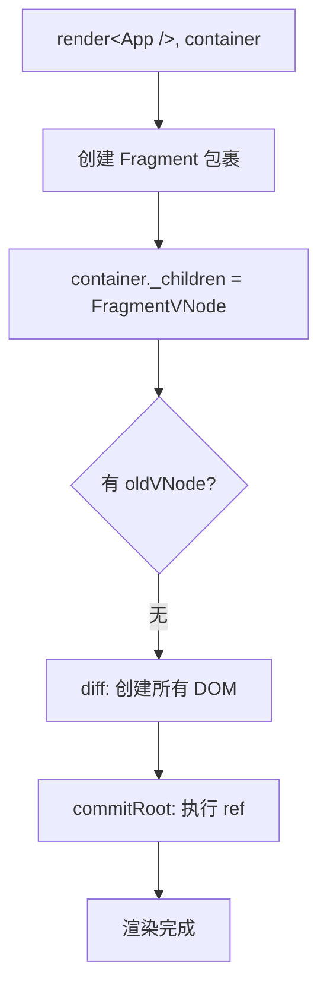
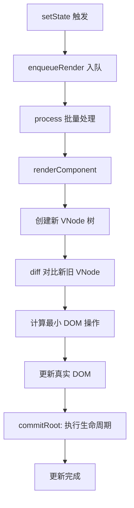
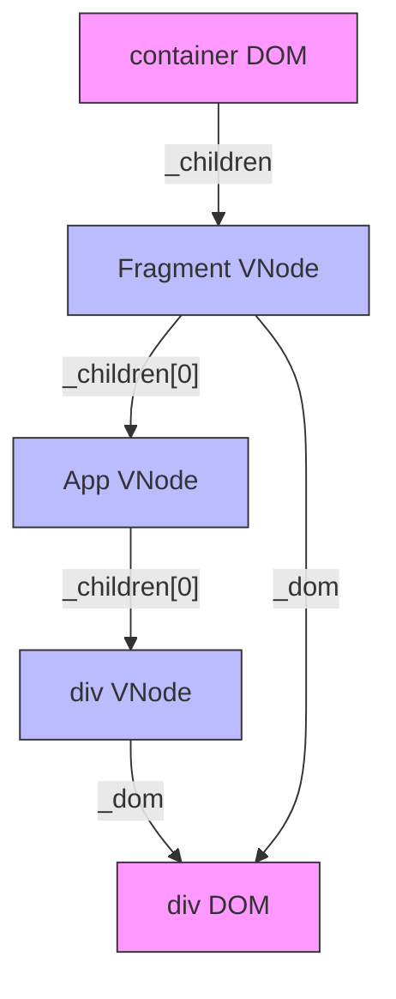

# 第 3 章：render() 渲染流程与 DOM 挂载

> **本章是《Preact 源码解析》系列的第 3 章**，聚焦于 `render()` 函数的完整执行链路。我们将追踪从 VNode 树到真实 DOM 的创建过程，理解首次渲染与更新渲染的差异，以及 `hydrate()` 服务端渲染激活的机制。

---

## 3.1 render() 函数签名

```javascript
// 文件：src/render.js
// 函数：render(vnode, parentDom, replaceNode)

export function render(vnode, parentDom, replaceNode) {
  // ...
}
```

**参数说明**：
| 参数 | 类型 | 作用 | 示例 |
|------|------|------|------|
| `vnode` | VNode | 要渲染的虚拟节点 | `<App />` |
| `parentDom` | Element | 目标 DOM 容器 | `document.body` |
| `replaceNode` | Element \| Function | 可选：用于替换的现有 DOM 或 hydrate 标记 | `hydrate` 函数 |

**常见用法**：

```javascript
// 基本用法
render(<App />, document.getElementById('root'));

// hydrate 用法（服务端渲染激活）
hydrate(<App />, document.getElementById('root'));
```

---

## 3.2 render() 完整源码分析

让我们逐段拆解 `render()` 函数的实现：

### 3.2.1 处理 document 特殊情况

```javascript
// https://github.com/preactjs/preact/issues/3794
if (parentDom == document) {
  parentDom = document.documentElement;
}
```

**为什么需要这个处理？**

直接渲染到 `document` 是不合法的，应该渲染到 `document.documentElement`（即 `<html>` 元素）。这是一个防御性编程示例。

### 3.2.2 调用 _root 钩子

```javascript
if (options._root) options._root(vnode, parentDom);
```

**插件扩展点** - 允许插件在渲染前拦截，例如 `preact/debug` 可能在这里做验证。

### 3.2.3 判断是否在 hydrate 模式

```javascript
let isHydrating = typeof replaceNode == 'function';
```

**关键技巧**：通过判断 `replaceNode` 是否是函数来确定是否在 hydrate 模式。

**为什么？** 回顾 `hydrate()` 的实现：

```javascript
export function hydrate(vnode, parentDom) {
  render(vnode, parentDom, hydrate);  // ⚠️ 传入 hydrate 函数本身作为第 3 个参数
}
```

这是一个巧妙的**自引用标记**模式：
| 调用方式 | replaceNode 值 | isHydrating |
|---------|---------------|-------------|
| `render(<App />, container)` | `undefined` | `false` |
| `hydrate(<App />, container)` | `hydrate` 函数 | `true` |

### 3.2.4 获取旧的 VNode 树

```javascript
let oldVNode = isHydrating
  ? NULL
  : (replaceNode && replaceNode._children) || parentDom._children;
```

**核心设计**：Preact 将上次渲染的 VNode 树存储在 DOM 元素的 `_children` 属性上。

**三种场景**：
| 场景 | oldVNode 来源 | 说明 |
|------|-------------|------|
| 首次渲染 | `NULL` | DOM 上没有 `_children` 属性 |
| 更新渲染 | `parentDom._children` | 从 DOM 元素读取上次渲染的 VNode |
| Hydrate | `NULL` | 服务端渲染的内容不需要对比旧 VNode |

**为什么需要 oldVNode？** diff 算法需要对比新旧 VNode 树，计算最小 DOM 操作。

### 3.2.5 创建 Fragment 包裹

```javascript
vnode = ((!isHydrating && replaceNode) || parentDom)._children =
  createElement(Fragment, NULL, [vnode]);
```

**关键设计**：将传入的 vnode 包裹在一个 `Fragment` 中。

**为什么？**

1. **统一处理** - 所有渲染都变成"更新 Fragment 的子节点"
2. **支持多根节点** - Fragment 允许返回多个子节点
3. **存储引用** - 将新的 VNode 树存储到 DOM 的 `_children` 属性

**执行后的结构**：

```javascript
// 假设传入 <App />
// 包裹后变成：
<Fragment>
  <App />
</Fragment>

// 同时存储到 DOM
parentDom._children = FragmentVNode;
```

### 3.2.6 调用 diff() 进行渲染

```javascript
let commitQueue = [], refQueue = [];

diff(
  parentDom,           // 父 DOM 元素
  vnode,               // 新 VNode（包裹后的 Fragment）
  oldVNode || EMPTY_OBJ,  // 旧 VNode（首次渲染为空对象）
  EMPTY_OBJ,           // 全局上下文
  parentDom.namespaceURI,  // 命名空间（HTML/SVG/MathML）
  !isHydrating && replaceNode
    ? [replaceNode]
    : oldVNode
      ? NULL
      : parentDom.firstChild
        ? slice.call(parentDom.childNodes)
        : NULL,        // excessDomChildren
  commitQueue,         // 提交队列（生命周期回调）
  !isHydrating && replaceNode
    ? replaceNode
    : oldVNode
      ? oldVNode._dom
      : parentDom.firstChild
        ? slice.call(parentDom.childNodes)
        : NULL,        // oldDom
  isHydrating,         // 是否 hydrate 模式
  refQueue             // ref 队列
);
```

**参数详解**（这是 diff 函数的完整签名）：
| 参数 | 作用 | 首次渲染值 |
|------|------|-----------|
| `parentDom` | 父 DOM 容器 | `document.body` |
| `newVNode` | 新 VNode 树 | FragmentVNode |
| `oldVNode` | 旧 VNode 树 | `EMPTY_OBJ` |
| `globalContext` | Context 上下文 | `{}` |
| `namespace` | DOM 命名空间 | `'http://www.w3.org/1999/xhtml'` |
| `excessDomChildren` | 多余 DOM 节点（用于 hydrate） | `null` 或childNodes 数组 |
| `commitQueue` | 生命周期回调队列 | `[]` |
| `oldDom` | 当前参考 DOM 节点 | `null` 或第一个子节点 |
| `isHydrating` | 是否 hydrate 模式 | `false` |
| `refQueue` | ref 调用队列 | `[]` |

### 3.2.7 执行提交队列

```javascript
commitRoot(commitQueue, vnode, refQueue);
```

**diff 阶段**只计算差异并修改 DOM，**commit 阶段**执行生命周期回调和 ref。

---

## 3.3 首次渲染 vs 更新渲染

### 3.3.1 首次渲染流程



**关键特征**：

- `oldVNode` 为 `NULL` 或 `EMPTY_OBJ`
- diff 算法会创建所有 DOM 节点
- 不会触发组件更新生命周期（如 `componentDidUpdate`）

### 3.3.2 更新渲染流程

```javascript
// 用户调用 setState
this.setState({ count: 1 });

// 内部流程
enqueueRender(component) → process() → renderComponent()

// renderComponent 内部
diff(
  component._parentDom,
  newVNode,      // 新 VNode 树
  oldVNode,      // 上次渲染的 VNode
  // ...
);
```



**关键特征**：

- `oldVNode` 存在（上次渲染的 VNode）
- diff 算法对比差异，复用现有 DOM
- 触发 `componentDidUpdate` 等更新生命周期

---

## 3.4 hydrate() 服务端渲染激活

### 3.4.1 什么是 Hydration？

**Hydration（激活）** 是指：服务端已经渲染了 HTML，客户端 Preact 不需要重新创建 DOM，而是"激活"现有 DOM，绑定事件监听器。

**对比**：
| 方式 | 服务端 | 客户端 | DOM 操作 |
|------|--------|--------|---------|
| `render()` | 无 | 完整渲染 | 创建所有 DOM |
| `hydrate()` | 已渲染 HTML | 绑定事件 | 几乎无 DOM 操作 |

### 3.4.2 hydrate() 实现

```javascript
export function hydrate(vnode, parentDom) {
  render(vnode, parentDom, hydrate);  // ⚠️ 传入 hydrate 函数本身
}
```

**巧妙设计**：通过传入 `hydrate` 函数作为第 3 个参数，`render()` 内部可以识别这是 hydrate 模式。

### 3.4.3 Hydrate 模式的特殊处理

在 `render()` 内部，hydrate 模式有以下差异：

```javascript
// 1. isHydrating = true
let isHydrating = typeof replaceNode == 'function';  // true

// 2. oldVNode = NULL（不对比旧 VNode）
let oldVNode = isHydrating ? NULL : parentDom._children;

// 3. excessDomChildren 包含现有 DOM 节点
excessDomChildren = !isHydrating && replaceNode
  ? [replaceNode]
  : oldVNode
    ? NULL
    : parentDom.firstChild
      ? slice.call(parentDom.childNodes)  // ✅ hydrate 时会获取现有 DOM
      : NULL;

// 4. 传递 isHydrating 标志给 diff
diff(
  // ...
  isHydrating,  // true
  // ...
);
```

### 3.4.4 Hydrate 流程图解

```mermaid
sequenceDiagram
    participant Server as 服务端
    participant Browser as 浏览器
    participant Preact as Preact hydrate()
    participant DOM as 真实 DOM
    Server->>Browser: 返回 HTML 字符串
    Browser->>DOM: 解析并渲染 HTML
    Note over Browser: 页面加载完成
    Browser->>Preact: 调用 hydrate(&lt;App /&gt;, container)
    Preact->>Preact: 创建 VNode 树
    Note over Preact: isHydrating = true
    Preact->>DOM: 对比 VNode 与现有 DOM
    Note over Preact,DOM: 不创建新 DOM，只验证结构
    Preact->>DOM: 绑定事件监听器
    Preact->>Preact: 执行 componentDidMount
    Preact-->>Browser: 激活完成
```

---

## 3.5 _children 指针系统

Preact 通过 `_children` 属性在 DOM 和 VNode 之间建立引用关系：

### 3.5.1 DOM._children 指向 VNode

```javascript
// render() 中
vnode = parentDom._children = createElement(Fragment, NULL, [vnode]);
```

**作用**：下次渲染时，可以通过 `parentDom._children` 获取上次的 VNode 树，用于 diff 对比。

### 3.5.2 VNode._children 指向子 VNode 数组

```javascript
// createVNode() 中
_children: NULL,

// diff 过程中会被赋值
newVNode._children = [...childVNodes];
```

**作用**：构建树形结构，方便遍历。

### 3.5.3 VNode._dom 指向真实 DOM

```javascript
// createVNode() 中
_dom: NULL,

// diff 创建 DOM 后赋值
newVNode._dom = document.createElement(newType);
```

**作用**：从 VNode 快速访问真实 DOM。

### 3.5.4 完整引用关系图



**粉色** = 真实 DOM  
**蓝色** = VNode  
**箭头** = 引用关系

---

## 3.6 commitRoot() 提交阶段

diff 阶段完成后，调用 `commitRoot()` 执行后续操作：

```javascript
// 文件：src/diff/index.js
// 函数：commitRoot(commitQueue, rootVNode, refQueue)

export function commitRoot(commitQueue, rootVNode, refQueue) {
  // 1. 执行 ref 回调
  for (let i = 0; i < refQueue.length; i++) {
    // 调用 ref 函数或设置 ref.current
  }
  
  // 2. 执行生命周期回调
  for (let i = 0; i < commitQueue.length; i++) {
    let c = commitQueue[i];
    if (c._renderCallbacks.length) {
      // 执行 componentDidUpdate 等
    }
  }
  
  // 3. 执行 options._commit 钩子
  if (options._commit) options._commit(rootVNode, commitQueue);
}
```

**为什么分两个阶段？**
| 阶段 | 职责 | 是否阻塞渲染 |
|------|------|-------------|
| **diff** | 计算差异、修改 DOM | ✅ 是（必须同步） |
| **commit** | 执行回调、生命周期 | ❌ 否（可以延迟） |

这种分离允许 Preact 在未来实现并发渲染（类似 React Fiber）。

---

## 3.7 完整渲染流程时序图

```mermaid
sequenceDiagram
    participant User as 用户代码
    participant R as render()
    participant CE as createElement()
    participant D as diff()
    participant DOM as 真实 DOM
    participant C as commitRoot()
    User->>R: render(&lt;App /&gt;, container)
    R->>R: 判断 isHydrating
    R->>R: 获取 oldVNode
    R->>CE: createElement(Fragment, NULL, [&lt;App /&gt;])
    CE-->>R: 返回 FragmentVNode
    R->>R: container._children = FragmentVNode
    R->>R: 初始化 commitQueue, refQueue
    R->>D: diff(container, FragmentVNode, oldVNode, ...)
    Note over D: diff 阶段开始
    D->>D: 判断 VNode 类型
    D->>D: 组件：实例化 + 调用 render()
    D->>D: DOM 元素：创建/复用节点
    D->>D: 递归 diff 子节点
    D->>DOM: 创建/更新 DOM 节点
    D-->>R: diff 完成
    Note over D: diff 阶段结束
    R->>C: commitRoot(commitQueue, FragmentVNode, refQueue)
    Note over C: commit 阶段开始
    C->>DOM: 执行 ref 回调
    C->>DOM: 执行 componentDidMount
    C-->>R: commit 完成
    R-->>User: 渲染完成
```

---

## 3.8 关键设计亮点

### 3.8.1 自引用标记模式

```javascript
// hydrate() 传入自身作为标记
render(vnode, parentDom, hydrate);

// render() 内部识别
let isHydrating = typeof replaceNode == 'function';
```

**优点**：无需额外的标志参数，复用现有参数实现模式切换。

### 3.8.2 DOM 存储 VNode 引用

```javascript
parentDom._children = vnode;
```

**优点**：
- 无需全局状态
- 支持多根节点（每个 container 独立）
- 天然支持增量更新

### 3.8.3 Fragment 包裹策略

```javascript
vnode = createElement(Fragment, NULL, [vnode]);
```

**优点**：
- 统一处理逻辑
- 支持返回多个子节点
- 简化 diff 算法

### 3.8.4 批量更新机制

```javascript
// setState 不立即渲染，而是入队
rerenderQueue.push(c);
(prevDebounce || defer)(process);  // 异步批量处理
```

**优点**：
- 多次 `setState` 合并为一次渲染
- 避免不必要的重复计算
- 提升性能

---

## 3.9 本章小结
| 知识点 | 核心内容 |
|--------|---------|
| **render() 参数** | vnode、parentDom、replaceNode（hydrate 标记） |
| **hydrate 模式** | 通过传入函数自身作为标记 |
| **_children 引用** | DOM 存储 VNode，支持增量更新 |
| **Fragment 包裹** | 统一处理逻辑，支持多根节点 |
| **diff 参数** | 10 个参数传递完整上下文 |
| **两阶段渲染** | diff（计算）+ commit（执行回调） |
| **批量更新** | setState 入队，异步合并处理 |

---

## 📖 下一章预告

**第 4 章：diff 算法核心——同层对比与更新策略**

我们将深入 Preact 最复杂的部分：

- diff 函数主干逻辑（600+ 行完整分析）
- 三种节点类型的处理策略
- DOM 操作最小化原理
- 完整的 diff 流程图

---

**本章源码阅读清单**：
| 文件 | 行数 | 阅读重点 |
|------|------|---------|
| `src/render.js` | 60 行 | render + hydrate 完整实现 |
| `src/component.js` | 200 行 | Component 基类 + enqueueRender |
| `src/diff/index.js` | 600+ 行 | diff 主函数（第 4 章详细分析） |

---

> ✅ **第 3 章完成**  
> 📁 文件位置：`/home/admin/.openclaw/workspace-source-code/output/preactAnalysis/ch03-render-mount-flow.md`  
> ⏭️ 继续第 4 章...
