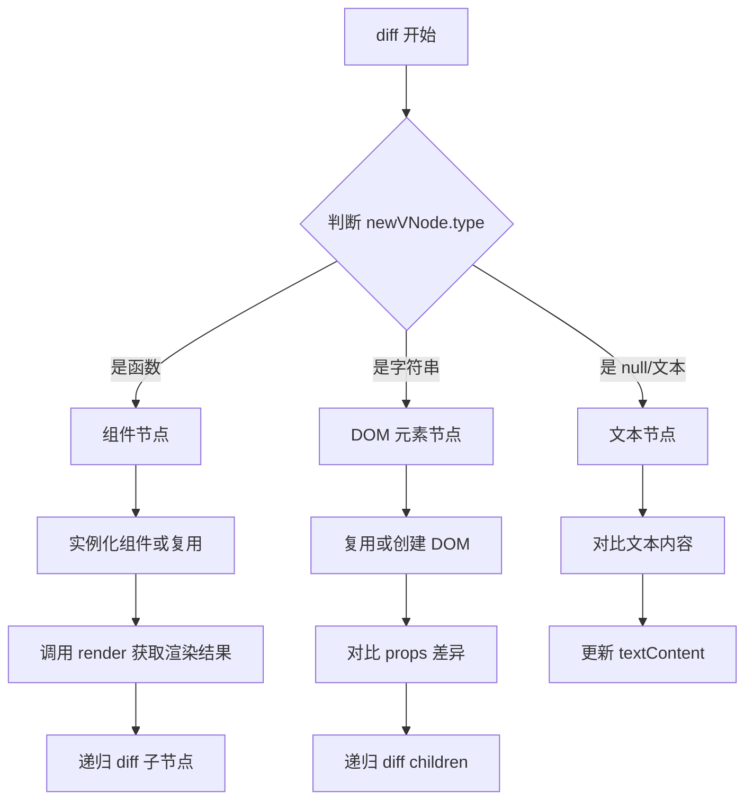
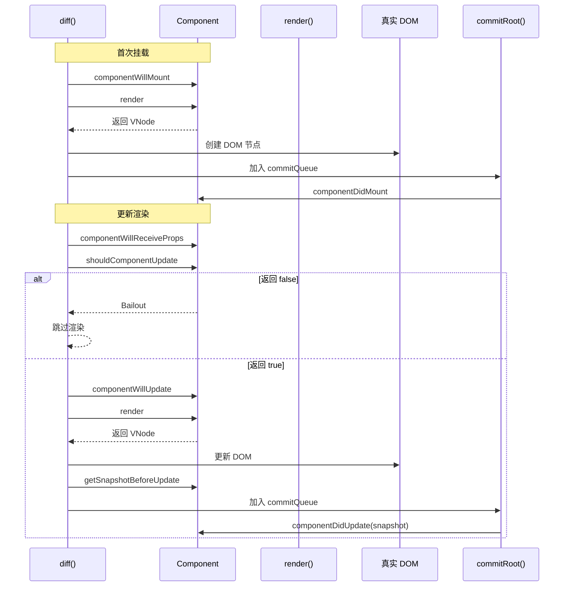
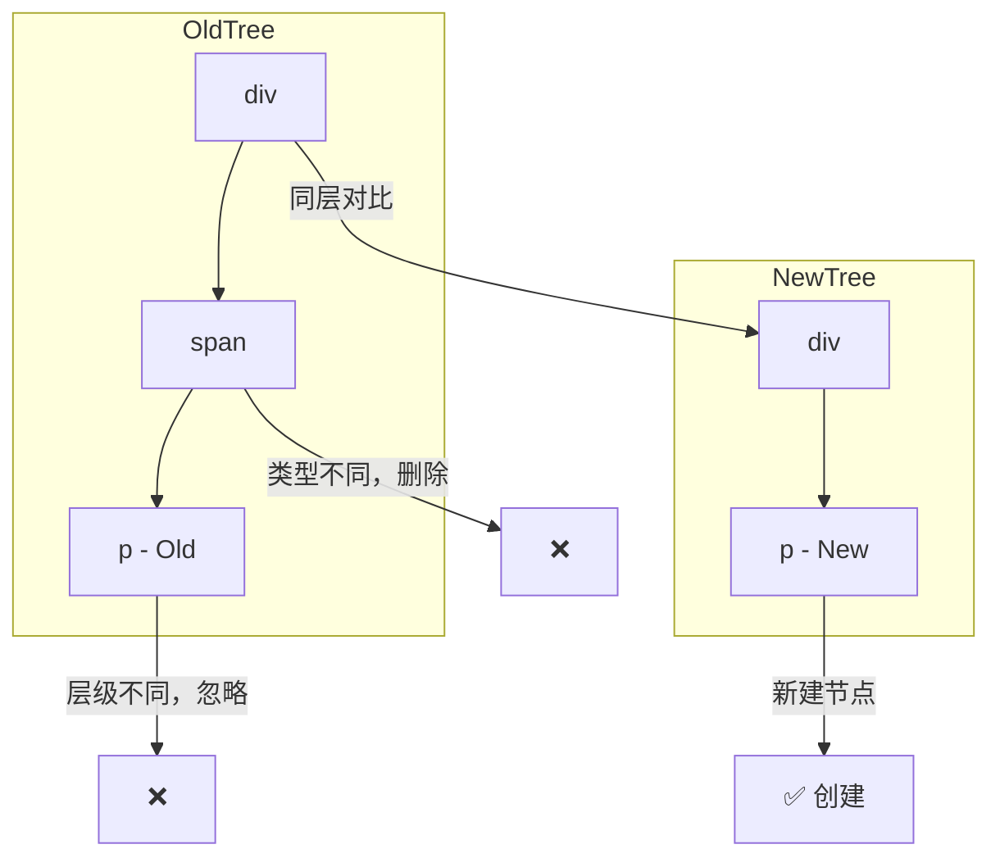
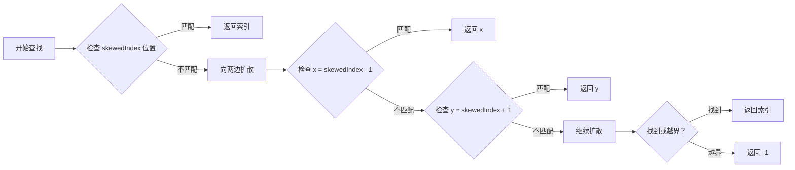
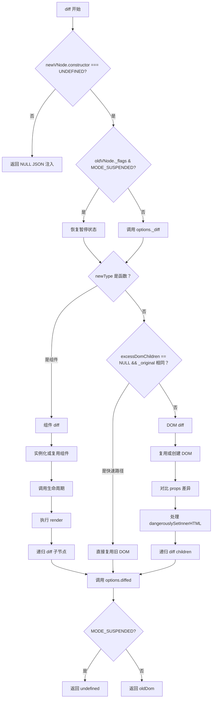

# 第 4 章：diff 算法核心——同层对比与更新策略

> **本章是《Preact 源码解析》系列的第 4 章**，也是整个系列的**核心章节**。我们将深入 Preact 最复杂的部分——diff 算法，理解它如何通过对比新旧 VNode 树，以最小的 DOM 操作完成 UI 更新。

---

## 4.1 diff 函数的地位与作用

### 4.1.1 为什么需要 diff 算法？

**问题**：当状态变化时，如何高效更新 DOM？

** naive 方案**：每次重新渲染整个组件树

```javascript
// 假设一个列表从 3 项变成 5 项
// 朴素做法：删除所有旧节点，创建 5 个新节点
// DOM 操作：3 次删除 + 5 次创建 = 8 次操作
```

**diff 方案**：对比差异，只更新变化的部分

```javascript
// diff 做法：保留 3 个旧节点，创建 2 个新节点
// DOM 操作：2 次创建 = 2 次操作
// 性能提升：75%
```

### 4.1.2 diff 函数的完整签名

```javascript
// 文件：src/diff/index.js
// 函数：diff() - 600+ 行核心逻辑

export function diff(
  parentDom,           // 父 DOM 容器
  newVNode,            // 新 VNode
  oldVNode,            // 旧 VNode
  globalContext,       // Context 上下文
  namespace,           // 命名空间（HTML/SVG/MathML）
  excessDomChildren,   // 多余 DOM 节点（用于 hydrate）
  commitQueue,         // 生命周期回调队列
  oldDom,              // 当前参考 DOM 节点
  isHydrating,         // 是否 hydrate 模式
  refQueue             // ref 调用队列
) {
  // ... 核心逻辑
}
```

**10 个参数**传递了 diff 所需的**完整上下文**，这是 Preact 性能优化的关键设计。

---

## 4.2 diff 主干流程

### 4.2.1 三种节点类型的处理策略

Preact 将 VNode 分为三种类型，每种类型有不同的 diff 策略：


| 节点类型 | type 值 | diff 策略 | 源码分支 |
|---------|--------|----------|---------|
| **文本节点** | `null` 或字符串 | 直接对比文本内容 | `diffElementNodes` |
| **DOM 元素** | `'div'`、`'span'` 等 | 复用/创建 DOM + 对比 props | `diffElementNodes` |
| **组件** | `function` 或 `class` | 实例化/复用组件 + 调用 render | `diff` 主函数 |

### 4.2.2 主干代码结构

```javascript
// 文件：src/diff/index.js
// 简化版主流程

export function diff(/* ... 参数 ... */) {
  let newType = newVNode.type;
  
  // 安全检查：防止 JSON 注入
  if (newVNode.constructor !== UNDEFINED) return NULL;
  
  // 处理 Suspense 暂停状态
  if (oldVNode._flags & MODE_SUSPENDED) {
    // ... 恢复逻辑
  }
  
  // 调用 _diff 钩子
  if ((tmp = options._diff)) tmp(newVNode);
  
  outer: if (typeof newType == 'function') {
    // ========== 组件节点处理 ==========
    // 1. 实例化或复用组件
    // 2. 调用生命周期
    // 3. 执行 render 获取结果
    // 4. 递归 diff 子节点
  } else if (
    excessDomChildren == NULL &&
    newVNode._original == oldVNode._original
  ) {
    // ========== 快速路径：无变化 ==========
    newVNode._children = oldVNode._children;
    newVNode._dom = oldVNode._dom;
  } else {
    // ========== DOM 元素节点处理 ==========
    oldDom = newVNode._dom = diffElementNodes(
      oldVNode._dom,
      newVNode,
      oldVNode,
      // ... 参数
    );
  }
  
  // 调用 diffed 钩子
  if ((tmp = options.diffed)) tmp(newVNode);
  
  return newVNode._flags & MODE_SUSPENDED ? undefined : oldDom;
}
```

---

## 4.3 组件节点 diff 详解

### 4.3.1 组件实例化与复用

```javascript
// 文件：src/diff/index.js
// 组件处理核心逻辑

if (typeof newType == 'function') {
  // 判断是否是类组件
  const isClassComponent =
    'prototype' in newType && newType.prototype.render;
  
  // 尝试复用旧组件实例
  if (oldVNode._component) {
    c = newVNode._component = oldVNode._component;
    clearProcessingException = c._processingException = c._pendingError;
  } else {
    // 实例化新组件
    if (isClassComponent) {
      // 类组件：调用构造函数
      newVNode._component = c = new newType(newProps, componentContext);
    } else {
      // 函数组件：包装成 BaseComponent
      newVNode._component = c = new BaseComponent(newProps, componentContext);
      c.constructor = newType;
      c.render = doRender;  // 包装 render 函数
    }
    
    // 初始化状态
    if (!c.state) c.state = {};
    c._globalContext = globalContext;
    isNew = c._dirty = true;  // 标记为新组件
    c._renderCallbacks = [];
    c._stateCallbacks = [];
  }
}
```

**关键设计**：
| 场景 | 组件实例 | isNew 标记 |
|------|---------|-----------|
| **首次渲染** | 创建新实例 | `true` |
| **更新渲染** | 复用旧实例 | `false` |
| **函数组件** | 包装成 `BaseComponent` | 同左 |

### 4.3.2 生命周期调用顺序

```javascript
// 类组件完整生命周期流程

if (isNew) {
  // ========== 首次挂载 ==========
  
  // 1. componentWillMount（已废弃，但兼容）
  if (c.componentWillMount != NULL) {
    c.componentWillMount();
  }
  
  // 2. componentDidMount（加入 commitQueue，延迟执行）
  if (c.componentDidMount != NULL) {
    c._renderCallbacks.push(c.componentDidMount);
  }
  
} else {
  // ========== 更新渲染 ==========
  
  // 1. componentWillReceiveProps（已废弃，但兼容）
  if (c.componentWillReceiveProps != NULL) {
    c.componentWillReceiveProps(newProps, componentContext);
  }
  
  // 2. shouldComponentUpdate（性能优化关键）
  if (
    !c._force &&
    c.shouldComponentUpdate != NULL &&
    c.shouldComponentUpdate(newProps, c._nextState, componentContext) === false
  ) {
    // Bailout：跳过渲染，直接复用旧 DOM
    newVNode._dom = oldVNode._dom;
    newVNode._children = oldVNode._children;
    break outer;  // 跳出 diff
  }
  
  // 3. componentWillUpdate（已废弃，但兼容）
  if (c.componentWillUpdate != NULL) {
    c.componentWillUpdate(newProps, c._nextState, componentContext);
  }
  
  // 4. componentDidUpdate（加入 commitQueue，延迟执行）
  if (c.componentDidUpdate != NULL) {
    c._renderCallbacks.push(() => {
      c.componentDidUpdate(oldProps, oldState, snapshot);
    });
  }
  
  // 5. getSnapshotBeforeUpdate（在 DOM 更新前调用）
  if (c.getSnapshotBeforeUpdate != NULL) {
    snapshot = c.getSnapshotBeforeUpdate(oldProps, oldState);
  }
}

// 6. render（所有组件都会调用）
tmp = c.render(c.props, c.state, c.context);
```

**生命周期时序图**：



### 4.3.3 shouldComponentUpdate 优化

```javascript
// Bailout 优化：跳过不必要的渲染

if (
  newVNode._original == oldVNode._original ||  // 相同引用
  (
    !c._force &&
    c.shouldComponentUpdate != NULL &&
    c.shouldComponentUpdate(newProps, c._nextState, componentContext) === false
  )
) {
  // 直接复用旧 VNode 的 DOM 和 children
  newVNode._dom = oldVNode._dom;
  newVNode._children = oldVNode._children;
  
  // 更新 parent 指针
  newVNode._children.some(vnode => {
    if (vnode) vnode._parent = newVNode;
  });
  
  // 加入 commitQueue，执行回调
  EMPTY_ARR.push.apply(c._renderCallbacks, c._stateCallbacks);
  c._stateCallbacks = [];
  
  if (c._renderCallbacks.length) {
    commitQueue.push(c);
  }
  
  break outer;  // ⚠️ 关键：跳出 diff，跳过后续处理
}
```

**优化效果**：
| 场景 | 无优化 | 有 bailout | 性能提升 |
|------|--------|-----------|---------|
| props 未变 | 完整 diff | 跳过 | ~90% |
| state 未变 | 完整 diff | 跳过 | ~90% |
| shouldComponentUpdate 返回 false | 完整 diff | 跳过 | ~95% |

---

## 4.4 DOM 元素节点 diff 详解

### 4.4.1 diffElementNodes 函数

```javascript
// 文件：src/diff/index.js
// 函数：diffElementNodes() - DOM 元素 diff

function diffElementNodes(
  dom,            // 旧 DOM 节点
  newVNode,       // 新 VNode
  oldVNode,       // 旧 VNode
  globalContext,
  namespace,
  excessDomChildren,
  commitQueue,
  isHydrating,
  refQueue
) {
  let oldProps = oldVNode.props || EMPTY_OBJ;
  let newProps = newVNode.props;
  let nodeType = newVNode.type;  // 如 'div'、'span'
  
  // 步骤 1: 处理命名空间（SVG/MathML）
  if (nodeType == 'svg') namespace = SVG_NAMESPACE;
  else if (nodeType == 'math') namespace = MATH_NAMESPACE;
  else if (!namespace) namespace = XHTML_NAMESPACE;
  
  // 步骤 2: 复用或创建 DOM
  if (excessDomChildren != NULL) {
    // 从 excessDomChildren 中查找可复用的 DOM
    for (i = 0; i < excessDomChildren.length; i++) {
      value = excessDomChildren[i];
      if (
        value &&
        'setAttribute' in value == !!nodeType &&
        (nodeType ? value.localName == nodeType : value.nodeType == 3)
      ) {
        dom = value;
        excessDomChildren[i] = NULL;  // 标记为已使用
        break;
      }
    }
  }
  
  if (dom == NULL) {
    // 没有可复用的 DOM，创建新节点
    if (nodeType == NULL) {
      return document.createTextNode(newProps);
    }
    dom = document.createElementNS(namespace, nodeType, newProps.is && newProps);
    excessDomChildren = NULL;  // 新父节点，所有子节点都不能复用
  }
  
  // 步骤 3: 对比 props 差异
  // 3.1 移除旧 props 中不存在的
  for (i in oldProps) {
    value = oldProps[i];
    if (i == 'dangerouslySetInnerHTML') {
      oldHtml = value;
    } else if (
      i != 'children' &&
      !(i in newProps) &&
      !(i == 'value' && 'defaultValue' in newProps)
    ) {
      setProperty(dom, i, NULL, value, namespace);  // 移除属性
    }
  }
  
  // 3.2 设置新 props
  for (i in newProps) {
    value = newProps[i];
    if (i == 'children') {
      newChildren = value;
    } else if (i == 'dangerouslySetInnerHTML') {
      newHtml = value;
    } else if (i == 'value') {
      inputValue = value;
    } else if (i == 'checked') {
      checked = value;
    } else if (
      (!isHydrating || typeof value == 'function') &&
      oldProps[i] !== value
    ) {
      setProperty(dom, i, value, oldProps[i], namespace);  // 更新属性
    }
  }
  
  // 步骤 4: 处理 dangerouslySetInnerHTML
  if (newHtml) {
    if (
      !isHydrating &&
      (!oldHtml || newHtml.__html != oldHtml.__html)
    ) {
      dom.innerHTML = newHtml.__html;
    }
    newVNode._children = [];  // 有 innerHTML，没有子节点
  } else {
    // 步骤 5: diff 子节点
    if (oldHtml) dom.innerHTML = '';  // 清空旧 HTML
    
    diffChildren(
      newVNode.type == 'template' ? dom.content : dom,
      isArray(newChildren) ? newChildren : [newChildren],
      newVNode,
      oldVNode,
      globalContext,
      nodeType == 'foreignObject' ? XHTML_NAMESPACE : namespace,
      excessDomChildren,
      commitQueue,
      // ... 参数
    );
  }
  
  // 步骤 6: 处理受控组件（input value/checked）
  if (inputValue != NULL) {
    setProperty(dom, 'value', inputValue, oldProps.value, namespace);
  }
  if (checked != NULL) {
    setProperty(dom, 'checked', checked, oldProps.checked, namespace);
  }
  
  return dom;
}
```

### 4.4.2 DOM 复用策略

**场景 1：首次渲染**

```javascript
// excessDomChildren = NULL
// 直接创建新 DOM
dom = document.createElementNS(namespace, nodeType);
```

**场景 2：更新渲染**

```javascript
// excessDomChildren = NULL
// oldVNode._dom 存在，直接复用
dom = oldVNode._dom;
// 只对比 props 差异
```

**场景 3：Hydrate 模式**

```javascript
// excessDomChildren = [所有现有 DOM 节点]
// 从 excessDomChildren 中查找匹配的 DOM
for (i = 0; i < excessDomChildren.length; i++) {
  if (value.localName == nodeType) {
    dom = value;  // 复用现有 DOM
    excessDomChildren[i] = NULL;  // 标记为已使用
    break;
  }
}
```

### 4.4.3 setProperty 属性更新

```javascript
// 文件：src/diff/props.js
// 函数：setProperty() - 设置 DOM 属性

export function setProperty(dom, name, value, oldValue, namespace) {
  // 场景 1: style 属性
  if (name == 'style') {
    if (typeof value == 'string') {
      dom.style.cssText = value;
    } else {
      // 对象形式：{ color: 'red', fontSize: '14px' }
      if (typeof oldValue == 'string') {
        dom.style.cssText = '';
      }
      // 移除不再存在的样式
      for (name in oldValue) {
        if (!(value && name in value)) {
          setStyle(dom.style, name, '');
        }
      }
      // 添加/更新样式
      for (name in value) {
        if (!oldValue || value[name] != oldValue[name]) {
          setStyle(dom.style, name, value[name]);
        }
      }
    }
  }
  
  // 场景 2: 事件处理（onXxx）
  else if (name[0] == 'o' && name[1] == 'n') {
    useCapture = name != (name = name.replace(CAPTURE_REGEX, '$1'));
    name = name.toLowerCase().slice(2);  // onClick -> click
    
    if (value) {
      if (!oldValue) {
        // 首次添加事件监听
        dom.addEventListener(name, useCapture ? eventProxyCapture : eventProxy, useCapture);
      }
    } else {
      // 移除事件监听
      dom.removeEventListener(name, useCapture ? eventProxyCapture : eventProxy, useCapture);
    }
  }
  
  // 场景 3: 普通属性
  else {
    // SVG 命名空间处理
    if (namespace == SVG_NAMESPACE) {
      name = name.replace(/xlink(H|:h)/, 'h').replace(/sName$/, 's');
    }
    
    // 布尔属性处理（checked、disabled 等）
    if (
      name != 'width' && name != 'height' &&
      name != 'href' && name != 'list' &&
      // ... 排除列表
      name in dom
    ) {
      try {
        dom[name] = value == NULL ? '' : value;  // 直接设置属性
        break o;
      } catch (e) {}
    }
    
    // 默认：使用 setAttribute
    if (typeof value == 'function') {
      // 不序列化函数
    } else if (value != NULL && (value !== false || name[4] == '-')) {
      dom.setAttribute(name, value);
    } else {
      dom.removeAttribute(name);
    }
  }
}
```

**属性更新优化**：
| 属性类型 | 更新策略 | 性能考虑 |
|---------|---------|---------|
| `style` | 对比差异，只更新变化的 | 避免重绘 |
| 事件 | 只在首次添加/移除时操作 | 避免重复绑定 |
| 布尔属性 | 直接设置 `dom.property` | 比 `setAttribute` 快 |
| 普通属性 | `setAttribute` | 兼容性最好 |

---

## 4.5 同层对比原则

### 4.5.1 什么是同层对比？

**核心原则**：diff 算法只对比**同一层级**的节点，不会跨层级对比。

```javascript
// 示例：两个不同的树
const oldTree = (
  <div>
    <span>
      <p>Old</p>
    </span>
  </div>
);

const newTree = (
  <div>
    <p>New</p>  {/* 层级变了 */}
  </div>
);
```

**diff 过程**：



### 4.5.2 同层对比的代码实现

```javascript
// 文件：src/diff/children.js
// 函数：diffChildren() - 子节点 diff

export function diffChildren(
  parentDom,
  renderResult,     // render() 返回的子节点
  newParentVNode,
  oldParentVNode,
  // ... 参数
) {
  // 获取旧子节点数组
  let oldChildren = (oldParentVNode && oldParentVNode._children) || EMPTY_ARR;
  
  // 步骤 1: 构建新子节点数组（处理复用、key 匹配等）
  oldDom = constructNewChildrenArray(
    newParentVNode,
    renderResult,
    oldChildren,
    oldDom
  );
  
  // 步骤 2: 遍历新子节点，递归 diff
  for (i = 0; i < newChildrenLength; i++) {
    childVNode = newParentVNode._children[i];
    if (childVNode == NULL) continue;
    
    // 从 oldChildren 中获取对应的旧 VNode
    oldVNode = oldChildren[childVNode._index] || EMPTY_OBJ;
    
    // 递归 diff
    let result = diff(
      parentDom,
      childVNode,
      oldVNode,
      // ... 参数
    );
    
    // 调整 DOM 位置
    newDom = childVNode._dom;
    if (shouldPlace || oldVNode._children === childVNode._children) {
      oldDom = insert(childVNode, oldDom, parentDom, shouldPlace);
    }
  }
}
```

**关键点**：

1. `oldChildren` 和 `newChildren` 是**两个独立数组**
2. 通过 `key` 和 `type` 在 `oldChildren` 中查找匹配的节点
3. 匹配的节点**原地复用**，不匹配的**删除或创建**
4. **不会跨层级查找**

### 4.5.3 同层对比的性能影响

**正面影响**：
| 场景 | 对比次数 | 说明 |
|------|---------|------|
| 列表顺序不变 | O(n) | 每个节点对比一次 |
| 列表末尾添加 | O(n) | 只处理新增节点 |
| 列表末尾删除 | O(n) | 只处理删除节点 |

**负面影响**：
| 场景 | 对比次数 | 说明 |
|------|---------|------|
| 列表头部插入 | O(n) | 所有节点都需要移动 |
| 列表反转 | O(n²) | 所有节点都需要重新匹配 |
| 跨层级移动 | O(n) + 创建 | 旧节点删除 + 新节点创建 |

**优化建议**：

```jsx
// ❌ 不好的做法：在列表头部插入
items.unshift(newItem);
items.map(item => <Item key={item.id} />);

// ✅ 好的做法：在列表末尾添加
items.push(newItem);
items.map(item => <Item key={item.id} />);

// ✅ 更好的做法：使用稳定的 key
items.map(item => <Item key={item.uniqueId} />);
```

---

## 4.6 DOM 操作最小化策略

### 4.6.1 批量 DOM 更新

```javascript
// diff 阶段：收集所有 DOM 操作
diff() {
  // 不立即执行，而是收集到队列
  commitQueue.push(component);
  refQueue.push(ref, dom, vnode);
}

// commit 阶段：批量执行
commitRoot(commitQueue, rootVNode, refQueue) {
  // 1. 执行所有 ref 回调
  for (let i = 0; i < refQueue.length; i++) {
    applyRef(refQueue[i], refQueue[++i], refQueue[++i]);
  }
  
  // 2. 执行所有生命周期回调
  commitQueue.some(c => {
    c._renderCallbacks.some(cb => cb.call(c));
  });
}
```

**优势**：
| 方面 | 立即执行 | 批量执行 |
|------|---------|---------|
| 重绘次数 | 多次 | 一次 |
| 布局抖动 | 可能多次 | 仅一次 |
| 性能 | 较差 | 优秀 |

### 4.6.2 节点复用优化

```javascript
// 文件：src/diff/children.js
// 函数：findMatchingIndex() - 查找匹配的旧节点

function findMatchingIndex(
  childVNode,
  oldChildren,
  skewedIndex,
  remainingOldChildren
) {
  const key = childVNode.key;
  const type = childVNode.type;
  let oldVNode = oldChildren[skewedIndex];
  
  // 优先检查当前位置
  if (
    (oldVNode === NULL && key == null) ||
    (matched && key == oldVNode.key && type == oldVNode.type)
  ) {
    return skewedIndex;  // 位置匹配，直接返回
  }
  
  // 不匹配，向两边扩散查找
  let x = skewedIndex - 1;
  let y = skewedIndex + 1;
  while (x >= 0 || y < oldChildren.length) {
    const childIndex = x >= 0 ? x-- : y++;
    oldVNode = oldChildren[childIndex];
    
    if (
      oldVNode != NULL &&
      key == oldVNode.key &&
      type == oldVNode.type
    ) {
      return childIndex;  // 找到匹配
    }
  }
  
  return -1;  // 未找到匹配
}
```

**查找策略**：



**性能优化**：

- **优先检查当前位置** - 大多数情况节点位置不变
- **双向扩散** - 同时向左右查找，减少查找次数
- **提前终止** - 找到匹配立即返回

### 4.6.3 节点移动优化

```javascript
// 文件：src/diff/children.js
// 函数：insert() - 插入/移动 DOM 节点

function insert(parentVNode, oldDom, parentDom, shouldPlace) {
  if (typeof parentVNode.type == 'function') {
    // 组件节点：递归处理子节点
    let children = parentVNode._children;
    for (let i = 0; children && i < children.length; i++) {
      if (children[i]) {
        oldDom = insert(children[i], oldDom, parentDom, shouldPlace);
      }
    }
    return oldDom;
  } else if (parentVNode._dom != oldDom) {
    if (shouldPlace) {
      // 需要插入/移动
      if (oldDom && parentVNode.type && !oldDom.parentNode) {
        oldDom = getDomSibling(parentVNode);
      }
      parentDom.insertBefore(parentVNode._dom, oldDom || NULL);
    }
    oldDom = parentVNode._dom;
  }
  
  // 跳过注释节点
  do {
    oldDom = oldDom && oldDom.nextSibling;
  } while (oldDom != NULL && oldDom.nodeType == 8);
  
  return oldDom;
}
```

**移动策略**：
| 场景 | 操作 | DOM API |
|------|------|---------|
| 新节点 | 插入 | `insertBefore()` |
| 位置变化 | 移动 | `insertBefore()` |
| 位置不变 | 跳过 | 无操作 |

---

## 4.7 完整 diff 流程图



---

## 4.8 本章小结
| 知识点 | 核心内容 |
|--------|---------|
| **三种节点类型** | 文本、DOM 元素、组件，各有不同 diff 策略 |
| **组件 diff** | 实例化/复用 → 生命周期 → render → 递归子节点 |
| **DOM diff** | 复用/创建 → props 对比 → 递归 children |
| **同层对比** | 只对比同一层级，不跨层级 |
| **DOM 最小化** | 批量更新、节点复用、移动优化 |
| **生命周期** | 8 个钩子函数，分挂载和更新两个阶段 |
| **Bailout 优化** | shouldComponentUpdate 跳过不必要渲染 |

---

## 📖 下一章预告

**第 5 章：Children diff 与 Keyed 列表优化**

我们将深入最复杂的子节点 diff 逻辑：

- `constructNewChildrenArray` 完整分析
- `key` 的作用与最佳实践
- 列表增删改的 diff 行为
- skew 算法详解

---

**本章源码阅读清单**：
| 文件 | 行数 | 阅读重点 |
|------|------|---------|
| `src/diff/index.js` | 600+ 行 | diff 主函数 + diffElementNodes |
| `src/diff/props.js` | 150 行 | setProperty 属性更新 |
| `src/diff/children.js` | 400+ 行 | 第 5 章详细分析 |

---

> ✅ **第 4 章完成**  
> 📁 文件位置：`/home/admin/.openclaw/workspace-source-code/output/preactAnalysis/ch04-diff-algorithm-core.md`  
> ⏭️ 继续第 5 章...
