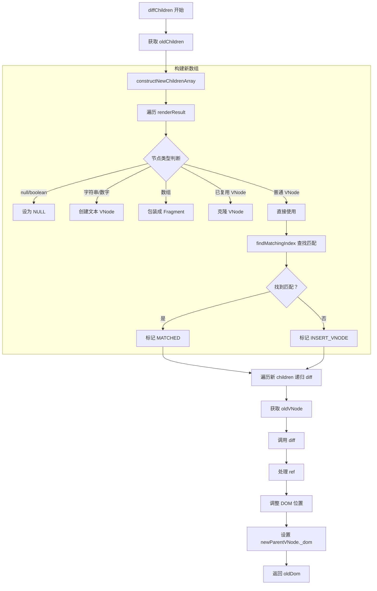
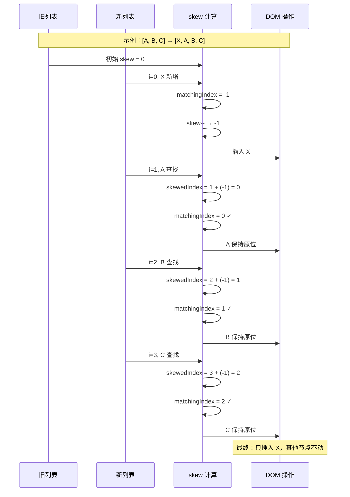
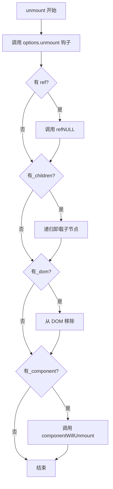

# 第 5 章：Children diff 与 Keyed 列表优化

> **本章是《Preact 源码解析》系列的第 5 章**，聚焦于子节点 diff 的完整实现。我们将深入 `diffChildren()` 函数，理解 `key` 的工作原理、列表优化的核心算法，以及 skew 算法如何高效处理节点移动。

---

## 5.1 diffChildren 函数概览

### 5.1.1 函数签名与职责

```javascript
// 文件：src/diff/children.js
// 函数：diffChildren() - 子节点 diff 核心

export function diffChildren(
  parentDom,           // 父 DOM 容器
  renderResult,        // render() 返回的子节点数组
  newParentVNode,      // 新父 VNode
  oldParentVNode,      // 旧父 VNode
  globalContext,       // Context 上下文
  namespace,           // 命名空间
  excessDomChildren,   // 多余 DOM 节点
  commitQueue,         // 生命周期队列
  oldDom,              // 当前参考 DOM
  isHydrating,         // 是否 hydrate
  refQueue             // ref 队列
) {
  // 步骤 1: 构建新 children 数组（处理复用、key 匹配）
  oldDom = constructNewChildrenArray(
    newParentVNode,
    renderResult,
    oldChildren,
    oldDom,
    newChildrenLength
  );
  
  // 步骤 2: 遍历新 children，递归 diff
  for (i = 0; i < newChildrenLength; i++) {
    childVNode = newParentVNode._children[i];
    if (childVNode == NULL) continue;
    
    // 获取对应的旧 VNode
    oldVNode = oldChildren[childVNode._index] || EMPTY_OBJ;
    
    // 递归 diff
    let result = diff(
      parentDom,
      childVNode,
      oldVNode,
      // ... 参数
    );
    
    // 调整 DOM 位置
    newDom = childVNode._dom;
    if (shouldPlace || oldVNode._children === childVNode._children) {
      oldDom = insert(childVNode, oldDom, parentDom, shouldPlace);
    }
  }
  
  newParentVNode._dom = firstChildDom;
  return oldDom;
}
```

**两大职责**：

1. **构建新 children 数组** - 通过 `constructNewChildrenArray` 匹配新旧节点
2. **递归 diff 子节点** - 对每个子节点调用 `diff()` 函数

### 5.1.2 执行流程



---

## 5.2 constructNewChildrenArray 详解

### 5.2.2 完整源码分析

```javascript
// 文件：src/diff/children.js
// 函数：constructNewChildrenArray() - 构建新 children 数组

function constructNewChildrenArray(
  newParentVNode,
  renderResult,
  oldChildren,
  oldDom,
  newChildrenLength
) {
  let i, childVNode, oldVNode;
  
  let oldChildrenLength = oldChildren.length,
    remainingOldChildren = oldChildrenLength;
  
  let skew = 0;  // 偏移量，用于处理节点移动
  
  // 初始化新 children 数组
  newParentVNode._children = new Array(newChildrenLength);
  
  for (i = 0; i < newChildrenLength; i++) {
    // @ts-expect-error We are reusing the childVNode variable
    childVNode = renderResult[i];
    
    // ========== 步骤 1: 处理特殊类型的 children ==========
    
    // 情况 1: null、boolean、function - 直接忽略
    if (
      childVNode == NULL ||
      typeof childVNode == 'boolean' ||
      typeof childVNode == 'function'
    ) {
      newParentVNode._children[i] = NULL;
      continue;
    }
    
    // 情况 2: 字符串、数字、bigint - 创建文本 VNode
    else if (
      typeof childVNode == 'string' ||
      typeof childVNode == 'number' ||
      typeof childVNode == 'bigint' ||
      childVNode.constructor == String
    ) {
      childVNode = newParentVNode._children[i] = createVNode(
        NULL,           // type 为 null 表示文本节点
        childVNode,     // 文本内容作为 props
        NULL,           // key
        NULL,           // ref
        NULL            // original
      );
    }
    
    // 情况 3: 数组 - 包装成 Fragment
    else if (isArray(childVNode)) {
      childVNode = newParentVNode._children[i] = createVNode(
        Fragment,
        { children: childVNode },
        NULL,
        NULL,
        NULL
      );
    }
    
    // 情况 4: 已复用的 VNode（_depth > 0）- 克隆
    else if (childVNode.constructor === UNDEFINED && childVNode._depth > 0) {
      // 场景：<div>{reuse}{reuse}</div> - 同一个 VNode 被多次使用
      childVNode = newParentVNode._children[i] = createVNode(
        childVNode.type,
        childVNode.props,
        childVNode.key,
        childVNode.ref ? childVNode.ref : NULL,
        childVNode._original
      );
    }
    
    // 情况 5: 普通 VNode - 直接使用
    else {
      newParentVNode._children[i] = childVNode;
    }
    
    // ========== 步骤 2: 设置 parent 和 depth ==========
    
    const skewedIndex = i + skew;
    childVNode._parent = newParentVNode;
    childVNode._depth = newParentVNode._depth + 1;
    
    // ========== 步骤 3: 查找匹配的旧 VNode ==========
    
    const matchingIndex = (childVNode._index = findMatchingIndex(
      childVNode,
      oldChildren,
      skewedIndex,
      remainingOldChildren
    ));
    
    oldVNode = NULL;
    if (matchingIndex != -1) {
      oldVNode = oldChildren[matchingIndex];
      remainingOldChildren--;
      if (oldVNode) {
        oldVNode._flags |= MATCHED;  // 标记为已匹配
      }
    }
    
    // ========== 步骤 4: 判断是否插入 ==========
    
    const isMounting = oldVNode == NULL || oldVNode._original == NULL;
    
    if (isMounting) {
      if (matchingIndex == -1) {
        // 数组长度变化，调整 skew
        if (newChildrenLength > oldChildrenLength) {
          skew--;  // 增长，skew 减
        } else if (newChildrenLength < oldChildrenLength) {
          skew++;  // 缩短，skew 增
        }
      }
      
      // DOM 节点需要插入
      if (typeof childVNode.type != 'function') {
        childVNode._flags |= INSERT_VNODE;
      }
    } else if (matchingIndex != skewedIndex) {
      // 位置变化，需要移动
      if (matchingIndex == skewedIndex - 1) {
        skew--;
      } else if (matchingIndex == skewedIndex + 1) {
        skew++;
      } else {
        if (matchingIndex > skewedIndex) {
          skew--;
        } else {
          skew++;
        }
        childVNode._flags |= INSERT_VNODE;
      }
    }
  }
  
  // ========== 步骤 5: 删除未匹配的旧节点 ==========
  
  if (remainingOldChildren) {
    for (i = 0; i < oldChildrenLength; i++) {
      oldVNode = oldChildren[i];
      if (oldVNode != NULL && (oldVNode._flags & MATCHED) == 0) {
        if (oldVNode._dom == oldDom) {
          oldDom = getDomSibling(oldVNode);
        }
        unmount(oldVNode, oldVNode);  // 卸载旧节点
      }
    }
  }
  
  return oldDom;
}
```

---

## 5.3 key 的作用与匹配机制

### 5.3.1 为什么需要 key？

**问题场景**：列表顺序变化时，如何高效复用节点？

```jsx
// 无 key 的情况
const oldList = [<li>A</li>, <li>B</li>, <li>C</li>];
const newList = [<li>C</li>, <li>A</li>, <li>B</li>];

// diff 行为：按位置对比
// A vs C → 类型相同，但内容不同 → 更新文本
// B vs A → 类型相同，但内容不同 → 更新文本
// C vs B → 类型相同，但内容不同 → 更新文本
// 结果：3 次文本更新，0 次 DOM 移动
```

```jsx
// 有 key 的情况
const oldList = [
  <li key="a">A</li>,
  <li key="b">B</li>,
  <li key="c">C</li>
];
const newList = [
  <li key="c">C</li>,
  <li key="a">A</li>,
  <li key="b">B</li>
];

// diff 行为：按 key 匹配
// key="c" → 找到 oldList[2] → 移动 DOM
// key="a" → 找到 oldList[0] → 移动 DOM
// key="b" → 找到 oldList[1] → 移动 DOM
// 结果：0 次文本更新，3 次 DOM 移动
```

**对比**：

| 场景 | 无 key | 有 key |
|------|--------|--------|
| 列表反转 | 更新所有文本 | 移动所有 DOM |
| 头部插入 | 更新所有文本 | 移动所有 DOM |
| 末尾添加 | ✅ 只创建新节点 | ✅ 只创建新节点 |
| 中间删除 | 更新后续所有 | 移动后续所有 |

### 5.3.2 findMatchingIndex 实现

```javascript
// 文件：src/diff/children.js
// 函数：findMatchingIndex() - 查找匹配的旧 VNode

function findMatchingIndex(
  childVNode,
  oldChildren,
  skewedIndex,
  remainingOldChildren
) {
  const key = childVNode.key;
  const type = childVNode.type;
  let oldVNode = oldChildren[skewedIndex];
  const matched = oldVNode != NULL && (oldVNode._flags & MATCHED) == 0;
  
  // ========== 判断是否需要搜索 ==========
  
  let shouldSearch =
    remainingOldChildren > (matched ? 1 : 0);
  
  // ========== 优先检查当前位置 ==========
  
  if (
    (oldVNode === NULL && key == null) ||
    (matched && key == oldVNode.key && type == oldVNode.type)
  ) {
    return skewedIndex;  // 位置匹配
  }
  
  // ========== 向两边扩散查找 ==========
  
  else if (shouldSearch) {
    let x = skewedIndex - 1;
    let y = skewedIndex + 1;
    
    while (x >= 0 || y < oldChildren.length) {
      const childIndex = x >= 0 ? x-- : y++;
      oldVNode = oldChildren[childIndex];
      
      if (
        oldVNode != NULL &&
        (oldVNode._flags & MATCHED) == 0 &&
        key == oldVNode.key &&
        type == oldVNode.type
      ) {
        return childIndex;  // 找到匹配
      }
    }
  }
  
  return -1;  // 未找到匹配
}
```

**查找策略**：

```mermaid
flowchart TD
    A[开始查找] --> B[获取 skewedIndex 位置的 oldVNode]
    B --> C{当前位置匹配？}
    C -->|是 | D[返回 skewedIndex]
    C -->|否 | E{需要搜索？}
    E -->|否 | F[返回 -1]
    E -->|是 | G[初始化 x = skewedIndex - 1, y = skewedIndex + 1]
    G --> H{x >= 0 或 y < length?}
    H -->|否 | F
    H -->|是 | I[计算 childIndex]
    I --> J{x >= 0?}
    J -->|是 | K[childIndex = x, x--]
    J -->|否 | L[childIndex = y, y++]
    K --> M[获取 oldVNode[childIndex]]
    L --> M
    M --> N{未匹配 且 key 相同 且 type 相同？}
    N -->|是 | O[返回 childIndex]
    N -->|否 | H
```

**匹配条件**：

| 条件 | 说明 | 示例 |
|------|------|------|
| `key` 相同 | 显式 key 或都无 key | `key="item-1"` |
| `type` 相同 | 标签名或组件函数 | `'div'`、`MyComponent` |
| 未匹配过 | `_flags & MATCHED == 0` | 避免重复使用 |

### 5.3.3 key 的最佳实践

**✅ 好的做法**：

```jsx
// 使用稳定的唯一 ID
items.map(item => <Item key={item.id} data={item} />);

// 使用字符串 key
items.map((item, i) => <Item key={`item-${item.id}`} />);

// 多层嵌套时，每层都使用 key
items.map(item => (
  <div key={item.id}>
    {item.children.map(child => (
      <span key={`${item.id}-${child.id}`}>{child.name}</span>
    ))}
  </div>
));
```

**❌ 不好的做法**：

```jsx
// 使用索引作为 key（列表顺序变化时会出错）
items.map((item, i) => <Item key={i} data={item} />);

// 使用随机数（每次渲染都创建新节点）
items.map(item => <Item key={Math.random()} data={item} />);

// key 不唯一
items.map(item => <Item key="same-key" data={item} />);
```

**key 选择指南**：

| 场景 | 推荐 key | 原因 |
|------|---------|------|
| 列表项 | `item.id` | 稳定唯一 |
| 动态内容 | `content.hash` | 内容变化时 key 变化 |
| 静态列表 | 可省略 | 无顺序变化 |
| 表单输入 | `field.name` | 保持输入状态 |

---

## 5.4 skew 算法详解

### 5.4.1 什么是 skew？

**skew（偏移量）** 是 Preact 用于优化节点移动的算法。它通过调整索引偏移，减少不必要的 DOM 操作。

**核心思想**：当列表发生变化时，通过 skew 调整预期位置，使匹配的节点尽可能保持在原位。

### 5.4.2 skew 计算规则

```javascript
// skew 初始化
let skew = 0;

// 在遍历过程中动态调整
const skewedIndex = i + skew;  // 实际查找位置 = 当前索引 + 偏移

// 调整规则
if (isMounting) {
  if (matchingIndex == -1) {
    // 新增或删除节点
    if (newChildrenLength > oldChildrenLength) {
      skew--;  // 列表增长，skew 减
    } else if (newChildrenLength < oldChildrenLength) {
      skew++;  // 列表缩短，skew 增
    }
  }
} else if (matchingIndex != skewedIndex) {
  // 节点位置变化
  if (matchingIndex == skewedIndex - 1) {
    skew--;  // 节点向前移动 1 位
  } else if (matchingIndex == skewedIndex + 1) {
    skew++;  // 节点向后移动 1 位
  } else {
    // 节点移动超过 1 位
    if (matchingIndex > skewedIndex) {
      skew--;
    } else {
      skew++;
    }
    childVNode._flags |= INSERT_VNODE;  // 标记需要移动
  }
}
```

### 5.4.3 skew 算法示例

**示例 1：列表头部插入**

```javascript
// 旧列表：[A, B, C]
// 新列表：[X, A, B, C]

i=0: X (新增)
  skewedIndex = 0 + 0 = 0
  matchingIndex = -1 (未找到)
  newChildrenLength > oldChildrenLength → skew--
  skew = -1

i=1: A (原位置 0)
  skewedIndex = 1 + (-1) = 0
  matchingIndex = 0 (找到)
  matchingIndex == skewedIndex → 无需调整

i=2: B (原位置 1)
  skewedIndex = 2 + (-1) = 1
  matchingIndex = 1 (找到)
  matchingIndex == skewedIndex → 无需调整

i=3: C (原位置 2)
  skewedIndex = 3 + (-1) = 2
  matchingIndex = 2 (找到)
  matchingIndex == skewedIndex → 无需调整

// 结果：只插入 X，A/B/C 保持原位
```

**示例 2：列表反转**

```javascript
// 旧列表：[A, B, C]
// 新列表：[C, B, A]

i=0: C (原位置 2)
  skewedIndex = 0 + 0 = 0
  matchingIndex = 2 (找到，但位置不同)
  matchingIndex > skewedIndex → skew--
  skew = -1
  INSERT_VNODE = true (需要移动)

i=1: B (原位置 1)
  skewedIndex = 1 + (-1) = 0
  matchingIndex = 1 (找到，但位置不同)
  matchingIndex > skewedIndex → skew--
  skew = -2
  INSERT_VNODE = true

i=2: A (原位置 0)
  skewedIndex = 2 + (-2) = 0
  matchingIndex = 0 (找到)
  matchingIndex == skewedIndex → 无需调整

// 结果：C 和 B 需要移动，A 保持原位
```

### 5.4.4 skew 算法可视化



---

## 5.5 列表增删改的 diff 行为

### 5.5.1 末尾添加

```jsx
// 旧：[A, B, C]
// 新：[A, B, C, D]

// diff 行为：
// A: 位置 0 → 0，匹配，无操作
// B: 位置 1 → 1，匹配，无操作
// C: 位置 2 → 2，匹配，无操作
// D: 新增，创建 DOM

// DOM 操作：1 次创建
```

### 5.5.2 头部插入

```jsx
// 旧：[A, B, C]
// 新：[X, A, B, C]

// diff 行为（无 key）：
// X: 新增，创建 DOM
// A: 位置 0 → 1，内容相同，无操作
// B: 位置 1 → 2，内容相同，无操作
// C: 位置 2 → 3，内容相同，无操作

// DOM 操作：1 次创建 + 文本更新（如果有）

// diff 行为（有 key）：
// X: 新增，创建 DOM
// A: key 匹配，移动 DOM
// B: key 匹配，移动 DOM
// C: key 匹配，移动 DOM

// DOM 操作：1 次创建 + 3 次移动
```

### 5.5.3 中间删除

```jsx
// 旧：[A, B, C, D]
// 新：[A, C, D]

// diff 行为（无 key）：
// A: 位置 0 → 0，匹配，无操作
// C: 位置 1 → 1，B vs C，更新文本
// D: 位置 2 → 2，C vs D，更新文本
// (旧 D): 删除

// DOM 操作：2 次文本更新 + 1 次删除

// diff 行为（有 key）：
// A: key 匹配，无操作
// C: key 匹配，移动 DOM
// D: key 匹配，移动 DOM
// B: key 未匹配，删除

// DOM 操作：2 次移动 + 1 次删除
```

### 5.5.4 列表对比表

| 操作 | 无 key | 有 key | 推荐 |
|------|--------|--------|------|
| 末尾添加 | ✅ 1 次创建 | ✅ 1 次创建 | 无 key 即可 |
| 头部插入 | ⚠️ 文本更新 | ✅ DOM 移动 | 有 key |
| 中间删除 | ⚠️ 文本更新 | ✅ DOM 移动 | 有 key |
| 列表反转 | ❌ 全部更新 | ✅ 全部移动 | 必须有 key |
| 随机打乱 | ❌ 全部更新 | ✅ 按 key 移动 | 必须有 key |

---

## 5.6 剩余节点删除

### 5.6.1 删除逻辑

```javascript
// 步骤 5: 删除未匹配的旧节点

if (remainingOldChildren) {
  for (i = 0; i < oldChildrenLength; i++) {
    oldVNode = oldChildren[i];
    
    // 检查是否未匹配
    if (oldVNode != NULL && (oldVNode._flags & MATCHED) == 0) {
      // 更新 oldDom 指针
      if (oldVNode._dom == oldDom) {
        oldDom = getDomSibling(oldVNode);
      }
      
      // 卸载节点
      unmount(oldVNode, oldVNode);
    }
  }
}
```

### 5.6.2 unmount 函数

```javascript
// 文件：src/diff/index.js
// 函数：unmount() - 卸载 VNode

function unmount(vnode, parentVNode) {
  // 调用 unmount 钩子
  if (options.unmount) options.unmount(vnode);
  
  // 处理 ref
  if (vnode.ref) {
    applyRef(vnode.ref, NULL, vnode);
  }
  
  // 递归卸载子节点
  if (vnode._children) {
    vnode._children.some(child => {
      if (child) unmount(child, vnode);
    });
  }
  
  // 移除 DOM
  if (vnode._dom) {
    removeNode(vnode._dom);
  }
  
  // 组件卸载
  if (vnode._component) {
    if (vnode._component.componentWillUnmount != NULL) {
      try {
        vnode._component.componentWillUnmount();
      } catch (e) {
        options._catchError(e, vnode);
      }
    }
    vnode._component.base = NULL;
  }
}
```

**卸载顺序**：



---

## 5.7 本章小结

| 知识点 | 核心内容 |
|--------|---------|
| **diffChildren 职责** | 构建新 children 数组 + 递归 diff 子节点 |
| **节点类型处理** | null/boolean 忽略，字符串/数字转文本，数组包装 Fragment |
| **key 的作用** | 节点身份标识，支持高效复用 |
| **findMatchingIndex** | 优先检查当前位置，双向扩散查找 |
| **skew 算法** | 动态调整索引偏移，减少 DOM 移动 |
| **列表优化** | 有 key 时移动 DOM，无 key 时更新文本 |
| **unmount** | 递归卸载，清理 ref、DOM、生命周期 |

---

## 📖 下一章预告

**第 6 章：Component 组件与生命周期实现**

我们将深入组件系统：

- Component 基类完整实现
- setState 异步批处理原理
- 8 个生命周期钩子详解
- forceUpdate 机制

---

**本章源码阅读清单**：

| 文件 | 行数 | 阅读重点 |
|------|------|---------|
| `src/diff/children.js` | 400+ 行 | diffChildren + constructNewChildrenArray |
| `src/diff/index.js` | 600+ 行 | unmount 函数 |
| `src/create-element.js` | 90 行 | createVNode 复用 |

---

> ✅ **第 5 章完成**  
> 📁 文件位置：`/home/admin/.openclaw/workspace-source-code/output/preactAnalysis/ch05-children-diff-keyed.md`  
> ⏭️ 继续第 6 章...
